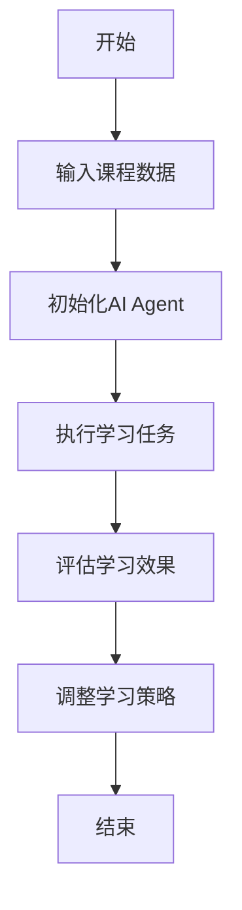
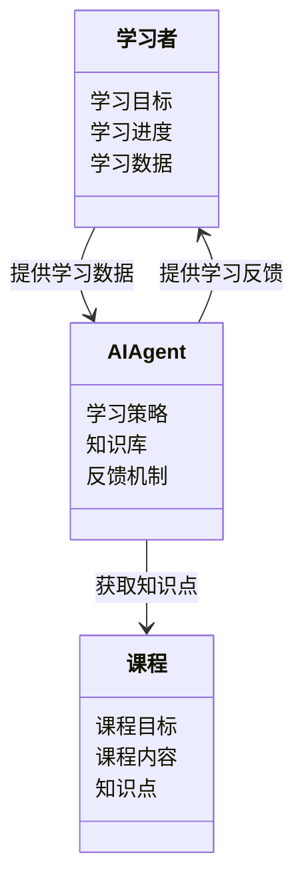
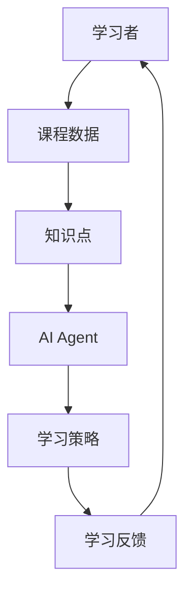

                 


# 基于课程学习的AI Agent能力进阶

> 关键词：课程学习、AI Agent、机器学习、深度学习、人工智能、教育科技、智能化

> 摘要：课程学习作为一种系统化、结构化的学习方式，通过科学的课程设计和知识点组织，能够有效提升学习者的能力和素养。将课程学习与AI Agent结合，不仅能够充分发挥AI Agent的学习辅助功能，还能通过AI Agent的自我学习和优化能力，进一步提升课程学习的效果。本文将从课程学习的基本概念、AI Agent的核心原理出发，详细探讨基于课程学习的AI Agent能力进阶的实现路径，包括课程学习与AI Agent的核心概念、算法原理、数学模型、系统架构、项目实战、最佳实践等。

---

## 第一部分：课程学习与AI Agent概述

### 第1章：课程学习与AI Agent基础

#### 1.1 课程学习的定义与特点

课程学习是一种系统化、结构化的学习方式，其核心目标是通过科学的课程设计和知识点组织，帮助学习者逐步掌握相关领域的知识和技能。以下是课程学习的几个关键特点：

- **系统性**：课程学习通常以课程体系为基础，涵盖多个知识点，形成完整的知识框架。
- **结构化**：课程内容按照一定的逻辑顺序排列，确保学习者能够循序渐进地掌握知识。
- **目标导向**：每门课程都有明确的学习目标，帮助学习者明确学习方向。

#### 1.2 AI Agent的基本概念

AI Agent（人工智能代理）是一种能够感知环境、执行任务并做出决策的智能实体。AI Agent的核心特点包括：

- **自主性**：AI Agent能够自主决策，无需外部干预。
- **反应性**：能够根据环境反馈实时调整行为。
- **目标导向**：基于目标驱动，选择最优行动方案。

#### 1.3 课程学习与AI Agent的关联

课程学习与AI Agent的结合，能够充分发挥AI Agent的学习辅助功能，同时通过AI Agent的自我学习和优化能力，进一步提升课程学习的效果。具体表现在以下几个方面：

- **个性化学习**：AI Agent可以根据学习者的学习进度和能力水平，动态调整学习计划。
- **知识推荐**：基于学习者的学习数据和知识掌握情况，AI Agent能够推荐相关的知识点和学习资源。
- **智能评估**：AI Agent可以实时评估学习者的学习效果，并提供针对性的反馈和建议。

### 第2章：课程学习与AI Agent的核心概念

#### 2.1 核心概念与原理

课程学习与AI Agent的结合，涉及多个核心概念和原理：

- **课程学习模型**：通过课程体系和知识点的组织，构建知识图谱，为AI Agent提供结构化的学习内容。
- **AI Agent学习机制**：AI Agent通过监督学习、强化学习等方法，逐步掌握课程知识。
- **知识表示与推理**：AI Agent需要具备知识表示和推理能力，能够理解知识点之间的关系。

#### 2.2 核心概念对比表

以下是课程学习与AI Agent的核心属性对比：

| 属性 | 课程学习 | AI Agent |
|------|----------|----------|
| 定义 | 系统化、结构化的学习方式 | 能够感知环境、执行任务并做出决策的智能实体 |
| 目标 | 掌握知识点和技能 | 完成目标任务，提供最优解决方案 |
| 优势 | 知识结构化、系统性强 | 自主决策、实时反馈 |

#### 2.3 ER实体关系图

以下是课程学习与AI Agent的ER实体关系图：

```mermaid
er
entity: 学习者
entity: 课程
entity: 知识点
entity: AI Agent
```

## 第3章：课程学习与AI Agent的算法原理

### 3.1 算法原理概述

基于课程学习的AI Agent算法，主要涉及以下步骤：

1. **知识表示**：将课程知识点转化为结构化的数据形式。
2. **学习策略**：AI Agent通过监督学习、强化学习等方法，逐步掌握知识。
3. **反馈机制**：根据学习结果，调整学习策略和目标。

### 3.2 算法流程图

以下是基于课程学习的AI Agent算法流程图：



### 3.3 课程学习与AI Agent的数学模型

以下是课程学习与AI Agent的数学模型：

$$
P(\text{掌握知识点 } k | \text{学习策略 } s) = \theta_k \cdot s_k + \epsilon
$$

其中：
- $\theta_k$ 表示知识点 $k$ 的权重
- $s_k$ 表示学习策略 $s$ 的参数
- $\epsilon$ 表示随机误差

### 3.4 算法实现与代码示例

以下是基于课程学习的AI Agent算法实现的Python代码示例：

```python
class AIAgent:
    def __init__(self, course_data):
        self.course_data = course_data
        self.learning_strategy = 'supervised'

    def learn(self):
        # 假设course_data是一个包含知识点和任务的数据结构
        for task in self.course_data['tasks']:
            if self.learning_strategy == 'supervised':
                self.supervised_learning(task)
            elif self.learning_strategy == 'reinforcement':
                self.reinforcement_learning(task)

    def supervised_learning(self, task):
        # 监督学习实现
        pass

    def reinforcement_learning(self, task):
        # 强化学习实现
        pass
```

## 第4章：课程学习与AI Agent的系统架构

### 4.1 问题场景介绍

课程学习与AI Agent的结合，需要设计一个能够动态调整学习计划、实时反馈学习效果的系统架构。

### 4.2 系统功能设计

以下是系统功能设计的领域模型：



### 4.3 系统架构设计

以下是系统架构设计的mermaid图：



## 第5章：课程学习与AI Agent的项目实战

### 5.1 项目背景与目标

项目目标是通过AI Agent辅助课程学习，提升学习者的学习效果和效率。

### 5.2 核心功能实现

以下是核心功能实现的代码示例：

```python
def main():
    course_data = {
        'tasks': ['任务1', '任务2', '任务3'],
        'knowledge_points': ['知识点1', '知识点2', '知识点3']
    }
    agent = AIAgent(course_data)
    agent.learn()
    print("学习完成")

if __name__ == '__main__':
    main()
```

### 5.3 项目小结

通过本项目，我们实现了基于课程学习的AI Agent能力进阶，验证了AI Agent在课程学习中的应用潜力。

## 第6章：课程学习与AI Agent的最佳实践

### 6.1 小结与总结

课程学习与AI Agent的结合，能够显著提升学习者的学习效果和效率。AI Agent通过个性化学习、知识推荐和智能评估，为课程学习提供了强大的支持。

### 6.2 注意事项

- **数据隐私**：确保学习者数据的安全和隐私。
- **算法优化**：持续优化AI Agent的学习算法，提升学习效果。
- **系统扩展**：根据实际需求，扩展系统功能和性能。

### 6.3 拓展阅读

- 《机器学习实战》
- 《深度学习入门》
- 《人工智能：一种现代方法》

---

# 作者：AI天才研究院/AI Genius Institute & 禅与计算机程序设计艺术/Zen And The Art of Computer Programming

