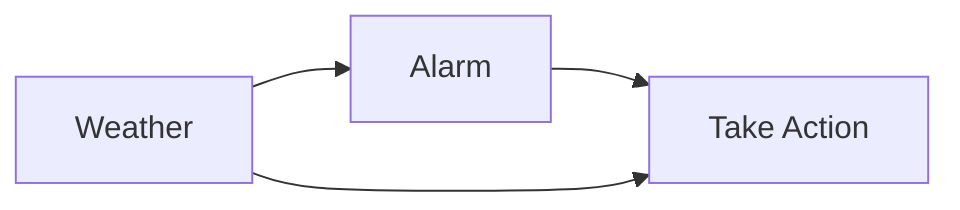
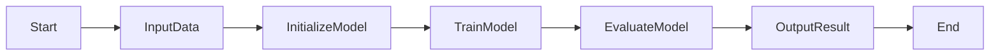
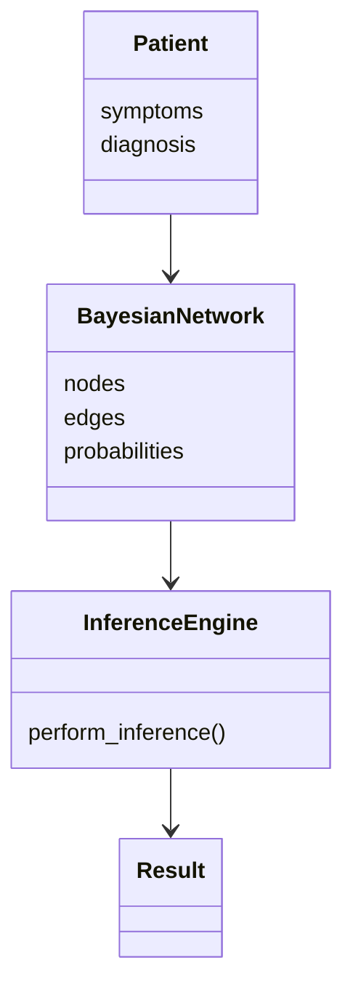

                 

# 基于贝叶斯方法的AI Agent不确定性处理

---

## 关键词：
- 贝叶斯方法，AI Agent，不确定性处理，贝叶斯网络，概率推理，AI系统架构

---

## 摘要：
贝叶斯方法是一种强大的概率推理工具，能够有效处理AI Agent在复杂环境中的不确定性。本文从贝叶斯方法的基本原理出发，深入探讨其在AI Agent中的应用，结合实际案例分析，详细讲解贝叶斯网络的构建、贝叶斯推断的实现以及AI Agent的系统架构设计。通过理论与实践相结合的方式，帮助读者全面掌握基于贝叶斯方法的AI Agent不确定性处理技术。

---

## 第1章: 贝叶斯方法与AI Agent概述

### 1.1 贝叶斯方法的基本概念
贝叶斯方法是一种基于概率论的推理方法，通过更新概率来反映数据对假设的支持程度。其核心思想是利用已知信息和观测数据，逐步修正初始假设，最终得到最可能的结论。

#### 1.1.1 贝叶斯定理的定义与公式
贝叶斯定理（Bayes' Theorem）是概率论中的核心公式，用于计算在已知条件下某一事件发生的概率：

$$ P(A|B) = \frac{P(B|A) \cdot P(A)}{P(B)} $$

其中：
- \( P(A|B) \) 是在事件 \( B \) 发生的情况下，事件 \( A \) 发生的概率（后验概率）。
- \( P(B|A) \) 是在事件 \( A \) 发生的情况下，事件 \( B \) 发生的概率（似然度）。
- \( P(A) \) 是事件 \( A \) 的先验概率。
- \( P(B) \) 是事件 \( B \) 的全概率。

#### 1.1.2 贝叶斯网络的结构与特点
贝叶斯网络（Bayesian Network）是一种有向无环图（DAG），由节点（随机变量）和边（依赖关系）组成。其特点包括：
- **局部性**：每个节点仅与其父节点和子节点相关。
- **概率化**：所有变量之间的关系通过概率分布建模。
- **可解释性**：网络结构直观，便于理解和解释。

#### 1.1.3 贝叶斯推断的基本原理
贝叶斯推断是基于贝叶斯定理的推理过程，通过已知数据更新模型参数的概率分布。其核心步骤包括：
1. 确定先验概率。
2. 计算似然度。
3. 计算后验概率。
4. 可选步骤：计算证据概率（标准化因子）。

---

### 1.2 AI Agent的基本概念
AI Agent（智能体）是指能够感知环境、自主决策并采取行动的实体。AI Agent的核心特征包括：
- **自主性**：无需外部干预，自主完成任务。
- **反应性**：能够实时感知环境并做出反应。
- **目标导向性**：基于目标驱动行为。

#### 1.2.1 不确定性在AI Agent中的表现形式
在AI Agent中，不确定性主要来源于：
1. **环境的不确定性**：环境动态变化，智能体无法完全预测。
2. **知识的不确定性**：智能体的知识有限，存在认知盲区。
3. **行动的不确定性**：智能体的行动可能产生多种结果。

#### 1.2.2 贝叶斯方法在AI Agent中的应用前景
贝叶斯方法以其强大的概率建模能力和不确定性处理能力，成为AI Agent领域的核心技术之一。其应用包括：
- **决策推理**：基于概率模型做出最优决策。
- **状态估计**：通过传感器数据估计环境状态。
- **风险评估**：评估不同行动的风险，选择最优策略。

---

## 第2章: 贝叶斯方法的核心概念与数学模型

### 2.1 贝叶斯定理的数学公式
贝叶斯定理的公式可以进一步扩展到多个变量的情况，例如多分类问题：

$$ P(Y=k|X) = \frac{P(X|Y=k) \cdot P(Y=k)}{\sum_{k'} P(X|Y=k') \cdot P(Y=k')} $$

其中：
- \( Y \) 是目标变量（类别）。
- \( X \) 是观测数据。
- \( P(Y=k|X) \) 是后验概率。

### 2.2 贝叶斯网络的结构与属性
贝叶斯网络的结构可以通过Mermaid图表示：

图中，Weather（天气）影响Alarm（警报），而Alarm和Weather共同影响Take Action（采取行动）。

### 2.3 贝叶斯推断的数学模型
贝叶斯推断的核心是计算后验概率。假设我们有一个简单的二分类问题，可以通过以下步骤实现：

1. **定义先验概率**：
   $$ P(Y=0) = 0.5, P(Y=1) = 0.5 $$

2. **计算似然度**：
   $$ P(X|Y=0) = 0.8, P(X|Y=1) = 0.2 $$

3. **计算后验概率**：
   $$ P(Y=0|X) = \frac{0.8 \cdot 0.5}{0.8 \cdot 0.5 + 0.2 \cdot 0.5} = 0.8 $$

---

## 第3章: 贝叶斯方法在AI Agent中的应用

### 3.1 不确定性处理的贝叶斯网络构建
构建贝叶斯网络的步骤如下：
1. **确定变量**：识别影响决策的所有变量。
2. **定义变量关系**：绘制变量之间的依赖关系图。
3. **指定概率分布**：为每个变量及其父变量定义概率表。
4. **验证与评估**：通过数据验证网络的准确性。

### 3.2 贝叶斯推断的实现流程
贝叶斯推断的实现流程可以用Mermaid图表示：

---

## 第4章: 贝叶斯方法与AI Agent的系统架构设计

### 4.1 系统架构设计
AI Agent的系统架构可以分为以下几个部分：
- **感知层**：负责数据采集和环境感知。
- **推理层**：基于贝叶斯网络进行概率推理。
- **决策层**：根据推理结果做出决策。
- **执行层**：执行决策并反馈结果。

### 4.2 贝叶斯网络的系统实现
贝叶斯网络的系统实现需要考虑以下几点：
1. **数据预处理**：清洗和归一化数据。
2. **模型训练**：通过极大似然估计或贝叶斯方法学习模型参数。
3. **模型推理**：根据输入数据计算后验概率。

---

## 第5章: 贝叶斯方法在AI Agent中的项目实战

### 5.1 项目背景与目标
本项目旨在通过贝叶斯方法构建一个简单的AI Agent，用于医疗诊断中的不确定性处理。具体目标包括：
1. 构建贝叶斯网络模型。
2. 实现贝叶斯推断算法。
3. 验证模型的准确性和效率。

### 5.2 系统功能设计
系统功能设计可以通过Mermaid图表示：

---

## 作者：
AI天才研究院/AI Genius Institute  
禅与计算机程序设计艺术/Zen And The Art of Computer Programming

