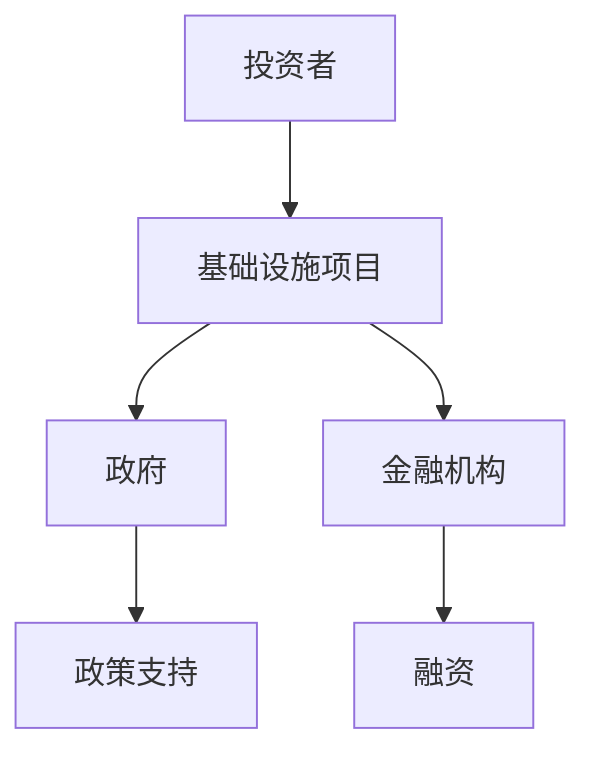
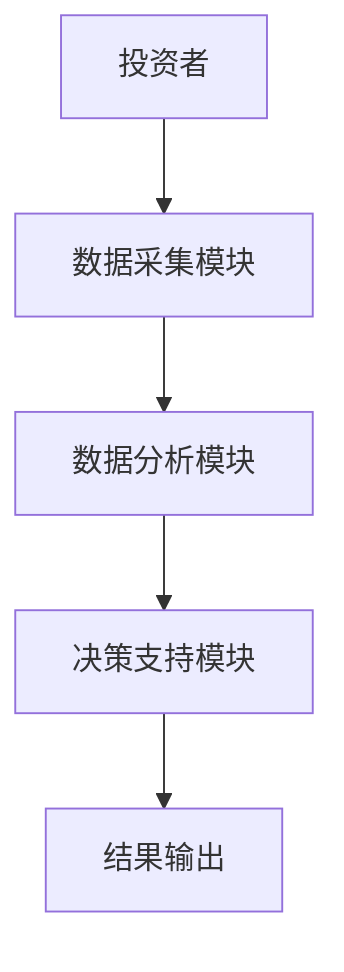

                 


# 基础设施投资：长期稳定收益的另类选择

---

## 关键词

- 基础设施投资
- 长期稳定收益
- 投资分析
- 数学模型
- 系统架构

---

## 摘要

本文深入探讨了基础设施投资作为一种长期稳定收益的另类选择，分析了其核心概念、算法原理、系统架构以及实际项目案例。通过结合背景介绍、数学模型、系统设计和实战分析，本文为投资者提供了全面的视角，帮助其理解并有效进行基础设施投资。

---

## 正文

---

### 第1章: 基础设施投资的背景与定义

#### 1.1 基础设施投资的定义与特点

基础设施投资是指对提供社会生产和生活所需的基本设施的投入，这些设施包括但不限于交通、能源、通信、水利和环境保护等。与传统投资相比，基础设施投资具有以下特点：

- **高门槛**：基础设施项目通常需要大量的初始投资。
- **长周期**：基础设施项目的建设周期较长，回报周期也较长。
- **高收益**：尽管回报周期长，但基础设施投资通常能带来稳定的长期收益。
- **低风险**：相较于股票等波动性较大的资产，基础设施投资的风险较低。

#### 1.2 当前经济形势下的基础设施投资

当前全球经济面临下行压力，传统投资渠道的回报率逐渐下降。在这种背景下，基础设施投资作为一种另类选择，逐渐受到投资者的关注。政策支持和基础设施投资的长期稳定收益特性，使其成为经济不确定性中的避风港。

---

### 第2章: 基础设施投资的核心概念与联系

#### 2.1 基础设施投资的核心概念

基础设施投资的核心概念包括以下方面：

- **项目生命周期**：从规划、建设到运营，基础设施项目的全生命周期管理至关重要。
- **投资回报分析**：通过现金流分析、净现值（NPV）和内部收益率（IRR）等指标评估项目的盈利能力。
- **风险与收益平衡**：在追求收益的同时，必须考虑各种潜在风险，如政策风险、建设风险和运营风险。

#### 2.2 基础设施投资的类型与对比

基础设施投资可以分为以下几类：

| 类型             | 特点                                   | 优缺点分析                               |
|------------------|--------------------------------------|-----------------------------------------|
| 公共基础设施     | 由政府投资，提供公共服务             | 收益稳定，但回报较低                   |
| 商业基础设施     | 由企业投资，用于商业运营             | 收益较高，但风险较大                   |
| 交通基础设施     | 包括铁路、公路、机场等               | 政策支持强，回报周期长                 |
| 能源基础设施     | 包括电力、燃气等                    | 需求稳定，但受政策影响较大             |

#### 2.3 基础设施投资的实体关系图



---

### 第3章: 基础设施投资的算法与数学模型

#### 3.1 基础设施投资的现金流分析

现金流分析是评估基础设施投资项目的重要工具。以下是现金流分析的步骤：

1. **预测现金流**：根据项目规划，预测每期的现金流。
2. **确定贴现率**：选择合适的贴现率，通常使用市场利率或企业资本成本。
3. **计算净现值（NPV）**：将未来现金流按贴现率折现，计算净现值。

**净现值公式**：
$$ NPV = \sum_{t=1}^{n} \frac{CF_t}{(1 + r)^t} $$

其中，\( CF_t \) 是第 \( t \) 期的现金流，\( r \) 是贴现率。

#### 3.2 内部收益率（IRR）的计算

内部收益率是使得净现值为零的贴现率。其计算公式为：

$$ IRR = r \text{ 使得 } NPV = 0 $$

例如，假设一个项目每年产生100万元的现金流，贴现率为5%，则：

$$ NPV = \frac{100}{(1+0.05)^1} + \frac{100}{(1+0.05)^2} + \frac{100}{(1+0.05)^3} - 初始投资 $$

---

### 第4章: 基础设施投资的系统架构与设计

#### 4.1 系统功能设计

基础设施投资项目的系统功能设计包括：

- **数据采集**：收集项目相关数据，如现金流、投资金额等。
- **数据分析**：对数据进行处理和分析，计算NPV和IRR。
- **决策支持**：基于分析结果，提供投资建议。

#### 4.2 系统架构设计



---

### 第5章: 基础设施投资的项目实战

#### 5.1 项目环境安装

安装Python和相关库：

```bash
pip install numpy pandas matplotlib
```

#### 5.2 核心代码实现

计算NPV和IRR的Python代码：

```python
import numpy as np

现金流 = [100, 100, 100]  # 每年的现金流
贴现率 = 0.05

NPV = np.npv(贴现率, 现金流)
IRR = np.irr(现金流)

print(f"NPV = {NPV:.2f}")
print(f"IRR = {IRR:.2%}")
```

#### 5.3 案例分析

以一个商业综合体项目为例，分析其现金流和收益情况。假设项目初始投资为5000万元，每年现金流为1500万元，贴现率为6%。计算其NPV和IRR。

---

### 第6章: 基础设施投资的最佳实践与注意事项

#### 6.1 投资前的注意事项

- **风险评估**：全面评估项目风险，包括政策风险、市场风险和运营风险。
- **团队组建**：组建专业的投资团队，确保项目顺利实施。
- **长期规划**：制定长期投资计划，避免短期波动影响决策。

#### 6.2 投资中的注意事项

- **持续监控**：定期监控项目进展，及时调整投资策略。
- **风险管理**：建立风险预警机制，制定应对措施。

---

## 小结

基础设施投资作为一种长期稳定收益的另类选择，具有独特的优势。通过科学的分析和合理的规划，投资者可以在当前经济环境下实现稳健的投资回报。本文通过背景介绍、算法原理、系统设计和项目实战，为投资者提供了全面的视角和实用的工具。

---

## 作者

作者：AI天才研究院/AI Genius Institute & 禅与计算机程序设计艺术/Zen And The Art of Computer Programming

---

