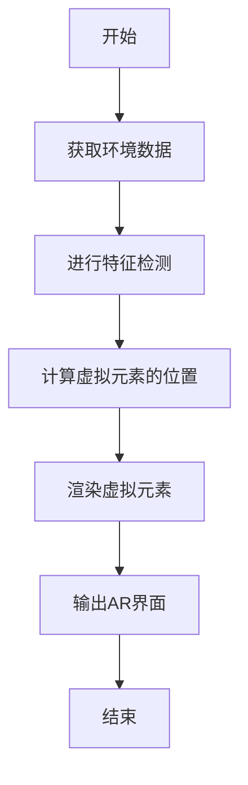
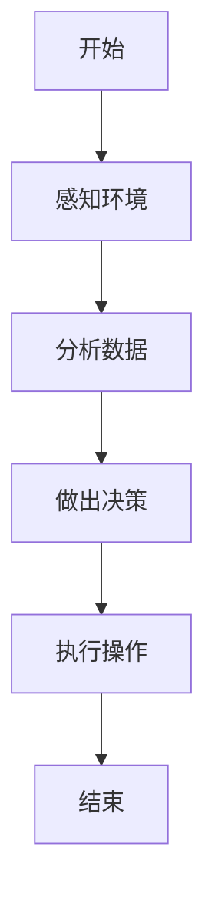
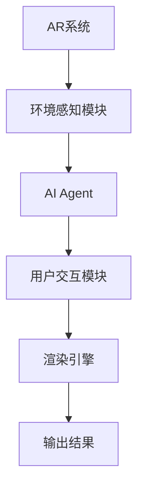
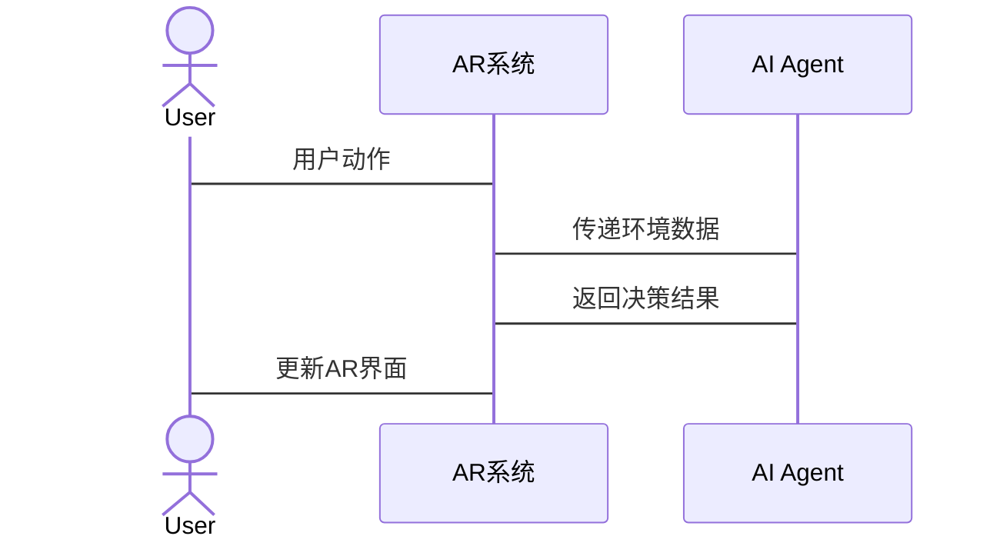

                 


# 增强现实技术与AI Agent的结合

> 关键词：增强现实技术, AI Agent, 结合, 算法原理, 系统架构, 项目实战

> 摘要：本文深入探讨了增强现实技术与人工智能代理（AI Agent）的结合，分析了两者的核心概念、算法原理、系统架构以及实际应用。通过详细的技术讲解和案例分析，展示了AR与AI Agent结合的潜力和实现方式，为相关领域的研究和应用提供了有价值的参考。

---

## 第一部分：增强现实技术与AI Agent的背景介绍

### 第1章：增强现实技术的定义与特点

#### 1.1 增强现实技术的定义
增强现实（Augmented Reality，AR）是一种将数字信息叠加到真实世界中的技术，通过计算机视觉、图形学和传感器技术，将虚拟元素与真实环境无缝融合。AR的核心在于“增强”现实，即通过添加数字信息来提升用户体验。

#### 1.2 增强现实技术的核心特点
1. **实时性**：AR需要实时处理和渲染，以确保虚拟元素与真实环境同步。
2. **交互性**：用户可以通过手势、语音或触控等方式与AR系统互动。
3. **沉浸感**：AR通过叠加虚拟元素，增强了用户的沉浸感，使其感觉虚拟内容与真实世界融为一体。

#### 1.3 增强现实技术与虚拟现实技术的区别
| **特点** | **增强现实（AR）** | **虚拟现实（VR）** |
|----------|---------------------|---------------------|
| 显示方式 | 将虚拟内容叠加在真实环境中 | 创建完全虚拟的数字世界 |
| 用户体验 | 用户可以看到真实环境和虚拟元素的结合 | 用户完全沉浸在虚拟环境中 |
| 应用场景 | 教育、医疗、游戏等领域 | 游戏、娱乐、模拟训练等领域 |

### 第2章：AI Agent的定义与特点

#### 2.1 AI Agent的定义
人工智能代理（AI Agent）是指具有感知环境、自主决策和执行任务能力的智能体。AI Agent能够通过传感器获取信息，利用算法进行分析和推理，并通过执行器与环境交互。

#### 2.2 AI Agent的核心特点
1. **自主性**：AI Agent能够自主决策，无需外部干预。
2. **反应性**：AI Agent能够实时感知环境变化并做出反应。
3. **学习能力**：AI Agent可以通过机器学习算法不断优化自身的决策能力。

#### 2.3 AI Agent与传统AI的区别
| **特点** | **AI Agent** | **传统AI** |
|----------|---------------|-------------|
| 执行能力 | 具备自主执行任务的能力 | 通常用于数据处理和分析 |
| 环境感知 | 能够感知和理解环境 | 依赖于预定义的数据和规则 |
| 适应性 | 可以根据环境变化自适应调整 | 需要人工干预进行调整 |

### 第3章：增强现实技术与AI Agent的结合意义

#### 3.1 结合的背景与问题背景
随着AR技术的快速发展，AI Agent的智能化能力为AR应用提供了更强大的支持。AR需要实时的环境感知和交互能力，而AI Agent可以通过其智能决策能力提升AR系统的用户体验。

#### 3.2 结合的核心概念与问题描述
AR与AI Agent的结合可以通过以下方式实现：
1. **环境感知**：AI Agent通过传感器和计算机视觉技术感知真实环境。
2. **智能决策**：AI Agent根据感知的信息做出决策，指导AR系统的渲染和交互。
3. **用户交互**：用户与AR系统中的虚拟元素互动，AI Agent通过分析用户的动作和反馈优化用户体验。

#### 3.3 结合的边界与外延
AR与AI Agent的结合不仅仅局限于技术层面，还涉及用户体验、系统设计和应用场景等多个方面。其外延包括教育、医疗、游戏、工业等领域。

#### 3.4 结合的概念结构与核心要素组成
结合AR与AI Agent的核心要素包括：
1. **环境感知模块**：通过传感器和计算机视觉技术获取环境信息。
2. **智能决策模块**：利用AI算法进行分析和决策。
3. **用户交互模块**：通过AR界面与用户进行互动。
4. **渲染引擎**：将虚拟元素叠加到真实环境中进行渲染。

---

## 第二部分：增强现实技术与AI Agent的核心概念与联系

### 第4章：增强现实技术与AI Agent的核心概念与联系

#### 4.1 核心概念原理
1. **AR的原理**：通过计算机视觉和图形学技术，将虚拟元素叠加到真实环境中。
2. **AI Agent的原理**：通过感知环境、分析数据和做出决策来实现智能代理功能。
3. **结合的原理**：AI Agent作为AR系统的核心决策模块，通过感知环境和用户行为，优化AR系统的渲染和交互。

#### 4.2 核心概念属性特征对比表格
| **属性** | **AR技术** | **AI Agent** |
|----------|-------------|--------------|
| 核心功能 | 渲染和叠加虚拟元素 | 感知、决策和执行 |
| 技术基础 | 计算机视觉、图形学 | 机器学习、自然语言处理 |
| 应用场景 | 教育、游戏、医疗 | 机器人控制、智能助手 |

#### 4.3 ER实体关系图架构
```mermaid
erd
actor
  name: User
  role: 用户
agent
  name: AI Agent
  role: 智能代理
ar_system
  name: AR系统
  role: 增强现实系统
  has: actor
  has: agent
```

---

## 第三部分：增强现实技术与AI Agent的算法原理讲解

### 第5章：增强现实技术的算法原理

#### 5.1 增强现实技术的算法流程图


#### 5.2 增强现实技术的核心算法实现
```python
def ar_rendering(environment, virtual_element):
    # 获取环境数据
    environment_data = get_environment_data(environment)
    # 计算虚拟元素位置
    position = calculate_position(environment_data, virtual_element)
    # 渲染虚拟元素
    render(virtual_element, position)
    return environment + virtual_element
```

#### 5.3 增强现实技术的数学模型与公式
$$ \text{虚拟元素位置计算公式} $$
$$ \text{示例：} $$
$$ \text{position} = (x, y, z) $$
$$ x = \text{environment_data.x} + \text{offset_x} $$
$$ y = \text{environment_data.y} + \text{offset_y} $$
$$ z = \text{environment_data.z} + \text{offset_z} $$

### 第6章：AI Agent的算法原理

#### 6.1 AI Agent的算法流程图


#### 6.2 AI Agent的核心算法实现
```python
def ai_agent_decision(environment, user_input):
    # 感知环境
    environment_data = perceive_environment(environment)
    # 分析数据
    analysis = analyze_data(environment_data)
    # 做出决策
    decision = make_decision(analysis, user_input)
    # 执行操作
    execute_action(decision)
    return decision
```

#### 6.3 AI Agent的数学模型与公式
$$ \text{决策模型公式} $$
$$ \text{示例：} $$
$$ \text{概率决策} = \argmax_{i} P(\text{action}_i | \text{state}_i) $$
$$ \text{其中，} P \text{表示动作} \text{action}_i \text{在状态} \text{state}_i \text{下的概率} $$

---

## 第四部分：增强现实技术与AI Agent的系统分析与架构设计方案

### 第7章：系统分析与架构设计

#### 7.1 问题场景介绍
- **问题场景**：在AR游戏中，用户需要与虚拟角色互动，AI Agent需要根据用户的动作和环境变化做出实时决策。
- **项目介绍**：开发一个基于AR技术的实时互动游戏，集成AI Agent进行智能决策。

#### 7.2 系统功能设计
- **环境感知**：通过摄像头和传感器获取用户周围的环境信息。
- **智能决策**：AI Agent根据环境信息和用户行为做出决策。
- **用户交互**：通过AR界面与用户进行互动，展示虚拟元素的位置和变化。

#### 7.3 系统架构设计


#### 7.4 系统接口设计
- **输入接口**：摄像头、麦克风、触摸屏。
- **输出接口**：显示屏、扬声器、震动反馈。

#### 7.5 系统交互图


---

## 第五部分：项目实战

### 第8章：项目实战

#### 8.1 项目环境安装
- **开发工具**：Python、OpenCV、TensorFlow。
- **硬件要求**：摄像头、传感器、高性能CPU。

#### 8.2 项目核心实现源代码
```python
# AR系统实现
def ar_system(environment):
    environment_data = get_environment_data(environment)
    virtual_element = create_virtual_element()
    position = calculate_position(environment_data, virtual_element)
    rendered_environment = render(environment, virtual_element, position)
    return rendered_environment

# AI Agent实现
def ai_agent(environment, user_input):
    environment_data = perceive_environment(environment)
    analysis = analyze_data(environment_data)
    decision = make_decision(analysis, user_input)
    return decision
```

#### 8.3 项目案例分析
- **案例描述**：在AR游戏中，AI Agent根据用户的动作和环境变化实时调整虚拟角色的行为。
- **实现细节**：通过机器学习模型训练AI Agent，使其能够识别用户的动作并做出相应的反应。

#### 8.4 项目小结
通过项目实战，我们展示了AR与AI Agent结合的实际应用，证明了两者的结合能够显著提升用户体验。

---

## 第六部分：最佳实践、小结、注意事项和拓展阅读

### 第9章：最佳实践与注意事项

#### 9.1 最佳实践
1. **模块化设计**：将AR系统和AI Agent模块化设计，便于维护和扩展。
2. **实时优化**：通过优化算法和硬件性能，提升系统的实时响应能力。
3. **用户体验优化**：注重用户的交互体验，确保AR界面的直观性和易用性。

#### 9.2 注意事项
1. **性能瓶颈**：AR和AI Agent的结合对硬件性能要求较高，需注意优化。
2. **数据隐私**：AR系统可能涉及用户的敏感数据，需注意数据隐私和安全。
3. **环境适应性**：AI Agent需要具备较强的环境适应能力，以应对复杂多变的环境。

### 第10章：小结与拓展阅读

#### 10.1 小结
本文深入探讨了增强现实技术与AI Agent的结合，分析了两者的算法原理和系统架构，并通过项目实战展示了其实际应用。通过本文的讲解，读者可以全面了解AR与AI Agent结合的核心技术及其应用场景。

#### 10.2 拓展阅读
- **参考文献**：
  1. [书籍标题]，[作者]，[出版社]。
  2. [书籍标题]，[作者]，[出版社]。
- **推荐阅读方向**：
  1. 增强现实技术的深度学习应用。
  2. AI Agent在复杂环境中的决策算法研究。

---

## 作者：AI天才研究院/AI Genius Institute & 禅与计算机程序设计艺术/Zen And The Art of Computer Programming

---

本文通过系统的分析和详细的讲解，全面探讨了增强现实技术与AI Agent的结合，从理论到实践，为相关领域的研究和应用提供了宝贵的参考和指导。

