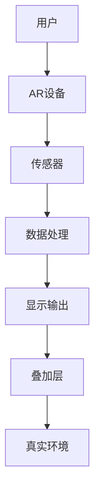
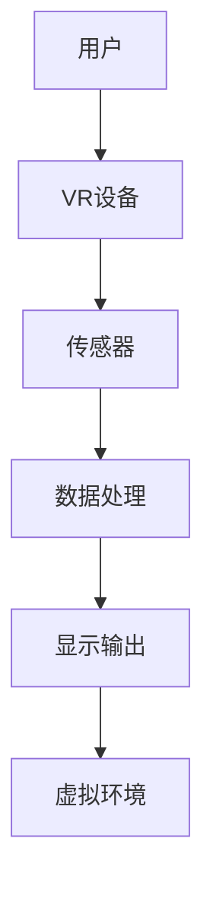
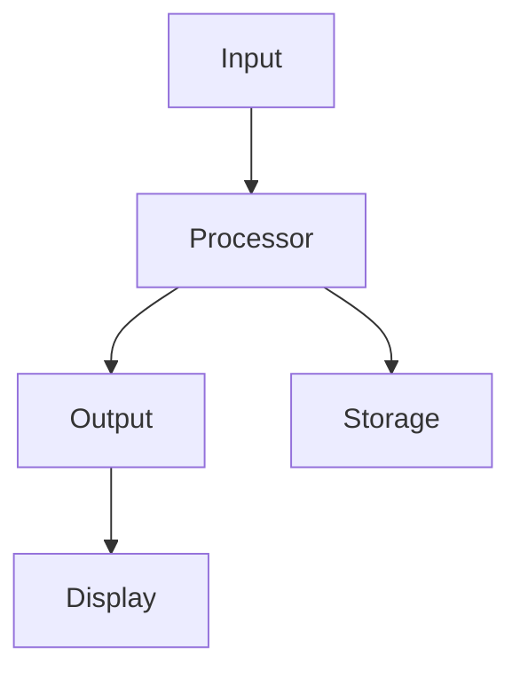
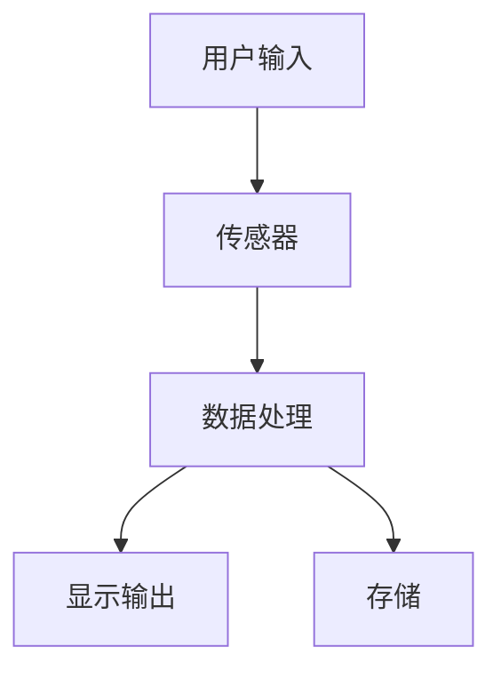
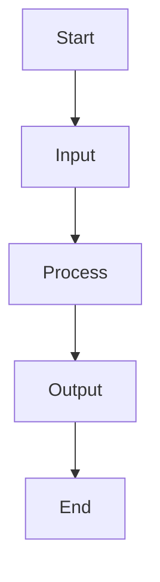
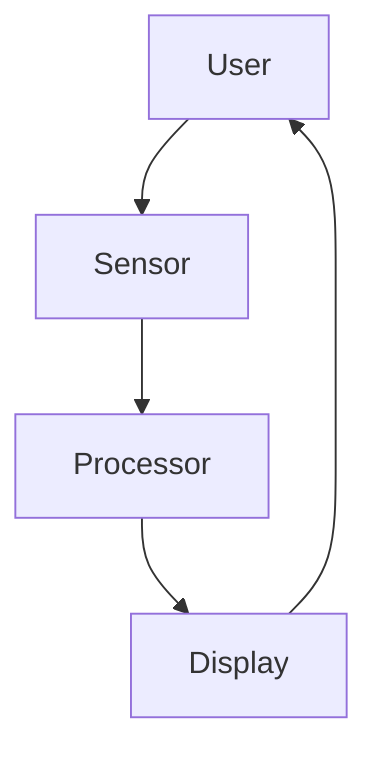

                 


# 增强现实（AR）和虚拟现实（VR）技术的商业化与投资前景

## 关键词：增强现实，虚拟现实，商业化，投资前景，算法原理，系统架构，应用场景

## 摘要：  
本文深入探讨增强现实（AR）和虚拟现实（VR）技术的商业化应用及其投资前景。通过分析技术背景、核心概念、算法原理、系统架构、应用场景及商业化模式，揭示AR和VR在教育、娱乐、医疗等领域的潜力，并展望其未来发展趋势和投资机会。

## 第1章: 增强现实（AR）和虚拟现实（VR）概述

### 1.1 增强现实（AR）和虚拟现实（VR）的基本概念

#### 1.1.1 增强现实（AR）的定义与特点
- **定义**：AR是一种将虚拟信息叠加在真实环境中的技术，通过计算机视觉、传感器和显示技术实现。
- **特点**：
  - 实时交互性
  - 环境感知能力
  - 用户沉浸感
  - 可扩展性

#### 1.1.2 虚拟现实（VR）的定义与特点
- **定义**：VR是通过计算机生成的虚拟环境，用户通过佩戴设备完全沉浸其中。
- **特点**：
  - 完全沉浸
  - 高度交互
  - 现实感强烈
  - 系统依赖性强

#### 1.1.3 AR与VR的核心区别与应用场景
- **区别对比**：
  | **技术指标** | **AR** | **VR** |
  |--------------|---------|--------|
  | 使用场景     | 实时叠加虚拟内容 | 创建完全虚拟环境 |
  | 设备依赖     | 手机、眼镜、平板 | 头显设备 |
  | 应用领域     | 教育、游戏、导航 | 游戏、培训、娱乐 |

- **应用场景**：
  - AR：教育、游戏、导航、零售
  - VR：游戏、培训、医疗模拟、虚拟旅行

### 1.2 AR和VR技术的发展历程

#### 1.2.1 技术起源与演变
- **AR起源**：20世纪60年代，Ivan Sutherland首次提出头显设备的概念。
- **VR起源**：1968年的达特茅斯学院，也提出了VR的概念。
- **演变**：从早期的笨重设备到现在的轻便智能设备，技术逐步成熟。

#### 1.2.2 关键技术突破与创新
- **显示技术**：OLED屏幕的高分辨率和低延迟。
- **传感器技术**：高精度陀螺仪、加速度计和激光定位技术。
- **交互技术**：手势识别和语音识别的发展。

#### 1.2.3 当前技术现状与未来趋势
- **现状**：AR和VR技术逐渐成熟，应用范围扩大。
- **未来趋势**：向智能化、轻量化、实时化方向发展，应用场景进一步拓展。

## 第2章: AR和VR技术的核心概念与原理

### 2.1 AR和VR的技术架构

#### 2.1.1 AR的技术架构



#### 2.1.2 VR的技术架构



#### 2.1.3 AR和VR技术的对比分析
- **设备依赖性**：AR设备较为轻便，VR设备依赖性强。
- **用户交互**：AR注重现实与虚拟的交互，VR注重完全沉浸的虚拟环境。
- **计算需求**：VR对硬件要求更高，AR对计算资源需求较低。

### 2.2 AR和VR的关键技术

#### 2.2.1 显示技术
- **OLED屏幕**：高分辨率、广视角、低延迟。
- **Micro-OLED**：适用于AR头显，提供更高的像素密度。

#### 2.2.2 传感器与交互技术
- **传感器**：IMU（惯性测量单元）包括加速度计和陀螺仪。
- **交互技术**：手势识别、语音识别和眼动追踪。

#### 2.2.3 三维建模与渲染技术
- **三维建模**：基于深度学习的建模技术，如PointNet、PointNet++。
- **渲染技术**：基于物理的渲染方法，如光线追踪。

#### 2.2.4 定位与追踪技术
- **定位技术**：基于视觉的定位，如ORB-SLAM。
- **追踪技术**：使用红外传感器和电磁追踪。

## 第3章: AR和VR的商业化应用

### 3.1 AR和VR的主要应用场景

#### 3.1.1 教育领域
- **虚拟教室**：学生通过VR头显学习历史事件。
- **AR辅助学习**：通过AR叠加解剖结构进行医学教学。

#### 3.1.2 娱乐与游戏
- **AR游戏**：如《Pokemon Go》。
- **VR游戏**：提供沉浸式的游戏体验。

#### 3.1.3 工业与制造
- **VR模拟训练**：员工通过VR进行安全培训。
- **AR辅助装配**：工人使用AR查看实时指导。

#### 3.1.4 医疗健康
- **VR手术模拟**：医生通过VR进行手术模拟训练。
- **AR医疗辅助**：医生使用AR查看患者实时数据。

#### 3.1.5 零售与营销
- **AR虚拟试穿**：顾客通过AR试穿服装。
- **VR虚拟展示**：房地产公司使用VR展示楼盘。

### 3.2 商业化模式分析

#### 3.2.1 产品销售模式
- **硬件销售**：销售VR头显和AR眼镜。
- **软件销售**：销售AR/VR应用程序。

#### 3.2.2 服务订阅模式
- **云服务订阅**：提供基于云的AR/VR服务。
- **按需付费**：按小时或使用次数收费。

#### 3.2.3 广告与内容分发模式
- **广告植入**：在AR/VR应用中嵌入广告。
- **内容分发**：通过应用商店分发AR/VR内容。

#### 3.2.4 行业定制解决方案
- **定制开发**：为特定行业开发AR/VR解决方案。
- **技术支持**：提供技术咨询和支持服务。

## 第4章: AR和VR技术的算法原理与数学模型

### 4.1 AR和VR中的关键算法

#### 4.1.1 三维重建算法
- **算法步骤**：
  1. 数据采集。
  2. 特征提取。
  3. 点云生成。
  4. 表面重构。

#### 4.1.2 视觉定位与跟踪算法
- **算法流程**：
  1. 特征提取。
  2. 姿态估计。
  3. 位置优化。

#### 4.1.3 光线追踪算法
- **基本原理**：
  - 计算光线与物体表面的交点。
  - 确定物体的材质和光照效果。

### 4.2 定位与跟踪算法的数学模型

#### 4.2.1 基于特征点的定位算法
- **数学模型**：
  $$ P = K \cdot R^T (X - C) $$
  其中：
  - P：图像点坐标。
  - K：相机内参矩阵。
  - R：旋转矩阵。
  - C：相机中心坐标。

#### 4.2.2 基于深度学习的定位算法
- **神经网络结构**：
  使用卷积神经网络（CNN）进行特征提取和回归预测。

#### 4.2.3 姿态估计的数学模型
- **公式**：
  $$ q = s \cdot [w, x, y, z] $$
  其中：
  - q：四元数表示的姿态。
  - s：缩放因子。

## 第5章: AR和VR系统的架构设计与实现

### 5.1 系统架构设计

#### 5.1.1 系统组成模块
- **输入模块**：传感器数据采集。
- **处理模块**：数据处理和算法实现。
- **输出模块**：显示和交互输出。

#### 5.1.2 模块之间的关系


#### 5.1.3 系统架构图


### 5.2 系统功能设计

#### 5.2.1 用户界面设计
- **AR界面**：叠加层设计。
- **VR界面**：虚拟环境设计。

#### 5.2.2 功能模块实现
- **定位与跟踪**：实现基于特征点的定位。
- **三维建模**：实现物体的三维重建。

#### 5.2.3 系统功能流程图


### 5.3 接口设计与交互流程图

#### 5.3.1 接口设计
- **传感器接口**：定义传感器数据的输入接口。
- **显示接口**：定义显示设备的输出接口。

#### 5.3.2 交互流程图


## 第6章: AR和VR技术的项目实战

### 6.1 项目背景与目标

#### 6.1.1 项目需求分析
- **目标**：开发一个简单的AR应用，展示虚拟物体在真实环境中的叠加。

#### 6.1.2 项目目标设定
- **功能需求**：实现基于摄像头的AR显示。
- **性能需求**：确保低延迟和高帧率。

### 6.2 项目实现

#### 6.2.1 开发环境搭建
- **开发工具**：使用Unity和Vuforia进行AR开发。
- **开发平台**：选择Android平台。

#### 6.2.2 核心代码实现

##### 6.2.2.1 ARCore初始化代码
```csharp
public class ARCoreManager : MonoBehaviour
{
    public static ARCoreManager Instance;

    void Start()
    {
        if (Instance == null)
        {
            Instance = this;
            ARCore.Initialize();
        }
    }

    public void StartTracking()
    {
        ARCore.StartTracking();
    }

    public void StopTracking()
    {
        ARCore.StopTracking();
    }
}
```

##### 6.2.2.2 定位与跟踪代码
```csharp
public class TrackingManager : MonoBehaviour
{
    private ARCoreManager arCoreManager;

    void Start()
    {
        arCoreManager = FindObjectOfType<ARCoreManager>();
        arCoreManager.StartTracking();
    }

    void Update()
    {
        // 获取跟踪状态
        var state = arCoreManager.GetTrackingState();
        if (state == TrackingState.Tracking)
        {
            // 获取相机姿态
            var pose = arCoreManager.GetCameraPose();
            // 更新虚拟物体位置
            transform.position = pose.position;
            transform.rotation = pose.rotation;
        }
    }
}
```

#### 6.2.3 代码解读与分析
- **ARCore初始化**：确保ARCore库正确初始化。
- **跟踪管理**：在Update函数中持续更新虚拟物体的位置和姿态。

### 6.3 项目小结
- **实现效果**：成功实现了虚拟物体在真实环境中的叠加显示。
- **遇到的问题**：定位精度和延迟问题，需要进一步优化。

## 第7章: 最佳实践、小结、注意事项和拓展阅读

### 7.1 最佳实践 tips
- **硬件选择**：根据需求选择合适的设备。
- **算法优化**：优化定位和跟踪算法以提高性能。
- **用户体验**：注重用户界面设计和交互体验。

### 7.2 小结
- AR和VR技术正在快速发展，应用范围广泛。
- 投资者应关注技术发展和市场趋势，寻找合适的商业机会。

### 7.3 注意事项
- **技术风险**：关注技术瓶颈和未来发展方向。
- **市场竞争**：了解竞争对手和市场动态。
- **用户需求**：深入分析用户需求，提供有价值的产品和服务。

### 7.4 拓展阅读
- **推荐书籍**：
  - 《增强现实：理论与实践》
  - 《虚拟现实开发指南》
- **在线资源**：
  - Unity和Unreal Engine的官方文档。
  - AR/VR相关的技术博客和开发者论坛。

## 作者：AI天才研究院/AI Genius Institute & 禅与计算机程序设计艺术 /Zen And The Art of Computer Programming

---

以上就是《增强现实（AR）和虚拟现实（VR）技术的商业化与投资前景》的完整目录结构和文章内容。

