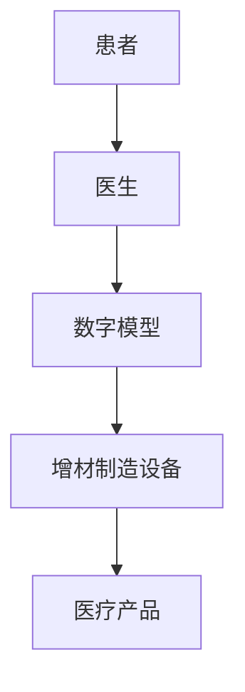

                 


# 增材制造技术在医疗领域的应用与投资机会

## 关键词：增材制造技术、医疗应用、投资机会、3D打印、 prosthetics、骨科植入物

## 摘要：增材制造技术（3D打印）在医疗领域的应用正在迅速扩展，从 prosthetics 到骨科植入物，再到牙科修复和药物递送，这项技术展示了巨大的潜力。本文将分析增材制造技术的基本原理、医疗领域的具体应用以及其投资机会。通过深入探讨技术细节、成功案例和市场趋势，本文为读者提供全面的视角，帮助他们理解增材制造技术在医疗领域的变革潜力。

---

# 第一部分: 增材制造技术在医疗领域的应用与投资机会

## 第1章: 增材制造技术概述

### 1.1 增材制造技术的基本概念

#### 1.1.1 增材制造技术的定义
增材制造技术（Additive Manufacturing，AM）是一种通过逐层添加材料来创建三维物体的过程，与传统的减材制造不同。其核心在于通过数字模型直接构建物体，减少了材料浪费并提高了制造效率。

#### 1.1.2 增材制造技术的核心原理
增材制造技术依赖于计算机辅助设计（CAD）模型，将三维模型分解为二维层，逐层打印。其原理包括：
1. **材料选择**：选择适合医疗应用的材料，如金属、聚合物、陶瓷等。
2. **工艺流程**：从数字模型到打印前准备，再到实际打印和后处理。
3. **设备选择**：包括FDM（熔融沉积成型）、SLA（光固化）、SLS（选择性激光烧结）等技术。

#### 1.1.3 增材制造技术的分类与特点
增材制造技术主要分为：
- **材料挤出**：适合制造塑料 prosthetics。
- **光固化**：用于牙科修复和生物相容性材料。
- **粉末床融合**：用于金属植入物。

---

### 1.2 医疗领域中的增材制造技术

#### 1.2.1 医疗领域对增材制造技术的需求
医疗领域对定制化、高效性和精准性有强烈需求，增材制造技术正好满足这些需求。例如， prosthetics 需要高度个性化，骨科植入物需要精确匹配患者的解剖结构。

#### 1.2.2 增材制造技术在医疗领域的应用现状
目前，增材制造技术已广泛应用于 prosthetics、骨科植入物、牙科修复等领域，并在手术器械和医疗模型中展现出潜力。

#### 1.2.3 增材制造技术在医疗领域的未来发展趋势
随着技术进步，增材制造将更加智能化和个性化，可能实现按需打印，减少库存压力。

---

## 第2章: 增材制造技术的核心概念与联系

### 2.1 增材制造技术的核心原理

#### 2.1.1 增材制造技术的材料选择
选择生物相容性材料是关键，如钛合金和生物可降解材料。需要考虑材料的强度、耐久性和与人体的相容性。

#### 2.1.2 增材制造技术的工艺流程
包括设计建模、打印准备、实际打印和后处理。每个步骤都需要精确控制，以确保最终产品的质量和性能。

#### 2.1.3 增材制造技术的设备与工具
设备选择影响最终产品的性能，如SLS技术适合金属植入物，而FDM适合塑料 prosthetics。

---

### 2.2 医疗领域中的增材制造技术核心要素

#### 2.2.1 医疗增材制造技术的实体关系图


#### 2.2.2 医疗增材制造技术的核心属性特征对比表
| 属性        | 常规制造   | 增材制造   |
|-------------|------------|------------|
| 材料利用率   | 低         | 高         |
| 成本         | 高         | 中等       |
| 时间         | 长         | 短         |
| 定制化能力   | 低         | 高         |

#### 2.2.3 医疗增材制造技术的ER实体关系图
```mermaid
entity Patient {
    id
    name
}
entity DigitalModel {
    id
    patient_id
    description
}
entity AMEquipment {
    id
    type
}
entity MedicalProduct {
    id
    model_id
    status
}
```

---

## 第3章: 增材制造技术在医疗领域的具体应用

### 3.1 增材制造技术在 prosthetics 中的应用

#### 3.1.1 prosthetics 的设计与制造过程
设计基于患者的具体需求，利用CAD建模和增材制造技术实现个性化 prosthetics。制造过程包括材料准备、打印和后处理。

#### 3.1.2 增材制造技术在 prosthetics 中的优势
- **个性化**：根据患者的身体结构定制 prosthetics。
- **轻量化**：材料利用率高，减少重量。
- **成本效益**：相比传统制造，增材制造更具成本效益。

#### 3.1.3 典型案例分析
案例：某患者因事故失去手臂，通过增材制造技术定制了一只轻便且符合人体工程学的 prosthetics，显著提高了生活质量。

---

### 3.2 增材制造技术在骨科植入物中的应用

#### 3.2.1 骨科植入物的设计与制造过程
基于患者CT扫描数据，设计个性化植入物，使用SLS技术打印，确保精确匹配解剖结构。

#### 3.2.2 增材制造技术在骨科植入物中的优势
- **精确性**：高度定制化，减少手术风险。
- **生物相容性**：选择合适的材料，如钛合金，确保与人体的兼容性。
- **耐用性**：打印技术提高了植入物的强度和耐久性。

#### 3.2.3 典型案例分析
案例：某患者因骨质疏松导致脊柱压缩骨折，通过增材制造技术定制了个性化的骨科植入物，显著改善了症状。

---

### 3.3 增材制造技术在牙科修复中的应用

#### 3.3.1 牙科修复的设计与制造过程
基于患者的口腔扫描数据，设计定制化的牙科修复体，如牙冠和牙桥，使用光固化技术打印。

#### 3.3.2 增材制造技术在牙科修复中的优势
- **精准度**：数字化设计确保修复体与牙齿完美契合。
- **效率**：减少人工操作，提高生产效率。
- **美观性**：材料选择多样化，修复体颜色接近天然牙齿。

#### 3.3.3 典型案例分析
案例：某患者因牙齿损坏需要牙冠修复，通过增材制造技术定制了一颗美观且耐用的牙冠，修复效果显著。

---

## 第4章: 增材制造技术在医疗领域的投资机会分析

### 4.1 医疗增材制造技术的市场现状

#### 4.1.1 全球医疗增材制造技术市场的规模与增长
2023年全球医疗增材制造市场约为30亿美元，预计年均增长率达20%以上。

#### 4.1.2 医疗增材制造技术的主要驱动力
- **技术进步**：打印速度和精度的提升。
- **需求增长**：患者对个性化医疗的需求增加。
- **政策支持**：各国政府对医疗技术创新的扶持。

#### 4.1.3 医疗增材制造技术的主要参与者
包括材料供应商、设备制造商、软件开发商和医疗机构。

---

### 4.2 医疗增材制造技术的投资模式

#### 4.2.1 风险投资与私募股权
风险投资主要集中在初创公司和技术创新项目，私募股权则关注成熟企业和商业化阶段。

#### 4.2.2 战略合作与并购
大型医疗公司通过与增材制造技术公司合作或并购，快速进入市场。

#### 4.2.3 初创企业与孵化器
孵化器支持初创企业，提供资金、技术和市场支持，推动技术商业化。

---

### 4.3 医疗增材制造技术的投资风险与机会

#### 4.3.1 技术风险
技术成熟度和知识产权风险是主要挑战。

#### 4.3.2 市场风险
市场需求波动和竞争加剧可能影响投资回报。

#### 4.3.3 政策与法规风险
监管政策的变化可能影响技术应用和市场准入。

#### 4.3.4 投资机会
个性化医疗、新兴市场的增长和技术创新带来的投资机会。

---

## 第5章: 增材制造技术在医疗领域的未来发展趋势

### 5.1 技术创新与进步

#### 5.1.1 新材料与新工艺的开发
开发更多生物相容性材料和高效打印工艺，如高分子材料和纳米材料。

#### 5.1.2 智能化与自动化的发展
引入人工智能和物联网技术，实现智能打印和远程监控。

#### 5.1.3 多材料与多功能打印技术的突破
实现单一打印过程中的多材料应用，提高产品功能多样性。

---

### 5.2 医疗领域中的新应用场景

#### 5.2.1 个性化医疗与精准治疗
增材制造技术将推动个性化医疗的发展，实现精准治疗。

#### 5.2.2 远程医疗与数字化医疗
结合数字技术，实现远程设计和打印，推动数字化医疗发展。

---

## 作者：AI天才研究院/AI Genius Institute & 禅与计算机程序设计艺术 /Zen And The Art of Computer Programming

---

**摘要**：增材制造技术在医疗领域的应用正迅速扩展，从 prosthetics 到骨科植入物，再到牙科修复和药物递送，这项技术展示了巨大的潜力。本文将分析增材制造技术的基本原理、医疗领域的具体应用以及其投资机会。通过深入探讨技术细节、成功案例和市场趋势，本文为读者提供全面的视角，帮助他们理解增材制造技术在医疗领域的变革潜力。

