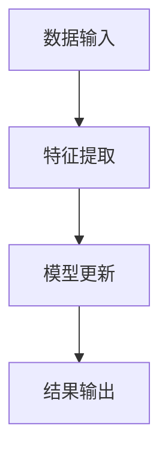
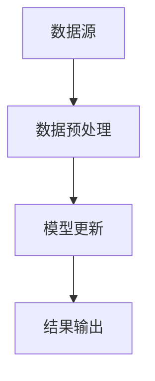

                 


# 增量学习：持续更新AI Agent的知识库

> 关键词：增量学习，AI Agent，知识库，机器学习，动态数据

> 摘要：本文详细探讨了增量学习在持续更新AI Agent知识库中的应用，从基础概念到算法原理，再到系统架构和实际案例，全面解析增量学习的核心原理和实际应用。

---

## 第一部分: 增量学习的基础与背景

### 第1章: 增量学习的基本概念

#### 1.1 什么是增量学习
增量学习是一种机器学习范式，旨在通过不断接收新的数据样本，逐步更新和优化模型，以适应数据分布的变化。与批量学习不同，增量学习适用于数据流环境，能够实时更新模型，保持其预测能力。

#### 1.2 增量学习的背景与意义
随着数据的实时生成和动态变化，传统的批量学习方法在处理大规模、动态数据时显得力不从心。增量学习能够高效地处理流数据，适用于实时数据分析、智能推荐系统和自动驾驶等领域，具有重要的研究价值。

#### 1.3 增量学习与传统机器学习的区别
| 特性 | 增量学习 | 批量学习 |
|------|----------|----------|
| 数据输入方式 | 实时处理 | 一次性加载 |
| 模型更新 | 动态更新 | 需要重新训练 |
| 资源消耗 | 较低 | 较高 |

### 第2章: 增量学习的核心问题

#### 2.1 动态数据流的处理
动态数据流的特点是数据不断生成且分布变化，增量学习需要能够快速处理这些数据，更新模型。

#### 2.2 模型更新的挑战
增量学习需要在每次接收新数据后，仅更新模型的增量部分，避免重新训练整个模型。

#### 2.3 资源受限环境下的学习
增量学习通常在资源受限的环境下进行，如移动设备或嵌入式系统，需要考虑计算效率和内存使用。

---

## 第二部分: 增量学习的核心概念与联系

### 第3章: 增量学习的原理

#### 3.1 增量学习的数学模型
增量学习的数学模型通常涉及在线更新规则，如：

$$
w_{t+1} = w_t + \eta (y_t - f(x_t; w_t)) x_t
$$

其中，$w_t$ 是当前模型参数，$\eta$ 是学习率，$y_t$ 是真实标签，$f(x_t; w_t)$ 是模型预测值。

#### 3.2 增量学习与在线学习的对比
- 在线学习：实时处理数据，更新模型。
- 增量学习：适用于在线学习，但更关注数据分布的变化。

### 第4章: 增量学习的核心要素

#### 4.1 数据流处理
增量学习需要高效处理数据流，通常采用滑动窗口技术，仅保留最近的数据样本。

#### 4.2 模型更新策略
增量学习采用增量更新策略，如：

$$
f(x; w_{t+1}) = f(x; w_t) + \Delta f(x; \Delta w)
$$

其中，$\Delta w$ 是参数的增量更新量。

#### 4.3 性能监控
增量学习需要监控模型性能，如准确率、召回率等指标，及时调整模型。

---

## 第三部分: 增量学习的算法原理

### 第5章: 增量学习的主要算法

#### 5.1 增量SVM算法
增量SVM在每次接收新样本后，仅更新支持向量，保持模型的稀疏性。

#### 5.2 增量随机森林
增量随机森林通过动态添加新样本，逐步更新决策树结构。

### 第6章: 增量学习的流程图



### 第7章: 增量学习的数学模型

增量SVM的目标函数：

$$
\min_{w,b,\xi} \frac{1}{2}\|w\|^2 + C\sum_{i=1}^n \xi_i
$$

约束条件：

$$
y_i(w\cdot x_i + b) \geq 1 - \xi_i, \xi_i \geq 0
$$

---

## 第四部分: 增量学习的系统架构设计

### 第8章: 增量学习系统的组成

#### 8.1 数据流处理模块
负责接收和预处理实时数据流。

#### 8.2 模型更新模块
根据新数据更新模型参数。

#### 8.3 性能监控模块
监控模型性能，调整更新策略。

### 第9章: 增量学习系统的架构图



---

## 第五部分: 项目实战

### 第10章: 增量学习分类器的实现

#### 10.1 环境配置
安装必要的库，如scikit-learn和numpy。

#### 10.2 代码实现

```python
class IncrementalSVM:
    def __init__(self):
        self.model = svm.SVC()

    def update_model(self, X, y):
        self.model.partial_fit(X, y)
```

#### 10.3 测试与优化
测试模型性能，调整参数以优化准确率。

---

## 第六部分: 最佳实践、小结和拓展阅读

### 第11章: 小结

增量学习通过持续更新模型，适应数据流的变化，适用于实时数据分析和智能推荐系统等领域。

### 第12章: 拓展阅读

推荐深入学习在线学习算法和分布式增量学习。

---

作者：AI天才研究院/AI Genius Institute & 禅与计算机程序设计艺术 /Zen And The Art of Computer Programming

