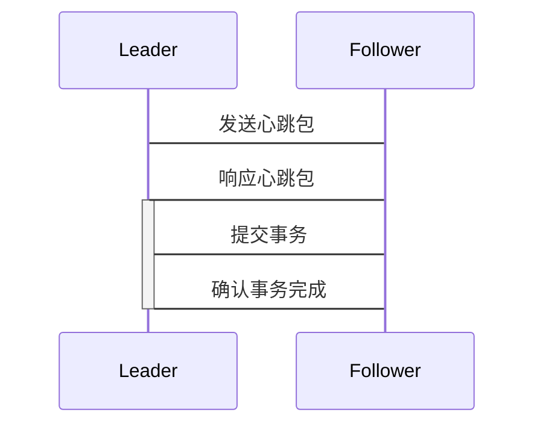
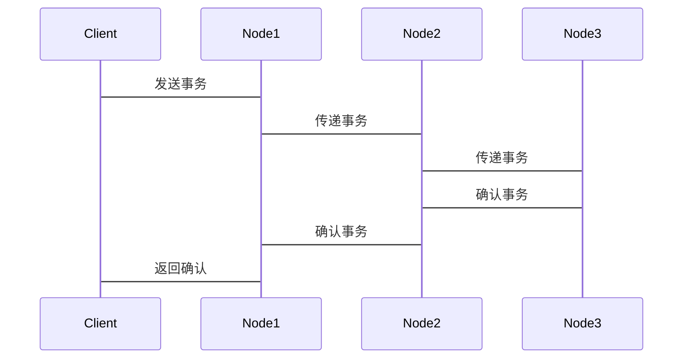
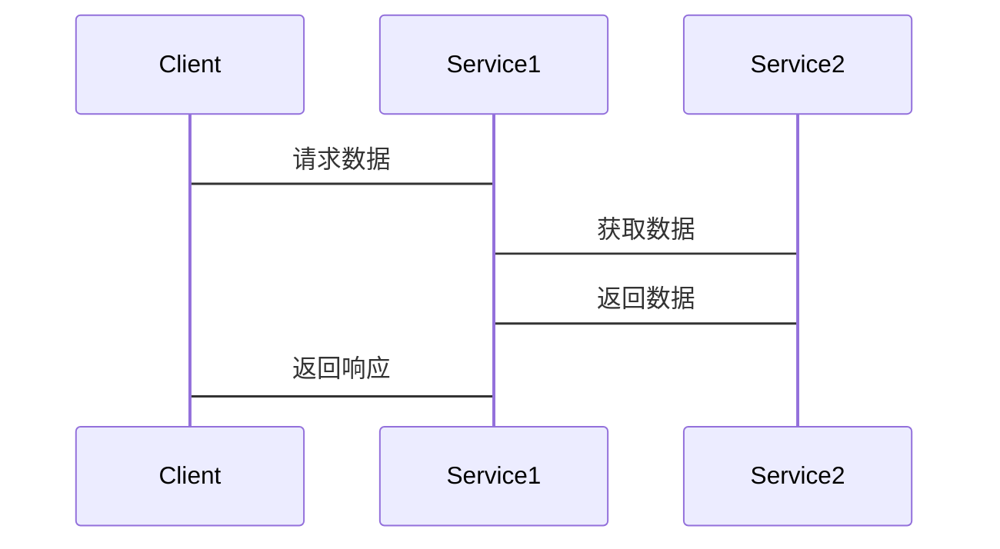

                 

# 多Agent协作系统：复杂任务的分布式解决方案

## 关键词：
多Agent系统，分布式协作，一致性算法，共识算法，系统架构设计

## 摘要：
多Agent协作系统通过分布式计算的方式，将复杂的任务分解为多个Agent协作完成。本文详细探讨了多Agent协作系统的理论基础、算法原理、系统架构设计以及项目实战。通过Raft一致性算法和PBFT共识算法的实现，结合具体的系统架构设计和项目案例，展示了多Agent协作系统在解决复杂任务中的应用。

---

# 第一部分: 多Agent协作系统概述

## 第1章: 多Agent协作系统概述

### 1.1 多Agent协作系统的基本概念

#### 1.1.1 什么是Agent
**Agent**（智能体）是一个能够感知环境并采取行动以实现目标的实体。在多Agent系统中，多个Agent通过协作完成复杂任务。Agent可以是软件程序、机器人或其他智能实体。

#### 1.1.2 多Agent系统的特点
多Agent系统具有以下特点：
- **分布式**：多个Agent独立运行，协作完成任务。
- **自治性**：每个Agent具有自主决策能力。
- **协作性**：Agent之间通过通信和协调完成共同目标。
- **动态性**：环境和任务需求可能动态变化。

#### 1.1.3 多Agent协作的定义与范围
多Agent协作是指多个Agent通过通信和协调，共同完成单个Agent无法完成的任务。其范围涵盖分布式计算、人工智能和机器人协作等领域。

### 1.2 多Agent协作系统的应用领域

#### 1.2.1 分布式计算中的应用
多Agent系统在分布式计算中用于任务分配、负载均衡和数据一致性维护。

#### 1.2.2 人工智能中的应用
在AI领域，多Agent协作用于群体智能、分布式问题求解和人机协作。

#### 1.2.3 机器人协作与分布式系统
多Agent协作在机器人协作、分布式传感器网络和自动驾驶等领域有广泛应用。

### 1.3 多Agent协作系统的优势与挑战

#### 1.3.1 分布式协作的优势
- **高可用性**：分布式架构避免单点故障。
- **扩展性**：系统可扩展性强，易于添加新Agent。
- **灵活性**：Agent可以根据任务需求动态调整行为。

#### 1.3.2 系统复杂性带来的挑战
- **通信开销**：Agent之间的通信可能带来额外的资源消耗。
- **一致性问题**：分布式系统中数据一致性难以保证。
- **安全性**：通信和协作过程中的安全问题。

---

## 第二部分: 多Agent协作系统的理论基础

## 第2章: 多Agent协作系统的理论基础

### 2.1 多Agent系统的核心概念

#### 2.1.1 Agent的定义与属性
- **智能体（Agent）**：能够感知环境并采取行动的实体。
- **属性**：自主性、反应性、主动性、社会性。

#### 2.1.2 多Agent系统中的角色与职责
- **角色**：每个Agent在系统中扮演特定角色，如协调者、执行者。
- **职责**：每个角色负责特定任务，如任务分配、状态监控。

#### 2.1.3 Agent之间的关系与交互
- **交互方式**：通过消息传递、共享数据库或中间件进行通信。
- **协作机制**：基于协议的协作，如一致性协议、共识协议。

### 2.2 多Agent协作的模型与协议

#### 2.2.1 通信模型
- **直接通信**：Agent之间直接交换消息。
- **间接通信**：通过中间件或消息队列进行通信。

#### 2.2.2 协作协议
- **一致性协议**：确保系统中数据一致性。
- **共识协议**：在分布式系统中达成共识。

#### 2.2.3 分布式决策模型
- **分布式决策**：多个Agent基于局部信息做出决策。
- **协调机制**：通过通信和协商达成一致。

---

## 第三部分: 多Agent协作系统的算法原理

## 第3章: 多Agent协作系统的算法原理

### 3.1 分布式一致性算法

#### 3.1.1 一致性问题的定义
**一致性**：系统中所有副本的数据状态保持一致。

#### 3.1.2 分布式一致性算法的分类
- **基于投票的算法**：如Raft。
- **基于状态机的算法**：如PAXOS。

#### 3.1.3 Raft一致性算法的实现
Raft是一种易于理解和实现的一致性算法，通过选举一个Leader来协调副本同步。

### 3.2 多Agent协作中的共识算法

#### 3.2.1 共识算法的基本原理
**共识算法**：分布式系统中多个节点达成一致的算法。

#### 3.2.2 PBFT算法的实现
PBFT是一种基于拜占庭容错的共识算法，适用于异步网络。

#### 3.2.3 共识算法的优缺点分析
- **优点**：确保系统一致性。
- **缺点**：通信开销大，实现复杂。

---

## 第四部分: 多Agent协作系统的系统架构设计

## 第4章: 多Agent协作系统的系统架构设计

### 4.1 系统功能设计

#### 4.1.1 Agent的生命周期管理
- **创建**：初始化Agent。
- **终止**：结束Agent任务。

#### 4.1.2 任务分配与调度
- **任务分配**：根据Agent的能力分配任务。
- **调度**：动态调整任务执行顺序。

#### 4.1.3 通信与协调机制
- **通信机制**：使用消息队列或中间件。
- **协调机制**：通过一致性算法确保数据一致。

### 4.2 系统架构设计

#### 4.2.1 分层架构设计
- **表示层**：用户界面。
- **业务逻辑层**：处理业务逻辑。
- **数据访问层**：访问数据源。

#### 4.2.2 微服务架构设计
- **服务独立**：每个服务独立运行。
- **服务通信**：通过API网关或服务发现进行通信。

#### 4.2.3 混合架构设计
- **混合架构**：结合分层和微服务架构。

### 4.3 系统接口设计

#### 4.3.1 系统接口设计
- **REST API**：定义标准接口。
- **消息队列**：用于异步通信。

### 4.4 系统交互设计

#### 4.4.1 系统交互设计
- **序列图**：展示系统交互流程。

---

## 第五部分: 多Agent协作系统的项目实战

## 第5章: 多Agent协作系统的项目实战

### 5.1 项目背景与需求分析

#### 5.1.1 项目目标
实现一个多Agent协作系统，用于任务分配和数据一致性维护。

#### 5.1.2 需求分析
- **功能需求**：任务分配、数据一致性。
- **性能需求**：高可用性、低延迟。

### 5.2 系统实现

#### 5.2.1 环境搭建与依赖安装
- **环境**：安装Python、Docker、Kubernetes。
- **依赖**：安装必要的库和工具。

#### 5.2.2 核心功能实现
- **任务分配**：实现任务分配逻辑。
- **数据一致性**：实现一致性算法。

#### 5.2.3 系统测试与部署
- **单元测试**：测试各模块功能。
- **集成测试**：测试系统整体功能。
- **部署**：部署到云平台。

### 5.3 项目小结

#### 5.3.1 项目总结
通过项目实战，掌握了多Agent协作系统的实现方法。

#### 5.3.2 注意事项
- **通信开销**：注意通信的效率。
- **一致性问题**：确保数据一致性。

---

## 第六部分: 最佳实践与总结

## 第6章: 最佳实践与总结

### 6.1 最佳实践

#### 6.1.1 通信优化
- **减少不必要的通信**。
- **使用高效的通信协议**。

#### 6.1.2 系统扩展性
- **模块化设计**。
- **使用微服务架构**。

### 6.2 小结

#### 6.2.1 全文总结
多Agent协作系统通过分布式计算，有效解决了复杂任务的协作问题。

#### 6.2.2 注意事项
- **通信开销**：注意通信的效率。
- **一致性问题**：确保数据一致性。

### 6.3 未来研究方向

#### 6.3.1 更高效的算法
- **改进一致性算法**。
- **研究新的共识算法**。

#### 6.3.2 更好的系统架构
- **优化系统架构设计**。
- **研究新的系统架构模式**。

---

## 参考文献

1. "Raft: Consensus for Distributed Systems"，《Distributed Systems》
2. "Practical Byzantine Fault Tolerance"，《Distributed Computing》
3. "Multi-Agent Systems: Complexity and Cognition"，《Artificial Intelligence》

---

## 作者：AI天才研究院/AI Genius Institute & 禅与计算机程序设计艺术 /Zen And The Art of Computer Programming

---

通过以上内容，您可以逐步实现一个多Agent协作系统的详细设计与实现。

