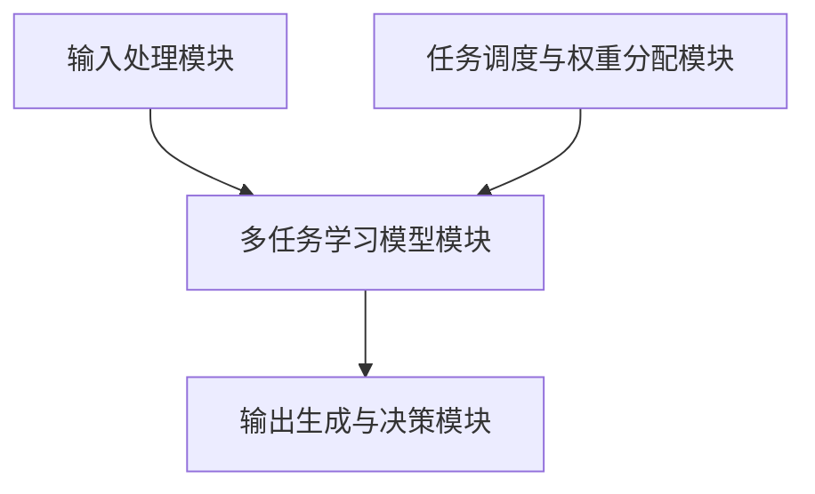
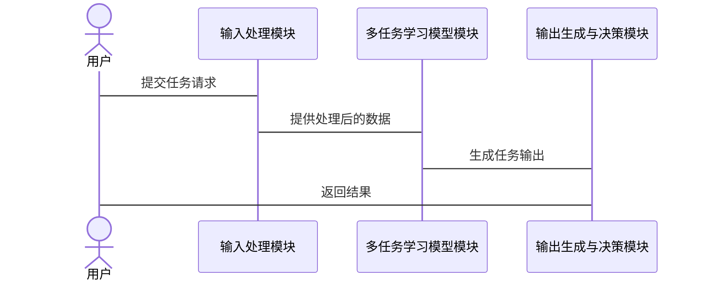

                 


# 多任务学习：构建全能型AI Agent

**关键词：** 多任务学习，AI Agent，机器学习，深度学习，任务建模

**摘要：** 多任务学习（Multi-Task Learning, MTL）是一种通过同时学习多个相关任务来提升模型性能和泛化能力的机器学习范式。本文将深入探讨多任务学习的核心概念、算法原理、系统架构设计以及实际应用案例，帮助读者全面理解如何利用多任务学习构建全能型AI Agent。文章从理论到实践，系统地分析了多任务学习的关键技术，并通过具体案例展示了其在AI Agent构建中的应用价值。

---

## 第三部分: 系统分析与架构设计

### 第4章: 多任务学习的系统架构设计

#### 4.1 AI Agent的系统架构概述
- 4.1.1 AI Agent的功能模块划分
  - 输入处理模块
  - 多任务学习模型模块
  - 任务调度与权重分配模块
  - 输出生成与决策模块
- 4.1.2 系统架构的整体设计思路
  - 模块之间的交互关系
  - 数据流与控制流的设计
  - 系统的可扩展性与灵活性

#### 4.2 多任务学习的系统架构图


#### 4.3 系统接口设计
- 4.3.1 输入接口规范
  - 输入数据格式
  - 任务类型标识
  - 参数配置接口
- 4.3.2 输出接口规范
  - 输出结果格式
  - 任务完成状态
  - 日志与反馈接口

#### 4.4 系统交互流程


---

## 第五部分: 项目实战

### 第5章: 多任务学习的项目实战

#### 5.1 项目背景与目标
- 5.1.1 项目背景
  - 构建一个能够进行对话理解、任务推理和决策的全能型AI Agent
- 5.1.2 项目目标
  - 实现多任务学习模型
  - 验证模型在多个任务上的性能
  - 验证系统的可扩展性

#### 5.2 环境配置与安装
- 5.2.1 系统环境要求
  - Python 3.8+
  - PyTorch 1.9+
  - CUDA 11.0+
- 5.2.2 安装依赖库
  - pip install torch transformers matplotlib

#### 5.3 代码实现与解读
##### 5.3.1 代码实现
```python
import torch
import torch.nn as nn
import torch.optim as optim
from torch.utils.data import DataLoader, Dataset

class MultiTaskModel(nn.Module):
    def __init__(self, input_dim, hidden_dim, output_dims):
        super(MultiTaskModel, self).__init__()
        self.shared_layer = nn.Sequential(
            nn.Linear(input_dim, hidden_dim),
            nn.ReLU()
        )
        self.task_layers = nn.ModuleList([
            nn.Linear(hidden_dim, output_dims[i]) for i in range(len(output_dims))
        ])
    
    def forward(self, x, tasks):
        x = self.shared_layer(x)
        outputs = []
        for i, task in enumerate(tasks):
            outputs.append(self.task_layers[i](x))
        return outputs

# 数据集定义
class MultiTaskDataset(Dataset):
    def __init__(self, X, y_list):
        self.X = X
        self.y_list = y_list
    
    def __len__(self):
        return len(self.X)
    
    def __getitem__(self, idx):
        return self.X[idx], self.y_list[idx]

# 训练函数
def train_model(model, optimizer, criterion, dataloaders, num_epochs=100):
    for epoch in range(num_epochs):
        for inputs, tasks in dataloaders:
            optimizer.zero_grad()
            outputs = model(inputs, tasks)
            loss = sum(criterion(output, target) for output, target in zip(outputs, tasks))
            loss.backward()
            optimizer.step()
    return model

# 测试函数
def test_model(model, dataloaders):
    with torch.no_grad():
        for inputs, tasks in dataloaders:
            outputs = model(inputs, tasks)
            # 验证每个任务的输出是否正确
            for i, (output, target) in enumerate(zip(outputs, tasks)):
                print(f"Task {i}: Output={output}, Target={target}")
```

##### 5.3.2 代码解读与分析
- 代码实现了多任务学习模型，包含共享层和任务特定层。
- 使用PyTorch框架进行训练和测试。
- 训练函数中，每个批次同时优化所有任务的损失函数。
- 测试函数展示了模型在多任务上的预测能力。

#### 5.4 案例分析与结果展示
- 5.4.1 训练过程展示
  - 每个任务的损失曲线
  - 整体模型的收敛速度
- 5.4.2 测试结果分析
  - 每个任务的准确率、召回率等指标
  - 任务之间是否存在性能竞争

#### 5.5 项目总结
- 成功实现了多任务学习模型
- 验证了多任务学习在AI Agent中的有效性
- 提出了系统扩展的改进建议

---

## 第六部分: 最佳实践与小结

### 第6章: 多任务学习的最佳实践

#### 6.1 实践中的注意事项
- 任务选择与设计的合理性
- 任务权重分配的动态调整
- 模型复杂度的平衡
- 数据分布的均衡性

#### 6.2 小结与展望
- 多任务学习的核心价值
- 构建全能型AI Agent的关键技术
- 未来研究方向与挑战

---

**作者：AI天才研究院/AI Genius Institute & 禅与计算机程序设计艺术 /Zen And The Art of Computer Programming**

