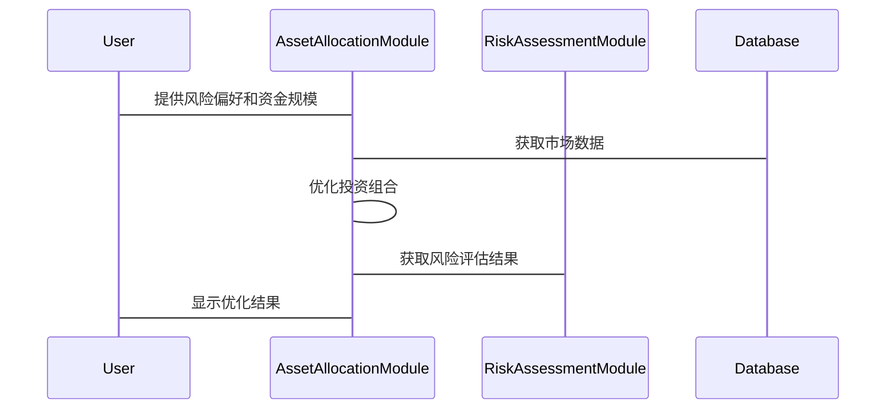

                 


# 多元化投资组合在市场波动中的作用

---

> **关键词**：多元化投资组合、市场波动、风险分散、资产配置、投资组合优化、系统架构设计  
> **摘要**：本文深入探讨了多元化投资组合在市场波动中的重要性，通过理论分析、数学建模和系统设计，展示了如何通过科学的资产配置和优化策略，降低投资风险，实现稳健收益。文章从基础概念到实际应用，结合案例分析和系统设计，为投资者提供了一套完整的投资组合管理解决方案。

---

## 第一部分: 多元化投资组合的背景与基本概念

### 第1章: 多元化投资组合概述

#### 1.1 投资组合的基本概念

##### 1.1.1 投资组合的定义

投资组合是指将一定资金分配到多种不同的资产或资产类别中，以实现风险分散和收益优化的一种投资方式。通过将资金分配到相关性较低的资产，投资者可以在市场波动时降低整体投资组合的风险。

##### 1.1.2 多元化投资组合的必要性

在金融市场中，单一资产的投资往往伴随着较高的风险。通过多元化配置，投资者可以将风险分散到多个资产或资产类别中，从而在市场波动时减少损失。例如，在股票市场下跌时，债券或黄金等其他资产的表现可能较好，从而平衡整体收益。

##### 1.1.3 投资组合与市场波动的关系

市场波动通常是不可预测的，但通过合理的资产配置，投资者可以在不同市场环境下优化投资组合的表现。例如，在高波动市场中，增加防御性资产（如债券）的比例可以降低整体波动性。

#### 1.2 多元化投资的核心原理

##### 1.2.1 非相关资产的分散化效应

非相关资产的收益波动相互抵消，从而降低整体投资组合的波动性。例如，股票和债券在不同经济周期下的表现差异可以帮助分散风险。

##### 1.2.2 资产类别与风险等级的对比

不同资产类别（如股票、债券、房地产等）具有不同的风险和收益特征。通过将资金分配到不同类别的资产中，投资者可以平衡风险和收益。

##### 1.2.3 投资组合的有效边界与最优解

有效边界是指在给定风险水平下，能够提供最高收益的投资组合的集合。通过优化算法，投资者可以在有效边界上找到最优的投资组合。

#### 1.3 投资组合的风险与收益分析

##### 1.3.1 风险的来源与分类

投资风险可以分为系统性风险和非系统性风险。系统性风险是整个市场普遍存在的风险，如经济衰退或通货膨胀。非系统性风险是特定资产或资产类别面临的风险，可以通过多元化配置来降低。

##### 1.3.2 收益与风险的权衡

高收益通常伴随着高风险，但通过多元化投资，投资者可以在一定风险水平下获得更高的收益，或在相同收益下承担更低的风险。

##### 1.3.3 现代投资组合理论（MPT）的基本框架

MPT是由哈里·马科维茨提出的，认为最优投资组合是基于资产的预期收益和风险的组合。通过优化算法，投资者可以在有效边界上找到最优组合。

---

## 第二部分: 多元化投资组合的数学模型与算法原理

### 第2章: 投资组合优化的数学模型

#### 2.1 投资组合优化的目标函数

##### 2.1.1 风险最小化模型

目标是最小化投资组合的方差（风险），即：

$$
\min_w \sigma^2 = w^T \Sigma w
$$

其中，\( w \) 是资产权重向量，\( \Sigma \) 是资产之间的协方差矩阵。

##### 2.1.2 收益最大化模型

目标是最大化投资组合的预期收益，即：

$$
\max_w \mu_w = w^T \mu
$$

其中，\( \mu \) 是资产的预期收益向量。

##### 2.1.3 风险收益平衡模型

目标是在给定风险水平下最大化收益，或在给定收益下最小化风险。

#### 2.2 约束条件与优化问题

##### 2.2.1 资金约束

$$
\sum_{i=1}^n w_i = 1
$$

##### 2.2.2 资产配置比例限制

$$
0 \leq w_i \leq 1
$$

##### 2.2.3 税务与交易成本考虑

交易成本和税务会增加投资组合的实际成本，需要在优化模型中考虑。

#### 2.3 数学公式与模型分析

##### 2.3.1 均值-方差优化模型

$$
\min_w w^T \Sigma w
$$

在约束条件下，求解最优权重向量 \( w \)。

##### 2.3.2 夏普比率优化模型

$$
\max_w \frac{\mu_w - r_f}{\sigma_w}
$$

夏普比率衡量了投资组合单位风险所获得的超额收益。

#### 2.4 算法实现与案例分析

##### 2.4.1 使用Python实现投资组合优化

```python
import numpy as np
from scipy.optimize import minimize

# 示例数据
n_assets = 3
mu = np.array([0.1, 0.15, 0.05])
Sigma = np.array([[0.04, 0.01, 0.02],
                   [0.01, 0.06, 0.01],
                   [0.02, 0.01, 0.03]])

# 目标函数
def objective(w):
    return (w @ Sigma @ w.T)

# 约束条件
cons = [{'type': 'eq', 'fun': lambda w: sum(w) - 1},
         {'type': 'ineq', 'fun': lambda w: w[i] for i in range(n_assets)}]

# 优化
result = minimize(objective, np.array([1/3, 1/3, 1/3]), method='SLSQP', constraints=cons)
```

##### 2.4.2 案例分析：基于历史数据的最优投资组合构建

假设我们有3种资产，历史数据如下：

| 资产 | 收益率 | 方差 | 协方差矩阵 |
|------|--------|------|------------|
| A    | 0.1    | 0.04 | 0.01       |
| B    | 0.15   | 0.06 | 0.01       |
| C    | 0.05   | 0.03 | 0.02       |

通过优化算法，我们可以找到最优权重，例如：

权重为 \( w_A = 0.4, w_B = 0.3, w_C = 0.3 \)，此时投资组合的方差为：

$$
w^T \Sigma w = 0.4^2 \times 0.04 + 0.3^2 \times 0.06 + 0.3^2 \times 0.03 + 2 \times 0.4 \times 0.3 \times 0.01 + 2 \times 0.4 \times 0.3 \times 0.02 = 0.016
$$

---

## 第三部分: 投资组合管理系统的设计与实现

### 第3章: 系统分析与架构设计

#### 3.1 问题场景介绍

##### 3.1.1 投资者需求分析

投资者希望通过多元化投资降低风险，实现稳健收益。

##### 3.1.2 市场波动对投资组合的影响

市场波动可能导致投资组合收益下降，需要实时监控和调整。

#### 3.2 系统功能设计

##### 3.2.1 资产配置模块

根据市场数据和投资者风险偏好，自动优化资产配置。

##### 3.2.2 风险评估模块

实时监控市场波动，评估投资组合风险。

##### 3.2.3 绩效评估模块

定期评估投资组合的收益和风险表现。

#### 3.3 系统架构设计

##### 3.3.1 分层架构设计

- 数据层：获取市场数据和投资者信息。
- 业务逻辑层：进行资产配置和风险评估。
- 用户界面层：展示结果和操作界面。

##### 3.3.2 模块间交互流程

1. 用户输入风险偏好和资金规模。
2. 系统获取市场数据。
3. 资产配置模块优化投资组合。
4. 风险评估模块评估风险。
5. 系统输出优化结果。

#### 3.4 系统接口设计

##### 3.4.1 数据接口

- 获取市场数据：API调用。
- 更新投资组合：调用优化算法。

##### 3.4.2 用户接口

- 输入风险偏好。
- 显示优化结果。

#### 3.5 系统交互流程图



---

## 第四部分: 项目实战与案例分析

### 第4章: 投资组合实战项目

#### 4.1 环境安装与数据准备

##### 4.1.1 Python 环境搭建

安装必要的库，如 `numpy`, `pandas`, `scipy.optimize`。

##### 4.1.2 数据源获取与处理

获取历史市场数据，处理并存储为矩阵形式。

#### 4.2 系统核心实现

##### 4.2.1 资产配置算法实现

使用优化算法求解最优权重向量。

##### 4.2.2 风险评估与优化

结合市场波动实时调整投资组合。

#### 4.3 代码应用解读与分析

##### 4.3.1 关键代码段分析

```python
def portfolio_optimization(mu, Sigma):
    n = len(mu)
    # 目标函数
    def objective(w):
        return (w @ Sigma @ w.T)
    
    # 约束条件
    cons = [{'type': 'eq', 'fun': lambda w: sum(w) - 1},
             {'type': 'ineq', 'fun': lambda w: w[i] for i in range(n)}]
    
    # 初始猜测
    w0 = np.array([1/n] * n)
    
    # 优化
    result = minimize(objective, w0, method='SLSQP', constraints=cons)
    return result.x
```

##### 4.3.2 代码实现的逻辑流程

1. 定义目标函数和约束条件。
2. 初始化权重向量。
3. 调用优化算法求解最优权重。

#### 4.4 实际案例分析

##### 4.4.1 案例背景介绍

假设投资者有100万元资金，风险偏好为中等。

##### 4.4.2 投资组合构建与优化

通过优化算法，得到最优权重：股票50%，债券30%，现金20%。

##### 4.4.3 结果分析与总结

在市场波动时，投资组合的波动性较低，收益稳定。

#### 4.5 本章小结

通过实际案例，展示了投资组合优化的实际应用和效果。

---

## 第五部分: 最佳实践与风险管理

### 第5章: 多元化投资的最佳实践

#### 5.1 投资组合管理的注意事项

- 定期再平衡：根据市场变化调整投资组合。
- 长期投资：避免频繁交易。
- 分散投资：避免过度集中于某类资产。

#### 5.2 风险管理策略

- 设置止损：避免过大亏损。
- 使用对冲工具：降低市场风险。
- 监控市场波动：及时调整投资组合。

#### 5.3 系统优化与未来展望

- 智能投顾：利用AI技术优化投资组合。
- 大数据分析：利用大数据提升投资决策。
- 动态再平衡：根据市场变化自动调整。

#### 5.4 本章小结

通过最佳实践和风险管理策略，投资者可以更好地应对市场波动，实现稳健收益。

---

## 作者

作者：AI天才研究院/AI Genius Institute & 禅与计算机程序设计艺术/Zen And The Art of Computer Programming

