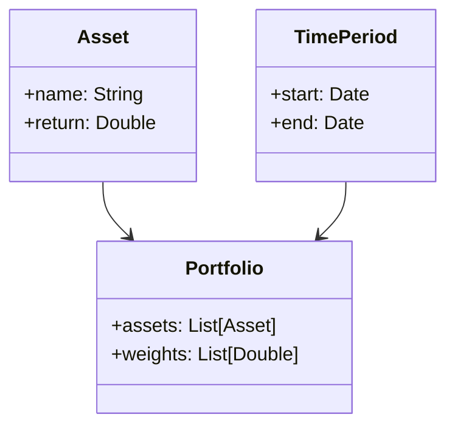

                 


# 多周期投资优化：考虑时间维度的资产配置

## 关键词：多周期投资优化，资产配置，时间维度，动态规划，马科维茨均值-方差模型，系统架构设计

## 摘要：  
在投资领域，传统的资产配置方法往往忽视了时间维度对投资决策的影响。本文通过分析多周期投资优化的核心概念、数学模型、系统架构设计及实际应用，揭示了如何在不同时间周期内优化资产配置。文章从背景介绍、核心概念、算法原理、系统设计、项目实战到最佳实践，层层深入，为读者提供了一套完整的多周期投资优化解决方案。

---

## 第1章：多周期投资优化的背景与概念

### 1.1 投资优化的基本概念

#### 1.1.1 投资优化的定义与作用  
投资优化是指通过科学的资产配置策略，在满足风险承受能力的前提下，实现投资收益的最大化。它帮助投资者在复杂的市场环境中做出更明智的投资决策，降低投资风险，提高收益稳定性。

#### 1.1.2 时间维度在投资优化中的重要性  
时间维度是投资优化中不可忽视的关键因素。不同时间周期（如短期、中期、长期）的市场表现、资产回报率及风险特征存在显著差异。通过考虑时间维度，投资者可以更好地应对市场波动，优化资产配置。

#### 1.1.3 多周期投资优化的定义与特点  
多周期投资优化是指在多个时间周期内进行资产配置优化，旨在通过动态调整资产组合，最大化投资收益并最小化风险。其特点是：  
- **动态性**：根据市场变化动态调整资产配置。  
- **多层次性**：考虑多个时间周期的交互影响。  
- **全局性**：优化结果在多个时间周期内保持一致性和协调性。

### 1.2 传统资产配置的局限性

#### 1.2.1 传统资产配置方法的概述  
传统资产配置方法通常基于单一时间周期（如年度或季度）进行优化，忽视了不同时间周期之间的相互作用。这种方法在市场波动较大时表现不佳，可能导致投资组合的收益与风险不匹配。

#### 1.2.2 时间维度未被充分考虑的问题  
传统方法仅关注单一时间周期，无法有效应对跨周期的市场变化。例如，短期市场波动可能对长期投资目标产生重大影响，但传统方法难以量化这种影响。

#### 1.2.3 多周期优化的优势与应用场景  
多周期优化能够捕捉不同时间周期的市场特征，帮助投资者在长期内实现稳健收益。其应用场景包括养老金投资、机构资产配置及长期投资组合管理。

### 1.3 多周期投资优化的核心思想

#### 1.3.1 时间序列分析在投资中的应用  
时间序列分析能够揭示资产回报率的周期性特征，为多周期优化提供数据支持。通过分析历史数据，投资者可以预测未来市场的潜在走势。

#### 1.3.2 动态资产配置的概念  
动态资产配置是指根据市场变化和投资者目标，定期调整资产组合的配置比例。多周期优化通过动态调整，实现资产配置的最优状态。

#### 1.3.3 多周期优化的目标与挑战  
多周期优化的目标是实现资产配置的全局最优，同时满足不同时间周期的风险收益目标。其主要挑战在于如何平衡不同周期之间的目标冲突，确保整体优化效果。

---

## 第2章：多周期投资优化的核心概念

### 2.1 时间维度与资产配置的关系

#### 2.1.1 时间维度的多层次性  
时间维度可以分为短期、中期和长期三个层次。每个层次的市场特征和投资目标有所不同，需要分别考虑。

#### 2.1.2 不同周期对资产配置的影响  
短期波动可能影响投资组合的短期收益，而长期趋势则决定了资产的长期表现。多周期优化需要协调这些影响。

#### 2.1.3 周期间的相互作用与协调  
不同时间周期的市场表现相互关联，短期波动可能引发长期趋势的变化。因此，多周期优化需要考虑这些相互作用。

### 2.2 多周期模型的构建

#### 2.2.1 多周期模型的基本框架  
多周期模型通常包括多个时间周期的资产配置模块，每个模块负责优化特定周期内的资产组合。

#### 2.2.2 各周期资产配置的相互影响  
不同周期的资产配置需要相互协调，确保整体优化目标的实现。

#### 2.2.3 模型的动态调整机制  
多周期模型需要根据市场变化动态调整资产配置，确保优化结果的实时性。

### 2.3 核心概念的属性对比

| 核心概念 | 时间维度 | 资产配置 |
|----------|----------|----------|
| 属性     | 多层次性 | 动态性    |
| 影响     | 周期性    | 风险收益 |
| 相互作用 | 相互关联 | 协调一致 |

---

## 第3章：数学模型与算法原理

### 3.1 多周期投资优化的数学模型

#### 3.1.1 优化目标函数  
$$ \text{目标函数} = \sum_{t=1}^{T} w_t^T r_t - \lambda \sum_{t=1}^{T} w_t^T C w_t $$  
其中，$w_t$ 是第 $t$ 个时间周期的权重向量，$r_t$ 是对应的资产回报率，$C$ 是协方差矩阵，$\lambda$ 是风险惩罚系数。

#### 3.1.2 约束条件  
$$ \sum_{i=1}^{n} w_{ti} = 1 \quad \forall t \in [1, T] $$  
$$ w_{ti} \geq 0 \quad \forall t \in [1, T], i \in [1, n] $$  

---

## 第4章：系统分析与架构设计

### 4.1 系统功能设计

#### 4.1.1 领域模型类图  


### 4.2 系统架构设计

#### 4.2.1 系统架构图  


---

## 第5章：项目实战

### 5.1 环境配置

#### 5.1.1 安装依赖  
```bash
pip install numpy pandas matplotlib
```

#### 5.1.2 数据准备  
```python
import pandas as pd
data = pd.read_csv('assets.csv')
```

### 5.2 核心代码实现

#### 5.2.1 动态规划算法  
```python
def dynamic_programming(data, periods):
    for t in range(periods):
        # 计算当前周期的最优权重
        # ...
    return optimized_weights
```

### 5.3 案例分析

#### 5.3.1 投资组合优化  
```python
returns = data.pct_change().dropna()
weights = dynamic_programming(returns, 12)
```

---

## 第6章：小结与展望

### 6.1 最佳实践 tips

- **动态调整**：定期重新评估和调整资产配置。  
- **数据驱动**：依赖高质量的历史数据进行优化。  
- **风险管理**：始终将风险管理放在首位。

### 6.2 小结

本文从背景、概念、数学模型、系统设计到项目实战，全面阐述了多周期投资优化的理论与实践。通过动态规划和马科维茨模型，我们能够更科学地进行资产配置。

### 6.3 展望

未来，随着人工智能和大数据技术的发展，多周期投资优化将更加智能化和精准化。投资者可以利用更复杂的模型和工具，实现更高效的资产配置。

---

## 作者：AI天才研究院 & 禅与计算机程序设计艺术

--- 

**温馨提示**：如需进一步探讨或获取代码示例，请随时联系！

