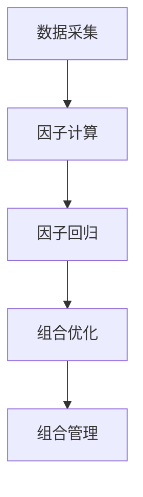

                 


# 多因子模型：提高投资组合表现的系统方法

## 关键词：多因子模型、投资组合、系统方法、量化投资、因子分析

## 摘要：  
多因子模型是一种系统化的投资方法，通过多个经济因子（如市值、价值、动量等）来解释资产收益，并构建投资组合以优化风险调整后的收益。本文从多因子模型的基本概念出发，逐步分析其数学原理、系统设计、实战应用及优化策略，帮助读者全面理解并掌握如何利用多因子模型提升投资组合的表现。

---

## 第一部分：多因子模型的背景与概念

### 第1章：多因子模型的背景与概念

#### 1.1 多因子模型的定义
多因子模型是一种基于多个经济因子（如市值、价值、动量、质量等）来解释资产收益的投资模型。它通过分析这些因子之间的关系，构建投资组合以实现超额收益。与传统单一因子模型相比，多因子模型能够更全面地捕捉市场风险和收益来源。

#### 1.2 多因子模型的核心要素
- **因子选择**：选择能够解释资产收益的核心因子，如市值（Size）、价值（Value）、动量（Momentum）、质量（Quality）等。
- **因子权重**：确定每个因子在投资组合中的权重，以优化风险调整后的收益。
- **因子组合**：将多个因子组合起来，构建一个分散化程度更高的投资组合。

#### 1.3 多因子模型的优势
- **分散化**：通过多个因子的组合，降低单一因子的风险。
- **超额收益**：通过捕捉多个因子的超额收益，提升投资组合的整体收益。
- **风险管理**：通过因子间的负相关性，降低投资组合的整体风险。

---

## 第二部分：多因子模型的核心概念与联系

### 第2章：多因子模型的核心概念

#### 2.1 多因子模型的因子属性
| 因子名称 | 定义 | 示例 |
|----------|------|------|
| 市值（Size） | 以市值大小作为因子，小盘股与大盘股表现差异 | 使用对数市值作为因子 |
| 价值（Value） | 以市盈率、市净率等估值指标作为因子，寻找低估资产 | 使用低市盈率或低市净率股票 |
| 动量（Momentum） | 过去一段时间的收益表现，动量效应 | 使用过去12个月的收益作为因子 |
| 质量（Quality） | 以盈利能力、现金流等财务指标作为因子，衡量公司质量 | 使用高ROE或高净利润率公司 |

#### 2.2 多因子模型的因子关系
通过分析因子之间的相关性，构建最优因子组合。例如，市值因子与价值因子可能在某些市场条件下呈现负相关性，从而降低投资组合的整体风险。

#### 2.3 多因子模型的数学表达
$$
R_i = \alpha + \beta_1 F_1 + \beta_2 F_2 + \cdots + \beta_n F_n + \epsilon
$$
其中，$R_i$ 是资产i的收益，$F_j$ 是因子j的收益，$\beta_j$ 是因子j的载荷，$\epsilon$ 是残差。

---

## 第三部分：多因子模型的算法原理

### 第3章：多因子模型的构建步骤

#### 3.1 数据收集与预处理
- 数据来源：股票的历史价格、财务数据、市场数据等。
- 数据清洗：处理缺失值、异常值等。

#### 3.2 因子计算与筛选
- 计算各个因子的值，如市值、价值、动量等。
- 筛选具有统计显著性的因子。

#### 3.3 因子回归与优化
- 进行因子回归，计算因子载荷。
- 优化因子权重，构建投资组合。

### 第4章：多因子模型的数学推导

#### 4.1 因子回归模型
$$
R_i = \alpha + \beta_1 F_1 + \beta_2 F_2 + \cdots + \beta_n F_n + \epsilon
$$
通过回归分析，确定每个因子对收益的贡献。

#### 4.2 风险调整模型
使用多因子模型构建风险调整后的收益，通过因子载荷矩阵进行组合优化。

#### 4.3 组合优化模型
$$
\text{Maximize } \mu^T w - \frac{1}{2} w^T \Sigma w
$$
其中，$\mu$ 是预期收益向量，$\Sigma$ 是协方差矩阵，$w$ 是权重向量。

---

## 第四部分：多因子模型的系统分析与架构设计

### 第5章：多因子模型的系统设计

#### 5.1 系统功能设计
- 数据采集模块：从数据库中获取历史数据。
- 因子计算模块：计算各个因子的值。
- 模型构建模块：进行因子回归和组合优化。
- 组合管理模块：监控和调整投资组合。

#### 5.2 系统架构设计


---

## 第五部分：多因子模型的项目实战

### 第6章：多因子模型的实战应用

#### 6.1 环境安装
安装必要的Python库，如pandas、numpy、scipy等。

#### 6.2 核心代码实现
```python
import pandas as pd
import numpy as np

# 示例：计算市值因子
data = pd.read_csv('stock_data.csv')
data['market_cap'] = data['price'] * data['volume']
data['market_cap_rank'] = data['market_cap'].rank()
```

#### 6.3 实际案例分析
通过具体案例，分析如何利用多因子模型构建投资组合，并对结果进行解读。

---

## 第六部分：多因子模型的总结与优化

### 第7章：多因子模型的总结与优化

#### 7.1 最佳实践
- 定期更新因子数据。
- 根据市场变化调整因子权重。
- 结合其他投资策略（如动量策略）进行优化。

#### 7.2 小结
多因子模型是一种系统化的投资方法，通过多个因子的组合，能够有效提升投资组合的风险调整后收益。

---

## 作者：AI天才研究院 & 禅与计算机程序设计艺术

---

以上是《多因子模型：提高投资组合表现的系统方法》的技术博客文章的完整内容。

