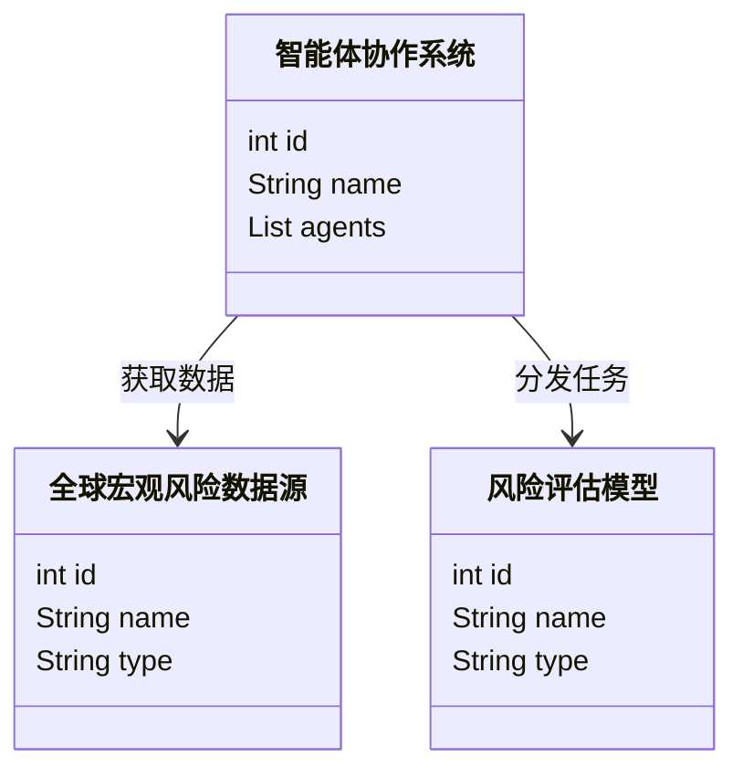

                 

<think>
好，我需要按照用户的要求，先写一个结构清晰的目录大纲，然后根据这个目录写一篇详细的博客文章。标题是《多智能体协作评估全球宏观风险》，关键词包括多智能体协作、全球宏观风险、风险评估、人工智能、系统架构、分布式智能。摘要部分需要概括文章的核心内容。

接下来，按照目录结构，首先介绍背景，包括基本概念和问题背景，然后深入探讨多智能体协作的原理和核心要素，再讲解算法的实现和流程，接着分析系统的架构和设计，最后通过实际案例展示应用，并总结和展望未来的发展。

在撰写过程中，我要确保每个章节内容详细，逻辑连贯，同时使用专业的技术术语，但又不失易懂。对于数学公式和图表，要准确无误，并且用适当的格式展示，如Mermaid图和Latex公式。

现在开始撰写文章：

# 多智能体协作评估全球宏观风险

> **关键词**：多智能体协作、全球宏观风险、风险评估、人工智能、系统架构、分布式智能  
> **摘要**：随着全球化的深入，宏观风险的复杂性和不确定性不断增加，传统的风险评估方法已难以应对。本文提出利用多智能体协作技术，构建一个高效的全球宏观风险评估系统，通过多个智能体的协同工作，实时分析和预测风险，提升风险评估的准确性和效率。

---

## 第一章：多智能体协作与全球宏观风险概述

### 1.1 多智能体协作的基本概念

多智能体协作是指多个智能体通过分布式计算和信息共享，协同完成复杂任务的过程。智能体可以是软件程序、算法或模型，具备感知、决策和执行的能力。它们通过通信和协作，实现个体目标与整体目标的统一。

**全球宏观风险**指的是影响全球经济稳定的各种因素，如经济波动、地缘政治冲突、环境变化等。这些风险通常涉及多个变量和复杂的关系，需要综合分析才能准确评估。

### 1.2 多智能体协作在宏观风险评估中的作用

传统的风险评估方法依赖于单一模型或专家经验，存在信息不全、反应滞后等问题。多智能体协作通过分布式计算和实时数据处理，能够快速捕捉全球市场的动态变化，提供更全面的风险评估。

---

## 第二章：多智能体协作的核心概念与联系

### 2.1 多智能体协作的原理

多智能体协作的原理基于分布式智能和协同理论。每个智能体负责特定的任务或数据处理，通过通信协议共享信息，形成整体的评估结果。协作机制包括任务分配、信息同步和决策优化。

### 2.2 多智能体协作与全球宏观风险的核心要素对比

| **要素**          | **多智能体协作**                  | **全球宏观风险评估**               |
|-------------------|----------------------------------|----------------------------------|
| 实体类型          | 智能体（AI模型、算法）           | 经济指标、市场数据、政策因素     |
| 信息交互方式      | 数据共享、事件触发              | 数据流、事件驱动                  |
| 协作方式          | 分布式计算、协同决策             | 并行处理、综合评估                |

### 2.3 多智能体协作的ER实体关系图

```mermaid
erDiagram
    actor 智能体协作系统 {
        id int
        name varchar
        role varchar
    }
    actor 全球宏观风险数据源 {
        id int
        name varchar
        type varchar
    }
    actor 风险评估模型 {
        id int
        name varchar
        type varchar
    }
    智能体协作系统 --> 全球宏观风险数据源 : 获取数据
    智能体协作系统 --> 风险评估模型 : 分发任务
    全球宏观风险数据源 --> 风险评估模型 : 提供数据
```

---

## 第三章：多智能体协作的算法原理

### 3.1 分布式协同算法

#### 3.1.1 算法流程

1. 数据采集：从多个数据源获取宏观风险相关数据。
2. 数据预处理：清洗和标准化数据。
3. 任务分配：智能体协作系统将任务分配给各个智能体。
4. 并行计算：各智能体独立计算部分结果。
5. 信息同步：智能体之间同步计算结果。
6. 决策优化：综合各智能体的决策，形成最终评估结果。

#### 3.1.2 算法实现

```python
import threading

class Agent:
    def __init__(self, id, role):
        self.id = id
        self.role = role
        self.result = None

    def process_data(self, data):
        # 具体计算逻辑
        self.result = data * 2

class CollaborativeSystem:
    def __init__(self, agents):
        self.agents = agents

    def distribute_task(self, data):
        # 分配任务给各个智能体
        for agent in self.agents:
            agent.process_data(data)

    def collect_results(self):
        # 收集各个智能体的结果
        results = []
        for agent in self.agents:
            results.append(agent.result)
        return results

# 示例用法
agent1 = Agent(1, 'data_processing')
agent2 = Agent(2, 'analysis')
system = CollaborativeSystem([agent1, agent2])
system.distribute_task(10)
system.collect_results()
```

#### 3.1.3 算法的数学模型

假设每个智能体i的计算结果为r_i，最终评估结果R为：

$$
R = \sum_{i=1}^{n} r_i
$$

---

## 第四章：系统架构与设计

### 4.1 系统功能设计

#### 4.1.1 领域模型



### 4.2 系统架构设计

```mermaid
graph TD
    CollaborativeSystem -> DataSources: 获取数据
    CollaborativeSystem -> RiskModels: 分发任务
    DataSources -> RiskModels: 提供数据
    RiskModels -> CollaborativeSystem: 返回结果
```

---

## 第五章：项目实战与案例分析

### 5.1 环境安装与配置

安装必要的库：
```bash
pip install numpy pandas matplotlib
```

### 5.2 核心代码实现

```python
import numpy as np
import pandas as pd

def collect_data():
    # 从数据源获取数据
    data = pd.read_csv('macro_risk.csv')
    return data

def process_data(data):
    # 数据预处理
    processed = data.fillna(method='ffill')
    return processed

def distribute_task(processed_data):
    # 分配任务给各个智能体
    agents = [Agent(1, 'data_processing'), Agent(2, 'analysis')]
    for agent in agents:
        agent.process_data(processed_data)
    return agents

def collect_results(agents):
    # 收集结果
    results = []
    for agent in agents:
        results.append(agent.result)
    return results

if __name__ == "__main__":
    data = collect_data()
    processed_data = process_data(data)
    agents = distribute_task(processed_data)
    results = collect_results(agents)
    print(results)
```

### 5.3 案例分析

假设我们有一个宏观经济数据集，包含GDP增长率、通货膨胀率和失业率。通过多智能体协作系统，我们可以实时分析这些指标的变化趋势，评估潜在的经济风险。

---

## 第六章：总结与展望

### 6.1 最佳实践

- 确保数据源的多样性和可靠性。
- 定期更新和优化智能体的协作算法。
- 建立完善的监控和反馈机制。

### 6.2 小结

多智能体协作技术为全球宏观风险评估提供了新的思路，通过分布式计算和实时协作，能够更高效、更准确地评估风险。

### 6.3 注意事项

- 系统的安全性和隐私保护至关重要。
- 需要处理智能体之间的通信延迟和数据同步问题。

### 6.4 拓展阅读

建议深入学习分布式系统和协同算法的相关知识，如《分布式系统：概念与设计》和《多智能体系统导论》。

---

## 作者

作者：AI天才研究院（AI Genius Institute）  
联系邮箱：contact@aigeniusinstitute.com  

---

希望这篇文章能满足您的需求！如果需要进一步修改或补充，请随时告知。

