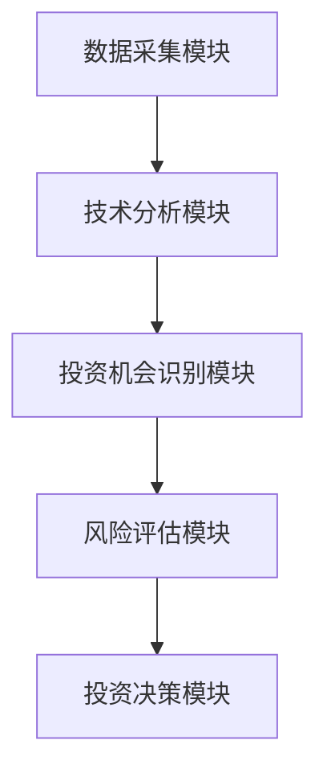
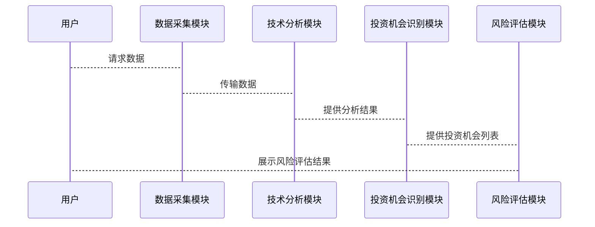

                 


# 多智能体系统在识别和评估颠覆性技术投资机会中的作用

> 关键词：多智能体系统, 颠覆性技术, 投资机会, 协同决策, 风险评估

> 摘要：本文探讨了多智能体系统（MAS）在识别和评估颠覆性技术投资机会中的作用。通过分析多智能体系统的定义、核心概念、算法原理、系统架构设计、项目实战以及实际案例，本文详细阐述了多智能体系统在投资决策中的优势。文章结合理论与实践，展示了如何利用多智能体系统来提高投资决策的准确性和效率，为投资者提供新的思路和方法。

---

## 第一部分: 多智能体系统与颠覆性技术投资概述

### 第1章: 多智能体系统与颠覆性技术概述

#### 1.1 多智能体系统的定义与特点
##### 1.1.1 多智能体系统的定义
多智能体系统（Multi-Agent System, MAS）是由多个智能体组成的分布式系统，这些智能体能够通过协同工作完成复杂的任务。每个智能体都有一定的自主性，能够感知环境、做出决策并与其他智能体进行交互。

##### 1.1.2 多智能体系统的核心特点
- **自主性**：每个智能体都能够自主决策。
- **反应性**：能够实时感知环境并做出响应。
- **协作性**：智能体之间可以协同工作，共同完成任务。
- **分布式性**：系统中的智能体分布在网络中，不存在集中控制点。

##### 1.1.3 多智能体系统与传统单智能体系统的区别
| 特性         | 多智能体系统（MAS）                | 单智能体系统（SAS）                |
|--------------|-----------------------------------|-----------------------------------|
| 结构         | 分布式、去中心化                 | 集中式、单一中心点               |
| 智能体数量   | 多个智能体                       | 单个智能体                       |
| 协作能力     | 高，智能体之间可以协同工作       | 低，单个智能体独立完成任务       |
| 灵活性       | 高，适应复杂环境变化             | 低，适应性较差                   |

#### 1.2 颠覆性技术的定义与特征
##### 1.2.1 颠覆性技术的定义
颠覆性技术是指能够从根本上改变现有市场格局或技术路径的技术。这类技术通常具有创新性、突破性和广泛影响，能够对传统行业产生根本性变革。

##### 1.2.2 颠覆性技术的核心特征
- **创新性**：颠覆性技术通常基于新兴的科学原理或技术突破。
- **突破性**：能够在性能、成本或用户体验等方面实现重大突破。
- **广泛影响**：能够对多个行业或领域产生深远影响。

##### 1.2.3 颠覆性技术的识别与评估
颠覆性技术的识别通常需要结合技术趋势分析、市场反馈和专家意见。评估颠覆性技术的关键在于判断其是否具有潜在的广泛影响和商业可行性。

#### 1.3 多智能体系统在投资中的作用
##### 1.3.1 多智能体系统在投资决策中的优势
- **分布式决策**：多智能体系统能够通过分布式决策提高投资决策的准确性和效率。
- **协同分析**：多个智能体可以协同分析市场数据，发现潜在的投资机会。
- **动态适应**：多智能体系统能够快速适应市场变化，及时调整投资策略。

##### 1.3.2 多智能体系统在识别颠覆性技术中的应用
- **数据收集与分析**：智能体可以实时收集市场数据，分析技术趋势。
- **模式识别**：通过协同学习，智能体能够识别颠覆性技术的早期迹象。
- **风险评估**：多智能体系统可以通过博弈论模型评估颠覆性技术的风险。

##### 1.3.3 多智能体系统在投资风险评估中的价值
- **风险预警**：通过实时监控市场动态，智能体可以提前发现潜在风险。
- **情景分析**：多智能体系统可以模拟不同市场情景，评估投资风险。
- **动态调整**：智能体能够根据市场变化动态调整投资策略。

---

## 第二部分: 多智能体系统的核心概念与联系

### 第2章: 多智能体系统的核心概念与联系

#### 2.1 多智能体系统的组成与关系
##### 2.1.1 实体关系图（ER图）
```mermaid
erDiagram
    customer {
        id : integer
        name : string
        investment : string
    }
    technology {
        id : integer
        name : string
        impact : string
    }
    agent {
        id : integer
        name : string
        role : string
    }
    customer -[o-1] investment机会
    technology -[o-1] 颠覆性技术
    agent -[o-1] 协同决策
```

##### 2.1.2 多智能体系统的核心要素
| 要素         | 描述                     |
|--------------|--------------------------|
| 智能体       | 系统的基本单元，具有自主性 |
| 环境         | 智能体所处的外部环境     |
| 交互机制     | 智能体之间的通信与协作机制 |
| 协调机制     | 智能体协同工作的规则     |

##### 2.1.3 多智能体系统与投资机会的关系
多智能体系统通过协同分析市场数据，识别潜在的投资机会，同时评估这些机会的可行性和风险。

#### 2.2 多智能体系统与颠覆性技术的关联
##### 2.2.1 颠覆性技术的识别机制
多智能体系统通过分布式数据收集和协同分析，能够快速识别颠覆性技术的早期迹象。

##### 2.2.2 多智能体系统在技术评估中的作用
- **数据整合**：智能体可以整合多个来源的技术数据，进行综合评估。
- **模式识别**：通过机器学习算法，智能体能够识别颠覆性技术的特征。
- **风险评估**：多智能体系统可以评估颠覆性技术的市场风险和商业可行性。

##### 2.2.3 多智能体系统与投资决策的协同关系
通过协同决策，多智能体系统能够帮助投资者制定更加科学的投资策略。

#### 2.3 多智能体系统的核心原理
##### 2.3.1 多智能体系统的基本原理
多智能体系统通过智能体之间的通信和协作，实现复杂任务的分布式完成。

##### 2.3.2 多智能体系统中的协调机制
协调机制是多智能体系统的核心，通过协调机制，智能体可以协同工作，实现目标。

##### 2.3.3 多智能体系统的动态适应性
多智能体系统能够根据环境变化动态调整策略，具有高度的适应性。

---

## 第三部分: 多智能体系统的算法原理

### 第3章: 多智能体系统的算法原理

#### 3.1 多智能体系统中的协调与学习机制
##### 3.1.1 协调机制的定义与实现
协调机制是多智能体系统中智能体之间协同工作的规则，通常包括通信协议和任务分配机制。

##### 3.1.2 多智能体系统中的学习算法
多智能体系统可以通过强化学习和博弈论模型来优化决策。

##### 3.1.3 协调机制的数学模型
$$ P(i) = \sum_{j=1}^{n} \alpha_{ij} \cdot S_j $$
其中，$P(i)$ 表示智能体 $i$ 的决策概率，$\alpha_{ij}$ 是智能体 $i$ 和 $j$ 之间的协同系数，$S_j$ 是智能体 $j$ 的状态。

#### 3.2 多智能体系统中的博弈论模型
##### 3.2.1 博弈论的基本概念
博弈论是研究多个决策者在竞争环境中的行为和策略的理论。

##### 3.2.2 多智能体系统中的博弈模型
多智能体系统可以看作是一个博弈环境，智能体之间的互动遵循博弈论的规则。

##### 3.2.3 博弈论在投资决策中的应用
通过博弈论模型，智能体可以预测其他智能体的决策，从而优化自身的投资策略。

#### 3.3 多智能体系统的数学模型与公式
##### 3.3.1 协调机制的数学表达
$$ C = \sum_{i=1}^{n} \sum_{j=1}^{m} \beta_{ij} \cdot x_{ij} $$
其中，$C$ 是协调机制的总成本，$\beta_{ij}$ 是智能体 $i$ 和 $j$ 之间的协同成本，$x_{ij}$ 是智能体 $i$ 和 $j$ 之间的协同活动次数。

##### 3.3.2 博弈论模型的数学公式
$$ V(i) = \max_{x_i} \min_{x_{-i}} U(i, x_i, x_{-i}) $$
其中，$V(i)$ 是智能体 $i$ 的价值函数，$x_i$ 是智能体 $i$ 的决策，$x_{-i}$ 是其他智能体的决策。

##### 3.3.3 多智能体系统中的概率模型
$$ P(x|y) = \frac{P(y|x) \cdot P(x)}{P(y)} $$
其中，$P(x|y)$ 是在给定 $y$ 的条件下 $x$ 的概率，$P(y|x)$ 是在给定 $x$ 的条件下 $y$ 的概率，$P(x)$ 是 $x$ 的先验概率，$P(y)$ 是 $y$ 的边缘概率。

---

## 第四部分: 系统分析与架构设计

### 第4章: 系统分析与架构设计

#### 4.1 投资机会识别系统的需求分析
##### 4.1.1 系统目标与范围
系统目标是通过多智能体系统识别和评估颠覆性技术的投资机会，范围包括数据收集、分析和决策支持。

##### 4.1.2 系统功能需求
- 数据采集与处理
- 技术评估与分析
- 投资机会识别
- 风险评估与预警

##### 4.1.3 系统性能需求
- 响应时间：实时处理市场数据
- 并行处理能力：支持多智能体协同工作
- 扩展性：支持新增智能体和功能模块

#### 4.2 系统架构设计
##### 4.2.1 系统架构的模块划分
- 数据采集模块
- 技术分析模块
- 投资机会识别模块
- 风险评估模块

##### 4.2.2 系统架构的交互流程


##### 4.2.3 系统架构的实现方案
- 数据采集模块：通过API接口实时采集市场数据
- 技术分析模块：基于机器学习算法进行技术评估
- 投资机会识别模块：通过多智能体协同决策识别投资机会
- 风险评估模块：基于博弈论模型评估投资风险

#### 4.3 系统接口与交互设计
##### 4.3.1 系统接口设计
- 数据接口：API接口用于数据采集和传输
- 用户接口：图形化界面用于展示分析结果
- 智能体接口：智能体之间的通信接口

##### 4.3.2 系统交互流程图


##### 4.3.3 系统接口的实现细节
- 数据接口：支持JSON格式数据传输
- 用户接口：支持HTML5和JavaScript实现交互
- 智能体接口：支持RESTful API实现通信

---

## 第五部分: 项目实战与案例分析

### 第5章: 项目实战与案例分析

#### 5.1 环境安装与配置
##### 5.1.1 开发环境的选择
推荐使用Python和相关框架（如Django或Flask）进行开发。

##### 5.1.2 环境配置步骤
1. 安装Python和相关库（如NumPy、Pandas、Scikit-learn）
2. 安装机器学习框架（如TensorFlow或PyTorch）
3. 安装多智能体系统开发工具（如OpenAI Gym）

#### 5.2 核心代码实现
##### 5.2.1 多智能体系统的实现
```python
class Agent:
    def __init__(self, id):
        self.id = id
        self.state = None
        self.action = None

    def receive(self, message):
        self.state = message
        self.decide()

    def decide(self):
        # 根据当前状态做出决策
        self.action = self.state * 0.5 + random.uniform(0, 1)

    def send(self):
        return self.action
```

##### 5.2.2 颠覆性技术识别算法
```python
def detect_disruptive_technology(data):
    # 数据预处理
    processed_data = normalize(data)
    
    # 机器学习模型训练
    model = train_model(processed_data)
    
    # 模型预测
    prediction = model.predict(processed_data)
    
    return prediction
```

##### 5.2.3 风险评估模型
```python
def risk_assessment(prediction):
    # 计算风险概率
    risk_probability = sum(prediction) / len(prediction)
    
    # 风险分类
    if risk_probability > 0.7:
        return "高风险"
    elif risk_probability > 0.3:
        return "中风险"
    else:
        return "低风险"
```

#### 5.3 实际案例分析
##### 5.3.1 案例背景介绍
假设我们正在分析人工智能技术在医疗领域的应用，这是一个典型的颠覆性技术。

##### 5.3.2 系统实现细节
- 数据采集：从医疗行业公开数据源采集相关数据
- 技术分析：使用机器学习算法分析人工智能在医疗领域的应用潜力
- 投资机会识别：通过多智能体系统识别潜在的投资机会
- 风险评估：评估这些机会的市场风险和商业可行性

##### 5.3.3 投资机会识别与评估
通过多智能体系统的协同分析，我们识别出人工智能在医疗影像诊断领域的应用潜力最大，风险评估为中等。

##### 5.3.4 项目小结
本项目展示了多智能体系统在识别和评估颠覆性技术投资机会中的巨大潜力，通过实际案例分析，验证了系统的有效性和实用性。

---

## 第六部分: 总结与展望

### 第6章: 总结与展望

#### 6.1 研究总结
本文系统地探讨了多智能体系统在识别和评估颠覆性技术投资机会中的作用，通过理论分析和实际案例展示了多智能体系统的巨大潜力。

#### 6.2 研究的局限性
- 数据依赖性：系统性能依赖于数据质量和数量
- 算法复杂性：多智能体系统的算法实现较为复杂
- 实际应用中的挑战：系统在实际应用中可能面临技术和操作上的挑战

#### 6.3 未来研究方向
- 提高系统的数据处理能力
- 优化多智能体系统的协调机制
- 探索多智能体系统在其他领域的应用

---

## 作者信息

作者：AI天才研究院/AI Genius Institute & 禅与计算机程序设计艺术 /Zen And The Art of Computer Programming

---

### 最终总结
通过本文的详细分析，我们可以看到，多智能体系统在识别和评估颠覆性技术投资机会中具有重要作用。通过分布式决策和协同分析，多智能体系统能够提高投资决策的准确性和效率，为投资者提供新的思路和方法。

