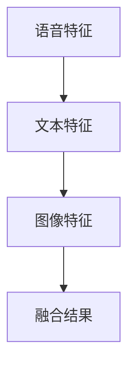
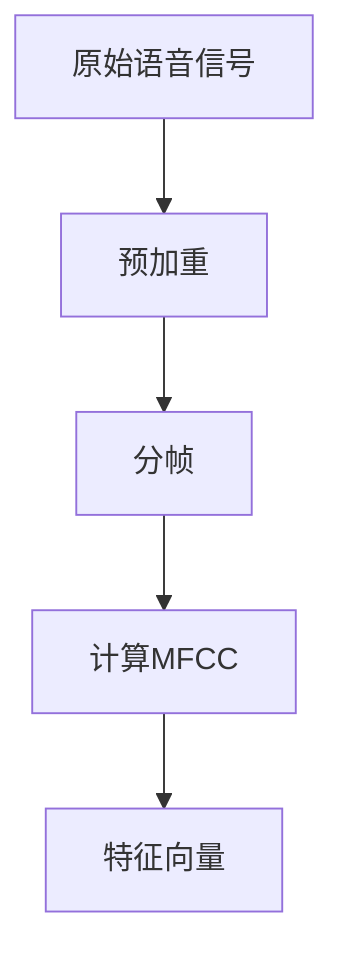
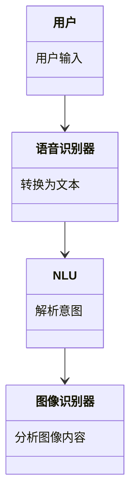
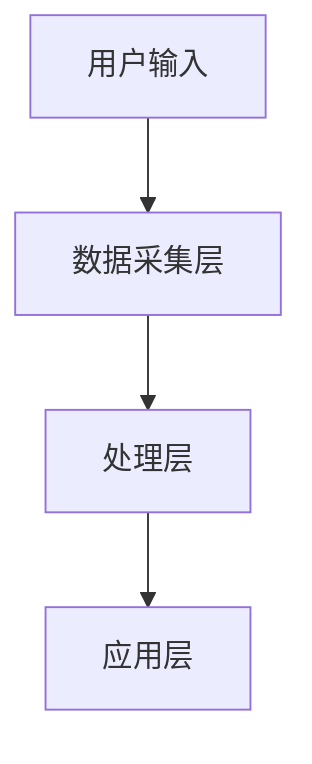
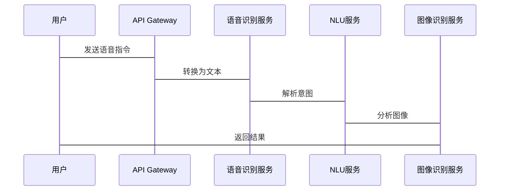

                 


# 多模态交互：语音、文本、图像的综合处理

> 关键词：多模态交互、语音处理、文本处理、图像处理、模式识别、数据融合

> 摘要：多模态交互是指通过语音、文本和图像等多种信息形式进行综合处理，以实现更智能、更自然的交互方式。本文将从多模态交互的核心概念、算法原理、系统设计以及项目实战等多个方面进行深入探讨，分析其在实际应用中的优势与挑战。

---

## 第1章：多模态交互概述

### 1.1 多模态交互的基本概念
多模态交互是一种结合多种信息形式（如语音、文本、图像）的交互方式，旨在通过综合利用不同模态的数据，提升系统的智能化和用户体验。例如，通过语音指令控制智能设备，并结合视觉反馈确认操作结果。

#### 问题背景
- **信息互补性**：单一模态的数据往往不足以提供完整的信息，例如仅依赖语音可能无法准确识别说话人的情感。
- **用户体验优化**：通过结合多种模态数据，可以更准确地理解用户意图，提供更个性化的服务。
- **技术挑战**：不同模态的数据具有不同的特征和处理方式，如何有效融合这些数据是多模态交互的核心问题。

### 1.2 语音、文本、图像的模态特点
- **语音**：时间序列数据，包含语调、音量等特征，适合情感分析和语音识别。
- **文本**：结构化数据，包含丰富的语义信息，适合自然语言处理任务。
- **图像**：空间数据，包含丰富的视觉特征，适合目标检测和图像分类。

### 1.3 多模态交互的核心要素
- **模态之间的关系**：不同模态之间存在语义关联，例如“笑”在语音中表现为笑声，在图像中表现为笑脸。
- **数据融合方式**：可以通过特征级融合、决策级融合或模型级融合来综合处理多模态数据。
- **边界与外延**：多模态交互不仅限于三种模态，还可以扩展到其他形式，如视频或手势。

---

## 第2章：多模态数据的融合与关联

### 2.1 多模态数据的特征对比
| 模态类型 | 特征维度 | 处理复杂度 | 异构性 |
|----------|----------|------------|--------|
| 语音     | 时间序列、频率特征 | 高 | 高 |
| 文本     | 词汇、语法、语义 | 中 | 低 |
| 图像     | 像素、空间特征 | 高 | 高 |

### 2.2 多模态数据的关联关系
通过构建实体关系图（ER图），可以清晰地展示语音、文本和图像之间的关联关系。

```mermaid
erDiagram
    class 语音 {
        音频信号
        说话人信息
    }
    class 文本 {
        文本内容
        作者信息
    }
    class 图像 {
        图像数据
        拍摄时间
    }
    语音 --> 关联关系：文本（如语音转文本）
    文本 --> 关联关系：图像（如文本描述图像）
    语音 --> 关联关系：图像（如语音指令控制图像处理）
```

### 2.3 多模态数据的融合方式


---

## 第3章：多模态交互的核心算法

### 3.1 语音处理算法
#### 3.1.1 基于MFCC的语音特征提取
MFCC（Mel-Frequency Cepstral Coefficients）是一种常用的语音特征提取方法，用于降维和提取语音的时频特征。



#### 3.1.2 语音识别算法
使用隐马尔可夫模型（HMM）或深度学习模型（如CTC）进行语音识别。

### 3.2 文本处理算法
#### 3.2.1 基于词嵌入的文本表示
使用Word2Vec或BERT模型将文本转换为向量表示。

```python
import tensorflow as tf
# 示例：使用Word2Vec生成词向量
word_vectors = {}
for word in vocabulary:
    word_vectors[word] = tf.random.uniform([300], minval=-0.5, maxval=0.5)
```

### 3.3 图像处理算法
#### 3.3.1 基于CNN的图像分类
使用卷积神经网络（CNN）进行图像分类，如VGG、ResNet等。

```python
import keras
model = keras.Sequential([
    keras.layers.Conv2D(32, (3,3), activation='relu', input_shape=(64,64,3)),
    keras.layers.MaxPooling2D(2,2),
    keras.layers.Conv2D(64, (3,3), activation='relu'),
    keras.layers.MaxPooling2D(2,2),
    keras.layers.Flatten(),
    keras.layers.Dense(128, activation='relu'),
    keras.layers.Dense(10, activation='softmax')
])
```

---

## 第4章：多模态交互的系统设计

### 4.1 系统功能设计
设计一个多模态对话系统，结合语音识别、自然语言理解和图像识别功能。

#### 4.1.1 领域模型设计


### 4.2 系统架构设计
采用分层架构，包括数据采集层、处理层和应用层。



### 4.3 接口设计与交互流程
设计RESTful API接口，实现语音、文本和图像的综合处理。



---

## 第5章：项目实战

### 5.1 多模态情感分析系统
实现一个结合语音和文本的情感分析系统。

#### 5.1.1 环境安装
```bash
pip install numpy pandas scikit-learn librosa tensorflow
```

#### 5.1.2 核心代码实现
```python
import librosa
import tensorflow as tf
import numpy as np

# 示例：语音特征提取
def extract_features(audio_path):
    audio, sr = librosa.load(audio_path, sr=16000)
    mfccs = librosa.feature.mfcc(y=audio, sr=sr, n_mfcc=13)
    return mfccs.T

# 示例：文本预处理
def preprocess_text(text):
    return tf.keras.preprocessing.text.text_to_word_sequence(text)
```

---

## 第6章：高级主题与应用展望

### 6.1 多模态交互的前沿技术
- **跨模态检索**：在图像中检索与文本相关的结果。
- **多模态生成模型**：如多模态GPT，同时生成文本和图像。

### 6.2 应用案例
- 教育领域：结合语音和图像进行个性化教学。
- 医疗领域：通过语音和图像辅助诊断。
- 娱乐领域：多模态交互式游戏体验。

---

## 第7章：注意事项与最佳实践

### 7.1 注意事项
- **数据异构性**：不同模态的数据格式和特征维度差异较大，需进行标准化处理。
- **计算资源**：多模态处理通常需要较高的计算资源，建议使用GPU加速。
- **模型复杂性**：多模态融合可能增加模型复杂性，需权衡性能与效率。

### 7.2 小结
多模态交互通过综合处理多种信息形式，能够显著提升系统的智能化水平和用户体验。未来，随着AI技术的发展，多模态交互将在更多领域得到广泛应用。

---

## 作者：AI天才研究院/AI Genius Institute & 禅与计算机程序设计艺术 /Zen And The Art of Computer Programming

