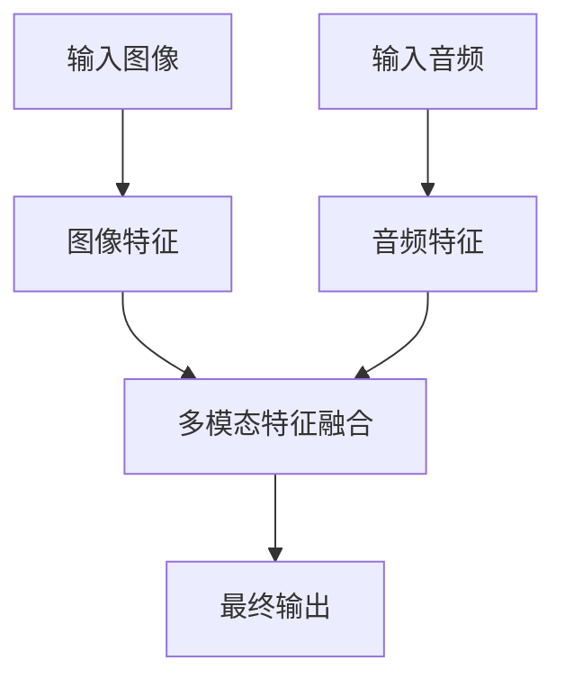
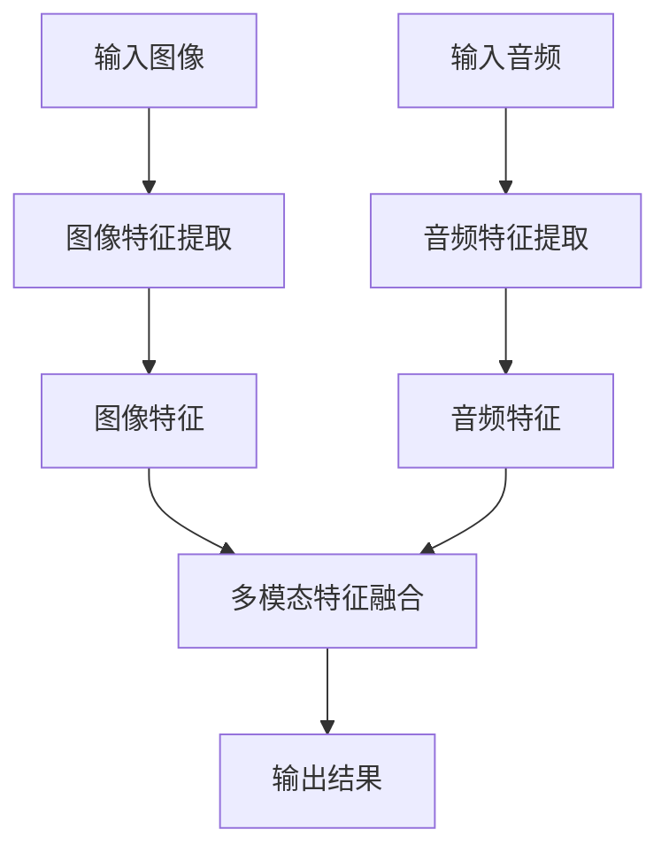
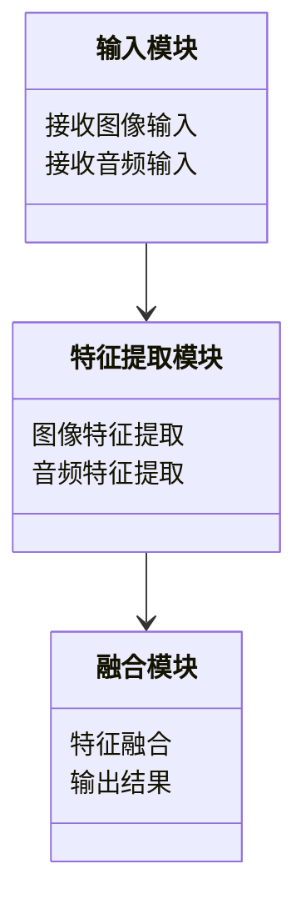
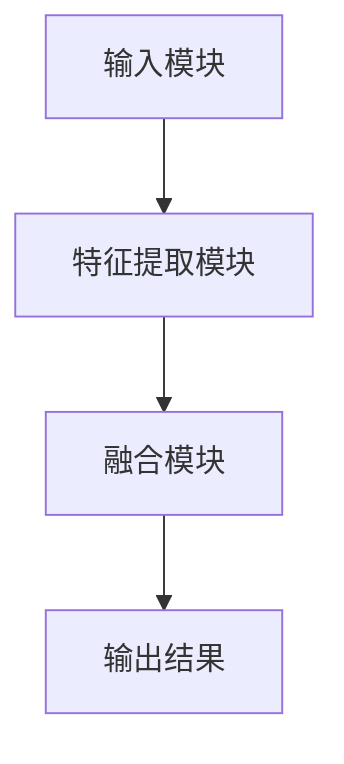

                 


# 多模态输入处理：让AI Agent理解图像和音频

## 关键词：
多模态输入处理，AI Agent，图像处理，音频处理，数据融合，多模态算法，系统架构设计

## 摘要：
本文深入探讨了多模态输入处理的核心概念、算法原理、系统架构设计以及实际应用。通过结合图像和音频的处理流程，详细分析了多模态数据的融合方法和挑战。文章还通过项目实战和最佳实践，展示了如何在实际场景中高效地设计和实现多模态输入处理系统，帮助AI Agent更好地理解和响应多模态输入。

---

# 第一部分: 多模态输入处理基础

## 第1章: 多模态输入处理概述

### 1.1 多模态输入的背景与问题背景
#### 1.1.1 多模态输入的定义与特点
多模态输入是指同时处理多种不同类型的数据输入，如图像、文本、音频等。其特点包括数据异构性、信息互补性和复杂性。

#### 1.1.2 多模态输入的必要性与应用场景
在智能音箱、自动驾驶、智能客服等领域，多模态输入处理能够提升系统的交互能力和用户体验。

#### 1.1.3 多模态输入的边界与外延
多模态输入的边界在于如何有效融合不同数据类型，外延则包括与其他感知数据的结合。

### 1.2 多模态输入的核心概念
#### 1.2.1 多模态输入的组成要素
图像、音频、文本等数据类型的结合，以及各自的特征提取方法。

#### 1.2.2 多模态输入的处理流程
输入接收、特征提取、数据融合、输出生成。

#### 1.2.3 多模态输入与AI Agent的关系
AI Agent通过多模态输入处理，能够更准确地理解和响应用户的意图。

### 1.3 多模态输入的典型应用
#### 1.3.1 图像与音频的结合应用
如智能音箱中的语音识别与屏幕显示结合。

#### 1.3.2 多模态输入在智能音箱中的应用
通过语音指令和屏幕显示的结合，提升用户交互体验。

#### 1.3.3 多模态输入在自动驾驶中的应用
通过视觉和听觉信息的融合，提高自动驾驶的安全性和准确性。

### 1.4 多模态输入处理的技术挑战
#### 1.4.1 多模态数据的异构性问题
不同数据类型的特征维度和表达方式差异较大。

#### 1.4.2 多模态数据的同步与对齐问题
如何将不同模态的数据在时间或空间上对齐，以实现有效融合。

#### 1.4.3 多模态数据的融合与关联问题
如何提取和关联不同模态数据中的有用信息，避免信息冗余或丢失。

### 1.5 本章小结
通过本章的学习，读者可以理解多模态输入处理的基本概念、应用场景和技术挑战。

---

## 第2章: 多模态输入的核心概念与联系

### 2.1 多模态输入的核心概念
#### 2.1.1 图像处理的基本原理
图像处理包括图像采集、预处理、特征提取和图像识别等步骤。

#### 2.1.2 音频处理的基本原理
音频处理包括音频采集、预处理、语音识别和音频分类等步骤。

#### 2.1.3 多模态输入的融合原理
将图像和音频的特征进行融合，以提高系统的识别和理解能力。

### 2.2 多模态输入的核心概念对比
#### 2.2.1 图像与音频的特征对比
| 特征维度 | 图像 | 音频 |
|----------|------|------|
| 数据类型 | 二维矩阵 | 一维时序数据 |
| 信息内容 | 空间信息 | 时间信息 |
| 处理方法 | CNN、RNN | DNN、LSTM |

#### 2.2.2 图像与音频的处理流程对比
- 图像处理流程：输入图像 -> 图像预处理 -> 特征提取 -> 图像分类/识别。
- 音频处理流程：输入音频 -> 音频预处理 -> 特征提取 -> 语音识别/分类。

#### 2.2.3 图像与音频的融合方式对比
- 图像融合：基于空间信息的特征融合。
- 音频融合：基于时间信息的特征融合。

### 2.3 多模态输入的ER实体关系图


### 2.4 本章小结
通过本章的学习，读者可以理解多模态输入的核心概念及其对比分析。

---

## 第3章: 多模态输入处理的算法原理

### 3.1 多模态输入处理的算法概述
#### 3.1.1 多模态输入的编码方法
- 图像编码：使用CNN提取图像特征。
- 音频编码：使用DNN提取音频特征。

#### 3.1.2 多模态输入的注意力机制
- 通过注意力机制实现对图像和音频特征的加权融合。

#### 3.1.3 多模态输入的融合方法
- 晚融合：在特征提取阶段分别处理图像和音频，最后进行融合。
- 早融合：在特征提取过程中同时处理图像和音频。

### 3.2 多模态输入处理的数学模型
#### 3.2.1 图像特征提取的数学模型
$$f_{\text{image}}(x) = \text{CNN}(x)$$

#### 3.2.2 音频特征提取的数学模型
$$f_{\text{audio}}(y) = \text{DNN}(y)$$

#### 3.2.3 多模态融合的数学模型
$$f_{\text{multi}}(x,y) = g(f_{\text{image}}(x), f_{\text{audio}}(y))$$

### 3.3 多模态输入处理的算法流程


### 3.4 本章小结
通过本章的学习，读者可以理解多模态输入处理的算法原理及其数学模型。

---

## 第4章: 多模态输入处理的系统架构设计

### 4.1 问题场景介绍
AI Agent需要同时处理图像和音频输入，以实现更智能的交互。

### 4.2 系统功能设计
#### 4.2.1 领域模型设计


#### 4.2.2 系统架构设计


#### 4.2.3 接口设计
- 输入接口：图像输入接口和音频输入接口。
- 输出接口：处理结果输出接口。

#### 4.2.4 交互流程
- 用户输入图像和音频。
- 系统分别提取图像和音频特征。
- 特征融合模块生成最终结果。

### 4.3 本章小结
通过本章的学习，读者可以理解多模态输入处理的系统架构设计及其交互流程。

---

## 第5章: 多模态输入处理的项目实战

### 5.1 环境搭建
- 安装Python、深度学习框架（如TensorFlow或PyTorch）。

### 5.2 系统核心实现源代码
```python
import tensorflow as tf
from tensorflow.keras import layers

# 图像特征提取模型
def image_model():
    model = tf.keras.Sequential([
        layers.Conv2D(32, (3,3), activation='relu', input_shape=(224, 224, 3)),
        layers.MaxPooling2D((2,2)),
        layers.Flatten(),
        layers.Dense(256, activation='relu'),
        layers.Dense(10, activation='softmax')
    ])
    return model

# 音频特征提取模型
def audio_model():
    model = tf.keras.Sequential([
        layers.Conv1D(32, 3, activation='relu', input_shape=(1024,)),
        layers.MaxPooling1D(2),
        layers.Flatten(),
        layers.Dense(256, activation='relu'),
        layers.Dense(10, activation='softmax')
    ])
    return model

# 多模态融合模型
def multi_modal_model():
    image_input = layers.Input(shape=(224, 224, 3))
    audio_input = layers.Input(shape=(1024,))
    
    image_features = image_model()(image_input)
    audio_features = audio_model()(audio_input)
    
    concatenated = layers.concatenate([image_features, audio_features])
    output = layers.Dense(10, activation='softmax')(concatenated)
    
    model = tf.keras.Model(inputs=[image_input, audio_input], outputs=output)
    return model
```

### 5.3 实际案例分析与详细解读
- 案例：通过图像和音频识别同一物体。
- 分析：图像识别和语音识别的结果进行融合，提升识别准确率。

### 5.4 本章小结
通过本章的学习，读者可以掌握多模态输入处理的项目实战方法。

---

## 第6章: 最佳实践与小结

### 6.1 本章小结
总结全文内容，强调多模态输入处理的重要性和应用价值。

### 6.2 多模态输入处理的最佳实践
- 数据预处理：确保图像和音频数据的质量。
- 模型选择：根据具体任务选择合适的特征提取和融合方法。
- 跨模态对齐：解决图像和音频数据的时间或空间对齐问题。

### 6.3 多模态输入处理的未来展望
- 更多模态的融合：如文本、触觉等。
- 更高效的数据处理方法：如轻量级模型和边缘计算。

### 6.4 本章小结
通过本章的学习，读者可以了解多模态输入处理的最佳实践和未来发展方向。

---

## 参考文献

1. LeCun, Y., Bengio, Y., & Hinton, G. (2015). Deep learning. Nature, 521(7555), 436-444.
2. Goodfellow, I., Bengio, Y., & Courville, A. (2016). Deep learning. MIT Press.
3. Hochreiter, S., & Schmidhuber, J. (1997). Long short-term memory. Neural computation, 9(8), 1735-1780.

---

## 作者：AI天才研究院/AI Genius Institute & 禅与计算机程序设计艺术 /Zen And The Art of Computer Programming

---

通过以上目录，读者可以系统地学习多模态输入处理的核心概念、算法原理、系统架构设计以及实际应用，帮助AI Agent更好地理解和处理多模态输入。

