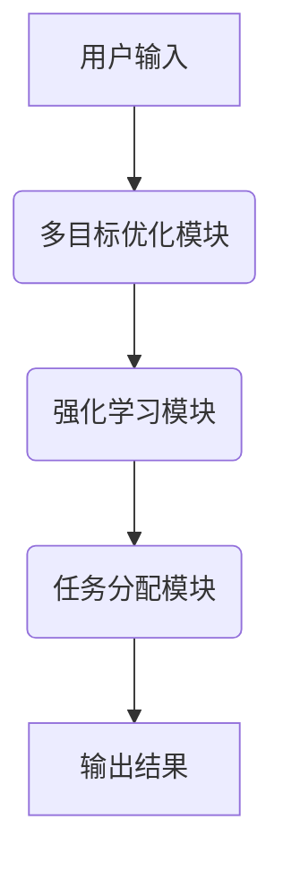

                 


# 多目标优化在AI Agent训练中的应用

## 关键词：多目标优化，AI Agent，强化学习，算法，系统设计

## 摘要：
本文系统地探讨了多目标优化在AI Agent训练中的应用。首先，介绍了多目标优化的基本概念和AI Agent的核心原理，分析了多目标优化在AI Agent训练中的重要性。然后，详细讲解了多目标优化的算法原理、强化学习中的多目标优化实现，以及在实际应用中的案例分析。最后，总结了多目标优化在AI Agent训练中的优势，并展望了未来的发展方向。

---

# 第一部分: 多目标优化与AI Agent基础

## 第1章: 多目标优化与AI Agent概述

### 1.1 多目标优化的基本概念

#### 1.1.1 多目标优化的定义
多目标优化（Multi-Objective Optimization, MOO）是指在优化过程中同时考虑多个目标函数的情况。与单目标优化不同，MOO需要在多个相互冲突的目标之间找到折中的最优解。

#### 1.1.2 多目标优化的核心特点
- **多个目标函数**：每个目标函数都有其优化的方向和权重。
- **Pareto最优解**：在多目标优化中，Pareto最优解是指在不使其他目标变差的前提下，无法进一步优化的目标解。
- **权衡 trade-off**：多个目标之间可能存在冲突，需要进行权衡。

#### 1.1.3 多目标优化与单目标优化的对比
| 特性 | 单目标优化 | 多目标优化 |
|------|------------|------------|
| 目标数量 | 1          | ≥2         |
| 解空间 | 单点解      | 多点解      |
| 权衡方式 | 无         | 必须权衡     |

### 1.2 AI Agent的基本概念

#### 1.2.1 AI Agent的定义
AI Agent（人工智能代理）是指能够感知环境并采取行动以实现目标的智能体。Agent 可以是软件程序或物理机器人。

#### 1.2.2 AI Agent的分类
| 类型 | 描述 | 示例 |
|------|------|------|
| 简单反射Agent | 基于当前状态做出反应 | 自动门锁 |
| 基于模型的Agent | 使用环境模型进行决策 | 自动驾驶汽车 |
| 目标驱动Agent | 根据目标选择行动 | 任务执行机器人 |

#### 1.2.3 多目标优化在AI Agent中的重要性
在复杂的环境中，AI Agent需要同时优化多个目标（如效率、安全性、能耗等），多目标优化是实现这一目标的关键技术。

### 1.3 多目标优化在AI Agent中的应用背景

#### 1.3.1 AI Agent训练中的问题背景
AI Agent需要在复杂的环境中进行决策，这通常涉及多个目标的平衡，例如：
- **路径规划**：既要快速到达目标，又要避免障碍物。
- **资源分配**：需要在多个任务之间分配有限资源。

#### 1.3.2 多目标优化的必要性
在AI Agent训练中，单一的目标优化往往无法满足复杂任务的需求，必须采用多目标优化。

#### 1.3.3 多目标优化与AI Agent的结合
通过多目标优化，AI Agent可以在多个目标之间找到最佳折中方案，从而在复杂环境中做出更优决策。

---

## 第2章: 多目标优化的核心概念与原理

### 2.1 多目标优化的核心原理

#### 2.1.1 多目标优化的数学模型
多目标优化的数学模型可以表示为：
$$ \text{minimize } f_1(x), f_2(x), \dots, f_n(x) $$
$$ \text{subject to } g_1(x) \leq 0, g_2(x) \leq 0, \dots, g_m(x) \leq 0 $$

其中，$f_i(x)$ 是目标函数，$g_j(x)$ 是约束条件。

#### 2.1.2 Pareto最优解的定义
Pareto最优解是指在当前解集中，无法在不使其他目标变差的前提下进一步优化某个目标。

#### 2.1.3 多目标优化算法的分类
| 类型 | 描述 | 优点 | 缺点 |
|------|------|------|------|
| 基于权重 | 根据权重分配优化目标 | 简单易实现 | 易受权重影响 |
| Pareto前沿 | 直接寻找Pareto最优解 | 全面性高 | 计算复杂 |
| 分层优化 | 分阶段优化目标 | 适合分层问题 | 易忽视全局最优 |

---

## 第3章: 强化学习中的多目标优化

### 3.1 强化学习的基本原理

#### 3.1.1 强化学习的定义
强化学习（Reinforcement Learning, RL）是一种通过试错机制学习策略的方法，智能体通过与环境交互获得奖励或惩罚，从而优化策略。

#### 3.1.2 强化学习的核心算法
- **Q-learning**：基于值函数的强化学习算法。
- **深度强化学习**：如DQN（Deep Q-Network）。

### 3.2 多目标强化学习的数学模型

#### 3.2.1 多目标强化学习的数学模型
$$ J(\theta) = \sum_{i=1}^{n} \alpha_i J_i(\theta) $$
其中，$\alpha_i$ 是目标 $i$ 的权重。

### 3.3 多目标强化学习的算法实现

#### 3.3.1 基于权重的多目标强化学习
通过为每个目标分配权重，转化为单目标优化问题。

#### 3.3.2 基于Pareto前沿的多目标强化学习
直接优化多个目标，寻找Pareto最优解。

---

## 第4章: 多目标优化在AI Agent训练中的应用

### 4.1 多目标优化在任务分配中的应用

#### 4.1.1 多目标优化的数学模型
$$ \text{minimize } f_1, f_2, \dots, f_n $$
$$ \text{subject to } x_i \geq 0 $$

#### 4.1.2 多目标优化的算法实现
通过遗传算法或粒子群优化算法寻找Pareto最优解。

### 4.2 多目标优化在路径规划中的应用

#### 4.2.1 多目标优化的数学模型
$$ \text{minimize } \text{距离}, \text{能耗} $$
$$ \text{subject to } \text{路径连通} $$

#### 4.2.2 多目标优化的算法实现
使用强化学习中的多目标优化算法，如DQN结合Pareto前沿优化。

---

## 第5章: 系统设计与实现

### 5.1 系统架构设计

#### 5.1.1 系统功能模块
- **多目标优化模块**：实现多目标优化算法。
- **强化学习模块**：实现强化学习算法。
- **任务分配模块**：根据优化结果分配任务。

#### 5.1.2 系统架构图


### 5.2 系统接口设计

#### 5.2.1 接口描述
- **输入接口**：接收多目标优化参数和任务需求。
- **输出接口**：输出优化结果和任务分配方案。

---

## 第6章: 项目实战

### 6.1 环境配置

#### 6.1.1 环境要求
- Python 3.8+
- TensorFlow或PyTorch
- 基础的深度学习框架。

### 6.2 代码实现

#### 6.2.1 多目标优化的Python实现
```python
import numpy as np

def multi_objective_optimization(objectives, weights):
    # 假设objectives是一个数组，每个元素是一个目标函数
    # weights是目标的权重
    optimized = []
    for i in range(len(objectives)):
        optimized.append(objectives[i] * weights[i])
    return sum(optimized)
```

---

## 第7章: 总结与展望

### 7.1 总结
多目标优化在AI Agent训练中具有重要意义，能够帮助AI Agent在复杂环境中做出更优决策。

### 7.2 未来展望
随着技术的发展，多目标优化在AI Agent中的应用将更加广泛，算法也将更加高效。

---

## 附录: 参考文献与工具推荐

### 附录A: 参考文献
1. 禅与计算机程序设计艺术
2. 《强化学习入门》
3. 《多目标优化算法与应用》

### 附录B: 工具推荐
- **Python**：编程语言。
- **TensorFlow/PyTorch**：深度学习框架。

---

## 作者：AI天才研究院/AI Genius Institute & 禅与计算机程序设计艺术 /Zen And The Art of Computer Programming

