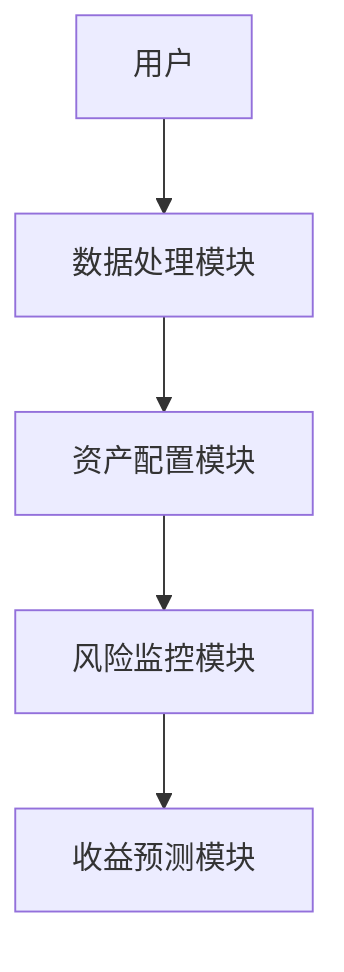

                 

# 多资产收益策略：构建稳定现金流的投资组合

> 关键词：多资产投资、收益策略、现金流、投资组合、风险管理

> 摘要：本文将详细探讨多资产收益策略的核心概念，从背景介绍到实战分析，结合数学模型、系统架构和实际案例，帮助读者构建一个稳定现金流的投资组合。文章将深入分析多资产配置的原理、优化模型以及风险管理策略，并通过具体案例展示如何在实际操作中应用这些方法。

---

## 第一部分：多资产收益策略概述

### 第1章：多资产收益策略的背景与重要性

#### 1.1 多资产投资的基本概念

##### 1.1.1 资产配置的核心概念
资产配置是指将资金分配到不同的资产类别（如股票、债券、房地产等）中，以实现风险分散和收益最大化。以下是资产配置的核心概念：

- **资产类别**：股票、债券、房地产、商品、现金等。
- **风险分散**：通过投资多种资产，降低单一资产带来的风险。
- **收益优化**：通过不同资产的组合，平衡风险与收益。

##### 1.1.2 多资产投资的优势与劣势
- **优势**：
  - 风险分散能力强。
  - 能够在不同市场环境下获取收益。
- **劣势**：
  - 管理复杂，需要较高的专业知识。
  - 成本较高，涉及多个资产类别的交易费用。

##### 1.1.3 全球经济环境下的多资产投资趋势
全球经济波动性增加，投资者需要通过多资产配置来应对不确定性。近年来，多资产投资在全球范围内越来越受欢迎，尤其是在波动的市场环境下。

---

#### 1.2 投资者需求与多资产策略

##### 1.2.1 不同类型投资者的需求分析
- **保守型投资者**：注重本金安全，追求稳定收益。
- **平衡型投资者**：在风险与收益之间寻找平衡。
- **激进型投资者**：愿意承担较高风险以获取更高收益。

##### 1.2.2 多资产策略如何满足投资者需求
通过灵活的资产配置，多资产策略能够满足不同风险偏好的投资者需求，同时在市场波动中保持收益的稳定性。

##### 1.2.3 多资产策略在不同经济周期中的应用
在经济繁荣期，可以增加股票配置；在经济衰退期，可以增加债券配置。通过动态调整资产配置，投资者能够在不同经济周期中保持收益的稳定性。

---

## 第二部分：多资产配置策略与优化

### 第2章：构建稳定现金流的目标与核心要素

#### 2.1 稳定现金流的定义与目标
稳定现金流是指通过合理配置资产，使投资组合在不同市场环境下保持稳定的现金流。其目标是实现长期收益的最大化，同时控制风险。

#### 2.2 多资产收益策略的核心要素
- **资产类别选择**：选择多样化的资产类别，降低投资组合的整体风险。
- **风险与收益的平衡**：通过优化模型，找到风险与收益的最佳平衡点。
- **税务优化与成本控制**：合理配置资产，降低税务负担和交易成本。

---

## 第三部分：数学模型与算法

### 第3章：多资产配置的优化模型

#### 3.1 基于现代投资组合理论的配置方法

##### 3.1.1 均值-方差优化模型
均值-方差优化模型是多资产配置的核心方法之一。以下是其实现步骤：

1. 计算各资产的预期收益和方差。
2. 计算资产之间的协方差矩阵。
3. 通过优化算法找到最优权重组合，使风险最小化或收益最大化。

公式如下：

$$
\min_w \left( w^T \Sigma w \right)
$$

其中，\( \Sigma \) 是协方差矩阵，\( w \) 是权重向量。

##### 3.1.2 风险调整后的收益优化模型
在考虑风险的情况下，可以使用夏普比率来优化收益。

$$
\text{夏普比率} = \frac{E(r) - R_f}{\sigma}
$$

其中，\( E(r) \) 是预期收益，\( R_f \) 是无风险利率，\( \sigma \) 是收益的标准差。

---

## 第四部分：系统架构与项目实战

### 第4章：系统架构设计

#### 4.1 数据收集与处理
- **数据来源**：股票价格、债券收益率、经济指标等。
- **数据预处理**：清洗数据，处理缺失值和异常值。

#### 4.2 系统功能设计
- **资产配置模块**：根据优化模型生成最优资产配置。
- **风险监控模块**：实时监控投资组合的风险。
- **收益预测模块**：预测未来收益并调整配置。

#### 4.3 系统架构图
以下是系统架构的Mermaid图：

---

## 第五部分：案例分析与实际操作

### 第5章：案例分析

#### 5.1 国内案例分析
以A股市场为例，分析如何通过多资产配置构建稳定现金流的投资组合。

#### 5.2 国际案例分析
以美国市场为例，分析如何通过多资产配置应对市场波动。

---

## 第六部分：最佳实践与总结

### 第6章：多资产收益策略的最佳实践

#### 6.1 投资组合管理
- 定期监控和调整资产配置。
- 根据市场变化动态优化。

#### 6.2 风险管理
- 设置止损点。
- 定期再平衡投资组合。

#### 6.3 投资工具的选择
- 使用专业的投资软件进行配置优化。
- 关注市场的宏观经济指标。

---

## 作者信息

作者：AI天才研究院/AI Genius Institute & 禅与计算机程序设计艺术 /Zen And The Art of Computer Programming

---

以上是《多资产收益策略：构建稳定现金流的投资组合》的技术博客文章的详细目录和内容框架。

