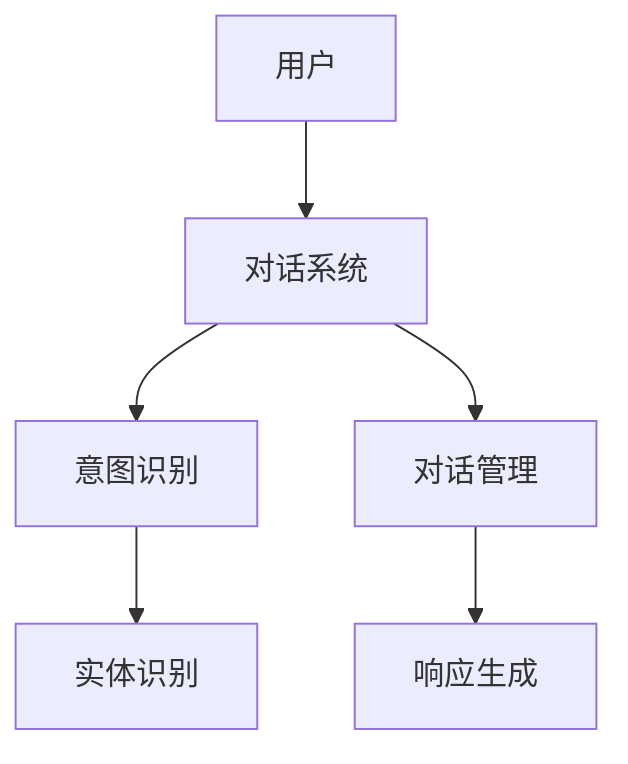
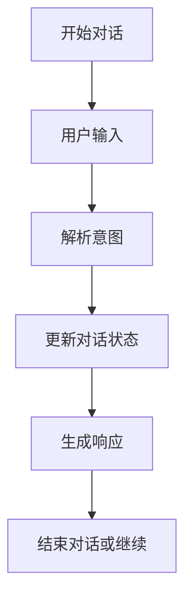
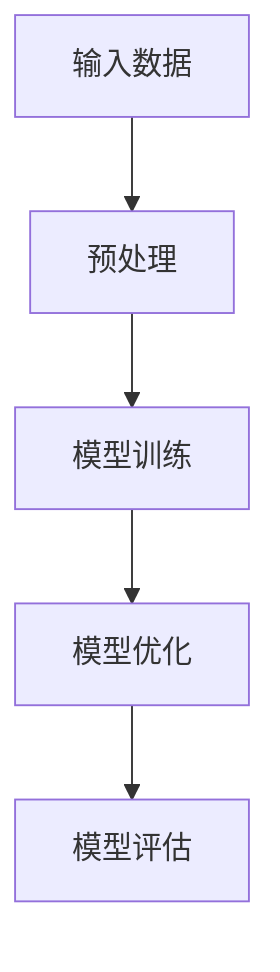

                 


# 多轮对话处理：提高AI Agent的交互质量

> 关键词：多轮对话、AI Agent、自然语言处理、对话系统、用户意图、上下文理解、对话生成

> 摘要：本文深入探讨了多轮对话处理的核心概念、算法原理和系统设计，旨在提升AI Agent的交互质量。通过详细讲解Seq2Seq模型和Transformer机制，结合系统架构设计和实战案例，帮助读者掌握多轮对话处理的关键技术，优化用户与AI Agent之间的交互体验。

---

## 第1章 多轮对话处理的背景与概念

### 1.1 多轮对话处理的定义与重要性

#### 1.1.1 什么是多轮对话
多轮对话是指用户与AI Agent之间通过多条消息进行的交互，与单轮对话相比，多轮对话能够更好地模拟人类自然对话的复杂性。

#### 1.1.2 多轮对话在AI Agent中的作用
多轮对话能够提高用户交互的自然性和流畅性，使AI Agent更贴近真实人类的对话方式。

#### 1.1.3 多轮对话与单轮对话的区别
| 特性 | 单轮对话 | 多轮对话 |
|------|----------|----------|
| 对话长度 | 简短 | 较长 |
| 上下文依赖 | 无 | 有 |
| 对话目标 | 单一 | 多样 |

### 1.2 多轮对话处理的背景与应用

#### 1.2.1 当前AI Agent的发展趋势
AI Agent正逐渐从单一功能向多任务、多轮交互方向发展，以满足用户复杂的需求。

#### 1.2.2 多轮对话处理的应用场景
多轮对话处理广泛应用于智能客服、智能助手、聊天机器人等领域。

#### 1.2.3 多轮对话处理的挑战与机遇
挑战包括对话上下文的理解和管理，机遇则在于提高用户体验和商业价值。

---

## 第2章 多轮对话处理的核心概念与联系

### 2.1 对话系统的核心要素

#### 2.1.1 用户意图
用户意图是对话的核心，包括显式意图（如查询天气）和隐式意图（如寻求建议）。

#### 2.1.2 对话状态
对话状态包括当前轮次的上下文信息和系统对用户意图的理解。

#### 2.1.3 上下文信息
上下文信息是多轮对话中不可或缺的部分，用于保持对话的连贯性。

### 2.2 多轮对话的实体关系图


### 2.3 多轮对话的流程图


---

## 第3章 多轮对话处理的算法原理

### 3.1 基于序列到序列模型的对话生成

#### 3.1.1 Seq2Seq模型的结构
Seq2Seq模型由编码器和解码器组成，编码器将输入序列转换为固定长度的向量，解码器将该向量转换为输出序列。

#### 3.1.2 注意力机制在对话生成中的应用
注意力机制通过计算输入序列中每个词的重要性，提升模型对上下文的理解能力。

#### 3.1.3 基于Transformer的对话生成模型
Transformer模型通过自注意力机制和前馈网络，显著提高了对话生成的质量。

### 3.2 对话系统的训练流程



---

## 第4章 对话系统的数学模型与公式

### 4.1 Seq2Seq模型的数学表达

#### 4.1.1 编码器的编码过程
$$ \text{编码器输出} = f_{\text{enc}}(x) $$

#### 4.1.2 解码器的解码过程
$$ \text{解码器输出} = f_{\text{dec}}(y_{\text{prev}}, f_{\text{enc}}(x)) $$

### 4.2 注意力机制的数学公式

$$ \text{注意力权重} = \text{softmax}(\frac{QK^T}{\sqrt{d}}) $$

$$ \text{加权和} = \text{value} \times \text{注意力权重} $$

---

## 第5章 系统分析与架构设计

### 5.1 项目背景与目标

#### 5.1.1 项目背景
本项目旨在通过多轮对话处理技术，提升AI Agent的交互质量。

#### 5.1.2 项目目标
实现一个能够理解用户意图、保持对话连贯性的多轮对话系统。

### 5.2 系统功能设计

#### 5.2.1 用户输入处理
用户输入首先经过预处理，提取关键信息。

#### 5.2.2 意图识别与对话管理
意图识别模块负责解析用户意图，对话管理模块负责维护对话状态。

#### 5.2.3 

---

## 第6章 项目实战

### 6.1 环境安装

```bash
pip install numpy tensorflow
```

### 6.2 系统核心实现源代码

```python
import numpy as np
import tensorflow as tf

def attention(inputs, attention_states):
    # 简化注意力机制实现
    query = tf.layers.dense(inputs, units=128)
    keys = tf.layers.dense(attention_states, units=128)
    attention_scores = tf.keras.layers.Dot(axes=[-1, -1])([query, keys])
    attention_weights = tf.nn.softmax(attention_scores)
    return tf.keras.layers.Dot(axes=[-1, -1])([attention_weights, inputs])
```

### 6.3 代码应用解读与分析
上述代码实现了注意力机制，用于处理多轮对话中的上下文信息。

### 6.4 实际案例分析和详细讲解剖析
通过具体案例分析，展示如何利用Seq2Seq模型实现多轮对话生成。

---

## 第7章 最佳实践、小结与展望

### 7.1 最佳实践Tips

- 定期更新对话系统的训练数据，保持模型的准确性。
- 优化模型的超参数，提升对话生成的质量。

### 7.2 小结
多轮对话处理是提升AI Agent交互质量的关键技术，通过本文的学习，读者可以掌握其核心概念和实现方法。

### 7.3 注意事项
在实际应用中，需注意保护用户隐私，确保对话数据的安全性。

### 7.4 拓展阅读
推荐阅读《神经网络与深度学习》和《自然语言处理实战》等书籍。

---

## 作者信息

作者：AI天才研究院/AI Genius Institute & 禅与计算机程序设计艺术 /Zen And The Art of Computer Programming

---

本文通过详细讲解多轮对话处理的核心概念、算法原理和系统设计，帮助读者掌握提升AI Agent交互质量的关键技术。希望本文能为相关领域的研究和实践提供有价值的参考。

