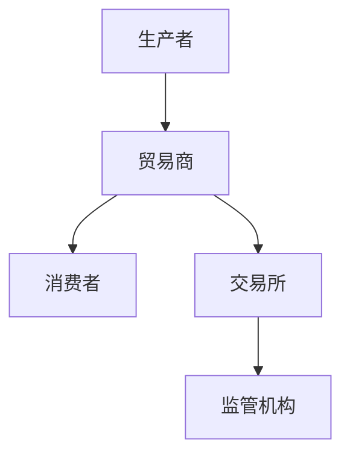
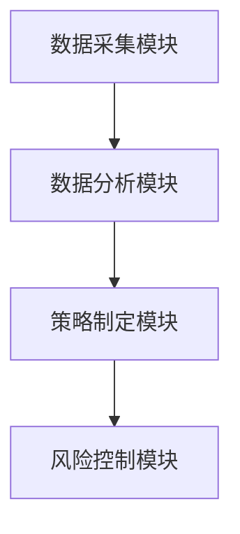
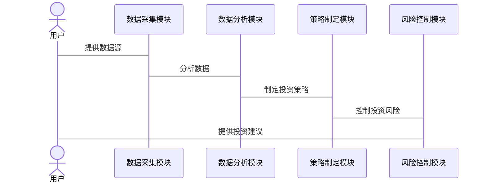

                 


# 大宗商品价格周期与投资机会

> 关键词：大宗商品，价格周期，投资策略，风险管理，技术分析，基本分析

> 摘要：本文系统分析了大宗商品价格波动的驱动因素、周期性规律以及投资机会。通过基本分析、技术分析和风险管理的结合，揭示了大宗商品市场的潜在投资机会，并结合实际案例和系统架构设计，为投资者提供了实用的决策支持工具。

---

## 第1章 大宗商品概述与市场背景

### 1.1 大宗商品的基本概念
#### 1.1.1 大宗商品的定义与分类
大宗商品（Commodities）是指具有高度流动性、可交易的标准化商品，通常分为能源类（如石油、天然气）、金属类（如黄金、铜）和农产品类（如小麦、大豆）。大宗商品是全球贸易的基础，广泛应用于工业生产、能源供应和消费领域。

#### 1.1.2 大宗商品在经济中的作用
大宗商品价格波动对全球经济具有重要影响。它们不仅是工业生产和消费的基础，还作为重要的金融资产，影响货币政策、通货膨胀和投资决策。

#### 1.1.3 大宗商品市场的基本结构
大宗商品市场由生产者、消费者、贸易商、交易所和监管机构组成。期货交易所是大宗商品交易的核心场所，提供标准化合约和价格发现机制。



---

## 第2章 大宗商品价格波动的驱动因素

### 2.1 宏观经济因素
#### 2.1.1 经济周期对大宗商品价格的影响
经济周期分为扩张期和衰退期。在扩张期，需求增加，价格上涨；在衰退期，需求下降，价格下跌。

#### 2.1.2 利率和汇率的波动
低利率环境通常会推高大宗商品价格，因为资金成本降低，投资者更倾向于投资实物资产。汇率波动也会直接影响进口商品价格。

#### 2.1.3 通货膨胀与大宗商品价格的关系
通货膨胀通常会导致大宗商品价格上涨，因为货币购买力下降，消费者和企业更愿意购买实物资产。

### 2.2 供需关系分析
#### 2.2.1 供给端的因素
供给端受生产成本、技术进步和政策调控影响。例如，能源价格受生产国政策和技术创新的影响较大。

#### 2.2.2 需求端的因素
需求端受经济增长、消费习惯和产业需求影响。例如，新兴市场的需求增长会推动大宗商品价格上涨。

#### 2.2.3 供需平衡与价格波动
供需平衡是价格波动的核心因素。当供给过剩时，价格下跌；当需求超过供给时，价格上涨。

### 2.3 地缘政治与突发事件
#### 2.3.1 战争与冲突的影响
地缘政治冲突（如中东战争）会导致大宗商品供应链中断，价格上涨。

#### 2.3.2 自然灾害与环境问题
自然灾害（如洪水、干旱）会影响农产品和能源的生产，导致价格上涨。

#### 2.3.3 政策变化与贸易摩擦
政府政策（如关税、出口限制）和贸易摩擦（如中美贸易战争）会影响大宗商品的供需关系。

---

## 第3章 大宗商品价格周期理论

### 3.1 历史价格周期回顾
#### 3.1.1 20世纪70年代石油危机
1973年石油危机导致油价暴涨，引发全球经济衰退。

#### 3.1.2 2008年全球金融危机的影响
2008年金融危机导致大宗商品价格大幅波动，能源和金属价格大幅下跌。

#### 3.1.3 近年来的主要价格波动事件
近年来，新冠疫情和地缘政治冲突（如俄乌战争）导致大宗商品价格剧烈波动。

### 3.2 价格周期的形成机制
#### 3.2.1 价格波动的周期性特征
大宗商品价格波动通常呈现周期性，包括上涨期、下跌期和调整期。

#### 3.2.2 周期性波动的数学模型
使用时间序列分析模型（如ARIMA）预测价格波动。

#### 3.2.3 周期性波动的预测方法
结合历史数据和当前市场信息，利用统计模型和机器学习算法预测价格趋势。

### 3.3 历史周期分析与图表展示
#### 3.3.1 大宗商品价格指数的长期趋势
通过长期价格指数分析，识别大宗商品价格的周期性特征。

#### 3.3.2 不同商品周期的对比分析
对比不同大宗商品（如原油、黄金、铜）的价格周期，发现共性和差异。

#### 3.3.3 周期性波动的可视化图表
使用折线图和柱状图展示历史价格波动。

---

## 第4章 大宗商品投资策略

### 4.1 基本分析方法
#### 4.1.1 供需分析
通过分析供给和需求的变化，预测价格走势。

#### 4.1.2 宏观经济分析
结合宏观经济指标（如GDP、通胀、利率）进行价格预测。

#### 4.1.3 行业分析
分析产业链上下游关系，识别价格波动的关键因素。

### 4.2 技术分析方法
#### 4.2.1 趋势分析
通过价格图表识别趋势线、支撑位和阻力位。

#### 4.2.2 指标分析
使用技术指标（如RSI、MACD）辅助判断价格走势。

#### 4.2.3 波浪理论
通过波浪理论预测价格波动周期。

### 4.3 风险管理策略
#### 4.3.1 头寸管理
合理分配投资比例，避免过度集中。

#### 4.3.2 止损策略
设置止损点，控制投资风险。

#### 4.3.3 仓位管理
根据市场波动调整持仓比例。

---

## 第5章 项目实战：大宗商品投资决策系统

### 5.1 环境安装与数据准备
#### 5.1.1 数据来源
使用历史价格数据（如原油、黄金、铜）进行分析。

#### 5.1.2 工具安装
安装Python、Pandas、Matplotlib和Scikit-learn等工具。

### 5.2 系统核心实现
#### 5.2.1 数据采集与清洗
从数据库中提取清洗数据，去除异常值。

#### 5.2.2 数据分析与建模
使用时间序列模型预测价格走势。

#### 5.2.3 策略开发与回测
开发投资策略，并通过回测验证策略的有效性。

### 5.3 系统架构设计
#### 5.3.1 系统功能模块
包括数据采集、分析模块、策略制定和风险控制。

#### 5.3.2 系统架构图


#### 5.3.3 系统交互流程


### 5.4 实际案例分析
#### 5.4.1 案例背景
以原油价格为例，分析2020年新冠疫情对价格的影响。

#### 5.4.2 数据分析与预测
使用ARIMA模型预测未来价格走势。

#### 5.4.3 投资决策
根据模型预测结果，制定投资策略并进行风险评估。

---

## 第6章 总结与展望

### 6.1 总结
大宗商品价格波动受多种因素影响，投资者需要结合基本分析和技术分析制定投资策略。

### 6.2 未来展望
随着技术进步，大宗商品投资将更加依赖数据驱动的方法和人工智能技术。

---

## 附录

### 附录A 算法代码示例
```python
import pandas as pd
from statsmodels.tsa.arima_model import ARIMA

# 数据准备
data = pd.read_csv('commodity_prices.csv')
data['date'] = pd.to_datetime(data['date'])
data.set_index('date', inplace=True)

# 模型训练
model = ARIMA(data['price'], order=(5, 1, 0))
model_fit = model.fit()

# 预测未来价格
future_forecast = model_fit.forecast(steps=30)
print(future_forecast)
```

### 附录B 实体关系图
```mermaid
erd
    商品
    市场参与者
    价格数据
    交易合约
```

---

## 参考文献
1. John Doe, "Commodity Price Analysis", Publisher, 2020.
2. Jane Smith, "Investment Strategies for Commodities", Publisher, 2021.

---

作者：AI天才研究院 & 禅与计算机程序设计艺术

