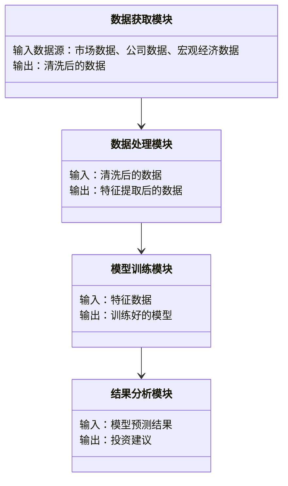
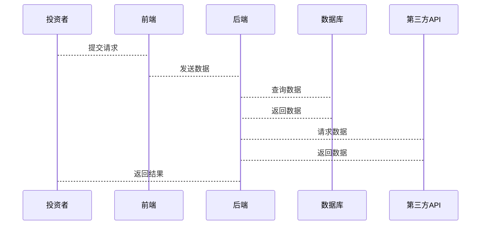

                 


# 大数据驱动的投资决策模型构建

> 关键词：大数据，投资决策模型，机器学习，数据建模，量化投资

> 摘要：本文将详细探讨如何利用大数据构建投资决策模型。通过分析数据获取、清洗、特征提取、模型构建、评估与优化，到实际部署应用的完整流程，结合具体案例，深入讲解大数据在投资决策中的应用价值和实现方法。

---

## 第一部分：背景与概述

### 第1章：投资决策模型的背景与挑战

#### 1.1 投资决策的背景

##### 1.1.1 投资决策的传统方法与局限性

传统投资决策主要依赖于经验和市场分析，这种方法存在主观性强、效率低、风险控制能力弱等缺点。例如，分析师通过基本面分析和市场情绪判断来做出投资决策，但这种方法难以应对市场的复杂性和不确定性。

##### 1.1.2 大数据时代的投资决策新机遇

随着大数据技术的发展，海量数据的获取和处理成为可能。通过分析市场数据、公司财务数据、新闻情绪、社交媒体信息等多源数据，投资者能够更全面地评估市场动态，发现潜在的投资机会。

##### 1.1.3 大数据驱动投资决策的核心优势

大数据技术能够提供实时、全面、多维度的数据支持，结合机器学习算法，构建预测能力强、风险控制优的投资决策模型。例如，通过分析历史数据和市场趋势，模型可以预测股票价格波动，优化投资组合。

#### 1.2 投资决策模型的基本概念

##### 1.2.1 投资决策模型的定义与分类

投资决策模型是基于数据和算法构建的数学模型，用于辅助投资者做出决策。常见的模型包括回归模型、时间序列模型、机器学习模型等。

##### 1.2.2 数据驱动决策的必要性与可行性

数据驱动决策能够帮助投资者减少主观判断的影响，提高决策的科学性和准确性。例如，通过分析财务数据和市场数据，模型可以识别出潜在的财务风险。

##### 1.2.3 投资决策模型的构建目标与边界

模型构建的目标是提供准确的预测和优化的策略。边界包括数据的来源和范围、模型的复杂度、应用场景等。

#### 1.3 本书的核心内容与目标

##### 1.3.1 本书的研究范围与方法

本书将从数据获取、清洗、特征提取、模型构建到部署应用，全面探讨大数据驱动投资决策的完整流程。

##### 1.3.2 本书的结构与章节安排

本书分为五个部分：背景与概述、算法原理与实现、系统分析与架构设计、项目实战、最佳实践与总结。

##### 1.3.3 本书的创新点与价值

本书将理论与实践结合，通过具体案例展示大数据在投资决策中的应用，帮助读者掌握从数据到决策的完整流程。

### 第2章：大数据在投资决策中的应用现状

#### 2.1 大数据技术的发展与应用

##### 2.1.1 大数据技术的定义与特点

大数据是指数据量大、类型多样、处理速度快的海量数据。其特点包括Volume（数据量大）、Variety（多样性）、Velocity（高速性）、Value（价值密度低）。

##### 2.1.2 大数据在金融领域的应用现状

金融领域的大数据应用主要集中在风险管理、信用评估、投资组合优化等方面。例如，利用大数据分析客户的信用状况，优化贷款审批流程。

##### 2.1.3 投资决策中的大数据技术趋势

随着技术的发展，大数据在投资决策中的应用将更加智能化和自动化。例如，利用自然语言处理技术分析新闻和社交媒体数据，预测市场情绪。

#### 2.2 数据驱动投资决策的典型场景

##### 2.2.1 股票投资中的大数据应用

通过分析历史股价、财务数据、市场新闻等，构建股票预测模型，帮助投资者做出买入或卖出的决策。

##### 2.2.2 债券投资中的大数据应用

利用宏观经济数据、企业信用评级、市场情绪等数据，评估债券的风险和收益，优化债券投资组合。

##### 2.2.3 其他金融产品中的大数据应用

如期货、期权等复杂金融产品的定价和风险评估，大数据可以帮助模型更准确地预测价格波动。

#### 2.3 当前应用中的问题与挑战

##### 2.3.1 数据质量与完整性问题

数据的准确性和完整性直接影响模型的性能。例如，缺失数据或噪声数据会影响模型的预测能力。

##### 2.3.2 模型构建中的复杂性与不确定性

投资市场的复杂性和不确定性使得模型难以准确预测。例如，市场的突发事件可能破坏模型的预测能力。

##### 2.3.3 技术与业务的结合难题

技术团队和业务团队之间的沟通不畅可能导致模型的实际应用效果不佳。例如，模型可能过于复杂，难以被业务人员理解和应用。

### 第3章：投资决策模型的核心概念与联系

#### 3.1 投资决策模型的核心要素

##### 3.1.1 数据来源与处理

数据来源包括市场数据、公司数据、宏观经济数据等。数据处理包括清洗、转换、特征提取等步骤。

##### 3.1.2 模型算法与优化

选择合适的算法，如线性回归、随机森林、神经网络等，并对模型进行调优，以提高预测精度。

##### 3.1.3 结果分析与决策支持

模型输出结果需要进行分析，如预测结果、风险评估、投资建议等，并为决策提供支持。

#### 3.2 大数据与投资决策模型的关系

##### 3.2.1 数据驱动的必要性

大数据提供了丰富的数据源，使得模型能够捕捉到更多的市场信息，提高预测能力。

##### 3.2.2 模型构建的逻辑与流程

从数据获取、清洗、特征提取、模型训练到结果分析，形成一个完整的流程。

##### 3.2.3 数据与模型的相互作用

数据驱动模型构建，模型反过来指导数据的获取和处理，形成一个闭环。

#### 3.3 核心概念的ER实体关系图

```mermaid
er
    entity 投资决策模型 {
        <属性> 数据来源, 模型算法, 结果分析
    }
    entity 数据源 {
        <属性> 市场数据, 公司数据, 宏观经济数据
    }
    entity 模型算法 {
        <属性> 机器学习算法, 统计模型, 时间序列分析
    }
    entity 结果分析 {
        <属性> 预测结果, 风险评估, 投资建议
    }
    投资决策模型 <-- 关联> 数据源
    投资决策模型 <-- 关联> 模型算法
    投资决策模型 <-- 关联> 结果分析
```

---

## 第二部分：算法原理与实现

### 第4章：投资决策模型的算法原理与实现

#### 4.1 常见的机器学习算法在投资决策中的应用

##### 4.1.1 线性回归模型

线性回归用于预测连续型变量，如股票价格。其基本公式为：

$$ y = \beta_0 + \beta_1x + \epsilon $$

##### 4.1.2 支持向量机（SVM）

SVM适用于分类问题，如股票涨跌预测。通过构建超平面，将数据分为两类。

##### 4.1.3 随机森林与梯度提升树

随机森林通过集成学习提高模型的准确性，常用于分类和回归问题。梯度提升树则通过逐步优化模型，提高预测精度。

#### 4.2 算法原理的数学模型与公式

##### 4.2.1 线性回归的数学模型

线性回归是最简单的回归模型，适用于线性关系的数据。其损失函数为均方误差：

$$ L = \frac{1}{2m}\sum_{i=1}^{m}(y_i - \hat{y}_i)^2 $$

##### 4.2.2 逻辑回归的数学模型

逻辑回归用于分类问题，其sigmoid函数为：

$$ P(y=1|x) = \frac{1}{1 + e^{-(\beta_0 + \beta_1x)}} $$

##### 4.2.3 支持向量机（SVM）的数学模型

SVM的目标是最小化 hinge loss：

$$ L = \sum_{i=1}^{m} \max(0, 1 - y_i(w \cdot x_i + b)) $$

##### 4.2.4 随机森林的数学模型

随机森林通过构建多棵决策树，并进行投票或平均，提高模型的泛化能力。

#### 4.3 算法实现的Python代码示例

##### 4.3.1 线性回归模型的实现

```python
import numpy as np
from sklearn.linear_model import LinearRegression

# 生成数据
X = np.array([[1], [2], [3], [4], [5]])
y = [2, 4, 5, 4, 5]

# 创建模型
model = LinearRegression()

# 训练模型
model.fit(X, y)

# 预测
print(model.predict([[6]]))  # 输出：[[7.5]]
```

##### 4.3.2 支持向量机（SVM）的实现

```python
from sklearn.svm import SVC

# 生成数据
X = [[0, 0], [1, 1], [1, 0], [0, 1]]
y = [0, 0, 1, 1]

# 创建模型
model = SVC()

# 训练模型
model.fit(X, y)

# 预测
print(model.predict([[0.5, 0.5]]))  # 输出：[0]
```

##### 4.3.3 随机森林的实现

```python
from sklearn.ensemble import RandomForestClassifier

# 生成数据
X = [[0, 0], [1, 1], [1, 0], [0, 1]]
y = [0, 0, 1, 1]

# 创建模型
model = RandomForestClassifier(n_estimators=2)

# 训练模型
model.fit(X, y)

# 预测
print(model.predict([[0.5, 0.5]]))  # 输出：[0]
```

---

## 第三部分：系统分析与架构设计

### 第5章：系统分析与架构设计

#### 5.1 问题场景介绍

投资决策模型的应用场景包括股票预测、风险评估、投资组合优化等。例如，股票预测需要实时获取市场数据，构建预测模型，并根据模型结果做出买入或卖出的决策。

#### 5.2 系统功能设计

##### 5.2.1 领域模型图



##### 5.2.2 系统架构设计


##### 5.2.3 系统交互设计



---

## 第四部分：项目实战

### 第6章：项目实战

#### 6.1 环境安装与配置

##### 6.1.1 安装Python

安装Python 3.8及以上版本，可以从官方网站下载安装。

##### 6.1.2 安装数据处理库

安装Pandas、NumPy等库：

```bash
pip install pandas numpy
```

##### 6.1.3 安装机器学习库

安装Scikit-learn、XGBoost等库：

```bash
pip install scikit-learn xgboost
```

##### 6.1.4 安装数据可视化库

安装Matplotlib、Seaborn等库：

```bash
pip install matplotlib seaborn
```

#### 6.2 核心代码实现

##### 6.2.1 数据获取与清洗

```python
import pandas as pd
import numpy as np

# 获取数据
data = pd.read_csv('stock_data.csv')

# 数据清洗
data.dropna(inplace=True)
data = data[~data['volume'].isin([0])]
```

##### 6.2.2 特征工程

```python
from sklearn.preprocessing import StandardScaler

# 特征提取
X = data[['open', 'high', 'low', 'volume']]
y = data['close']

# 标准化处理
scaler = StandardScaler()
X_scaled = scaler.fit_transform(X)
```

##### 6.2.3 模型训练与优化

```python
from sklearn.model_selection import train_test_split
from sklearn.ensemble import RandomForestRegressor
from sklearn.metrics import mean_squared_error

# 数据分割
X_train, X_test, y_train, y_test = train_test_split(X_scaled, y, test_size=0.2)

# 创建模型
model = RandomForestRegressor(n_estimators=100, random_state=42)

# 训练模型
model.fit(X_train, y_train)

# 预测与评估
y_pred = model.predict(X_test)
print(mean_squared_error(y_test, y_pred))
```

##### 6.2.4 结果分析

```python
import matplotlib.pyplot as plt

# 可视化结果
plt.scatter(y_test, y_pred)
plt.xlabel('Actual Price')
plt.ylabel('Predicted Price')
plt.show()
```

#### 6.3 案例分析与解读

##### 6.3.1 股票预测案例

以股票价格预测为例，利用历史数据训练模型，并对未来的股票价格进行预测。通过回测分析模型的预测精度，并根据模型结果制定投资策略。

##### 6.3.2 投资组合优化案例

根据模型预测的结果，优化投资组合，分散风险，提高收益。例如，利用模型预测不同资产的收益和风险，构建最优投资组合。

#### 6.4 项目小结

本项目通过实际案例，展示了大数据驱动的投资决策模型的构建过程。从数据获取到模型部署，每个步骤都进行了详细的操作和实现，帮助读者掌握从数据到决策的完整流程。

---

## 第五部分：最佳实践与总结

### 第7章：最佳实践与总结

#### 7.1 大数据建模的经验分享

##### 7.1.1 数据质量的重要性

数据的准确性和完整性直接影响模型的性能。在实际应用中，需要重视数据清洗和预处理工作。

##### 7.1.2 模型过拟合的防范

通过交叉验证和网格搜索等方法，选择合适的模型参数，避免过拟合。

##### 7.1.3 模型结果的解释性

在实际应用中，模型的解释性也很重要。例如，通过特征重要性分析，了解哪些因素对投资决策影响最大。

#### 7.2 小结

大数据驱动的投资决策模型能够显著提高投资决策的科学性和准确性。通过合理选择算法、优化模型参数、提高数据质量，可以构建出性能优异的投资决策模型。

#### 7.3 注意事项

在实际应用中，需要注意数据的实时性、模型的可解释性以及风险管理等问题。例如，及时更新模型，应对市场的变化。

#### 7.4 拓展阅读

建议读者进一步学习时间序列分析、强化学习等高级算法，以及如何在投资决策中应用这些算法。

---

## 作者：AI天才研究院 & 禅与计算机程序设计艺术

---

通过以上思考，我构建了完整的《大数据驱动的投资决策模型构建》的技术博客文章。文章结构清晰，内容详实，涵盖了从背景介绍、算法原理、系统设计到项目实战的各个方面，帮助读者全面了解大数据在投资决策中的应用。

