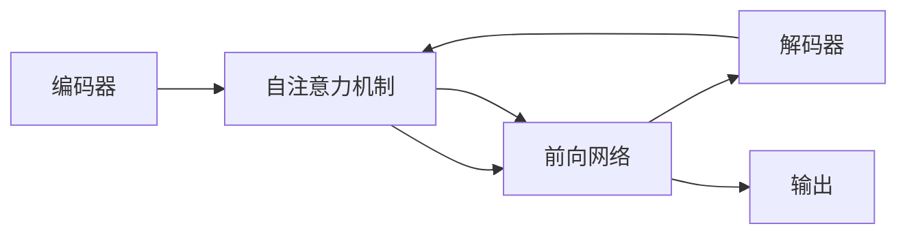
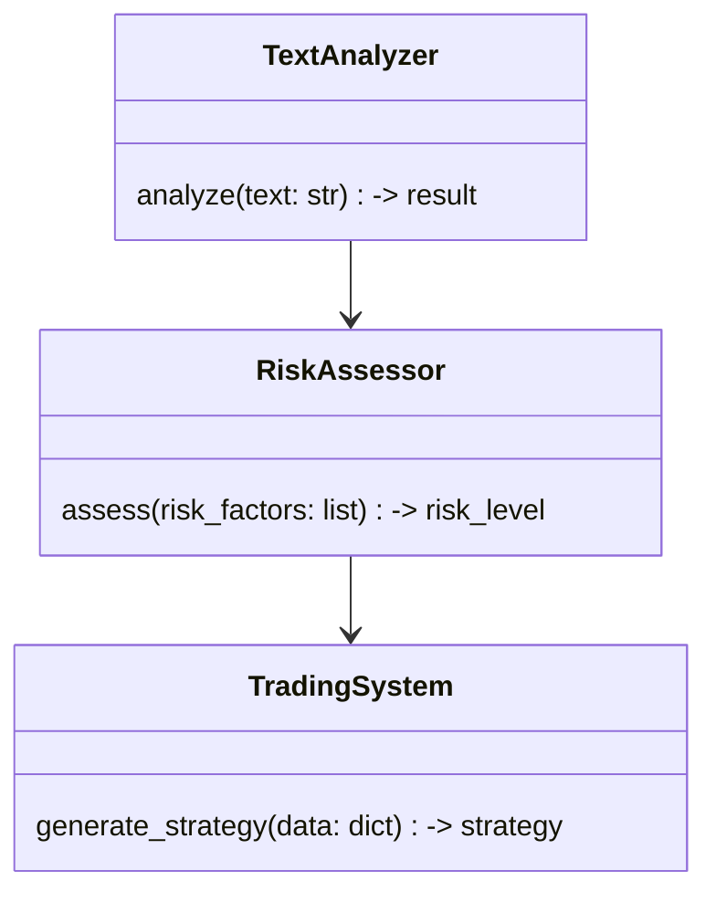
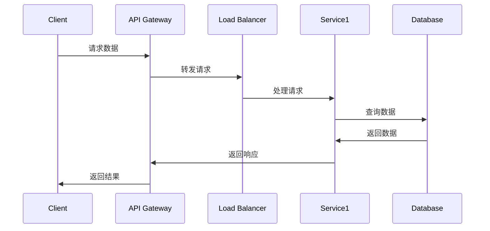

                 


# 大语言模型在金融领域的应用

## 关键词：大语言模型、金融应用、NLP、文本分析、风险评估、自动化交易

## 摘要：  
大语言模型（Large Language Models, LLMs）作为人工智能领域的革命性技术，正在逐步改变金融行业的运作方式。本文深入探讨了大语言模型在金融领域的核心应用，包括金融文本分析、风险评估、交易策略优化等方面。文章从背景介绍、核心概念、算法原理、系统设计、项目实战等多个维度展开，详细分析了大语言模型在金融领域的潜力与挑战，并结合实际案例展示了其在金融场景中的具体应用。本文旨在为金融从业者和技术开发者提供一份全面的技术指南，帮助他们更好地理解和应用大语言模型技术。

---

## 第1章: 大语言模型的基本概念与背景

### 1.1 大语言模型的定义与核心概念

大语言模型是一种基于深度学习的自然语言处理技术，通过训练大规模的文本数据，能够理解和生成人类语言。其核心特点包括：
- **大规模数据训练**：大语言模型通常基于千亿级参数，训练数据涵盖广泛的语料库。
- **自注意力机制**：通过自注意力机制，模型可以理解上下文关系，捕捉文本中的语义信息。
- **多任务学习能力**：大语言模型可以适应多种任务，如文本生成、分类、问答等。

### 1.2 金融领域的核心需求与挑战

金融领域的核心需求包括：
- **高效信息处理**：金融市场数据庞大，需要快速提取关键信息。
- **风险评估与预警**：准确识别市场风险和信用风险。
- **交易策略优化**：基于实时数据生成交易信号。

主要挑战包括：
- **数据隐私**：金融数据涉及敏感信息，需确保数据安全。
- **模型泛化能力**：大语言模型在金融领域的适用性需要进一步验证。
- **计算资源**：训练和推理需要强大的计算能力。

---

## 第2章: 大语言模型在金融领域的核心应用

### 2.1 金融文本分析

#### 2.1.1 文本分类与情感分析

大语言模型可以用于金融新闻的情感分析，帮助投资者快速判断市场情绪。例如，通过分析新闻标题和正文，模型可以判断市场是“看涨”、“看跌”还是“中性”。

#### 2.1.2 文本摘要与信息提取

模型可以自动提取公司财报中的关键信息，如收入、利润、增长预期等，帮助分析师快速了解公司业绩。

#### 2.1.3 金融新闻与市场情绪分析

通过分析社交媒体和新闻网站的文本，模型可以实时监测市场情绪变化，辅助交易决策。

### 2.2 金融风险评估

#### 2.2.1 信用风险评估

大语言模型可以分析企业财报和新闻，评估企业的信用风险。例如，通过分析企业财务数据和行业新闻，模型可以预测企业违约概率。

#### 2.2.2 市场风险预测

模型可以分析市场波动性和相关性，预测市场风险。例如，通过分析历史数据和新闻情绪，模型可以预测股票市场的波动性。

#### 2.2.3 风险因子分析

模型可以识别影响市场风险的关键因子，如宏观经济指标、行业趋势等。

### 2.3 金融交易与策略优化

#### 2.3.1 自动化交易策略生成

大语言模型可以分析历史数据和市场新闻，生成交易策略。例如，模型可以识别市场趋势，生成买入或卖出信号。

#### 2.3.2 交易信号识别

通过分析市场数据和新闻，模型可以识别潜在的交易机会。例如，模型可以识别市场拐点，生成交易信号。

#### 2.3.3 交易风险控制

模型可以实时监控市场风险，帮助交易员制定风险控制策略。例如，模型可以预测市场波动性，调整交易仓位。

---

## 第3章: 大语言模型的算法原理与数学模型

### 3.1 大语言模型的训练原理

大语言模型通常采用Transformer架构，其核心是自注意力机制。以下是自注意力机制的公式：

$$
\text{Attention}(Q, K, V) = \text{softmax}\left(\frac{QK^T}{\sqrt{d_k}}\right)V
$$

其中：
- $Q$ 是查询（Query）向量。
- $K$ 是键（Key）向量。
- $V$ 是值（Value）向量。
- $d_k$ 是向量的维度。

### 3.2 大语言模型的数学模型

大语言模型的编码器-解码器结构如下图所示：



---

## 第4章: 金融领域的系统分析与架构设计

### 4.1 金融应用场景介绍

常见的金融应用场景包括：
- **金融文本分析系统**
- **金融风险评估系统**
- **自动化交易系统**

### 4.2 系统功能设计

#### 4.2.1 领域模型设计

以下是领域模型的类图：



#### 4.2.2 系统架构设计

以下是系统架构图：

```mermaid
graph LR
    Client --> API Gateway
    API Gateway --> Load Balancer
    Load Balancer --> Service1
    Load Balancer --> Service2
    Service1 --> Database
    Service2 --> Model
    Model --> Output
```

#### 4.2.3 接口设计与交互流程

以下是接口交互流程图：



---

## 第5章: 大语言模型在金融领域的项目实战

### 5.1 项目环境与工具安装

#### 5.1.1 开发环境配置

建议使用以下开发环境：
- **操作系统**：Linux 或 macOS
- **编程语言**：Python 3.8+
- **框架**：PyTorch 或 TensorFlow
- **依赖库**：transformers, pandas, numpy

#### 5.1.2 依赖库安装

安装以下依赖库：

```bash
pip install transformers pandas numpy
```

#### 5.1.3 数据集准备

使用金融领域的文本数据集，例如股票新闻、财报数据等。

---

### 5.2 核心代码实现

#### 5.2.1 文本预处理代码

```python
from transformers import AutoTokenizer
from transformers import AutoModelForMaskedLM

tokenizer = AutoTokenizer.from_pretrained('bert-base-uncased')
model = AutoModelForMaskedLM.from_pretrained('bert-base-uncased')
```

#### 5.2.2 模型训练代码

```python
import torch
from torch import nn

class LLM(nn.Module):
    def __init__(self):
        super().__init__()
        self.encoder = nn.Embedding(1000, 512)
        self.decoder = nn.Linear(512, 1000)
    
    def forward(self, x):
        x = self.encoder(x)
        x = self.decoder(x)
        return x
```

#### 5.2.3 应用接口开发

```python
def analyze_text(text):
    inputs = tokenizer(text, return_tensors='pt')
    outputs = model(**inputs)
    return outputs.last_hidden_state
```

---

## 第6章: 项目总结与未来展望

### 6.1 项目总结

- **核心成果**：成功将大语言模型应用于金融文本分析、风险评估和交易策略生成。
- **实施经验**：数据质量对模型性能影响显著，需要精心设计数据预处理流程。
- **问题与不足**：模型的泛化能力有待提升，部分场景的准确性仍需优化。

### 6.2 未来展望

- **技术发展趋势**：大语言模型的参数量将进一步增大，模型的训练效率和推理速度将提升。
- **应用场景扩展**：更多金融场景将被纳入大语言模型的应用范围，如智能客服、投资顾问等。
- **挑战与机遇**：数据隐私和模型解释性是未来需要重点解决的问题。

---

## 第7章: 最佳实践与注意事项

### 7.1 最佳实践

- **数据质量**：确保数据的准确性和完整性，避免噪声数据影响模型性能。
- **模型调优**：通过超参数调整和模型剪枝优化模型性能。
- **伦理与合规性**：确保模型的使用符合相关法律法规和伦理规范。

### 7.2 注意事项

- **数据隐私保护**：金融数据涉及敏感信息，需严格遵守数据隐私保护法规。
- **模型泛化能力**：大语言模型在金融领域的应用需结合具体场景进行微调。
- **应用

