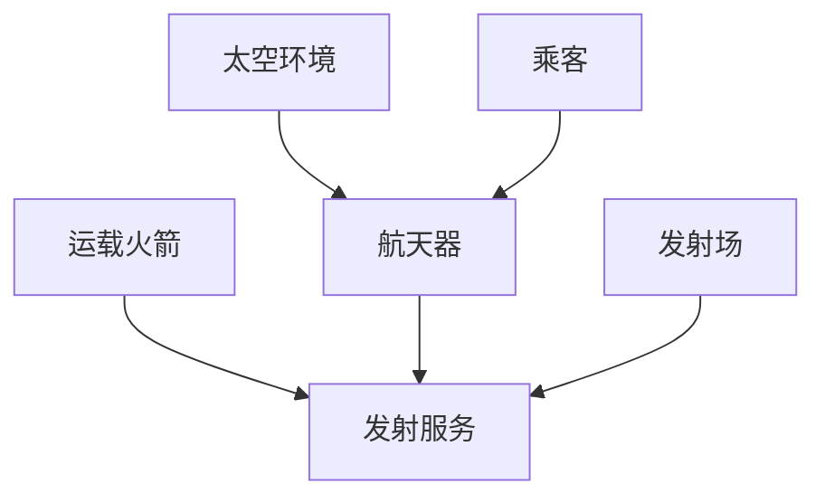

                 

# 太空旅游产业的兴起与投资机会

> **关键词**：太空旅游，商业航天，投资机会，运载火箭，太空经济

> **摘要**：太空旅游产业作为新兴的商业航天领域，正在快速发展。本文将从太空旅游的起源、技术支撑、商业模式、投资机会、风险评估等方面进行详细分析，探讨其发展现状与未来趋势。

---

## 第1章: 太空旅游产业的背景与起源

### 1.1 太空旅游的起源与演变

#### 1.1.1 从冷战到商业航天：太空旅游的起源
太空旅游的起源可以追溯到20世纪的冷战时期。苏联和美国在1957年至1975年间的太空竞赛推动了人类首次进入太空。1961年，苏联宇航员尤里·加加林成为第一个进入太空的人类。然而，当时的太空探索主要是国家行为，目的是展示科技实力，而非商业盈利。

随着冷战的结束，商业航天逐渐兴起。1999年，俄罗斯将富商丹尼斯·蒂托送入国际空间站，成为首位太空游客，标志着商业太空旅游的诞生。此后，SpaceX、Blue Origin等公司开始将商业太空旅游作为一项新业务发展。

#### 1.1.2 太空旅游的定义与范围
太空旅游指的是以商业为目的，向普通公众提供进入太空、体验失重环境或参观太空站等服务的活动。其范围包括亚轨道飞行、低地球轨道（LEO）飞行、深空探索等不同层次。

#### 1.1.3 太空旅游的边界与外延
太空旅游的边界主要取决于飞行的高度和时间：
- **亚轨道飞行**：高度在100公里以下，飞行时间约10-30分钟，体验失重。
- **低地球轨道（LEO）飞行**：高度在160-2000公里之间，飞行时间更长，可进入国际空间站。
- **深空探索**：飞往月球或火星，时间跨度以月甚至年计。

太空旅游的外延包括与之相关的基础设施建设（如发射场、地面支持）、技术支持（如运载火箭）、以及下游服务（如太空酒店设计）。

### 1.2 太空旅游的产业链构成

#### 1.2.1 上游：运载工具与发射服务
运载工具是太空旅游的核心，主要由火箭和航天器组成。上游产业包括火箭制造、发射服务、地面支持等。

- **运载火箭**：SpaceX的猎鹰9号是目前最成功的可重复使用火箭，降低了发射成本。
- **航天器**：太空船的设计需要兼顾舒适性和安全性，Blue Origin的“新谢泼德”号是典型的亚轨道太空船。

#### 1.2.2 中游：太空旅行服务与体验
中游产业涉及直接向游客提供服务，包括太空船票销售、培训、太空站访问等。

- **太空船票**：目前，SpaceX、Blue Origin等公司提供亚轨道飞行服务，票价在几十万美元到数百万美元之间。
- **培训与体验**：游客需要接受严格的物理和心理测试，以及太空环境模拟训练。

#### 1.2.3 下游：市场推广与用户服务
下游产业包括市场推广、品牌合作、太空旅游保险等。

- **市场推广**：通过社交媒体、旅游展会等渠道吸引游客。
- **太空旅游保险**：保险公司为游客提供覆盖太空旅行期间的风险保障。

### 1.3 太空旅游的核心要素与概念结构

#### 1.3.1 核心概念：运载火箭、航天器、太空环境
- **运载火箭**：用于将乘客送入太空，可重复使用火箭是降低成本的关键。
- **航天器**：提供舒适的乘坐体验，包括失重环境和必要的生命支持系统。
- **太空环境**：包括地球大气层以外的真空、辐射和极端温度。

#### 1.3.2 概念属性对比表格

| **核心概念** | **属性**         | **描述**                                                                 |
|--------------|------------------|--------------------------------------------------------------------------|
| 运载火箭     | 可重复使用        | 火箭可以多次发射，降低成本。                                         |
| 航天器       | 舒适性           | 提供乘客舒适的乘坐体验，包括失重环境。                             |
| 太空环境     | 辐射与真空       | 环境恶劣，需要生命支持系统保障乘客安全。                           |

#### 1.3.3 ER实体关系图（Mermaid流程图）

---

## 第2章: 太空旅游的技术支撑与创新

### 2.1 太空旅游的关键技术

#### 2.1.1 运载火箭技术
运载火箭是太空旅游的核心技术。以下是几种主要的运载火箭及其特点：

- **SpaceX的猎鹰9号**：可重复使用，成本低。
- **Blue Origin的New Glenn**：计划于2024年发射，目标是LEO。

#### 2.1.2 航天器设计与制造
航天器设计需要兼顾安全性和舒适性。以下是几种典型的航天器：

- **SpaceX的星舰（Starship）**：设计用于深空探索，可容纳100人。
- **Blue Origin的新谢泼德号**：亚轨道飞行，乘客舱可容纳6人。

#### 2.1.3 太空环境适应技术
在太空环境中，乘客需要适应失重、辐射和极端温度。以下是关键的技术：

- **生命支持系统**：提供氧气、过滤空气、调节温度。
- **辐射屏蔽**：使用多层材料和水箱保护乘客。

### 2.2 太空旅游的技术创新

#### 2.2.1 可重复使用火箭技术
可重复使用火箭是降低发射成本的关键。以下是主要的技术创新：

- **猎鹰9号**：通过反推技术实现垂直回收。
- **New Glenn**：计划实现第一级火箭的重复使用。

#### 2.2.2 航天器的轻量化设计
通过使用复合材料和模块化设计，降低航天器重量，提高效率。

#### 2.2.3 太空生命支持系统
生命支持系统是保障乘客在太空环境中生存的关键。以下是其组成部分：

- **氧气供应**：通过化学反应生成氧气。
- **空气过滤**：去除二氧化碳和其他有害气体。
- **温度控制**：使用辐射冷却和加热系统。

### 2.3 太空旅游的技术挑战与解决方案

#### 2.3.1 技术风险与应对策略
技术风险包括火箭故障、航天器失灵等。以下是应对策略：

- **冗余设计**：关键系统有备用方案。
- **自动化控制**：减少人为操作失误。

#### 2.3.2 技术创新的驱动因素
市场需求和政策支持是推动技术创新的主要因素。

#### 2.3.3 技术发展对产业的推动作用
技术进步降低了成本，提高了安全性，使太空旅游逐渐商业化。

---

## 第3章: 太空旅游的商业模式与盈利模式

### 3.1 太空旅游的商业模式

#### 3.1.1 直接销售：太空旅行服务
直接销售是主要的商业模式，通过销售太空船票实现盈利。

#### 3.1.2 政府合作：太空项目投资
与政府合作，参与国家太空项目，获取资金支持。

#### 3.1.3 广告与品牌合作
通过广告和品牌合作，增加收入来源。

### 3.2 太空旅游的盈利模式

#### 3.2.1 票务收入：直接销售
票务收入是主要的盈利来源，票价高昂。

#### 3.2.2 附加服务：太空体验与培训
提供培训、地面支持等附加服务，增加收入。

#### 3.2.3 数据与资源开发
通过太空资源开发（如小行星采矿）获取额外收入。

### 3.3 太空旅游的市场分析与竞争格局

#### 3.3.1 市场规模与增长潜力
市场增长迅速，预计到2030年，市场规模将超过100亿美元。

#### 3.3.2 主要参与者与竞争分析
主要参与者包括SpaceX、Blue Origin、Virgin Galactic等。

#### 3.3.3 未来市场发展趋势
未来市场将更加成熟，竞争加剧。

---

## 第4章: 太空旅游的投资机会与风险评估

### 4.1 太空旅游的投资机会

#### 4.1.1 发射服务：运载火箭制造与发射
发射服务是主要的投资机会，尤其是可重复使用火箭技术。

#### 4.1.2 太空资源开发：小行星采矿与空间站建设
小行星采矿和空间站建设是高潜力的投资领域。

#### 4.1.3 太空旅游服务
随着市场需求增长，太空旅游服务将吸引更多投资。

### 4.2 太空旅游的风险评估

#### 4.2.1 技术风险
技术失败可能导致重大损失。

#### 4.2.2 市场风险
市场需求可能不及预期。

#### 4.2.3 政策风险
政策变化可能影响产业发展。

---

## 总结

太空旅游产业正处于快速发展阶段，投资机会与挑战并存。随着技术进步和市场需求增长，太空旅游将成为商业航天的重要组成部分。投资者需关注技术风险、市场需求和政策环境，抓住投资机会。

---

**作者：AI天才研究院/AI Genius Institute & 禅与计算机程序设计艺术 /Zen And The Art of Computer Programming**

