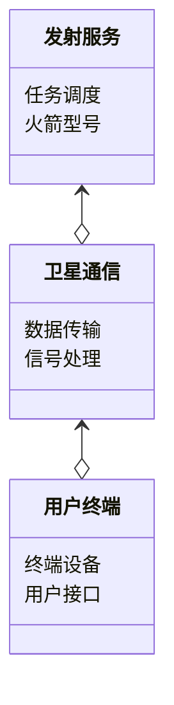
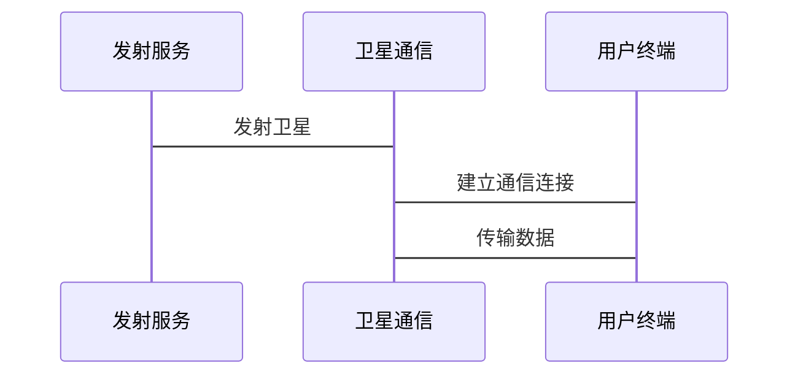

                 


# 太空经济：新兴投资领域的风险与回报

## 关键词：太空经济, 投资, 风险, 回报, 商业航天, 卫星技术, 太空资源

## 摘要：太空经济是一个新兴的投资领域，涉及卫星技术、商业航天和太空资源开发等多个方面。本文将分析太空经济的核心概念、风险评估、数学模型、系统架构和实际案例，帮助投资者理解其潜在回报和面临的挑战。

---

## 第一部分: 太空经济的背景与概念

### 第1章: 太空经济的定义与现状

#### 1.1 太空经济的定义与内涵
- **1.1.1 太空经济的定义**  
  太空经济是指利用太空资源和技术进行商业活动的经济体系，涵盖卫星通信、太空旅游、资源开发等领域。

- **1.1.2 太空经济的核心内涵**  
  太空经济依赖于技术创新，涉及高风险和高回报，受法律法规和国际政策影响。

- **1.1.3 太空经济的边界与外延**  
  包括技术、市场、法律等多个方面，外延涉及国际合作和私营企业参与。

#### 1.2 太空经济的发展背景
- **1.2.1 太空技术的进步**  
  卫星技术、火箭推进和太空探索技术的发展推动了太空经济的发展。

- **1.2.2 全球经济发展的驱动**  
  科技进步和全球化需求促使太空经济成为新的投资热点。

- **1.2.3 太空经济的全球发展趋势**  
  美国、欧洲和亚洲的国家和地区都在积极投资太空经济，推动其增长。

#### 1.3 太空经济的主要参与者
- **1.3.1 政府机构**  
  NASA、ESA等政府机构主导太空探索和政策制定。

- **1.3.2 私营企业**  
  SpaceX、Blue Origin等企业推动商业航天和技术创新。

- **1.3.3 国际组织与合作**  
  国际电信联盟、联合国等组织促进太空资源的全球合作。

#### 1.4 太空经济的投资机会
- **1.4.1 卫星通信**  
  卫星互联网服务如Starlink为投资者提供巨大潜力。

- **1.4.2 太空资源开发**  
  小行星采矿和月球基地建设带来新机遇。

- **1.4.3 太空旅游**  
  Virgin Galactic和SpaceX等公司推动私人太空旅行的发展。

#### 1.5 本章小结
本章介绍了太空经济的定义、现状、参与者和投资机会，为后续分析奠定了基础。

### 第2章: 太空经济的核心概念与联系

#### 2.1 太空经济的核心概念
- **2.1.1 太空资源**  
  包括小行星、月球和火星资源，可用于能源和材料开发。

- **2.1.2 太空技术**  
  卫星、火箭和太空站技术推动经济活动。

- **2.1.3 太空投资**  
  包括风险投资、私募和政府资助，支持太空项目发展。

#### 2.2 太空经济的核心要素
- **2.2.1 技术创新**  
  新技术是太空经济发展的关键驱动力。

- **2.2.2 市场需求**  
  卫星通信、导航和遥感技术的市场需求推动经济活动。

- **2.2.3 法律法规**  
  国际法和国内政策对太空资源开发和商业活动有重要影响。

#### 2.3 太空经济的概念结构
- **2.3.1 太空经济的系统模型**  
  由技术、市场、法律和参与者构成复杂系统。

- **2.3.2 太空经济的产业链**  
  包括上游制造、发射服务、下游应用等环节。

- **2.3.3 太空经济的生态体系**  
  政府、企业和科研机构共同构建生态。

#### 2.4 太空经济的核心属性特征对比
- **2.4.1 技术驱动型**  
  技术创新是核心动力。

- **2.4.2 高风险高回报**  
  项目失败风险高，成功则回报丰厚。

- **2.4.3 法律法规的复杂性**  
  国际法和政策的不确定性增加投资风险。

#### 2.5 太空经济的ER实体关系图
```mermaid
erDiagram
    投资者--<分配>--> 项目
    项目--<依赖>--> 技术
    项目--<满足>--> 市场需求
    项目--<受制于>--> 法律法规
   抽屉 技术 {
        <属性> 类型
        <属性> 等级
    }
    投资者 {
        <属性> 金额
        <属性> 来源
    }
    市场需求 {
        <属性> 规模
        <属性> 趋势
    }
    法律法规 {
        <属性> 类型
        <属性> 内容
    }
```

#### 2.6 本章小结
本章通过概念模型和ER图分析了太空经济的核心要素及其相互关系。

### 第3章: 太空经济的风险评估与回报分析

#### 3.1 太空经济的风险评估
- **3.1.1 技术风险**  
  技术失败可能导致项目终止，影响投资回报。

- **3.1.2 市场风险**  
  市场需求变化或竞争加剧可能导致投资损失。

- **3.1.3 法律风险**  
  国际法和政策变化可能影响项目实施。

- **3.1.4 财务风险**  
  高额投资和回报周期长增加财务压力。

#### 3.2 太空经济的回报分析
- **3.2.1 高回报潜力**  
  成功项目如卫星通信和太空旅游可能带来丰厚利润。

- **3.2.2 市场增长**  
  卫星技术广泛应用推动市场需求增长。

- **3.2.3 技术创新带来的附加价值**  
  创新技术可能带来专利和市场垄断优势。

#### 3.3 太空经济的风险-回报模型
- **3.3.1 数学模型**  
  回报率 = 技术成功率 × 市场需求增长 × 投资金额 × 时间因素

- **3.3.2 技术成功率分析**  
  使用概率树分析技术失败和成功的可能性。

- **3.3.3 投资回报周期分析**  
  高风险项目通常回报周期长，需长期投资。

#### 3.4 本章小结
本章通过数学模型和概率分析评估了太空经济的风险与回报，帮助投资者做出决策。

### 第4章: 太空经济的系统架构与设计

#### 4.1 项目介绍
- **4.1.1 项目背景**  
  商业航天项目如卫星发射和太空旅游。

- **4.1.2 项目目标**  
  提供通信服务或太空旅游体验。

#### 4.2 系统功能设计
- **4.2.1 领域模型**  
  包括发射服务、卫星通信和用户终端。

- **4.2.2 领域模型Mermaid类图**


#### 4.3 系统架构设计
- **4.3.1 分层架构**  
  包括发射、通信和用户终端三层。

- **4.3.2 系统架构Mermaid图**


#### 4.4 系统接口设计
- **4.4.1 接口描述**  
  发射服务与通信系统接口定义数据传输协议。

- **4.4.2 接口交互Mermaid序列图**


#### 4.5 本章小结
本章通过系统架构和设计展示了太空经济项目的实施过程和接口交互。

### 第5章: 太空经济的项目实战

#### 5.1 环境安装
- **5.1.1 系统要求**  
  高性能计算机、相关软件和开发工具。

- **5.1.2 安装步骤**  
  安装Python、Git和虚拟环境，克隆代码仓库。

#### 5.2 系统核心实现源代码
- **5.2.1 卫星通信模块**  
  Python代码实现数据传输和信号处理。

- **5.2.2 发射服务模块**  
  管理火箭发射和任务调度。

#### 5.3 代码实现与解读
```python
# 卫星通信模块
import numpy as np

def signal_processing(signal):
    # 信号处理算法
    return signal * np.fft.fft(signal)

# 发射服务模块
class RocketLauncher:
    def __init__(self, rockets):
        self.rockets = rockets

    def launch(self, rocket_index):
        return f"发射火箭 {self.rockets[rocket_index]} 成功"
```

#### 5.4 案例分析与详细讲解
- **5.4.1 案例背景**  
  某公司发射通信卫星，面临技术挑战和市场风险。

- **5.4.2 案例分析**  
  分析项目中的技术选择、成本控制和市场策略。

#### 5.5 本章小结
本章通过实际案例展示了太空经济项目的实施过程和技术细节。

### 第6章: 太空经济的最佳实践与小结

#### 6.1 小结
- 太空经济涉及多个领域，具有高风险和高回报的特点。

#### 6.2 注意事项
- **技术风险**：确保技术创新和可靠实施。
- **法律合规**：遵守国际法和相关政策。
- **市场风险**：关注市场需求变化和竞争情况。

#### 6.3 拓展阅读
- 推荐阅读相关书籍和学术论文，参加行业会议，关注最新动态。

#### 6.4 本章小结
本章总结了太空经济的关键点和投资注意事项，为读者提供了实用建议。

---

## 作者：AI天才研究院/AI Genius Institute & 禅与计算机程序设计艺术 /Zen And The Art of Computer Programming

