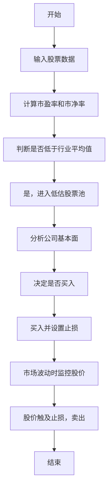
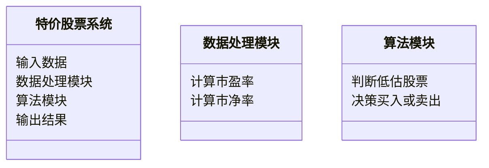
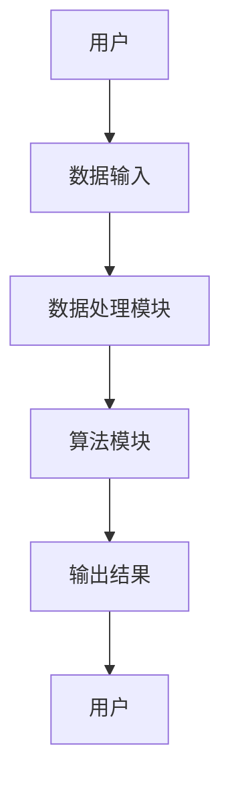
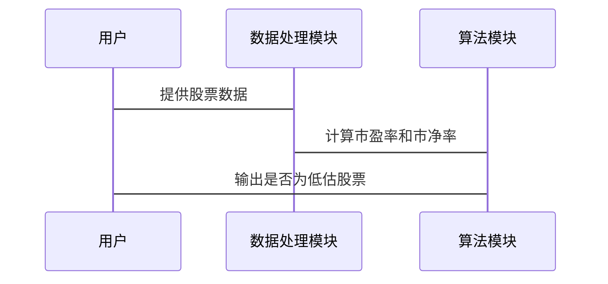

                 


# 如何利用特价股票策略应对去全球化趋势

## 关键词：特价股票，去全球化，股票策略，投资策略，风险管理

## 摘要：  
本文探讨了在去全球化趋势下，如何利用特价股票策略进行有效的投资。文章从背景分析、策略制定、算法实现、系统架构设计到项目实战，全面解析了特价股票策略的应用。通过数学模型、流程图和代码示例，详细讲解了如何在复杂多变的市场环境中，利用特价股票策略应对去全球化带来的挑战。

---

## 第1章: 特价股票策略与去全球化趋势的背景

### 1.1 特价股票策略的定义与特点

#### 1.1.1 特价股票的定义  
特价股票是指价格显著低于其内在价值的股票。这类股票通常被市场低估，具有较大的反弹潜力。  

#### 1.1.2 特价股票的特点  
- **低估性**：市场价格低于内在价值。  
- **低流动性**：交易量小，市场关注度低。  
- **高波动性**：价格波动较大，容易受到市场情绪影响。  

#### 1.1.3 特价股票与传统股票投资的区别  
- **投资逻辑**：传统股票注重长期增长，特价股票注重短期反弹。  
- **风险偏好**：传统股票风险较低，特价股票风险较高。  

### 1.2 去全球化趋势的背景与影响

#### 1.2.1 去全球化的概念与表现  
去全球化是指全球化进程的逆转，表现为贸易壁垒增加、供应链本地化、地缘政治冲突加剧等。  

#### 1.2.2 去全球化对全球经济的影响  
- **贸易萎缩**：跨国贸易减少，各国更倾向于本地化生产。  
- **供应链调整**：企业重新布局供应链，减少对全球化的依赖。  
- **地缘政治风险**：区域冲突增加，影响全球经济稳定性。  

#### 1.2.3 去全球化对股票市场的影响  
- **市场分割**：区域市场分化，全球市场整合减少。  
- **行业调整**：部分行业受冲击，如跨国公司和出口导向型企业。  

### 1.3 特价股票策略在去全球化背景下的重要性

#### 1.3.1 特价股票策略的优势  
- **低成本**：特价股票价格低，适合中小投资者。  
- **高潜力**：低估股票具有较大的反弹空间。  

#### 1.3.2 去全球化趋势下股票市场的不确定性  
- **市场波动**：地缘政治风险导致市场波动加剧。  
- **行业调整**：部分行业受去全球化影响，股价可能被低估。  

#### 1.3.3 特价股票策略的应对作用  
- **抓住低估机会**：在去全球化背景下，部分行业可能被市场低估。  
- **分散风险**：通过投资特价股票，降低整体投资组合的风险。  

### 1.4 本章小结  
本章介绍了特价股票的定义、特点及与传统股票的区别，分析了去全球化趋势的背景及其对全球经济和股票市场的影响，最后探讨了特价股票策略在去全球化背景下的重要性。

---

## 第2章: 特价股票策略的核心概念与原理

### 2.1 特价股票策略的核心概念

#### 2.1.1 特价股票的市场定位  
特价股票通常出现在市场低迷时期，投资者情绪低落，市场关注度较低。  

#### 2.1.2 特价股票的估值方法  
- **市盈率（P/E）**：比较股票价格与每股收益的比例。  
- **市净率（P/B）**：比较股票价格与每股净资产的比例。  

#### 2.1.3 特价股票的风险与收益分析  
- **收益**：低估股票价格反弹带来的收益。  
- **风险**：市场波动大，可能继续下跌。  

### 2.2 特价股票策略的原理

#### 2.2.1 市场波动与低价股票的机会  
市场波动导致部分股票价格被低估，投资者可以通过低价买入，等待反弹。  

#### 2.2.2 投资者情绪与市场周期  
投资者情绪波动影响市场价格，市场恐慌时可能产生低估股票。  

#### 2.2.3 特价股票的长期与短期策略结合  
- **短期策略**：利用市场波动，快速买卖赚取差价。  
- **长期策略**：买入低估股票，长期持有，等待价值回归。  

### 2.3 特价股票策略与去全球化趋势的关联

#### 2.3.1 去全球化对行业的影响  
- **供应链调整**：部分行业受去全球化影响，股价可能被低估。  
- **区域化投资**：投资者可以关注本地化企业，寻找低估机会。  

#### 2.3.2 特价股票策略在行业调整中的应用  
- **行业选择**：选择受去全球化影响较小的行业，如科技、医疗等。  
- **公司基本面分析**：关注公司财务状况，选择基本面良好的低估股票。  

### 2.4 本章小结  
本章详细讲解了特价股票策略的核心概念，包括市场定位、估值方法和风险收益分析，并探讨了特价股票策略与去全球化趋势的关联。

---

## 第3章: 去全球化趋势下的股票市场分析

### 3.1 去全球化对股票市场的影响机制

#### 3.1.1 贸易壁垒与市场分割  
贸易壁垒导致市场分割，影响跨国公司的业绩。  

#### 3.1.2 供应链调整与企业成本变化  
供应链本地化可能导致企业成本上升，影响盈利能力。  

#### 3.1.3 地缘政治风险与市场波动  
地缘政治冲突加剧，导致市场波动加大。  

### 3.2 特价股票策略在区域化市场中的应用

#### 3.2.1 区域市场的特点  
- **本地化**：关注本地企业的投资机会。  
- **市场分割**：区域市场可能被低估，存在投资机会。  

#### 3.2.2 区域市场中的特价股票机会  
- **行业调整**：部分行业受去全球化影响，股价被低估。  
- **市场情绪**：区域市场可能因情绪波动产生低估股票。  

#### 3.2.3 区域化投资的风险管理  
- **分散投资**：避免过度集中于某一区域或行业。  
- **风险对冲**：利用衍生工具对冲市场风险。  

### 3.3 去全球化趋势下的投资机会分析

#### 3.3.1 特价股票的行业选择  
- **受去全球化影响小的行业**：如科技、医疗、公用事业等。  
- **本地化企业**：关注本地化企业，寻找低估机会。  

#### 3.3.2 特价股票的公司基本面分析  
- **财务状况**：关注公司的盈利能力、资产负债情况。  
- **管理团队**：选择管理团队稳定的公司。  

#### 3.3.3 市场周期与投资时机的把握  
- **市场低点**：在市场低点买入低估股票。  
- **市场反弹**：利用市场反弹，卖出股票获利。  

### 3.4 本章小结  
本章分析了去全球化趋势对股票市场的影响机制，探讨了特价股票策略在区域化市场中的应用，并提出了投资机会分析的具体方法。

---

## 第4章: 特价股票策略与去全球化趋势的结合

### 4.1 特价股票策略的核心要素

#### 4.1.1 市场定位  
- **行业选择**：选择受去全球化影响较小的行业。  
- **公司筛选**：选择基本面良好、股价低估的公司。  

#### 4.1.2 估值模型  
- **市盈率（P/E）**：比较股票价格与每股收益的比例。  
- **市净率（P/B）**：比较股票价格与每股净资产的比例。  

#### 4.1.3 风险管理  
- **止损策略**：设定止损点，避免亏损扩大。  
- **分散投资**：避免过度集中于某一股票或行业。  

### 4.2 去全球化趋势下的投资策略调整

#### 4.2.1 区域化投资策略  
- **本地化投资**：关注本地企业的投资机会。  
- **区域市场分析**：分析区域市场的特点，寻找低估股票。  

#### 4.2.2 行业选择与公司筛选  
- **行业选择**：选择受去全球化影响较小的行业，如科技、医疗等。  
- **公司筛选**：选择基本面良好、股价低估的公司。  

### 4.3 本章小结  
本章结合去全球化趋势，提出了特价股票策略的核心要素和投资策略调整方法，为投资者提供了具体的指导。

---

## 第5章: 特价股票策略的算法实现

### 5.1 特价股票策略的数学模型

#### 5.1.1 市盈率（P/E）模型  
$$ \text{P/E} = \frac{\text{股价}}{\text{每股收益}} $$  

#### 5.1.2 市净率（P/B）模型  
$$ \text{P/B} = \frac{\text{股价}}{\text{每股净资产}} $$  

### 5.2 特价股票策略的算法流程图  



### 5.3 特价股票策略的Python代码实现  

```python
import pandas as pd
import numpy as np

def calculate_pe_ticker(ticker_data):
    pe = ticker_data['股价'] / ticker_data['每股收益']
    return pe

def calculate_pb_ticker(ticker_data):
    pb = ticker_data['股价'] / ticker_data['每股净资产']
    return pb

def is_undervalued(pe, pb, pe_industry_avg, pb_industry_avg):
    if pe < pe_industry_avg and pb < pb_industry_avg:
        return True
    return False

# 示例数据
data = {
    '股价': [10, 15, 20, 25],
    '每股收益': [5, 6, 7, 8],
    '每股净资产': [8, 9, 10, 12]
}
ticker_data = pd.DataFrame(data)

pe = calculate_pe_ticker(ticker_data)
pb = calculate_pb_ticker(ticker_data)

pe_industry_avg = 15
pb_industry_avg = 12

result = is_undervalued(pe, pb, pe_industry_avg, pb_industry_avg)
print("是否存在低估股票:", result)
```

### 5.4 本章小结  
本章通过数学模型和算法流程图，详细讲解了特价股票策略的实现方法，并提供了Python代码示例，帮助读者理解策略的具体操作。

---

## 第6章: 特价股票策略的系统架构设计

### 6.1 系统功能设计

#### 6.1.1 领域模型  


#### 6.1.2 系统架构设计  


### 6.2 接口设计与交互流程

#### 6.2.1 接口设计  
- **输入接口**：接收股票数据，包括股价、每股收益、每股净资产等。  
- **输出接口**：输出是否为低估股票的判断结果。  

#### 6.2.2 交互流程  


### 6.3 本章小结  
本章通过系统架构设计，详细描述了特价股票策略的实现过程，包括功能模块设计和交互流程。

---

## 第7章: 特价股票策略的项目实战

### 7.1 环境安装与配置

#### 7.1.1 安装Python环境  
- 安装Python 3.8 或更高版本。  
- 安装必要的库：Pandas、NumPy、Matplotlib。  

#### 7.1.2 安装数据接口  
- 使用Yahoo Finance API或其他金融数据接口。  

### 7.2 核心实现代码

#### 7.2.1 数据获取与处理  
```python
import pandas_datareader as pdr

# 获取股票数据
data = pdr.get_data_yahoo('AAPL', start='2020-01-01', end='2023-12-31')

# 计算市盈率和市净率
data['PE'] = data['Adj Close'] / data['EPS']
data['PB'] = data['Adj Close'] / data['Book Value per Share']
```

#### 7.2.2 特价股票筛选  
```python
def screen_undervalued_stocks(data, pe_threshold=15, pb_threshold=12):
    undervalued = data[(data['PE'] < pe_threshold) & (data['PB'] < pb_threshold)]
    return undervalued

# 示例筛选
pe_threshold = 15
pb_threshold = 12
result = screen_undervalued_stocks(data, pe_threshold, pb_threshold)
print("低估股票数量:", len(result))
```

### 7.3 案例分析与详细解读

#### 7.3.1 案例分析  
假设我们选择苹果公司（AAPL）作为案例，分析其市盈率和市净率。  

#### 7.3.2 实际操作  
- **数据获取**：获取AAPL的股价数据。  
- **计算指标**：计算市盈率和市净率。  
- **判断是否低估**：根据阈值判断是否为低估股票。  

### 7.4 本章小结  
本章通过项目实战，详细讲解了特价股票策略的实现过程，包括环境安装、数据获取、代码实现和案例分析。

---

## 第8章: 总结与展望

### 8.1 本章总结  
本文详细探讨了如何利用特价股票策略应对去全球化趋势，从背景分析、策略制定、算法实现到系统架构设计，全面解析了特价股票策略的应用。  

### 8.2 最佳实践 Tips  
- **分散投资**：避免过度集中于某一股票或行业。  
- **风险管理**：设置止损点，避免亏损扩大。  
- **持续学习**：关注市场动态，及时调整投资策略。  

### 8.3 未来展望  
随着去全球化趋势的加剧，特价股票策略将在区域化市场中发挥越来越重要的作用。未来，可以通过人工智能和大数据技术，进一步优化特价股票的筛选和投资策略。

### 8.4 本章小结  
本章总结了全文内容，并提出了未来的研究方向和投资建议。

---

## 作者：AI天才研究院/AI Genius Institute & 禅与计算机程序设计艺术 /Zen And The Art of Computer Programming

