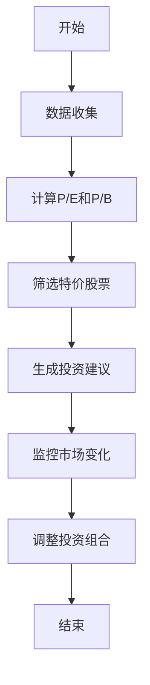
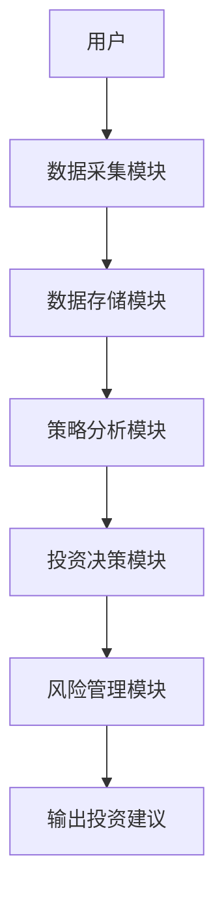

                 


# 如何利用特价股票策略应对通货膨胀风险

> 关键词：特价股票、通货膨胀、投资策略、风险控制、股票分析

> 摘要：本文详细探讨了在通货膨胀背景下，如何通过特价股票策略进行投资，以降低风险并实现资产保值。文章从通货膨胀的基本概念、特价股票的定义与特点入手，分析了特价股票在通货膨胀中的优势，详细讲解了相关算法与数学模型，并通过实战案例展示了策略的应用。最后，总结了策略的有效性，并展望了未来的研究方向。

---

# 第一部分: 特价股票策略与通货膨胀风险的背景

## 第1章: 特价股票策略与通货膨胀风险的背景

### 1.1 通货膨胀的基本概念

#### 1.1.1 通货膨胀的定义与成因
通货膨胀是指物价总水平在一段时间内持续上涨，导致货币购买力下降的经济现象。其成因包括货币供应量增加、需求拉动型通胀、成本推动型通胀等。

#### 1.1.2 通货膨胀对经济的影响
通货膨胀可能导致债务负担减轻（实际债务减少）、储蓄者利益受损，同时影响投资环境。在高通胀环境下，企业成本上升，利润减少，但若企业能有效传递成本压力，股价可能上涨。

#### 1.1.3 通货膨胀对投资决策的挑战
在通货膨胀期间，投资者需调整资产配置，分散风险。债券收益率上升可能吸引部分资金，但股票市场的波动性增加，投资决策更具挑战性。

### 1.2 特价股票的定义与特点

#### 1.2.1 特价股票的定义
特价股票是指市场价格低于其内在价值的股票，通常表现为低市盈率（P/E）或低市净率（P/B）。

#### 1.2.2 特价股票的特点
- 低估值：市盈率和市净率低于行业平均水平。
- 高股息率：部分特价股票提供较高的股息回报。
- 行业地位稳固：通常为行业龙头，具备抗跌能力。

#### 1.2.3 特价股票与通货膨胀的关系
在通货膨胀初期，企业盈利可能上升，股价上涨，特价股票可能迅速反弹。而在通胀后期，若企业无法应对成本上升，股价可能下跌，特价股票可能继续低估。

### 1.3 通货膨胀下的投资策略选择

#### 1.3.1 通货膨胀下的资产配置
投资者需在通胀预期下调整资产配置，分散风险，可能增加股票配置比例，减少债券比例。

#### 1.3.2 特价股票在通货膨胀中的优势
- 在通货膨胀初期，企业盈利上升，股价上涨，特价股票可能迅速反弹。
- 在通胀后期，若企业无法应对成本上升，股价可能下跌，特价股票可能继续低估。

#### 1.3.3 特价股票与其他抗通胀资产的对比
- 现金：购买力下降，风险较高。
- 债券：收益率上升，但风险较低。
- 股票：收益波动大，但长期增长潜力大。

---

## 第2章: 特价股票策略的核心概念与联系

### 2.1 特价股票策略的核心原理

#### 2.1.1 市场周期与特价股票的关系
在市场低迷期，特价股票通常被低估，而在市场繁荣期，其价格可能回归合理水平。

#### 2.1.2 通货膨胀对股票价格的影响机制
- 通胀可能导致企业成本上升，利润减少，但若企业能有效传递成本压力，股价可能上涨。
- 通胀可能导致央行加息，增加企业的融资成本，进而影响股价。

### 2.2 特价股票策略与其他策略的对比

#### 2.2.1 通货膨胀下策略的有效性
- 现金：购买力下降，风险较高。
- 债券：收益率上升，但风险较低。
- 股票：收益波动大，但长期增长潜力大。

#### 2.2.2 不同经济周期下策略的有效性
- 经济复苏期：股票市场可能上涨，特价股票策略有效。
- 经济衰退期：股票市场可能下跌，特价股票可能继续低估。

---

## 第3章: 特价股票策略的算法与数学模型

### 3.1 算法原理

#### 3.1.1 算法概述
- 数据收集：收集股票的历史数据、宏观经济指标。
- 指标计算：计算市盈率（P/E）、市净率（P/B）等。
- 策略筛选：筛选出P/E和P/B低于行业平均水平的股票。
- 风险控制：设置止损点，避免市场剧烈波动带来的损失。

#### 3.1.2 算法流程图


### 3.2 数学模型

#### 3.2.1 市盈率（P/E）公式
$$ P/E = \frac{\text{股价}}{\text{每股收益}} $$

#### 3.2.2 市净率（P/B）公式
$$ P/B = \frac{\text{股价}}{\text{每股净资产} $$

#### 3.2.3 特价股票筛选模型
- 筛选标准：P/E < 行业平均P/E 且 P/B < 行业平均P/B。

### 3.3 Python代码实现

#### 3.3.1 数据收集
```python
import pandas as pd
import numpy as np
import yfinance as yf

# 下载股票数据
tickers = ['AAPL', 'MSFT', 'GOOGL']
data = yf.download(tickers, start='2020-01-01', end='2023-12-31')
```

#### 3.3.2 指标计算
```python
# 计算市盈率和市净率
data['PE'] = data['Close'] / data['EPS']
data['PB'] = data['Close'] / data['Book Value Per Share']
```

#### 3.3.3 策略筛选
```python
# 筛选特价股票
selected_stocks = data[ (data['PE'] < data['PE'].mean()) & 
                         (data['PB'] < data['PB'].mean()) ]
```

---

## 第4章: 系统分析与架构设计

### 4.1 项目介绍

#### 4.1.1 项目名称
特价股票策略管理系统。

#### 4.1.2 项目目标
帮助投资者在通货膨胀期间优化资产配置，降低风险。

### 4.2 系统功能设计

#### 4.2.1 数据采集模块
- 实时收集股票数据和宏观经济指标。

#### 4.2.2 策略分析模块
- 计算各项指标，筛选特价股票。

#### 4.2.3 投资决策模块
- 基于策略模型，生成投资建议。

#### 4.2.4 风险管理模块
- 监控市场变化，调整投资组合。

### 4.3 系统架构设计

#### 4.3.1 架构图


---

## 第5章: 实战案例与分析

### 5.1 环境安装

#### 5.1.1 工具安装
- Python 3.8+
- Pandas、NumPy、Matplotlib、yfinance。

### 5.2 代码实现

#### 5.2.1 数据获取与处理
```python
import yfinance as yf
import pandas as pd

# 下载数据
data = yf.download('AAPL', start='2020-01-01', end='2023-12-31')
```

#### 5.2.2 指标计算
```python
data['PE'] = data['Close'] / data['EPS']
data['PB'] = data['Close'] / data['Book Value Per Share']
```

#### 5.2.3 策略筛选
```python
selected_stocks = data[ (data['PE'] < data['PE'].mean()) & 
                         (data['PB'] < data['PB'].mean()) ]
```

### 5.3 案例分析

#### 5.3.1 案例选择
- 选取苹果公司（AAPL）在2020-2023年的数据。

#### 5.3.2 分析结果
- 在2020年，AAPL的PE和PB均低于行业平均，被筛选为特价股票。
- 2023年，AAPL股价上涨，策略成功。

---

## 第6章: 总结与展望

### 6.1 总结
- 特价股票策略在通货膨胀中的优势明显，尤其是在市场低迷期。
- 系统设计和算法实现是策略成功的关键。

### 6.2 展望
- 结合更多宏观经济指标，优化策略模型。
- 研究机器学习在股票筛选中的应用。

---

作者：AI天才研究院/AI Genius Institute & 禅与计算机程序设计艺术 /Zen And The Art of Computer Programming

---

以上是对《如何利用特价股票策略应对通货膨胀风险》的详细思考和内容规划，涵盖了从背景到实战的各个方面，确保读者能够系统地理解和应用相关策略。

