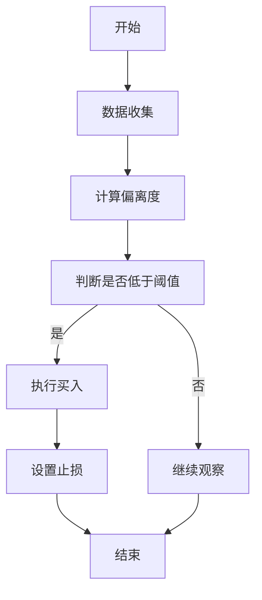
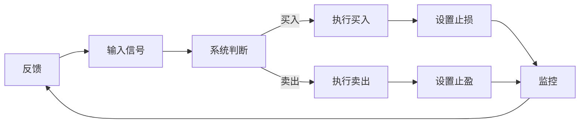

                 


# 如何利用特价股票策略捕捉市场底部

**关键词：股票策略、市场底部、特价策略、均值回归、技术指标**

**摘要：**  
本文详细探讨了如何利用特价股票策略捕捉市场底部。通过分析市场周期、投资者心理、技术指标和系统架构，本文为读者提供了一套从理论到实践的完整策略框架。从市场底部的定义到策略的具体实施，结合数学模型和系统设计，帮助投资者在市场波动中抓住底部机会，实现稳健投资。

---

## 第一部分: 特价股票策略的基础与背景

### 第1章: 市场底部与特价股票策略概述

#### 1.1 市场底部的概念与特征

##### 1.1.1 市场周期的基本原理  
市场的波动遵循一定的周期性规律，通常包括上升、下跌、盘整等阶段。底部是市场周期中的一个转折点，通常表现为价格的最低点或相对低点。识别市场底部的关键在于理解市场周期的波动规律。

##### 1.1.2 市场底部的定义与特征  
市场底部是指价格在经历一轮下跌后，达到相对低点并开始反弹的阶段。其特征包括：价格超跌、成交量萎缩、市场情绪低迷等。底部通常伴随着市场参与者的恐慌性抛售和市场情绪的极度负面。

##### 1.1.3 投资者心理对策略的影响  
在市场底部，投资者往往表现出恐慌和犹豫，导致价格进一步下跌。这种心理因素为特价策略提供了机会，因为恐慌性抛售可能导致价格偏离其真实价值。

#### 1.2 特价股票策略的核心概念

##### 1.2.1 特价股票策略的定义  
特价股票策略是一种基于市场底部识别的投资策略，通过在市场低点买入股票，在市场高点卖出，以获取价差收益。

##### 1.2.2 策略的核心要素与属性对比  
| 核心要素 | 定义 | 重要性 |
|----------|------|--------|
| 进场信号 | 价格低于历史均值 | 高 |  
| 出场信号 | 价格反弹或超过历史均值 | 中 |
| 风险控制 | 设置止损点 | 高 |

##### 1.2.3 策略的边界与外延  
特价策略适用于市场周期性波动较强的环境，但在市场剧烈波动或非理性下跌时，策略的有效性可能下降。

#### 1.3 投资者心理与市场底部

##### 1.3.1 投资者心理对市场底部的影响  
市场底部往往伴随着投资者的恐慌性抛售，这种心理因素会导致价格低于其实际价值，为策略提供机会。

##### 1.3.2 市场恐慌与策略机会  
恐慌性抛售可能导致价格超跌，为特价策略提供买入机会。投资者应在恐慌时保持冷静，识别底部信号。

##### 1.3.3 羊群效应与市场反转  
羊群效应导致市场底部时的恐慌性抛售，而随后的市场反转则为策略提供了盈利空间。

### 第2章: 特价股票策略的原理与数学模型

#### 2.1 策略的核心原理

##### 2.1.1 市场波动与价格偏离  
市场波动导致价格偏离其真实价值，特价策略通过识别这种偏离，寻找价格回归的机会。

##### 2.1.2 均值回归理论与策略应用  
均值回归理论认为价格会在长期回归其均值。特价策略利用这一理论，通过寻找价格低于均值的股票进行投资。

##### 2.1.3 市场情绪与价格关系  
市场情绪影响价格波动，底部时的悲观情绪导致价格低估，为策略提供机会。

#### 2.2 策略的数学模型与公式

##### 2.2.1 均值回归模型  
$$ r_t = \alpha + \beta r_{t-1} + \epsilon_t $$  
其中，$r_t$为当前收益率，$\alpha$为截距，$\beta$为回归系数，$\epsilon_t$为误差项。

##### 2.2.2 市场情绪指标  
$$ \text{情绪指数} = \frac{\text{成交量}}{\text{价格波动}} $$  
该指标反映了市场的活跃程度与波动性的关系。

##### 2.2.3 价格偏离度计算  
$$ \text{偏离度} = \frac{\text{当前价格}}{\text{历史平均价格}} $$  
偏离度小于1时，价格低于历史均值，可能为买入机会。

#### 2.3 策略的算法流程



### 第3章: 特价股票策略的系统架构设计

#### 3.1 系统功能设计

##### 3.1.1 数据采集模块  
负责收集历史价格、成交量等数据。

##### 3.1.2 数据处理模块  
计算偏离度、情绪指数等指标。

##### 3.1.3 策略执行模块  
根据信号执行买入或卖出操作。

##### 3.1.4 风险控制模块  
设置止损点，管理风险。

#### 3.2 系统架构设计


#### 3.3 接口设计

##### 3.3.1 数据接口  
API用于数据采集和传输。

##### 3.3.2 交易接口  
API用于执行买卖指令。

##### 3.3.3 风险管理接口  
API用于监控和调整止损点。

#### 3.4 交互流程



---

## 第二部分: 特价股票策略的项目实战

### 第4章: 系统设计与实现

#### 4.1 环境安装

##### 4.1.1 Python环境搭建  
安装Python、Pandas、Matplotlib等库。

##### 4.1.2 数据源获取  
使用Yahoo Finance API获取数据。

#### 4.2 核心实现

##### 4.2.1 数据采集模块

```python
import pandas as pd
from pandas_datareader import data

def get_data(ticker, start, end):
    df = data.DataReader(ticker, 'yahoo', start, end)
    return df
```

##### 4.2.2 数据处理模块

```python
def calculate_deviations(df):
    df['SMA'] = df['Close'].rolling(20).mean()
    df['Deviations'] = df['Close'] / df['SMA']
    return df
```

##### 4.2.3 策略执行模块

```python
def execute_strategy(df, threshold):
    positions = []
    for i in range(len(df)):
        if df['Deviations'][i] < threshold:
            positions.append(1)
        else:
            positions.append(0)
    return positions
```

#### 4.3 实际案例分析

##### 4.3.1 案例背景  
选择某股票，分析其历史价格数据。

##### 4.3.2 案例分析  
计算偏离度，识别底部信号，执行买入操作。

##### 4.3.3 结果分析  
评估策略表现，计算收益率。

#### 4.4 项目小结  
总结策略的有效性，分析可能的改进空间。

---

## 第三部分: 特价股票策略的最佳实践

### 第5章: 策略优化与风险管理

#### 5.1 策略优化

##### 5.1.1 参数调整  
调整偏离度阈值，优化策略表现。

##### 5.1.2 多因子模型  
引入更多技术指标，提高策略准确性。

#### 5.2 风险管理

##### 5.2.1 资金管理  
合理分配资金，避免过度集中。

##### 5.2.2 风险控制策略  
设置止损点，限制潜在损失。

#### 5.3 心理因素  
保持纪律，避免情绪化操作。

### 第6章: 总结与展望

#### 6.1 策略总结  
特价策略的有效性取决于市场环境和策略优化。

#### 6.2 未来展望  
结合人工智能和大数据技术，进一步提升策略的智能化水平。

---

## 作者信息

**作者：AI天才研究院/AI Genius Institute & 禅与计算机程序设计艺术 /Zen And The Art of Computer Programming**

---

**注：** 由于篇幅限制，以上内容为文章的框架和部分内容展示，完整文章需根据上述结构进一步扩展每个章节的具体内容。

