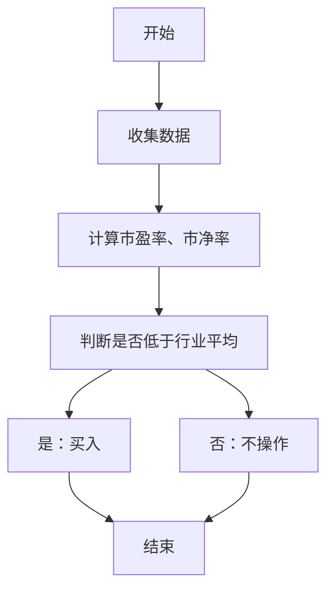
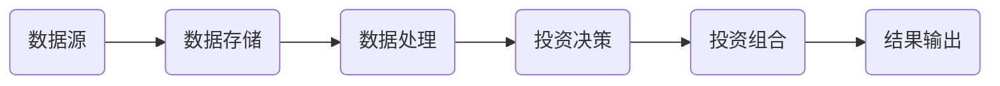

                 


# 如何利用特价股票策略构建未来科技伦理与治理主题基金

## 关键词：特价股票策略、科技伦理、主题基金、量化交易、投资策略、金融创新、风险管理

## 摘要：随着科技的快速发展，科技伦理与治理的重要性日益凸显。本文将探讨如何利用特价股票策略构建未来科技伦理与治理主题基金，通过量化交易和人工智能技术，识别具有长期投资价值的科技公司，同时确保投资行为符合伦理标准。文章将详细分析策略原理、系统架构设计，并提供实际案例和代码实现。

---

## 第一章：背景介绍

### 1.1 特价股票策略的核心概念

#### 1.1.1 特价股票策略的定义与特点
- **定义**：特价股票策略是指在特定市场条件下，以低于内在价值的价格买入股票的投资策略。
- **特点**：
  - 高性价比：寻找被市场低估的股票。
  - 长期价值：关注公司的长期增长潜力。
  - 风险控制：通过低估值减少市场波动的影响。

#### 1.1.2 科技领域的投资机会
- 科技行业的高增长潜力。
- 技术创新带来的投资机会。
- 科技公司对伦理和治理的关注日益增加。

### 1.2 科技伦理与治理主题基金的背景

#### 1.2.1 科技伦理与治理主题基金的定义
- **定义**：投资于那些在科技伦理和治理方面表现优秀的公司或项目。
- **目标**：通过投资促进科技行业的可持续发展和伦理合规。

#### 1.2.2 科技伦理与治理主题基金的特点
- **社会影响力**：投资于具有社会责任感的公司。
- **长期价值**：关注公司的长期治理结构和伦理表现。
- **创新性**：结合科技与伦理，推动行业进步。

### 1.3 特价股票策略与科技伦理治理主题基金的结合

#### 1.3.1 结合的必要性
- 科技伦理与治理主题基金需要高效的投资策略。
- 特价股票策略能够降低投资成本，提高回报率。

#### 1.3.2 结合的方式
- 通过量化模型筛选符合科技伦理标准的低价股票。
- 结合市场趋势和公司基本面进行投资决策。

---

## 第二章：核心概念与联系

### 2.1 特价股票策略的原理

#### 2.1.1 基本原理
- 基于价值投资理念，寻找被低估的股票。
- 通过技术指标和财务指标分析，判断股票的买卖时机。

#### 2.1.2 算法流程
- 数据收集：获取目标股票的历史价格、财务数据。
- 数据分析：计算市盈率、市净率等指标，识别低估股票。
- 投资决策：根据模型输出信号，进行买入或卖出操作。

### 2.2 科技伦理与治理主题基金的原理

#### 2.2.1 评估标准
- 公司治理结构是否透明。
- 业务是否符合伦理规范。
- 是否积极参与社会责任项目。

#### 2.2.2 评估流程
- 数据收集：收集公司治理、伦理表现的相关数据。
- 评分系统：根据评分标准对目标公司进行评分。
- 投资决策：选择高评分的公司构建投资组合。

### 2.3 特价股票策略与科技伦理治理主题基金的联系

#### 2.3.1 联系点
- 都注重长期价值。
- 都依赖于数据驱动的决策。
- 都关注公司的基本面和外部环境。

#### 2.3.2 对比分析
| 特性               | 特价股票策略                | 科技伦理治理主题基金          |
|--------------------|-----------------------------|-----------------------------|
| 投资目标           | 寻找低价股票               | 投资符合伦理标准的公司        |
| 评估标准           | 市盈率、市净率等            | 公司治理、伦理表现            |
| 投资策略           | 价值投资、量化交易          | 主动筛选、评分系统             |

---

## 第三章：算法原理讲解

### 3.1 特价股票策略的数学模型

#### 3.1.1 市盈率模型
$$ \text{市盈率} = \frac{\text{股价}}{\text{每股收益}} $$

#### 3.1.2 市净率模型
$$ \text{市净率} = \frac{\text{股价}}{\text{每股净资产}} $$

#### 3.1.3 投资决策模型
$$ \text{投资信号} = \begin{cases} 
\text{买入} & \text{如果市盈率 < 行业平均市盈率} \\
\text{卖出} & \text{否则} 
\end{cases} $$

### 3.2 特价股票策略的算法流程



---

## 第四章：系统分析与架构设计方案

### 4.1 系统功能设计

#### 4.1.1 功能模块划分
- 数据收集模块：收集股票数据和公司治理数据。
- 数据分析模块：计算估值指标，评估公司治理。
- 投资决策模块：根据模型生成投资信号。
- 投资组合管理模块：优化投资组合，进行风险控制。

### 4.2 系统架构设计



---

## 第五章：项目实战

### 5.1 环境安装

- Python 3.8+
- Jupyter Notebook
- Pandas、NumPy、Scikit-learn

### 5.2 核心代码实现

#### 5.2.1 数据收集
```python
import pandas as pd
import requests

url = "https://api.example.com/stock_data"
data = requests.get(url).json()
df = pd.DataFrame(data)
```

#### 5.2.2 数据分析
```python
def calculate_value_indicators(df):
    df['市盈率'] = df['股价'] / df['每股收益']
    df['市净率'] = df['股价'] / df['每股净资产']
    return df

df = calculate_value_indicators(df)
```

#### 5.2.3 投资决策
```python
from sklearn.preprocessing import LabelEncoder

encoder = LabelEncoder()
encoded_data = encoder.fit_transform(df['行业'])
df['行业编码'] = encoded_data

# 判断是否低于行业平均
df['投资信号'] = df['市盈率'] < df['行业平均市盈率']
```

---

## 第六章：最佳实践与注意事项

### 6.1 最佳实践
- 定期回顾投资组合，进行调整。
- 关注市场变化，及时更新数据。
- 结合多种策略，降低投资风险。

### 6.2 小结
通过结合特价股票策略和科技伦理与治理主题基金，可以在实现投资收益的同时，推动科技行业的可持续发展。

### 6.3 注意事项
- 风险管理：控制仓位，避免过度集中。
- 数据质量：确保数据来源可靠。
- 法律合规：遵守相关法律法规。

### 6.4 拓展阅读
- 《量化交易实战指南》
- 《科技伦理与投资策略》

---

## 作者：AI天才研究院 & 禅与计算机程序设计艺术

---

希望这篇文章能够为读者提供有价值的见解，并帮助他们理解如何利用特价股票策略构建未来科技伦理与治理主题基金。

