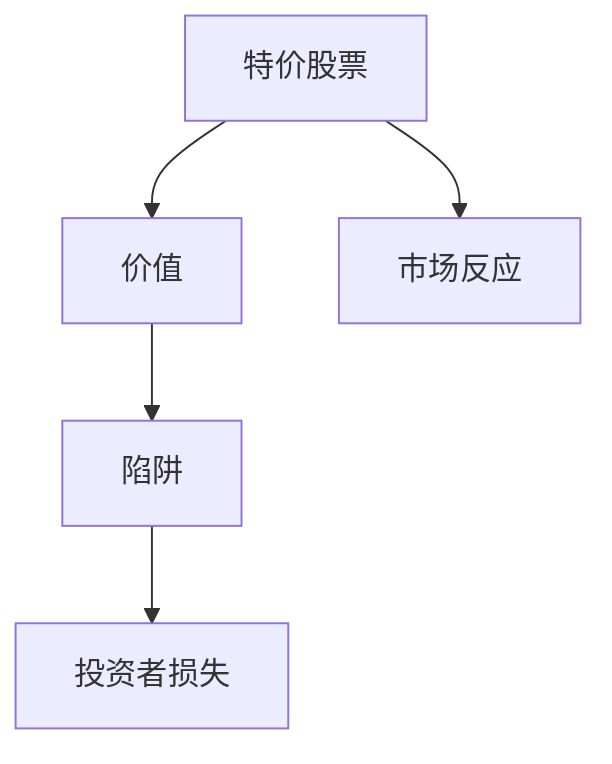
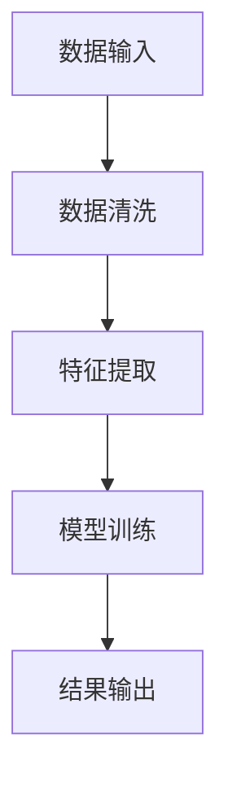
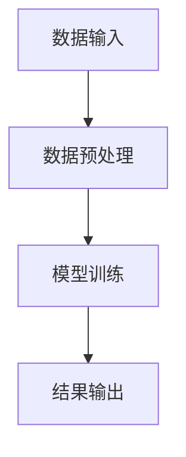
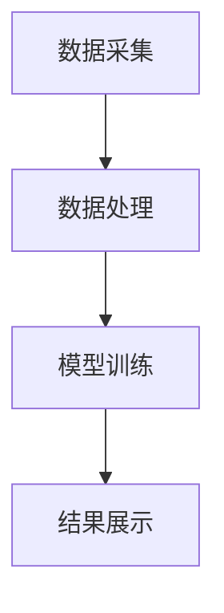
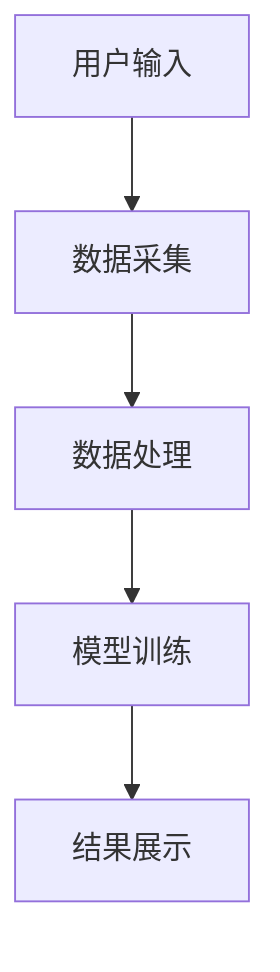

                 


# 如何利用特价股票策略进行价值陷阱规避

> **关键词**：特价股票、价值陷阱、投资策略、风险管理、数据分析、股票筛选算法  
> **摘要**：本文详细探讨如何利用特价股票策略规避价值陷阱，从背景介绍、核心概念、算法原理到系统架构、项目实战及最佳实践，全面解析如何在股票投资中识别特价股票，避免价值陷阱，提升投资效率和收益。

---

## 第1章: 特价股票策略的背景与概念

### 1.1 特价股票的定义与特点

#### 1.1.1 特价股票的定义
特价股票是指在特定市场条件下，由于某种原因导致股票价格低于其实际价值的股票。这种价格优势通常吸引投资者，但同时也伴随着较高的风险。

#### 1.1.2 特价股票的核心特点
- **低估值**：市场价格低于内在价值。
- **短期波动**：通常由市场情绪或短期事件引发。
- **潜在机会**：价格恢复后可能带来丰厚收益。

#### 1.1.3 特价股票与普通股票的区别
| 特性       | 特价股票                 | 普通股票                 |
|------------|--------------------------|--------------------------|
| 价格       | 低于市场价               | 接近市场价               |
| 风险       | 较高                     | 较低                     |
| 投资逻辑   | 价值回归驱动             | 市场趋势驱动             |

### 1.2 价值陷阱的定义与特征

#### 1.2.1 价值陷阱的定义
价值陷阱是指股票价格看似低于其实际价值，但实际上由于公司基本面恶化或行业环境变化，价格无法恢复，导致投资者损失。

#### 1.2.2 价值陷阱的主要特征
- **虚假低估值**：价格低但公司基本面差。
- **高风险**：公司可能面临破产或持续亏损。
- **市场误判**：投资者误将价值陷阱误认为特价股票。

#### 1.2.3 价值陷阱与价值投资的区别
| 特性       | 价值陷阱               | 价值投资               |
|------------|-------------------------|-------------------------|
| 投资逻辑   | 价格低于市场价但公司差 | 公司基本面优秀，价格合理 |
| 风险       | 高                     | 中                     |
| 投资结果   | 可能亏损               | 可能盈利               |

### 1.3 特价股票策略的必要性

#### 1.3.1 为什么需要避免价值陷阱
- **保护投资本金**：避免因误判导致的重大损失。
- **提高投资效率**：通过筛选避免低效投资。

#### 1.3.2 特价股票策略的潜在优势
- **高收益潜力**：价格恢复带来的收益。
- **低门槛**：适合中小投资者。

#### 1.3.3 特价股票策略的适用场景
- **市场低迷期**：大量特价股票出现。
- **行业调整期**：部分行业公司因短期问题被市场低估。

---

## 第2章: 特价股票策略的核心概念与联系

### 2.1 特价股票策略的核心原理

#### 2.1.1 特价股票的识别方法
- **基本面分析**：评估公司财务状况和行业地位。
- **技术分析**：通过K线图识别短期超跌股。

#### 2.1.2 价值陷阱的识别方法
- **财务指标分析**：关注ROE、毛利率等关键指标。
- **行业环境分析**：评估行业发展趋势。

#### 2.1.3 特价股票与价值陷阱的关系
- **特价股票是潜在机会**，但需区分价值陷阱。

### 2.2 特价股票与价值陷阱的对比分析

#### 2.2.1 特价股票与价值陷阱的属性对比
| 特性       | 特价股票                 | 价值陷阱               |
|------------|--------------------------|--------------------------|
| 公司价值   | 内在价值高于市场价格     | 内在价值低于市场价格     |
| 市场反应   | 可能回升                 | 难以回升               |
| 投资风险   | 中等                     | 高                     |

#### 2.2.2 价值陷阱的ER实体关系图


---

## 第3章: 特价股票策略的算法原理

### 3.1 特价股票筛选算法

#### 3.1.1 算法原理
- **数据输入**：获取股票数据。
- **数据清洗**：剔除无效数据。
- **特征提取**：提取市盈率、市净率等关键指标。
- **模型训练**：基于历史数据训练分类模型。

#### 3.1.2 算法实现


#### 3.1.3 算法的数学模型
股票价格评估公式：
$$ \text{评估价值} = \text{市盈率} \times \text{净利润} $$

### 3.2 价值陷阱识别算法

#### 3.2.1 算法原理
- **输入数据**：股票价格、财务指标。
- **数据预处理**：标准化处理。
- **模型训练**：基于财务指标和市场表现训练分类模型。
- **结果输出**：识别价值陷阱。

#### 3.2.2 算法实现


---

## 第4章: 特价股票策略的系统架构

### 4.1 系统架构设计

#### 4.1.1 系统功能设计
- **数据采集**：从API获取实时数据。
- **数据处理**：清洗和特征提取。
- **模型训练**：基于机器学习算法训练模型。
- **结果展示**：生成可视化报告。

#### 4.1.2 系统架构图


### 4.2 系统接口设计

#### 4.2.1 数据接口设计
- **输入接口**：股票代码、时间范围。
- **输出接口**：评估价值、是否为特价股票。

#### 4.2.2 系统交互图


---

## 第5章: 特价股票策略的项目实战

### 5.1 项目环境安装

#### 5.1.1 安装Python
- 使用Anaconda安装Python 3.8以上版本。

#### 5.1.2 安装依赖库
- `pip install pandas numpy scikit-learn`

### 5.2 核心代码实现

#### 5.2.1 数据获取
```python
import pandas as pd
import numpy as np

def get_stock_data(tickers):
    # 示例代码，实际应调用API获取数据
    return pd.DataFrame()
```

#### 5.2.2 特价股票筛选
```python
def screen_cheap_stocks(data):
    # 示例代码，实际应根据具体指标筛选
    return data[data['市盈率'] < data['市盈率'].mean()]
```

### 5.3 实际案例分析

#### 5.3.1 案例背景
假设市场中有多只股票，部分为特价股票，部分为价值陷阱。

#### 5.3.2 数据分析与结果
- 筛选出的特价股票可能包括一些潜在机会，但也可能包含价值陷阱。

### 5.4 结果分析与优化

#### 5.4.1 结果分析
- 成功筛选出部分特价股票。
- 需进一步分析以区分价值陷阱。

#### 5.4.2 优化建议
- 结合更多财务指标进行分析。
- 定期更新模型。

---

## 第6章: 特价股票策略的最佳实践

### 6.1 投资策略建议

#### 6.1.1 长期投资策略
- 选择基本面良好的公司。
- 长期持有，等待价值回归。

#### 6.1.2 短期投资策略
- 短期内关注技术指标。
- 快速进出，锁定收益。

### 6.2 风险管理技巧

#### 6.2.1 分散投资
- 不将所有资金投入单一股票。
- 降低风险。

#### 6.2.2 设置止损
- 设置止损点，避免重大损失。

### 6.3 小结与注意事项

#### 6.3.1 小结
- 特价股票策略需要结合基本面和技术分析。
- 需警惕价值陷阱。

#### 6.3.2 注意事项
- 定期更新模型。
- 避免过度依赖单一指标。

---

## 第7章: 总结与展望

### 7.1 总结
- 特价股票策略是有效的投资工具。
- 需谨慎识别价值陷阱。

### 7.2 展望
- 结合人工智能技术优化模型。
- 开发更多策略应对市场变化。

---

## 作者：AI天才研究院/AI Genius Institute & 禅与计算机程序设计艺术 /Zen And The Art of Computer Programming

