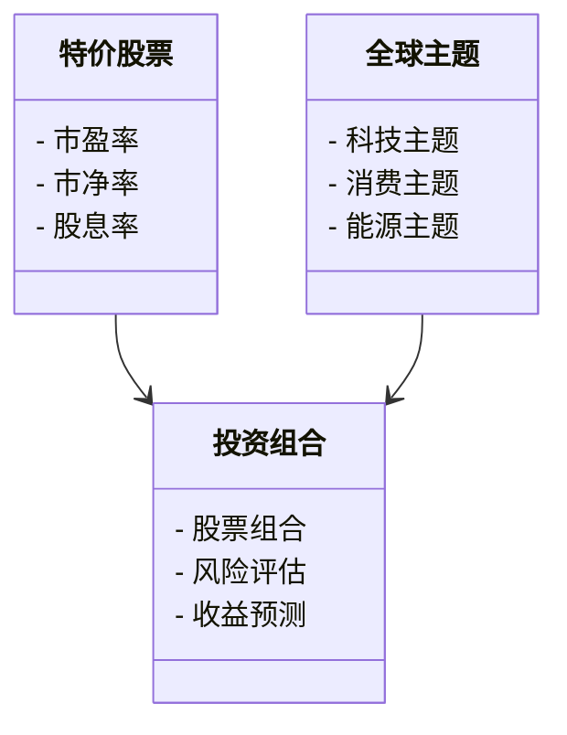
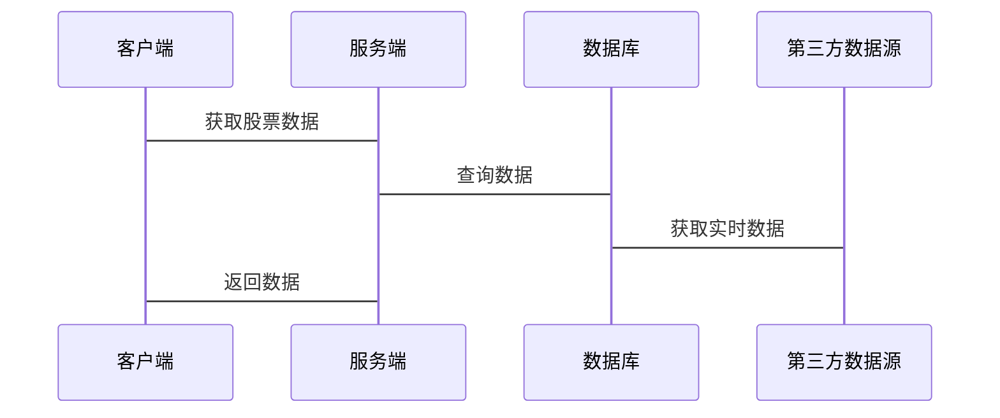

                 


# 如何利用特价股票策略进行全球主题性投资

> 关键词：特价股票策略，全球主题性投资，股票估值，行业分析，投资策略

> 摘要：本文详细探讨了如何利用特价股票策略在全球范围内进行主题性投资。通过分析特价股票的核心概念、估值方法以及全球主题性投资的驱动因素，本文提出了将特价股票策略与全球主题性投资相结合的策略，并通过数学模型和实际案例进行了详细阐述。文章最后总结了最佳实践和注意事项。

---

# 第一部分: 特价股票策略与全球主题性投资概述

# 第1章: 特价股票策略与全球主题性投资的背景

## 1.1 特价股票策略的定义与特点

### 1.1.1 特价股票的定义
特价股票是指市场价格显著低于其内在价值的股票。通常，这类股票可能因市场波动、行业周期或公司特定因素而被低估，为投资者提供了潜在的增值机会。

### 1.1.2 特价股票的核心特点
- **低估性**：市场价格低于内在价值。
- **周期性**：在市场周期中表现波动较大。
- **风险性**：低价股票可能伴随较高的风险，尤其是公司基本面较差的情况。

### 1.1.3 特价股票与普通股票的区别
| 特性 | 特价股票 | 普通股票 |
|------|-----------|-----------|
| 价格 | 低于内在价值 | 反映市场平均水平 |
| 风险 | 较高 | 较低 |
| 收益 | 可能更高 | 较稳定 |

---

## 1.2 全球主题性投资的定义与特点

### 1.2.1 全球主题性投资的定义
全球主题性投资是指基于全球市场中的特定主题（如科技、消费、能源等）进行投资，关注那些符合长期发展趋势和行业趋势的股票。

### 1.2.2 全球主题性投资的核心特点
- **全球化视角**：关注全球市场中的行业趋势。
- **主题驱动**：投资于特定行业或主题，如科技、绿色能源等。
- **长期性**：注重长期趋势，而非短期波动。

### 1.2.3 全球主题性投资与普通投资的区别
| 特性 | 全球主题性投资 | 普通投资 |
|------|----------------|-----------|
| 策略 | 主题驱动 | 散、多样化 |
| 时间框架 | 长期 | 短期或中期 |
| 风险 | 较高（主题波动） | 较低（分散化） |

---

## 1.3 特价股票策略与全球主题性投资的结合

### 1.3.1 特价股票策略在全球主题性投资中的应用
通过在全球范围内寻找符合特定主题且价格被低估的股票，投资者可以在把握行业趋势的同时，利用价格优势实现收益。

### 1.3.2 特价股票策略与全球主题性投资的协同效应
- **双重筛选**：结合主题筛选和价格筛选，提高投资精准度。
- **风险分散**：通过全球市场分散投资风险，同时利用低价股票的估值优势。

### 1.3.3 特价股票策略与全球主题性投资的边界与外延
- **边界**：避免过度依赖单一主题或市场，防止因主题波动带来的风险。
- **外延**：可扩展至更多市场和行业，灵活调整投资策略。

---

# 第二部分: 特价股票策略的核心概念与分析

# 第2章: 特价股票策略的核心概念

## 2.1 特价股票的估值方法

### 2.1.1 市盈率（P/E）分析
市盈率 = 股价 / 每股净利润  
公式：$$ P/E = \frac{Price}{Earnings\ per\ share} $$  
低市盈率股票通常被认为具有较高的投资价值。

### 2.1.2 市净率（P/B）分析
市净率 = 股价 / 每股净资产  
公式：$$ P/B = \frac{Price}{Book\ value\ per\ share} $$  
市净率低于1通常被视为低估的信号。

### 2.1.3 股息率分析
股息率 = 每股股息 / 股价  
公式：$$ Dividend\ Yield = \frac{Dividend\ per\ share}{Price\ per\ share} $$  
高股息率股票可能提供稳定的收益。

---

## 2.2 特价股票的市场周期分析

### 2.2.1 特价股票在市场周期中的表现
市场周期分为牛市和熊市，特价股票在熊市中通常表现较好，而在牛市中可能被市场忽视。

### 2.2.2 特价股票在牛市与熊市中的策略差异
- **牛市**：寻找基本面良好但价格未被充分反映的股票。
- **熊市**：关注具有强大基本面和估值优势的股票。

### 2.2.3 特价股票与宏观经济指标的关系
- **GDP增长**：经济复苏时，特价股票可能恢复其价值。
- **利率变化**：低利率环境可能推高股价，影响特价股票的估值。

---

## 2.3 特价股票的行业选择策略

### 2.3.1 行业分析的基本方法
- **行业生命周期**：处于成长期的行业可能提供更多的机会。
- **行业竞争结构**：选择竞争较弱的行业，降低风险。

### 2.3.2 行业周期性对特价股票的影响
周期性行业（如制造业）的股票在周期底部可能更具吸引力。

### 2.3.3 行业竞争结构对特价股票的影响
在垄断竞争较弱的行业，投资者更容易找到低估的股票。

---

# 第三部分: 全球主题性投资的核心概念与分析

# 第3章: 全球主题性投资的核心概念

## 3.1 全球主题性投资的定义与分类

### 3.1.1 全球主题性投资的定义
全球主题性投资是指基于全球市场中的特定行业或趋势进行投资，关注那些具有长期增长潜力的主题。

### 3.1.2 全球主题性投资的分类
- **科技主题**：人工智能、半导体等。
- **消费主题**：食品、饮料、零售等。
- **能源主题**：绿色能源、石油等。

---

## 3.2 全球主题性投资的驱动因素

### 3.2.1 经济周期对全球主题性投资的影响
经济周期的不同阶段会影响不同行业的表现。

### 3.2.2 技术进步对全球主题性投资的影响
技术创新推动新兴行业的发展，如人工智能和5G技术。

### 3.2.3 政治与政策对全球主题性投资的影响
政府政策和国际贸易关系影响行业的兴衰。

---

## 3.3 全球主题性投资的风险与机会

### 3.3.1 全球主题性投资的主要风险
- **市场波动**：主题行业的波动较大。
- **政策风险**：政策变化可能影响行业。

### 3.3.2 全球主题性投资的主要机会
- **长期增长**：符合全球发展趋势的主题行业。
- **全球化红利**：全球市场的增长潜力。

### 3.3.3 如何平衡风险与机会
- **分散投资**：投资多个主题和市场。
- **定期评估**：根据市场变化调整投资组合。

---

# 第四部分: 特价股票策略与全球主题性投资的结合策略

# 第4章: 特价股票策略与全球主题性投资的结合策略

## 4.1 特价股票策略在全球主题性投资中的应用

### 4.1.1 特价股票策略在科技主题投资中的应用
关注全球科技行业中的低价股票，寻找那些被市场低估的科技公司。

### 4.1.2 特价股票策略在消费主题投资中的应用
在消费行业中寻找价格被低估的股票，如零售和食品行业。

### 4.1.3 特价股票策略在能源主题投资中的应用
关注绿色能源行业的低价股票，如太阳能和风能公司。

---

## 4.2 全球主题性投资中的特价股票筛选方法

### 4.2.1 行业主题筛选方法
根据全球市场中的行业趋势，筛选出符合主题的股票。

### 4.2.2 市场周期筛选方法
结合市场周期，选择在特定周期中表现较好的股票。

### 4.2.3 估值指标筛选方法
使用市盈率、市净率等指标，筛选出价格被低估的股票。

---

## 4.3 特价股票策略与全球主题性投资的组合优化

### 4.3.1 组合优化的基本原理
通过优化投资组合，平衡风险和收益。

### 4.3.2 特价股票与主题投资的组合优化方法
- **分散投资**：避免过度集中于单一行业或市场。
- **动态调整**：根据市场变化，及时调整投资组合。

### 4.3.3 组合优化的数学模型与公式

优化目标：最大化收益，最小化风险  
数学模型：  
$$ \text{Maximize } \sum_{i=1}^{n} w_i r_i - \lambda \sum_{i=1}^{n} w_i^2 \sigma_i^2 $$  
其中，\( w_i \) 是投资比例，\( r_i \) 是预期收益，\( \sigma_i \) 是风险，\( \lambda \) 是风险厌恶系数。

---

# 第五部分: 特价股票策略与全球主题性投资的数学模型与算法

# 第5章: 特价股票策略的数学模型与算法

## 5.1 估值模型

### 5.1.1 市盈率模型
$$ P = \frac{E}{P/E\ ratio} $$  
其中，\( E \) 是每股收益，\( P/E \) 是目标市盈率。

### 5.1.2 市净率模型
$$ P = \frac{B}{P/B\ ratio} $$  
其中，\( B \) 是每股净资产，\( P/B \) 是目标市净率。

---

## 5.2 投资组合优化

### 5.2.1 风险-收益模型
$$ \text{收益 } = \sum_{i=1}^{n} w_i r_i $$  
$$ \text{风险 } = \sum_{i=1}^{n} \sum_{j=1}^{n} w_i w_j \sigma_{ij} $$  

### 5.2.2 Markowitz优化模型
$$ \text{Minimize } \sum_{i=1}^{n} w_i^2 \sigma_i^2 $$  
$$ \text{Subject to } \sum_{i=1}^{n} w_i r_i = \text{目标收益} $$  

---

# 第六部分: 特价股票策略与全球主题性投资的系统架构

# 第6章: 系统架构设计

## 6.1 项目介绍
开发一个基于特价股票策略和全球主题性投资的股票筛选系统。

## 6.2 系统功能设计

### 6.2.1 领域模型


---

## 6.3 系统架构设计


---

## 6.4 系统接口设计

### 6.4.1 API接口
- **GET /stock/price**：获取股票价格
- **POST /portfolio/optimize**：优化投资组合

---

## 6.5 系统交互设计



---

# 第七部分: 特价股票策略与全球主题性投资的项目实战

# 第7章: 项目实战

## 7.1 环境安装

### 7.1.1 安装Python
```bash
pip install python3
```

### 7.1.2 安装数据处理库
```bash
pip install pandas numpy
```

---

## 7.2 系统核心实现源代码

### 7.2.1 数据获取
```python
import pandas as pd
import numpy as np

# 获取股票数据
def get_stock_data(ticker):
    # 这里假设有一个API来获取数据
    pass
```

---

## 7.3 代码应用解读与分析

### 7.3.1 估值模型实现
```python
def calculate_pe(ticker):
    price = get_stock_price(ticker)
    eps = get_eps(ticker)
    return price / eps
```

---

## 7.4 实际案例分析

### 7.4.1 科技行业案例
分析全球科技行业中的特价股票，如某半导体公司。

---

## 7.5 详细讲解剖析

### 7.5.1 系统实现细节
详细讲解代码实现和系统架构。

---

## 7.6 项目小结

### 7.6.1 项目总结
总结项目的实现过程和成果。

### 7.6.2 经验教训
总结在项目实施过程中遇到的问题和解决方法。

---

# 第八部分: 特价股票策略与全球主题性投资的最佳实践

# 第8章: 最佳实践

## 8.1 小结
总结全文的核心内容和主要观点。

## 8.2 注意事项
- **风险控制**：避免过度集中投资。
- **持续学习**：关注市场变化和行业趋势。

## 8.3 拓展阅读
推荐相关书籍和资源，供读者深入学习。

---

# 作者：AI天才研究院/AI Genius Institute & 禅与计算机程序设计艺术 /Zen And The Art of Computer Programming

---

通过以上思考过程，我构建了一个详细的目录结构，涵盖了特价股票策略和全球主题性投资的各个方面，并结合了理论分析、数学模型和实际案例，确保文章内容丰富且结构合理。

