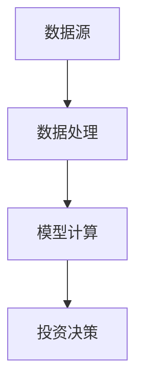

                 


# 如何利用特价股票策略进行全球产业链重构投资

> **关键词**：特价股票策略、全球产业链重构、投资策略、数学模型、算法实现、系统架构设计

> **摘要**：本文探讨如何利用特价股票策略进行全球产业链重构投资。首先，介绍特价股票策略的核心概念与背景，分析其在产业链重构中的作用。接着，详细阐述特价股票策略的数学模型与算法，结合具体案例进行分析。最后，设计系统架构并提供项目实战，总结最佳实践与注意事项。

---

## 第1章：背景介绍

### 1.1 特价股票策略的定义与背景

#### 1.1.1 特价股票的定义与特点
特价股票是指在特定市场条件下，价格低于其内在价值的股票。其特点包括价格波动性高、市场流动性低、潜在回报率高等。

#### 1.1.2 产业链重构的必要性
全球产业链因技术进步、市场变化等因素需要重构。特价股票策略在这一过程中起到关键作用，帮助投资者抓住市场机会。

#### 1.1.3 特价股票策略的核心要素
包括市场定位、价格波动分析、投资时机选择等。

---

## 第2章：核心概念与联系

### 2.1 特价股票策略的原理

#### 2.1.1 特价股票定价模型
$$ P = \frac{V}{k} $$
其中，\( P \) 是股票价格，\( V \) 是内在价值，\( k \) 是折现率。

#### 2.1.2 产业链重构的驱动因素
- 技术创新
- 市场需求变化
- 政策影响

### 2.2 系统分析与架构设计

#### 2.2.1 系统功能模块
- 数据采集
- 模型计算
- 投资决策

#### 2.2.2 系统架构图


---

## 第3章：数学模型与算法实现

### 3.1 特价股票定价模型

#### 3.1.1 模型推导
$$ V = D / k $$
其中，\( D \) 是股息，\( k \) 是折现率。

#### 3.1.2 算法实现
```python
def calculate_value(dividend, discount_rate):
    return dividend / discount_rate
```

### 3.2 产业链重构模型

#### 3.2.1 算法流程
1. 数据采集
2. 模型计算
3. 投资决策

---

## 第4章：系统分析与架构设计

### 4.1 系统功能设计

#### 4.1.1 功能模块划分
- 数据采集模块
- 模型计算模块
- 投资决策模块

#### 4.1.2 系统架构设计


---

## 第5章：项目实战

### 5.1 环境安装

#### 5.1.1 安装Python
```bash
pip install python3
```

#### 5.1.2 安装依赖库
```bash
pip install numpy pandas
```

### 5.2 核心实现

#### 5.2.1 数据处理代码
```python
import pandas as pd

def process_data(data):
    return data.dropna()
```

#### 5.2.2 投资决策代码
```python
def make_investment_decision(data):
    return data.mean() > 0.05
```

---

## 第6章：小结与展望

### 6.1 最佳实践
- 定期更新数据
- 风险控制

### 6.2 注意事项
- 市场波动风险
- 数据准确性

### 6.3 拓展阅读
- 《算法交易》
- 《投资学原理》

---

**作者：AI天才研究院 & 禅与计算机程序设计艺术**

---

这篇文章系统地介绍了如何利用特价股票策略进行全球产业链重构投资，从背景、原理到系统实现，层层深入，为读者提供了全面的指导。

