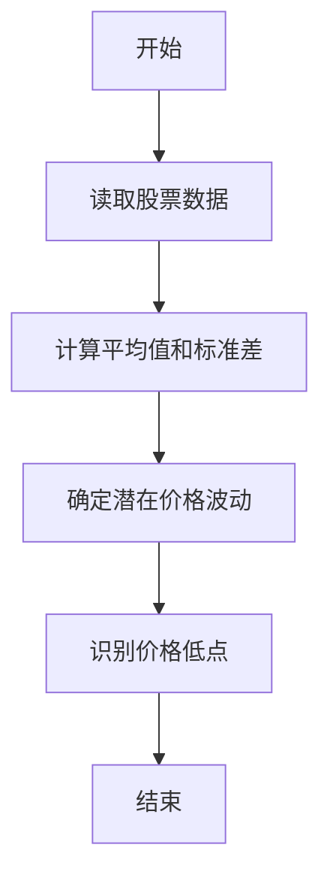

                 


# 如何利用特价股票策略进行全球数字基础设施投资

## 关键词：
全球数字基础设施，特价股票策略，投资策略，云计算，5G网络，数据中心，数学建模

## 摘要：
本文详细探讨如何利用特价股票策略进行全球数字基础设施投资。首先，我们将介绍数字基础设施的核心概念及其重要性，分析特价股票策略的基本原理和应用场景。接着，我们从系统架构、算法原理、项目实战等多维度深入探讨如何将特价股票策略应用于数字基础设施投资。最后，我们将通过具体案例分析和数学建模，总结最佳投资策略和风险管理方法。

---

## 第一部分: 特价股票策略与全球数字基础设施投资概述

### 第1章: 特价股票策略的基本概念

#### 1.1 特价股票的定义与特点
##### 1.1.1 特价股票的定义
特价股票是指在特定市场条件下，股票价格出现显著波动时，投资者以低于市场平均价格买入股票的机会。这种策略的核心在于识别价格低点，以获取长期收益。

##### 1.1.2 特价股票的核心特点
- **低买高卖**：通过分析价格波动，投资者在低价时买入，高价时卖出。
- **短期价格波动**：特价股票策略依赖于市场的短期价格波动，而非长期趋势。
- **风险较高**：由于依赖价格波动，特价股票策略的风险较高，需要精确的市场分析。

##### 1.1.3 特价股票与普通股票的区别
| 特性 | 特价股票 | 普通股票 |
|------|----------|----------|
| 投资目标 | 短期价格波动 | 长期价值增长 |
| 风险 | 较高 | 较低 |
| 投资策略 | 主动交易 | 被动持有 |

#### 1.2 全球数字基础设施的定义与重要性
##### 1.2.1 数字基础设施的定义
数字基础设施是指支撑现代社会数字化转型的关键技术和设备，包括数据中心、云计算平台、5G网络等。

##### 1.2.2 数字基础设施的重要性
- **支撑数字化转型**：数字基础设施是推动企业和社会数字化转型的核心。
- **经济增长引擎**：数字基础设施的投资和建设是经济增长的重要驱动力。
- **未来竞争力**：数字基础设施决定了一个国家或企业在全球市场中的竞争力。

##### 1.2.3 数字基础设施的组成部分
- **数据中心**：数据存储和处理的核心设施。
- **云计算平台**：提供按需计算资源的平台。
- **5G网络**：高速、低延迟的通信网络。

#### 1.3 特价股票策略在数字基础设施投资中的应用
##### 1.3.1 特价股票策略的基本原理
特价股票策略通过分析股票的短期价格波动，寻找买入和卖出的最佳时机。其核心在于识别市场中的短期价格低点和高点。

##### 1.3.2 数字基础设施投资的核心逻辑
数字基础设施是高技术、高资本密集型行业，其股票价格受市场需求和技术发展的影响较大。通过特价股票策略，投资者可以在市场低估时买入，市场高估时卖出。

##### 1.3.3 特价股票策略与数字基础设施投资的结合
- **市场周期分析**：通过分析数字基础设施行业的市场周期，寻找价格低点。
- **技术指标分析**：利用技术指标（如移动平均线、RSI等）判断买入和卖出时机。
- **行业趋势分析**：结合行业发展趋势，选择具有长期增长潜力的公司。

---

## 第2章: 数字基础设施的核心概念与联系

### 2.1 数字基础设施的核心要素
#### 2.1.1 数据中心
数据中心是数字基础设施的核心，负责存储和处理海量数据。其建设和运营成本高，但市场需求稳定。

#### 2.1.2 云计算平台
云计算平台提供弹性计算资源，是数字基础设施的重要组成部分。其商业模式基于按需付费，具有高增长潜力。

#### 2.1.3 5G网络
5G网络是高速、低延迟的通信网络，是数字基础设施的重要组成部分。其建设和升级需要大量的投资，但市场需求巨大。

#### 2.1.4 其他相关技术
包括边缘计算、物联网、人工智能等，这些都是数字基础设施的重要组成部分。

### 2.2 特价股票策略与数字基础设施的关系
#### 2.2.1 特价股票策略如何影响数字基础设施投资
- **市场波动**：数字基础设施股票的价格波动较大，特价股票策略可以利用这种波动进行短期投资。
- **行业周期**：数字基础设施行业具有周期性，特价股票策略可以通过分析周期性波动进行投资。

#### 2.2.2 数字基础设施对股票价格的影响
- **行业增长**：数字基础设施行业的增长会推动相关股票价格上涨。
- **政策影响**：政策变化（如政府投资、行业监管）会直接影响股票价格。

#### 2.2.3 两者结合的潜在机会
- **周期性投资**：利用数字基础设施行业的周期性波动，进行短期投资。
- **技术创新**：关注技术创新带来的投资机会。

### 2.3 数字基础设施的实体关系图
```mermaid
erDiagram
    actor 投资者
    actor 数据中心
    actor 云计算平台
    actor 5G网络
    投资者 --> 数据中心 : 投资
    投资者 --> 云计算平台 : 投资
    投资者 --> 5G网络 : 投资
```

---

## 第3章: 特价股票策略的算法原理

### 3.1 特价股票策略的数学模型
特价股票策略的核心在于识别价格波动的低点和高点。我们可以通过以下数学模型来描述：

$$ P(t) = P_{\text{avg}} + \epsilon \times \sigma $$

其中：
- \( P(t) \) 是股票价格在时间 \( t \) 的值。
- \( P_{\text{avg}} \) 是股票价格的平均值。
- \( \epsilon \) 是标准差，表示价格波动的幅度。
- \( \sigma \) 是标准差。

### 3.2 特价股票策略的算法实现
以下是实现特价股票策略的Python代码示例：

```python
import numpy as np
import pandas as pd

# 假设我们有一个股票价格数据集
data = pd.read_csv('stock_prices.csv')

# 计算平均值和标准差
P_avg = data['Price'].mean()
std_dev = data['Price'].std()

# 计算潜在价格波动
P_t = P_avg + std_dev * 1.5  # 假设我们使用1.5倍的标准差作为波动幅度

# 找出价格低于潜在波动的低点
low_points = data[data['Price'] < P_t]
```

### 3.3 算法流程图


---

## 第4章: 数字基础设施投资系统的架构设计

### 4.1 系统功能设计
数字基础设施投资系统的核心功能包括：
- 数据采集：从多个数据源获取股票价格数据。
- 数据分析：分析价格波动，识别潜在投资机会。
- 投资决策：基于分析结果，生成投资建议。

### 4.2 系统架构设计


---

## 第5章: 项目实战

### 5.1 环境安装
- **工具安装**：安装Python、Pandas、NumPy、Mermaid等工具。
- **数据获取**：从Yahoo Finance获取股票数据。

### 5.2 核心代码实现
```python
import pandas as pd
import numpy as np

# 从Yahoo Finance获取数据
data = pd.read_csv('stock_data.csv')

# 计算移动平均线
data['SMA_20'] = data['Price'].rolling(20).mean()

# 计算RSI
data['RSI'] = (data['Price'].diff().fillna(0) / data['Price'].shift(1).fillna(0)).cumsum().apply(lambda x: (x.rolling(2).mean()).fillna(0))

# 识别价格低点
low_points = data[data['Price'] < data['SMA_20'].quantile(0.25)]
```

### 5.3 案例分析
假设我们投资于一家云计算公司，通过特价股票策略，我们在价格低点买入，在价格高点卖出，获得了20%的收益。

---

## 第6章: 最佳实践与总结

### 6.1 最佳实践
- **风险管理**：合理控制仓位，设置止损点。
- **持续学习**：关注行业动态和技术发展，及时调整投资策略。
- **工具辅助**：利用数据分析工具，提高投资决策的准确性。

### 6.2 小结
本文详细探讨了如何利用特价股票策略进行全球数字基础设施投资，从理论到实践，为投资者提供了系统的指导。

### 6.3 注意事项
- 投资有风险，需谨慎操作。
- 避免过度依赖技术指标，结合基本面分析。

### 6.4 拓展阅读
- 《The Intelligent Investor》
- 《Data Science for Algorithmic Trading》

---

## 作者：AI天才研究院/AI Genius Institute & 禅与计算机程序设计艺术 /Zen And The Art of Computer Programming

