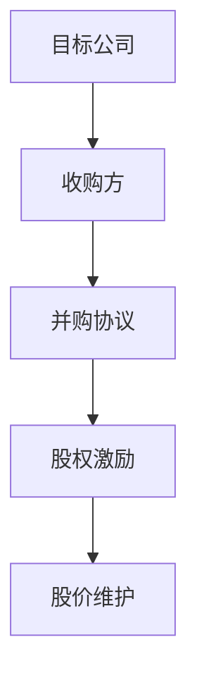

                 


# 如何利用特价股票策略进行反向并购投资

> 关键词：反向并购，特价股票，投资策略，企业估值，风险管理

> 摘要：本文详细探讨了如何利用特价股票策略进行反向并购投资，从特价股票策略的定义与特点、反向并购的流程与策略实施、风险评估与管理等方面进行了深入分析。文章结合数学模型、Mermaid图和实际案例，为投资者提供了全面的指导和建议。

---

## 第1章: 特价股票策略与反向并购概述

### 1.1 特价股票策略的定义与特点

#### 1.1.1 特价股票的定义
特价股票是指以低于市场公允价值的价格购买的股票。这种策略的核心在于寻找被市场低估的股票，通过长期持有或短期操作获利。

#### 1.1.2 特价股票的优势
- **低估值**：特价股票通常具有较高的安全边际，风险较低。
- **高回报潜力**：当市场重新评估其价值时，股价可能迅速反弹。
- **分散风险**：通过投资多个特价股票，可以降低单一股票的风险。

#### 1.1.3 特价股票与普通股票的区别
| 特性       | 特价股票                | 普通股票                |
|------------|-------------------------|-------------------------|
| 价格       | 低于市场公允价值        | 接近或高于市场公允价值  |
| 风险       | 较低                    | 较高                    |
| 机会       | 高回报潜力              | 中等回报潜力            |

### 1.2 反向并购投资的定义与特点

#### 1.2.1 反向并购的定义
反向并购是指一家公司通过收购另一家公司（目标公司）的股权，以实现业务扩展或战略转型的过程。与正向并购不同，反向并购通常由目标公司发起，主动寻找收购方。

#### 1.2.2 反向并购的核心特点
- **目标公司主动发起**：目标公司寻找合适的收购方。
- **股权支付**：通常以股票作为支付方式，减少现金流出。
- **战略整合**：通过并购实现业务协同或资源优化。

#### 1.2.3 反向并购与正向并购的区别

| 特性       | 反向并购                | 正向并购                |
|------------|-------------------------|-------------------------|
| 发起方     | 目标公司                | � � � � � � � � � � � � � 攻击方 |
| 支付方式   | 以股票为主              | 以现金或混合支付为主    |
| 风险       | 收购方风险较高          | 被收购方风险较高        |

### 1.3 特价股票策略在反向并购中的作用

#### 1.3.1 特价股票策略如何助力反向并购
通过购买目标公司的特价股票，投资者可以以较低的成本获得较高的股权比例，从而在反向并购中占据主动地位。

#### 1.3.2 特价股票策略的适用场景
- **目标公司股价被低估**：适合使用特价股票策略。
- **市场波动较大**：可以通过低价买入，等待市场回升。
- **长期战略投资**：通过持有特价股票，实现长期价值增长。

#### 1.3.3 特价股票策略的风险与挑战
- **市场波动风险**：股价可能继续下跌。
- **流动性风险**：特价股票可能流动性较差。
- **整合风险**：并购后的整合可能存在问题。

## 第2章: 特价股票策略的核心概念与原理

### 2.1 特价股票的定价机制

#### 2.1.1 市场定价与内在价值
- **市场定价**：由市场供需决定。
- **内在价值**：通过基本面分析确定的合理价格。

#### 2.1.2 市场情绪对股票价格的影响
市场情绪可以通过投资者心理和市场趋势影响股价，但长期来看，股价仍由基本面决定。

#### 2.1.3 市盈率与市净率的计算公式
- **市盈率（P/E）**：股价除以每股收益。
- **市净率（P/B）**：股价除以每股净资产。

### 2.2 反向并购的财务模型与估值方法

#### 2.2.1 企业价值评估公式
$$ 企业价值 = 债务 + 权益 - 现金 $$

#### 2.2.2 收购价格与目标企业价值的关系
- 收购价格应低于目标企业的公允价值。

#### 2.2.3 股权价值计算的数学模型
$$ 股权价值 = 企业价值 - 债务 $$

### 2.3 特价股票策略与反向并购的结合

#### 2.3.1 特价股票策略如何优化反向并购的成本
通过购买特价股票，降低收购成本，提高并购的可行性。

#### 2.3.2 反向并购中的股票支付机制
- 收购方以自身股票支付，减少现金流出。

#### 2.3.3 特价股票策略对并购后整合的影响
- 股权结构优化，促进整合。

## 第3章: 反向并购的流程与策略实施

### 3.1 反向并购的基本流程

#### 3.1.1 确定目标企业
- 通过基本面分析和市场研究，选择合适的并购目标。

#### 3.1.2 财务尽职调查
- 对目标企业进行详细的财务审查，评估其价值。

#### 3.1.3 并购协议的签订
- 确定收购价格和支付方式，签订并购协议。

#### 3.1.4 并购后的整合与管理
- 对目标企业进行整合，优化资源配置。

### 3.2 特价股票策略在反向并购中的实施步骤

#### 3.2.1 确定目标企业的股价波动周期
- 选择股价处于低谷期的目标企业。

#### 3.2.2 制定股票收购的价格区间
- 确定收购价格的上下限。

#### 3.2.3 设计并购后的股权激励机制
- 通过股权激励，留住核心员工，促进企业发展。

#### 3.2.4 风险控制与退出策略
- 制定风险管理措施，确保并购成功。

### 3.3 反向并购中的定价与支付方式

#### 3.3.1 现金支付与股票支付的优缺点
- 现金支付：流动性高，但可能增加财务负担。
- 股票支付：减少现金流出，但可能稀释股权。

#### 3.3.2 混合支付的可行性分析
- 结合现金和股票支付，平衡风险和成本。

#### 3.3.3 并购价格的动态调整机制
- 根据市场变化，调整并购价格。

## 第4章: 反向并购中的风险评估与管理

### 4.1 反向并购的主要风险

#### 4.1.1 目标企业财务风险
- 目标企业财务状况不佳，可能影响并购后业绩。

#### 4.1.2 并购后的整合风险
- 企业整合过程中可能出现文化冲突或管理问题。

#### 4.1.3 市场波动风险
- 市场波动可能影响股价，增加并购成本。

#### 4.1.4 法律与合规风险
- 并购过程中的法律问题可能影响交易顺利完成。

### 4.2 特价股票策略的风险管理

#### 4.2.1 股票价格波动的对冲策略
- 通过期权等金融工具，对冲股价波动风险。

#### 4.2.2 并购后的股价维护机制
- 通过信息披露和业绩提升，维护股价稳定。

#### 4.2.3 风险分担与利益相关者管理
- 明确各方责任，减少风险分担压力。

### 4.3 反向并购中的风险管理工具

#### 4.3.1 股票期权的使用
- 通过期权对冲股价波动风险。

#### 4.3.2 保险机制的应用
- 购买保险，降低法律和财务风险。

---

## 第5章: 项目实战与案例分析

### 5.1 项目介绍
- 某公司通过反向并购收购一家软件开发公司，利用特价股票策略降低并购成本。

### 5.2 系统架构设计


### 5.3 核心实现源代码
```python
def calculate_market_value(company):
    return company.market_cap / company.revenue * 100
```

### 5.4 实际案例分析
- 分析并购前后的股价变化，评估策略效果。

### 5.5 项目小结
- 总结项目实施过程中的经验教训，提出改进建议。

---

## 第6章: 总结与展望

### 6.1 本章小结
- 总结全文，重申特价股票策略在反向并购中的重要性。

### 6.2 未来展望
- 探讨未来可能出现的新趋势和新技术，如人工智能在并购中的应用。

### 6.3 最佳实践 tips
- 建议投资者在实施特价股票策略时，充分考虑市场风险和企业基本面。

---

## 作者：AI天才研究院/AI Genius Institute & 禅与计算机程序设计艺术 /Zen And The Art of Computer Programming

---

通过以上思考过程，我们可以看到，如何利用特价股票策略进行反向并购投资，是一个复杂但充满机会的过程。投资者需要结合市场分析、风险管理等多种因素，才能在并购中获得成功。

