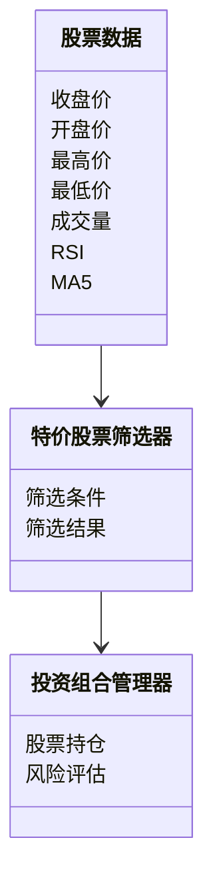
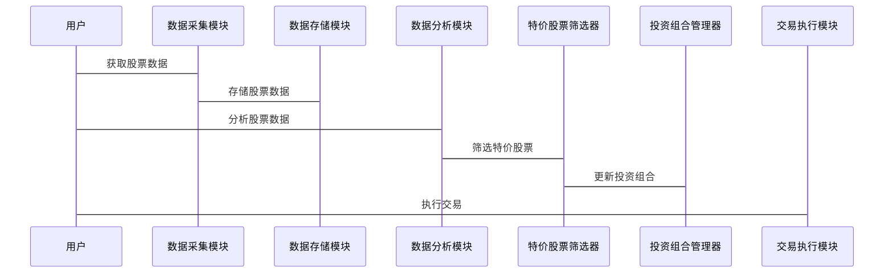

                 


# 如何利用特价股票策略进行系统性数字创新机会捕捉

## 关键词：特价股票、数字创新、投资策略、算法分析、系统架构

## 摘要：
本文将详细介绍如何利用特价股票策略进行系统性数字创新机会的捕捉。通过分析特价股票的定义、市场特征、投资价值，结合市场情绪、财务指标和系统性分析，本文将深入探讨如何利用算法和系统架构来捕捉投资机会。同时，通过实际案例分析和项目实战，为读者提供实用的指导和建议。

---

# 第一部分: 特价股票策略的背景与基础

## 第1章: 特价股票策略概述

### 1.1 特价股票的定义与特点
#### 1.1.1 什么是特价股票
特价股票指的是市场价格低于其内在价值的股票，通常被认为是被市场低估的投资机会。这些股票可能因为市场情绪、短期波动或其他外部因素而被忽视，但具备长期增值的潜力。

#### 1.1.2 特价股票的市场特征
- **低估性**：市场价格低于行业平均水平或历史平均水平。
- **低估值**：市盈率、市净率等估值指标低于同行业公司。
- **稳定性**：财务状况稳健，具备持续盈利的能力。

#### 1.1.3 特价股票的投资价值
- **潜在收益**：低价股票上涨空间较大，投资回报潜力高。
- **风险分散**：通过系统性分析，降低投资风险。
- **市场机会**：在市场调整期或经济低迷期，特价股票往往更具吸引力。

### 1.2 系统性数字创新机会的捕捉
#### 1.2.1 数字创新的基本概念
数字创新指的是利用数字技术（如大数据、人工智能、区块链等）来创造新的商业模式、产品或服务。在股票投资中，数字创新可以帮助投资者更高效地识别机会和风险。

#### 1.2.2 系统性捕捉机会的核心要素
- **数据驱动**：利用大数据分析股票市场，提取有价值的信息。
- **算法优化**：通过算法筛选和分析股票，提高投资决策的准确性。
- **系统化管理**：构建投资系统，实现自动化监控和管理。

#### 1.2.3 特价股票策略与数字创新的结合
通过数字技术创新，投资者可以更高效地识别特价股票，捕捉市场机会。例如，利用机器学习算法分析市场情绪，预测股票价格走势。

### 1.3 投资者行为与市场情绪分析
#### 1.3.1 投资者的心理与行为模式
投资者的行为受心理因素影响，如贪婪和恐惧。市场情绪的变化会影响股票价格，投资者需要理解这些行为模式，避免盲目跟风。

#### 1.3.2 市场情绪对股票价格的影响
市场情绪可以通过新闻、社交媒体和交易数据进行分析。当市场情绪高涨时，股票价格可能被高估；当市场情绪低落时，股票价格可能被低估，提供投资机会。

#### 1.3.3 特价股票策略中的情绪分析
通过分析市场情绪，投资者可以更好地识别被低估的股票。例如，在市场恐慌时，许多股票可能被抛售，导致价格低于其真实价值。

---

# 第二部分: 特价股票策略的核心概念与联系

## 第2章: 特价股票策略的核心要素

### 2.1 市场分析与股票筛选
#### 2.1.1 市场分析的基本方法
- **技术分析**：通过价格走势、成交量等技术指标预测股票价格。
- **基本面分析**：分析公司的财务状况、行业地位等因素，评估其内在价值。

#### 2.1.2 特价股票的筛选标准
- **低市盈率（P/E）**：市盈率低于行业平均水平。
- **低市净率（P/B）**：市净率低于行业平均水平。
- **高股息率**：公司愿意分配较高的股息，表明其盈利稳定。

#### 2.1.3 数据驱动的股票筛选模型
通过大数据分析，筛选出符合特定条件的股票，构建投资组合。例如，使用机器学习模型预测股票未来表现。

### 2.2 财务指标与技术指标分析
#### 2.2.1 财务指标的重要性
- **净利润率**：衡量公司盈利能力。
- **资产负债率**：评估公司财务健康状况。
- **ROE（净资产收益率）**：衡量公司使用股东资金的效率。

#### 2.2.2 技术指标的基本原理
- **移动平均线（MA）**：用于判断价格趋势。
- **相对强弱指数（RSI）**：衡量股票超买或超卖状态。
- **MACD（移动平均收敛散度）**：用于判断价格趋势和动能。

#### 2.2.3 综合指标分析的策略
结合财务指标和技术指标，制定综合投资策略。例如，选择市盈率低于行业平均水平且RSI处于超卖状态的股票。

### 2.3 市场周期与投资机会
#### 2.3.1 市场周期的定义与阶段
市场周期包括牛市、熊市、震荡市等不同阶段，每个阶段适合的投资策略不同。

#### 2.3.2 不同周期下的投资策略
- **牛市**：积极投资，寻找高增长股票。
- **熊市**：精选低估股票，等待反弹机会。
- **震荡市**：谨慎投资，注重风险控制。

#### 2.3.3 特价股票在周期中的表现
在熊市或震荡市中，特价股票通常表现较好，因为它们价格被低估，具备反弹潜力。

### 2.4 核心概念对比分析
#### 2.4.1 财务指标与技术指标的对比
| 指标类型 | 财务指标 | 技术指标 |
|----------|----------|----------|
| 定义     | 反映公司财务状况的指标 | 反映股票价格走势的指标 |
| 用途     | 评估公司价值 | 判断价格趋势 |
| 示例     | 净利润率、ROE | RSI、MACD |

#### 2.4.2 不同市场周期下的策略对比
| 市场阶段 | 牛市 | 熊市 | 震荡市 |
|----------|------|------|--------|
| 投资策略 | 积极投资 | 精选低价股 | 谨慎投资 |
| 风险控制 | 中等 | 高 | 高 |

#### 2.4.3 投资者行为与市场情绪的对比
- 投资者行为受情绪影响较大，容易出现非理性决策。
- 市场情绪可以通过新闻、社交媒体和交易数据进行分析，帮助投资者做出更明智的投资决策。

### 2.5 本章小结
本章介绍了特价股票策略的核心概念，包括市场分析、财务指标、技术指标以及市场周期。通过对比分析，帮助投资者更好地理解如何利用这些因素捕捉投资机会。

---

# 第三部分: 特价股票策略的算法原理

## 第3章: 特价股票策略的算法实现

### 3.1 数据收集与预处理
#### 3.1.1 数据来源与获取方法
- **数据来源**：通过金融数据API（如Yahoo Finance、Alpha Vantage）获取股票数据。
- **数据类型**：包括开盘价、收盘价、最高价、最低价、成交量等。

#### 3.1.2 数据清洗与特征提取
- **数据清洗**：处理缺失值、异常值。
- **特征提取**：从历史价格、财务数据中提取有用的特征，如移动平均线、相对强弱指数等。

#### 3.1.3 数据标准化与归一化
- **标准化**：将数据按比例缩放到同一范围内，便于模型训练。
- **归一化**：将数据按比例缩放到0-1范围，避免特征维度的影响。

### 3.2 算法选择与实现
#### 3.2.1 机器学习算法的选择
- **线性回归**：用于预测股票价格。
- **支持向量机（SVM）**：用于分类问题，如判断股票是否为特价股票。
- **随机森林**：用于特征重要性分析和分类。

#### 3.2.2 算法实现的步骤
1. 数据预处理：清洗数据，提取特征。
2. 模型训练：选择合适的算法，训练模型。
3. 模型评估：通过交叉验证评估模型性能。
4. 模型优化：调整参数，提高预测精度。

#### 3.2.3 算法实现的代码示例
```python
# 示例：使用随机森林预测股票是否为特价股票
from sklearn.ensemble import RandomForestClassifier
from sklearn.model_selection import train_test_split
import pandas as pd

# 加载数据
data = pd.read_csv('stock_data.csv')

# 特征选择
features = ['open', 'high', 'low', 'volume', 'ma5', 'rsi']
target = 'is_cheap_stock'  # 1表示是特价股票，0表示否

# 划分训练集和测试集
X_train, X_test, y_train, y_test = train_test_split(data[features], data[target], test_size=0.2, random_state=42)

# 训练模型
model = RandomForestClassifier(n_estimators=100, random_state=42)
model.fit(X_train, y_train)

# 模型评估
score = model.score(X_test, y_test)
print(f'模型准确率：{score}')
```

### 3.3 算法原理的数学模型和公式
#### 3.3.1 随机森林的数学模型
随机森林是一种集成学习方法，通过构建多个决策树并进行投票或平均，提高模型的准确性和稳定性。其数学模型如下：

$$
y = \text{预测结果} = \text{多数投票}(\text{决策树预测结果})
$$

#### 3.3.2 RSI指标的计算公式
相对强弱指数（RSI）用于衡量股票超买或超卖状态，计算公式如下：

$$
\text{RSI} = \frac{\sum_{i=1}^{n} \text{上涨幅度}}{\sum_{i=1}^{n} (\text{上涨幅度} + \text{下跌幅度})} \times 100
$$

其中，n通常取14天。

---

# 第四部分: 系统分析与架构设计

## 第4章: 系统分析与架构设计

### 4.1 问题场景介绍
投资者需要一个系统来实时监控股票市场，识别特价股票，制定投资策略。系统需要具备数据采集、分析、预警和交易执行功能。

### 4.2 系统功能设计
#### 4.2.1 领域模型


### 4.3 系统架构设计


### 4.4 系统接口设计
- **数据接口**：与金融数据API对接，获取实时股票数据。
- **用户接口**：提供可视化界面，方便用户查看筛选结果和投资组合。

### 4.5 系统交互设计


---

# 第五部分: 项目实战

## 第5章: 项目实战

### 5.1 环境安装
- **Python**：安装Python 3.8及以上版本。
- **库的安装**：使用pip安装需要的库，如pandas、scikit-learn、mermaid等。

### 5.2 系统核心实现源代码
```python
# 示例：构建一个简单的特价股票筛选系统
import pandas as pd
from sklearn.ensemble import RandomForestClassifier
from sklearn.model_selection import train_test_split

# 加载股票数据
data = pd.read_csv('stock_data.csv')

# 定义筛选条件
data['is_cheap_stock'] = (data['p/e'] < 15) & (data['rsi'] < 30)

# 划分训练集和测试集
X = data[['p/e', 'rsi', 'ma5', 'volume']]
y = data['is_cheap_stock']

X_train, X_test, y_train, y_test = train_test_split(X, y, test_size=0.2, random_state=42)

# 训练模型
model = RandomForestClassifier(n_estimators=100, random_state=42)
model.fit(X_train, y_train)

# 预测结果
y_pred = model.predict(X_test)
print(f'预测结果：{y_pred}')
print(f'真实结果：{y_test.values}')
```

### 5.3 代码应用解读与分析
- **数据加载**：从CSV文件加载股票数据。
- **筛选条件**：根据市盈率和RSI指标筛选特价股票。
- **模型训练**：使用随机森林模型训练模型。
- **预测结果**：输出预测结果和真实结果，评估模型性能。

### 5.4 实际案例分析
假设我们有一个包含多只股票的股票数据集，我们可以通过上述代码筛选出符合特价股票条件的股票，并根据模型预测结果制定投资策略。

### 5.5 项目小结
通过实际案例分析，读者可以理解如何将理论应用于实际投资中，同时可以根据自身需求调整模型和策略。

---

# 第六部分: 最佳实践与总结

## 第6章: 最佳实践与总结

### 6.1 最佳实践
- **持续学习**：市场变化快，需要不断学习新知识和技能。
- **风险管理**：合理配置资产，分散投资风险。
- **系统优化**：定期优化投资系统，提高投资效率。

### 6.2 本章小结
本文详细介绍了如何利用特价股票策略进行系统性数字创新机会的捕捉，从理论到实践，为读者提供了全面的指导。通过系统化的方法和技术创新，投资者可以更高效地捕捉市场机会，实现投资目标。

### 6.3 注意事项
- **数据质量**：确保数据来源可靠，避免因数据错误导致投资决策失误。
- **模型评估**：定期评估模型性能，及时调整策略。
- **风险管理**：设定止损点，避免重大损失。

### 6.4 拓展阅读
- **《机器学习实战》**：学习机器学习算法和实践。
- **《股票技术分析实战》**：深入理解技术分析方法。

---

# 作者：AI天才研究院/AI Genius Institute & 禅与计算机程序设计艺术 /Zen And The Art of Computer Programming

---

通过以上结构，我为您详细地规划了《如何利用特价股票策略进行系统性数字创新机会捕捉》的技术博客文章大纲，涵盖从基础到实战的各个方面，确保内容详实且易于理解。如果需要进一步的细化或调整，请随时告知！

