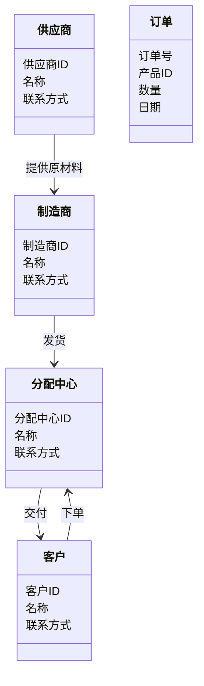

                 


# 如何在估值中考虑企业的供应链优势

> 关键词：供应链优势、企业估值、成本控制、竞争优势、供应链优化

> 摘要：供应链优势是企业竞争优势的重要组成部分，直接影响企业的成本、效率和市场响应能力。本文从供应链优势的核心概念出发，分析其在企业估值中的重要性，探讨供应链优势对估值模型的影响，提供行业案例和最佳实践，帮助投资者和企业管理者更好地理解和利用供应链优势进行估值。

---

# 第一部分: 供应链优势与企业估值基础

## 第1章: 供应链优势的核心概念

### 1.1 供应链优势的定义与背景

#### 1.1.1 供应链的基本概念
供应链是指从原材料采购到产品交付给最终客户的整个过程中的所有环节和参与者。它包括供应商、制造商、分销商、零售商和客户等。

#### 1.1.2 供应链优势的定义
供应链优势是指企业在供应链管理中所具有的独特优势，包括成本控制、效率提升、灵活性和快速响应市场变化的能力。

#### 1.1.3 供应链优势与企业价值的关系
供应链优势直接影响企业的运营成本、利润率和市场竞争力，从而影响企业的整体价值。

---

### 1.2 供应链优势的核心要素

#### 1.2.1 供应链的成本控制
- 集中采购：通过规模效应降低原材料采购成本。
- JIT（准时制）生产：减少库存积压，降低仓储成本。
- 供应商管理：选择可靠的供应商，优化供应链成本。

#### 1.2.2 供应链的效率提升
- 减少库存：通过精确的需求预测和 JIT 生产，降低库存水平。
- 提高交付速度：优化物流网络，缩短交付时间，提升客户满意度。
- 优化流程：通过自动化和数字化技术提升供应链的整体效率。

#### 1.2.3 供应链的灵活性与响应能力
- 多元化的供应商策略：降低供应链中断的风险。
- 快速调整生产计划：根据市场需求变化灵活调整生产。
- 智能预测：利用数据分析和 AI 技术预测市场变化，提前做出响应。

---

## 第2章: 供应链优势与企业估值的关系

### 2.1 供应链优势对企业价值的影响

#### 2.1.1 供应链优势如何影响企业成本
- 通过集中采购和 JIT 生产降低成本。
- 通过优化物流网络降低运输成本。
- 通过减少库存积压降低仓储成本。

#### 2.1.2 供应链优势如何影响企业利润
- 提高生产效率，降低单位产品成本，从而增加利润。
- 提高交付速度和客户满意度，增强市场竞争力，从而增加收入。

#### 2.1.3 供应链优势如何影响企业市场竞争力
- 通过快速响应市场变化，赢得更多的市场份额。
- 通过降低成本和提高效率，增强企业的盈利能力。

---

### 2.2 供应链优势在企业估值中的重要性

#### 2.2.1 供应链优势对估值模型的影响
- 供应链优势可以显著影响企业的EBITDA（息税折旧及摊销前利润）。
- 供应链优势可以降低企业的运营风险，从而影响其估值倍数。

#### 2.2.2 供应链优势对估值结果的影响
- 具有强大供应链优势的企业通常具有更高的市盈率和市净率。
- 供应链优势可以显著影响企业的企业价值（EV）。

#### 2.2.3 供应链优势对投资决策的影响
- 投资者在评估企业时，需要考虑其供应链优势是否可持续。
- 供应链优势可以作为企业竞争优势的重要组成部分。

---

## 第3章: 供应链优势的核心概念与联系

### 3.1 供应链优势的核心原理

#### 3.1.1 供应链的成本优化原理
- 集中采购：通过规模效应降低采购成本。
- JIT 生产：通过精确的需求预测和生产计划，减少库存积压。

#### 3.1.2 供应链的效率优化原理
- 自动化技术：通过机器人和物联网技术提高供应链的效率。
- 数字化管理：通过 ERP 系统和数据分析优化供应链的管理流程。

#### 3.1.3 供应链的灵活性优化原理
- 多元化的供应商策略：通过选择多个供应商降低供应链中断的风险。
- 快速调整生产计划：通过灵活的生产安排快速响应市场需求变化。

---

### 3.2 供应链优势的属性特征对比表

| 属性       | 成本控制 | 效率提升 | 灵活性提升 |
|------------|----------|----------|------------|
| 描述       | 供应链通过优化采购、生产、物流等环节降低成本 | 供应链通过优化流程、减少库存、提高交付速度提升效率 | 供应链通过快速响应市场需求、调整生产计划提升灵活性 |
| 示例       | 通过集中采购降低原材料成本 | 通过 JIT（准时制）生产减少库存 | 通过多供应商策略快速应对市场需求变化 |

---

### 3.3 供应链优势的ER实体关系图


---

## 第4章: 供应链优势的算法原理讲解

### 4.1 供应链优化的数学模型

#### 4.1.1 线性规划模型
供应链优化可以通过线性规划模型来解决。例如，最小化成本的线性规划模型如下：

$$
\text{目标函数：} \min \sum_{i=1}^{n} c_i x_i
$$

$$
\text{约束条件：} \sum_{i=1}^{n} a_i x_i \leq b \\
x_i \geq 0, i=1,2,\dots,n
$$

其中，\( c_i \) 是第 \( i \) 种资源的单位成本，\( x_i \) 是第 \( i \) 种资源的使用量，\( a_i \) 是第 \( i \) 种资源在产品 \( j \) 上的使用量，\( b \) 是可用的资源总量。

---

#### 4.1.2 网络流模型

供应链优化也可以通过网络流模型来解决。例如，运输问题的网络流模型如下：

$$
\text{目标函数：} \min \sum_{i=1}^{m} \sum_{j=1}^{n} c_{ij} x_{ij}
$$

$$
\text{约束条件：} \sum_{j=1}^{n} x_{ij} = s_i \quad \forall i \\
\sum_{i=1}^{m} x_{ij} = d_j \quad \forall j \\
x_{ij} \geq 0
$$

其中，\( c_{ij} \) 是从节点 \( i \) 到节点 \( j \) 的单位成本，\( s_i \) 是节点 \( i \) 的供应量，\( d_j \) 是节点 \( j \) 的需求量。

---

## 第5章: 供应链优势的系统架构设计方案

### 5.1 问题场景介绍
假设我们有一个制造企业，需要优化其供应链以降低生产成本和提高交付效率。

### 5.2 系统功能设计

#### 5.2.1 领域模型



---

### 5.3 系统架构设计


---

## 第6章: 供应链优势的项目实战

### 6.1 环境安装

#### 6.1.1 供应链管理软件安装
- 安装ERP系统（如SAP、Oracle）。
- 安装数据分析工具（如Tableau、Power BI）。

#### 6.1.2 供应链硬件安装
- 安装传感器和执行器。
- 配置物联网设备。

---

### 6.2 系统核心实现源代码

#### 6.2.1 采购模块
```python
# 采购模块实现
class Supplier:
    def __init__(self, supplier_id, name, contact):
        self.supplier_id = supplier_id
        self.name = name
        self.contact = contact

    def send_order(self, product_id, quantity):
        # 向供应商发送订单
        print(f"向供应商 {self.name} 发送采购订单，产品ID：{product_id}，数量：{quantity}")

# 使用示例
supplier = Supplier("S001", "Supplier A", "contact@supplier.com")
supplier.send_order("P001", 100)
```

#### 6.2.2 生产模块
```python
# 生产模块实现
class Manufacturer:
    def __init__(self, manufacturer_id, name, contact):
        self.manufacturer_id = manufacturer_id
        self.name = name
        self.contact = contact

    def start_production(self, product_id, quantity):
        # 开始生产
        print(f"开始生产产品 {product_id}，数量：{quantity}")

# 使用示例
manufacturer = Manufacturer("M001", "Manufacturer A", "contact@manufacturer.com")
manufacturer.start_production("P001", 100)
```

---

### 6.3 代码应用解读与分析
- 采购模块代码展示了如何与供应商交互，发送采购订单。
- 生产模块代码展示了如何启动生产计划，确保订单按时完成。

---

## 第7章: 供应链优势的最佳实践与未来趋势

### 7.1 最佳实践 tips
- 定期评估供应链的效率和成本。
- 引入先进的供应链管理技术（如物联网、AI）。
- 建立多元化的供应商策略，降低供应链中断的风险。

---

### 7.2 供应链优势的小结
供应链优势是企业竞争优势的重要组成部分，通过优化供应链管理，企业可以降低成本、提高效率、增强市场响应能力，从而提升整体价值。

---

### 7.3 供应链优势的未来趋势
- 智能化供应链：通过AI和大数据技术优化供应链管理。
- 可持续供应链：关注环保和可持续发展，减少供应链的环境影响。
- 全球化供应链：应对全球化市场的挑战，建立更具韧性的供应链。

---

## 第8章: 供应链优势的总结与展望

### 8.1 供应链优势的核心总结
供应链优势是企业竞争优势的重要组成部分，直接影响企业的成本、效率和市场竞争力。通过优化供应链管理，企业可以显著提升其整体价值。

### 8.2 供应链优势的未来展望
随着技术的进步和市场需求的变化，供应链优势将变得更加重要。企业需要不断优化其供应链管理，以应对未来的挑战和机遇。

---

## 作者：AI天才研究院/AI Genius Institute & 禅与计算机程序设计艺术 /Zen And The Art of Computer Programming

---

通过以上目录和内容的设计，我们可以系统地理解和应用供应链优势在企业估值中的重要性，为企业投资者和管理者提供实用的指导和参考。

