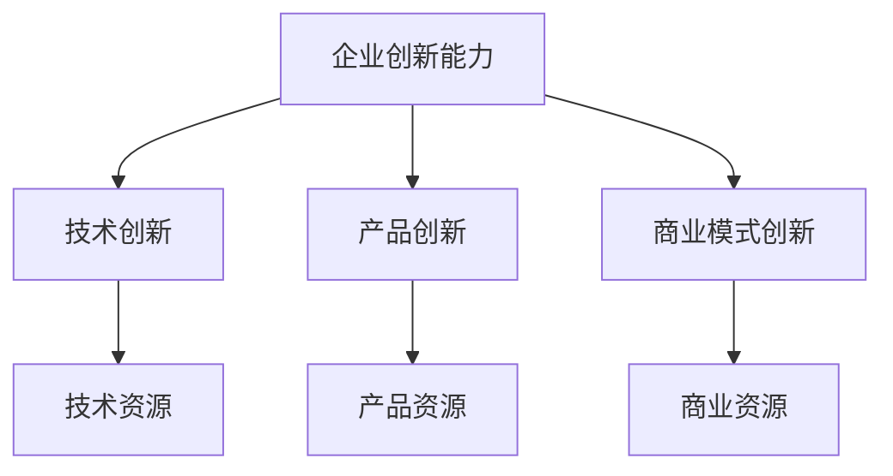
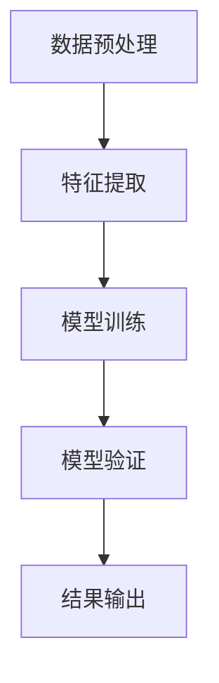
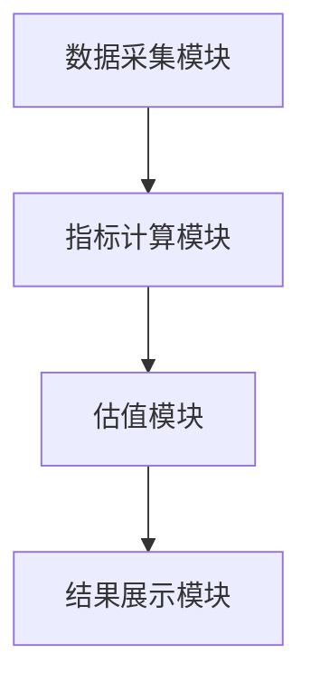

                 


# 如何在估值中考虑企业的创新能力

> 关键词：企业创新能力，估值，创新评估，企业创新系统，创新指数模型，企业创新算法，创新价值评估

> 摘要：本文详细探讨了在企业估值中如何考虑创新能力。从创新的定义、核心要素、评估模型、系统架构到实际案例分析，系统阐述了企业创新能力对企业价值的影响及如何进行科学评估。文章结合理论与实践，提供了具体的数学模型和算法实现，为投资者和企业管理者提供了实用的评估工具和方法。

---

# 第一部分: 企业创新能力的背景与核心概念

## 第1章: 企业创新能力的背景与问题描述

### 1.1 企业创新能力的定义与内涵
企业创新能力是指企业在技术研发、产品设计、商业模式等方面进行创新的能力。它不仅包括技术层面的创新，还涉及管理、市场、文化等多方面的创新能力。企业创新能力是企业持续发展的核心动力，也是企业在竞争中保持优势的关键因素。

### 1.2 企业创新能力的重要性
企业创新能力的重要性体现在以下几个方面：
1. **市场竞争优势**：创新能力决定了企业在市场中的竞争力，能够帮助企业推出新产品、开拓新市场。
2. **价值创造**：创新是企业创造价值的核心源泉，能够为企业带来超额收益。
3. **长期发展**：创新能力是企业长期发展的关键，能够帮助企业应对市场变化和挑战。

### 1.3 企业创新能力的评估问题
评估企业创新能力的难点在于：
1. **多维度性**：创新能力涉及多个维度，包括技术、产品、市场等，难以用单一指标衡量。
2. **动态性**：创新能力是一个动态变化的过程，受到内外部环境的影响。
3. **数据获取**：创新能力的评估需要大量数据支持，包括技术研发投入、专利数量、产品迭代速度等。

## 第2章: 企业创新能力的核心概念与联系

### 2.1 企业创新的核心要素
企业创新的核心要素包括：
1. **技术创新**：技术创新是企业创新的核心，包括技术研发、专利申请等。
2. **产品创新**：产品创新是企业创新的直接体现，包括新产品开发、产品升级等。
3. **商业模式创新**：商业模式创新是企业创新的重要方面，包括业务模式、盈利模式的创新。

### 2.2 企业创新能力与相关概念的对比
企业创新能力与其他相关概念的对比如下：
| 概念 | 定义 | 关注点 | 区别 |
|------|------|--------|------|
| 研发能力 | 企业进行技术研发的能力 | 技术研发、团队能力 | 更关注技术实现，不涉及市场和管理 |
| 市场竞争力 | 企业在市场中的竞争力 | 市场份额、客户满意度 | 更关注外部表现，不涉及创新能力 |
| 组织能力 | 企业组织结构和管理能力 | 组织架构、管理效率 | 更关注内部管理，不涉及创新 |

### 2.3 企业创新能力的ER实体关系图


---

## 第3章: 企业创新能力评估的数学模型与算法原理

### 3.1 企业创新能力评估的数学模型
企业创新能力评估的数学模型如下：
$$
\text{创新能力指数} = \frac{\sum w_i x_i}{\sum w_i}
$$

其中，$w_i$ 是第 $i$ 个指标的权重，$x_i$ 是第 $i$ 个指标的评分。

### 3.2 算法原理
1. **数据预处理**：收集企业的创新能力相关数据，包括专利数量、研发投入、产品迭代速度等。
2. **特征提取**：将数据转化为可量化的指标，如技术创新指标、产品创新指标等。
3. **模型训练**：使用加权平均法计算创新能力指数。
4. **模型验证**：通过实际案例验证模型的有效性。

### 3.3 算法流程图


---

## 第4章: 系统分析与架构设计方案

### 4.1 问题场景介绍
企业创新能力评估系统需要解决的问题包括：
1. 如何量化企业的创新能力？
2. 如何动态评估企业的创新能力？
3. 如何将创新能力与企业估值相结合？

### 4.2 系统功能设计
系统功能模块包括：
- 数据采集模块：采集企业的创新能力相关数据。
- 指标计算模块：计算创新能力指数。
- 估值模块：将创新能力指数与企业估值相结合。

### 4.3 系统架构设计


---

## 第5章: 项目实战

### 5.1 环境安装
需要安装以下工具：
- Python
- 数据处理库（如Pandas）
- 可视化库（如Matplotlib）

### 5.2 核心实现代码
```python
import pandas as pd
import numpy as np

# 数据预处理
data = pd.read_csv('innovation.csv')
data = data.dropna()

# 特征提取
features = ['技术创新', '产品创新', '商业模式创新']
data_features = data[features]

# 模型训练
weights = [0.4, 0.3, 0.3]
innovation_index = np.zeros(len(data_features.index))
for i in range(len(data_features.index)):
    innovation_index[i] = np.sum(weights[i] * data_features.iloc[i])

# 模型验证
print(innovation_index)
```

### 5.3 案例分析
以某科技公司为例，通过数据计算其创新能力指数，并与行业平均水平进行对比，分析其创新能力对企业估值的影响。

---

## 第6章: 最佳实践与总结

### 6.1 最佳实践
1. 在评估企业创新能力时，应结合企业的实际经营情况。
2. 使用多维度指标和动态模型进行评估。
3. 结合行业基准和实际案例进行验证。

### 6.2 总结
企业创新能力是企业估值的重要因素，科学评估企业创新能力能够帮助企业制定更好的战略规划，提升企业价值。

---

## 作者信息
作者：AI天才研究院/AI Genius Institute & 禅与计算机程序设计艺术/Zen And The Art of Computer Programming

