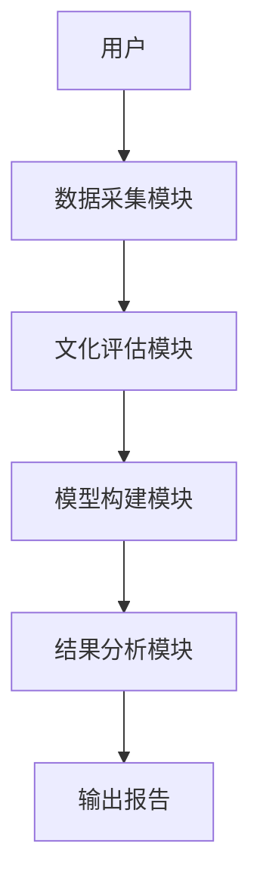

                 


# 如何在估值中考虑企业的文化因素

## 文章关键词

企业估值, 文化因素, 企业文化, 企业价值, 文化影响

## 摘要

在企业估值过程中，文化因素往往被忽视，但它们对企业的长期价值和绩效有着重要影响。本文探讨了文化因素如何影响企业价值，分析了文化因素与企业绩效的关系，并提出了在估值中综合考虑文化因素的方法。通过数学模型和实际案例，本文展示了如何将文化因素量化，以提升企业估值的准确性。

---

# 第一部分：企业估值与文化因素的背景介绍

## 第1章：文化因素在企业估值中的重要性

### 1.1 企业估值的核心概念

企业估值是通过对企业的财务和非财务因素进行评估，确定其市场价值的过程。传统方法主要依赖财务指标，如收入、利润和现金流，但忽略了文化因素的重要性。

#### 1.1.1 企业估值的基本定义与方法

企业估值方法包括市盈率、市净率和DCF模型等。这些方法主要关注财务数据，但忽略了企业文化对企业绩效的影响。

#### 1.1.2 传统企业估值的局限性

传统方法未能考虑企业文化对企业运营效率、创新能力和员工满意度的影响，导致估值结果可能不准确。

#### 1.1.3 文化因素对企业价值的影响

企业文化通过影响员工效率和企业声誉间接影响企业价值。优秀的企业文化可以提升企业凝聚力和市场竞争力，从而增加企业价值。

### 1.2 企业文化的核心要素

企业文化由愿景、价值观和领导风格等多个维度组成，每个维度都对企业的长期发展产生影响。

#### 1.2.1 企业文化的定义与内涵

企业文化是企业在长期发展过程中形成的价值观和行为准则的集合，影响企业的决策和运营。

#### 1.2.2 企业文化的主要维度

- **愿景与使命**：企业长期目标和方向。
- **价值观**：企业认同的核心信念。
- **领导风格**：领导者管理风格对企业氛围的影响。
- **员工参与度**：员工在企业决策中的参与程度。
- **创新文化**：企业鼓励创新和适应变化的程度。

#### 1.2.3 企业文化与企业绩效的关系

企业文化通过影响员工满意度、创新能力和团队协作，进而影响企业绩效。优秀的企业文化可以提升企业绩效，增强企业的市场竞争力。

## 第2章：文化因素对企业价值的影响机制

### 2.1 文化因素如何影响企业绩效

#### 2.1.1 文化因素对企业运营效率的影响

高效的企业文化可以提升员工的工作效率，优化企业运营流程，降低运营成本，从而提升企业绩效。

#### 2.1.2 文化因素对企业创新能力和竞争力的影响

创新文化鼓励员工提出新想法，促进产品和服务的创新，增强企业的市场竞争力。

#### 2.1.3 文化因素对企业员工满意度和留存率的影响

良好的企业文化可以提升员工满意度，降低员工流失率，保持稳定的团队，确保企业长期发展。

### 2.2 文化因素如何影响企业市场价值

#### 2.2.1 文化因素对企业品牌价值的影响

优秀的企业文化可以提升企业品牌形象，增强消费者对企业的好感和信任，从而提升品牌价值。

#### 2.2.2 文化因素对企业资本成本的影响

良好的企业文化可以降低企业的资本成本，因为投资者更愿意投资于文化优秀的企业，愿意接受较低的回报要求。

#### 2.2.3 文化因素对企业长期增长潜力的影响

企业文化影响企业的长期战略和目标，优秀的企业文化可以确保企业长期稳定发展，具备更强的增长潜力。

## 第3章：文化因素在企业估值中的应用现状与挑战

### 3.1 传统企业估值方法中对文化因素的忽视

#### 3.1.1 财务指标在企业估值中的局限性

财务指标如收入和利润仅反映了企业的财务表现，未能全面反映企业价值。

#### 3.1.2 非财务因素在企业估值中的重要性

非财务因素如企业文化、员工满意度和品牌声誉对企业价值的影响不可忽视。

#### 3.1.3 文化因素在传统估值方法中的缺失

传统估值方法未能将文化因素纳入考虑范围，导致估值结果可能不准确。

### 3.2 在现代企业估值中引入文化因素的必要性

#### 3.2.1 现代企业估值方法的变革

随着企业竞争加剧，仅依赖财务指标的估值方法已不足以准确评估企业价值，引入文化因素成为必要。

#### 3.2.2 文化因素对企业价值的长期影响

企业文化影响企业的长期战略和目标，优秀的企业文化可以确保企业长期稳定发展，具备更强的增长潜力。

#### 3.2.3 文化因素在企业估值中的实际应用

通过建立文化评估指标和模型，将文化因素量化，纳入企业估值过程，提升估值的准确性和全面性。

---

# 第二部分：文化因素的数学模型与系统架构

## 第4章：文化因素的数学模型

### 4.1 文化因素量化模型

为了在企业估值中考虑文化因素，我们需要将文化因素转化为可量化的指标。以下是文化因素量化模型的构建过程：

#### 4.1.1 文化因素的指标体系

我们需要定义一组文化因素指标，如员工满意度、领导风格、创新文化等。

$$
C = \{C_1, C_2, \ldots, C_n\}
$$

其中，$C_i$ 表示第$i$个文化因素指标。

#### 4.1.2 文化因素的加权评分

每个文化因素指标都有一个权重，表示其对企业价值的影响程度。我们可以使用因子分析等方法确定每个指标的权重。

$$
W = \{w_1, w_2, \ldots, w_n\}
$$

其中，$w_i$ 表示第$i$个文化因素指标的权重。

#### 4.1.3 文化影响指数的计算

将文化因素指标与权重相乘并求和，得到文化影响指数（Cultural Impact Index, CII）：

$$
CII = \sum_{i=1}^{n} w_i \times C_i
$$

CII的取值范围在0到1之间，0表示文化因素对企业价值无影响，1表示文化因素对企业价值有最大影响。

### 4.2 文化因素与企业价值的关系模型

为了将文化影响指数纳入企业估值模型，我们需要构建一个综合考虑财务指标和文化因素的数学模型。以下是具体步骤：

#### 4.2.1 企业价值的综合评估模型

企业价值（EV）可以表示为：

$$
EV = f(F, C)
$$

其中，$F$ 表示财务指标，$C$ 表示文化影响指数。

#### 4.2.2 结合文化因素的企业估值公式

我们可以将文化影响指数与财务指标结合起来，构建企业价值的综合评估公式：

$$
EV = \alpha \times F + \beta \times CII
$$

其中，$\alpha$ 和 $\beta$ 是调整系数，用于调整财务指标和文化因素在企业价值评估中的重要性。

---

## 第5章：系统架构与实现方案

### 5.1 系统功能设计

为了实现文化因素在企业估值中的应用，我们需要构建一个模块化的系统，包括数据采集、文化评估、模型构建和结果分析等模块。

#### 5.1.1 数据采集模块

该模块负责采集企业的文化因素数据，包括员工满意度、领导风格、创新文化等指标。

#### 5.1.2 文化评估模块

该模块对采集的文化因素数据进行评估，计算文化影响指数（CII）。

#### 5.1.3 模型构建模块

该模块结合财务指标和文化影响指数，构建企业价值的综合评估模型。

#### 5.1.4 结果分析模块

该模块对评估结果进行分析，提供企业估值的建议和优化方案。

### 5.2 系统架构设计

以下是系统的总体架构图：



该架构图展示了用户如何通过数据采集模块输入文化因素数据，经过文化评估模块和模型构建模块的处理，最终生成企业价值的评估报告。

### 5.3 系统接口设计

系统接口设计包括数据输入接口和结果输出接口。数据输入接口接收企业的文化因素数据，结果输出接口提供企业估值的报告。

### 5.4 系统交互设计

以下是系统的交互流程图：

```mermaid
sequenceDiagram
    participant 用户
    participant 数据采集模块
    participant 文化评估模块
    participant 模型构建模块
    participant 结果分析模块
    participant 输出报告
    
    用户 -> 数据采集模块: 提供文化因素数据
    数据采集模块 -> 文化评估模块: 传输文化因素数据
    文化评估模块 -> 模型构建模块: 计算文化影响指数
    模型构建模块 -> 结果分析模块: 构建企业价值评估模型
    结果分析模块 -> 输出报告: 生成企业估值报告
    用户 <- 输出报告: 获取企业估值报告
```

---

## 第6章：项目实战与案例分析

### 6.1 项目环境与数据收集

#### 6.1.1 项目背景

假设我们正在为一家科技公司进行估值，该公司拥有一支高效的团队和良好的企业文化。我们需要将文化因素纳入估值模型，以更准确地评估其市场价值。

#### 6.1.2 数据收集

我们首先收集该公司的文化因素数据，包括员工满意度、领导风格、创新文化等指标。例如：

- 员工满意度：90%
- 领导风格：民主型
- 创新文化：鼓励员工提出新想法

### 6.2 模型构建与分析

#### 6.2.1 文化影响指数计算

根据前面的公式，我们计算文化影响指数：

$$
CII = \sum_{i=1}^{n} w_i \times C_i
$$

假设员工满意度的权重为0.4，领导风格的权重为0.3，创新文化的权重为0.3，且各指标的得分均为高分（例如，员工满意度得分为0.9，领导风格得分为0.8，创新文化得分为0.7），则：

$$
CII = 0.4 \times 0.9 + 0.3 \times 0.8 + 0.3 \times 0.7 = 0.36 + 0.24 + 0.21 = 0.81
$$

#### 6.2.2 企业价值评估

假设该公司的财务指标F得分为0.8，且$\alpha = 0.6$，$\beta = 0.4$，则：

$$
EV = 0.6 \times 0.8 + 0.4 \times 0.81 = 0.48 + 0.324 = 0.804
$$

因此，该公司的企业价值得分为0.804，高于仅考虑财务指标的0.48，表明文化因素在该公司的估值中起到了重要作用。

### 6.3 案例分析与结果解读

通过上述案例分析，我们可以看到，将文化因素纳入企业估值模型可以更全面地反映企业的实际价值。在实际应用中，我们还可以根据不同的行业和企业特点，调整文化因素的权重和指标，以更好地适应具体情况。

---

## 第7章：总结与建议

### 7.1 总结

本文探讨了文化因素在企业估值中的重要性，分析了文化因素如何影响企业绩效和市场价值，并提出了将文化因素量化纳入企业估值模型的方法。通过实际案例分析，我们展示了文化因素对企业价值的重要影响。

### 7.2 最佳实践 tips

- 在企业估值中，除了关注财务指标，还需考虑文化因素对企业绩效和市场价值的影响。
- 根据企业的具体情况，调整文化因素的权重和指标，以更好地反映企业的实际价值。
- 定期评估和更新企业文化因素的数据，以确保企业估值模型的准确性和有效性。

### 7.3 小结

企业文化是企业长期发展的核心要素，其对企业价值的影响不容忽视。通过将文化因素量化并纳入企业估值模型，我们可以更全面、更准确地评估企业的市场价值，为投资者和企业管理者提供更有价值的决策支持。

### 7.4 注意事项

- 文化因素的量化需要结合企业的实际情况，确保数据的准确性和代表性。
- 在实际应用中，可能需要引入更多的文化因素指标，并根据企业的特点进行调整。
- 文化因素的评估需要长期关注和动态调整，以确保其对企业价值评估的有效性。

### 7.5 拓展阅读

- 《企业文化和企业绩效的关系研究》
- 《文化因素在企业估值中的应用实践》
- 《如何构建高效的企业文化评估体系》

---

# 作者

作者：AI天才研究院/AI Genius Institute & 禅与计算机程序设计艺术/Zen And The Art of Computer Programming

---

以上是《如何在估值中考虑企业的文化因素》的文章内容，涵盖了从背景介绍到实际案例分析的完整内容。

