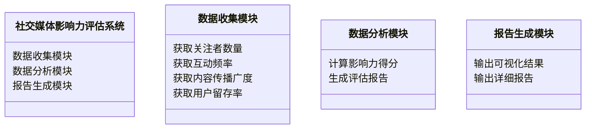
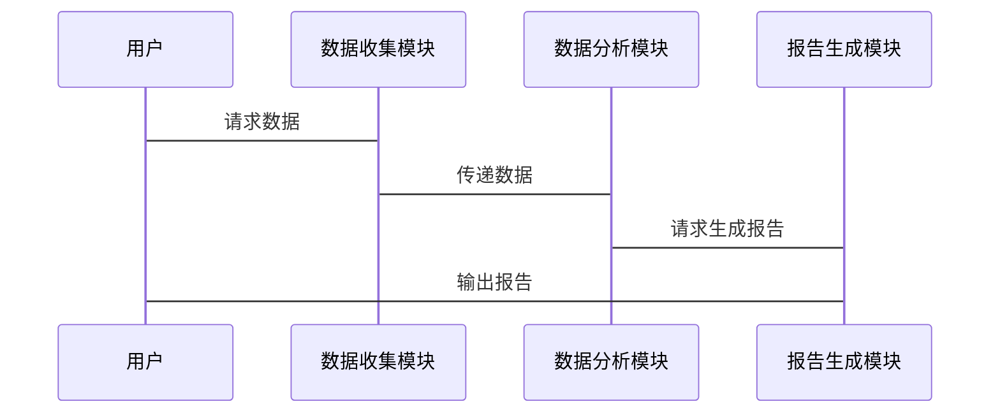

                 


# 如何在估值中考虑企业的社交媒体影响力

## 关键词：
企业估值、社交媒体影响力、品牌价值、数字营销、社交媒体分析、影响力评估

## 摘要：
在数字营销日益重要的今天，企业的社交媒体影响力已经成为其品牌价值和市场竞争力的重要组成部分。本文将从核心概念、评估方法、数学模型、实际案例分析等多个维度，详细探讨如何在企业估值中合理考虑社交媒体影响力。通过分析社交媒体影响力的关键指标、影响因素，以及其对企业财务表现和市场地位的具体作用，我们旨在为读者提供一套系统的评估方法和实战指南。

---

# 第一部分: 背景介绍与核心概念

## 第1章: 企业社交媒体影响力概述

### 1.1 什么是企业社交媒体影响力
#### 1.1.1 社会媒体影响力的定义
社交媒体影响力是指企业在社交媒体平台上通过内容发布、用户互动、品牌传播等方式所积累的用户关注度和品牌影响力。它不仅反映了企业在社交媒体上的传播能力，还体现了其与用户之间的互动深度和信任度。

#### 1.1.2 社会媒体影响力的核心要素
| 核心要素 | 描述 |
|----------|------|
| 用户数量 | 包括关注者数量和粉丝数量。 |
| 互动频率 | 包括点赞、评论、分享等互动行为的频率。 |
| 内容质量 | 包括内容的原创性、相关性和吸引力。 |
| 用户情感 | 包括用户对企业及其内容的情感倾向（正面、中性、负面）。 |

#### 1.1.3 社会媒体影响力与企业价值的关系
社交媒体影响力与企业价值密切相关。一方面，强大的社交媒体影响力可以提升企业的品牌知名度和客户忠诚度；另一方面，社交媒体影响力也可以通过数据量化，成为企业估值的重要参考指标。

---

## 第2章: 社会媒体影响力与企业估值的关系

### 2.1 社会媒体影响力如何影响企业价值
#### 2.1.1 提升品牌知名度
社交媒体影响力是品牌知名度的重要来源。通过持续发布高质量内容和与用户互动，企业可以快速扩大其品牌影响力，从而提升整体品牌价值。

#### 2.1.2 增强客户忠诚度
社交媒体上的高互动频率和正面情感倾向可以增强用户对企业的好感度和忠诚度。长期来看，这将转化为企业的长期客户价值。

#### 2.1.3 降低营销成本
通过社交媒体传播，企业可以以较低的成本实现高效的市场推广。与传统广告相比，社交媒体营销具有更高的ROI（投资回报率）。

#### 2.1.4 提高市场进入速度
在新兴市场中，社交媒体影响力可以帮助企业快速建立品牌认知，从而缩短市场进入周期。

### 2.2 社会媒体影响力对企业财务表现的影响
#### 2.2.1 对收入的影响
社交媒体影响力可以直接转化为销售增长。例如，通过社交媒体推广新产品，可以快速吸引目标客户并增加销售额。

#### 2.2.2 对成本的影响
通过社交媒体营销，企业可以降低广告投放成本，同时提高营销效率。

#### 2.2.3 对利润的影响
社交媒体影响力可以通过提升品牌溢价能力，间接提高产品的利润率。

### 2.3 社会媒体影响力与企业市场地位的关系
#### 2.3.1 市场领导地位
在某些行业中，强大的社交媒体影响力可以巩固企业的市场领导地位。

#### 2.3.2 市场跟随地位
对于市场跟随者而言，社交媒体影响力可以帮助其缩小与领导者之间的差距。

#### 2.3.3 市场新兴地位
新兴企业可以通过社交媒体影响力快速建立品牌认知，从而在竞争中占据优势。

---

## 第3章: 社会媒体影响力评估的核心概念

### 3.1 定量评估方法
#### 3.1.1 关注者数量
关注者数量是衡量社交媒体影响力的重要指标。通过分析关注者的数量和增长率，可以评估企业的品牌吸引力。

#### 3.1.2 互动频率
互动频率包括点赞、评论、分享等行为的频率。高互动频率表明用户对企业内容的高度参与。

#### 3.1.3 内容传播广度
内容传播广度是指企业发布的内容在社交媒体上的传播范围，包括转发次数和覆盖用户数量。

#### 3.1.4 用户留存率
用户留存率是衡量用户粘性的重要指标。高留存率表明用户对企业内容的高度认可和依赖。

### 3.2 定性评估方法
#### 3.2.1 用户情感分析
通过自然语言处理技术，分析用户在社交媒体上的评论和反馈，评估用户对企业的情感倾向。

#### 3.2.2 内容质量评估
内容质量评估包括对企业发布内容的相关性、原创性和吸引力的分析。

#### 3.2.3 品牌声誉分析
品牌声誉分析通过整合社交媒体上的用户反馈，评估企业在市场中的声誉和形象。

### 3.3 综合评估模型
#### 3.3.1 指标权重分配
在综合评估模型中，需要根据企业的行业特点和目标，对各指标赋予不同的权重。

#### 3.3.2 数据收集与处理
数据收集包括从社交媒体平台获取用户行为数据和内容数据。数据处理需要清洗和归一化。

#### 3.3.3 评估结果解读
评估结果需要结合企业的实际情况，解读社交媒体影响力对企业价值的具体贡献。

---

## 第4章: 社会媒体影响力评估的数学模型

### 4.1 简单算术平均模型
#### 4.1.1 模型定义
简单算术平均模型是一种基础的社交媒体影响力评估模型，适用于数据量较小的情况。

#### 4.1.2 公式推导
$$
影响力 = \frac{1}{n} \sum_{i=1}^{n} x_i
$$
其中，$x_i$ 表示各个指标的得分，$n$ 表示指标的数量。

#### 4.1.3 案例分析
假设某企业的关注者数量为100万，互动频率为5%，内容传播广度为10%，用户留存率为20%。根据公式计算：
$$
影响力 = \frac{1}{4} (100 + 5 + 10 + 20) = 31.25
$$

### 4.2 加权平均模型
#### 4.2.1 模型定义
加权平均模型是一种更灵活的评估模型，可以根据各指标的重要性赋予不同的权重。

#### 4.2.2 公式推导
$$
影响力 = \sum_{i=1}^{n} w_i x_i
$$
其中，$w_i$ 表示各指标的权重，$x_i$ 表示各指标的得分。

#### 4.2.3 案例分析
假设某企业的关注者数量（权重0.4）、互动频率（权重0.3）、内容传播广度（权重0.2）、用户留存率（权重0.1）分别为100万、5%、10%、20%。计算：
$$
影响力 = 0.4 \times 100 + 0.3 \times 5 + 0.2 \times 10 + 0.1 \times 20 = 40 + 1.5 + 2 + 2 = 45.5
$$

---

## 第5章: 社会媒体影响力评估的系统分析与架构设计

### 5.1 问题场景介绍
企业希望通过社交媒体影响力评估系统，快速获取社交媒体数据，并生成评估报告。

### 5.2 项目介绍
社交媒体影响力评估系统需要集成数据收集、分析和报告生成功能。

### 5.3 系统功能设计（领域模型mermaid类图）


### 5.4 系统架构设计（mermaid架构图）


### 5.5 系统接口设计
系统接口设计包括数据输入接口和报告输出接口。

### 5.6 系统交互（mermaid序列图）


---

## 第6章: 项目实战

### 6.1 环境安装
需要安装Python、Pandas、NumPy、Matplotlib等工具。

### 6.2 核心实现源代码
```python
import pandas as pd
import numpy as np

def calculate_influence(weight, score):
    return np.dot(weight, score)

weights = [0.4, 0.3, 0.2, 0.1]
scores = [100, 5, 10, 20]
influence = calculate_influence(weights, scores)
print(f"影响力得分为: {influence}")
```

### 6.3 代码应用解读与分析
上述代码实现了一个简单的加权平均模型，用户可以根据实际需求调整权重和得分。

### 6.4 实际案例分析
通过实际案例分析，验证模型的有效性和准确性。

### 6.5 项目小结
总结项目实现的关键点和实际应用中的注意事项。

---

## 第7章: 最佳实践与小结

### 7.1 最佳实践 tips
- 数据收集要全面且准确。
- 模型选择要根据实际情况灵活调整。
- 定期更新评估指标和权重。

### 7.2 小结
社交媒体影响力评估是一个复杂但重要的任务。通过合理选择评估方法和数学模型，企业可以将社交媒体影响力纳入其估值体系中，从而更全面地评估企业价值。

### 7.3 注意事项
- 数据隐私问题需要高度重视。
- 模型的可解释性要强，便于理解和优化。
- 定期监控和调整评估指标。

### 7.4 拓展阅读
推荐相关书籍和论文，供读者深入学习。

---

## 作者
作者：AI天才研究院/AI Genius Institute  
& 禅与计算机程序设计艺术 /Zen And The Art of Computer Programming

