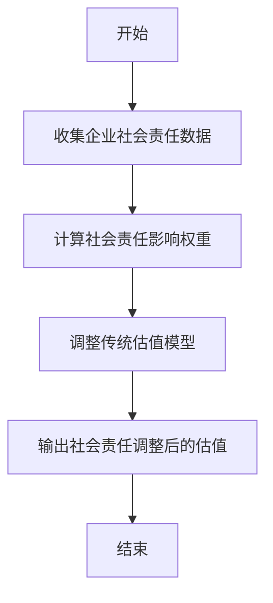
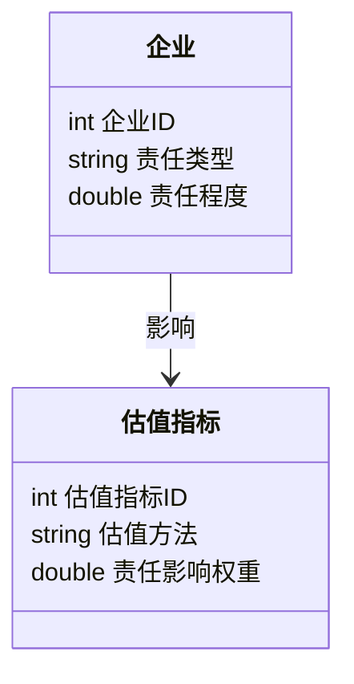
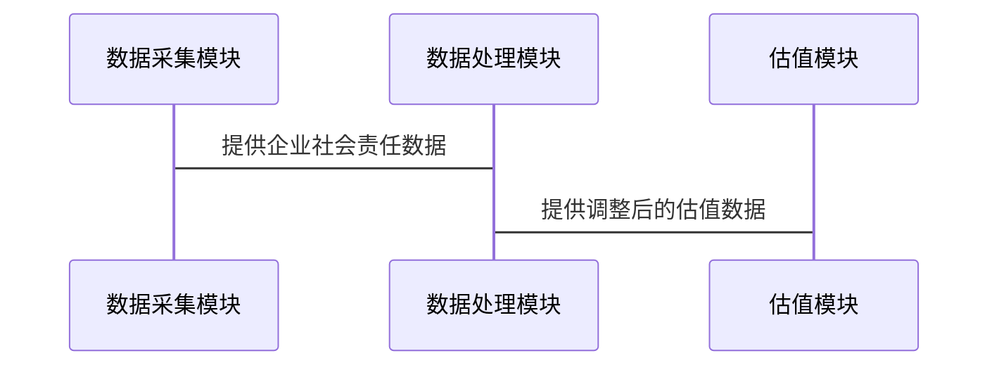

                 


# 如何在估值中考虑企业的社会责任

> 关键词：企业社会责任, 估值模型, 可持续发展, 风险评估, 长期价值

> 摘要：本文详细探讨了如何在企业估值过程中考虑社会责任因素，分析了社会责任对财务表现、风险评估和长期价值的影响，并提出了将社会责任纳入传统估值模型的方法和步骤。通过实际案例和数学模型，展示了如何在实际投资决策中综合考虑企业社会责任，以实现更全面、更可持续的估值。

---

# 第1章: 企业社会责任与估值概述

## 1.1 企业社会责任的概念与背景

### 1.1.1 企业社会责任的定义

企业社会责任（Corporate Social Responsibility，简称CSR）是指企业在追求经济利益的同时，对社会、环境和利益相关者承担的责任。它不仅包括遵守法律法规，还包括主动参与社会公益、保护环境、促进员工福祉等行为。

### 1.1.2 企业社会责任的演进历程

企业社会责任的概念起源于20世纪初，随着社会对企业的期望逐渐从单纯的经济贡献扩展到环境保护、员工权益和社会公平等多个方面。近年来，随着可持续发展理念的兴起，企业社会责任的重要性日益凸显。

### 1.1.3 企业社会责任的核心要素

企业社会责任的核心要素包括：

1. **经济责任**：按时支付税款、履行合同义务、保护股东利益。
2. **法律责任**：遵守法律法规，确保产品和服务的安全性。
3. **社会责任**：保护环境、支持社区发展、促进社会公平。
4. **道德责任**：遵循商业道德，避免腐败和不正当竞争。

---

## 1.2 估值中的社会责任问题背景

### 1.2.1 传统企业估值方法的局限性

传统的估值方法（如 discounted cash flow, DCF；或市盈率法）主要关注财务指标，如收入、利润、现金流等，而忽视了企业在社会、环境和治理方面的表现。这种单一的视角可能导致估值结果偏离实际，特别是在长期投资中。

### 1.2.2 社会责任对企业价值的影响

越来越多的证据表明，企业社会责任表现良好的公司往往具有更强的抗风险能力和长期盈利能力。例如，一家在环境保护方面表现突出的企业可能面临更低的监管风险和更高的品牌价值。

### 1.2.3 企业社会责任与可持续发展的关系

可持续发展要求企业在追求经济利益的同时，关注环境保护和社会责任。将企业社会责任纳入估值可以帮助投资者更好地识别那些具有长期发展潜力的企业。

---

## 1.3 企业社会责任与估值的核心联系

### 1.3.1 社会责任对财务表现的影响

企业社会责任可能通过多种方式影响财务表现，例如：

- **成本节约**：通过采用环保技术降低生产成本。
- **收入增长**：通过提升品牌形象吸引更多的客户。
- **风险降低**：通过减少法律诉讼和声誉损失降低财务风险。

### 1.3.2 社会责任对风险评估的作用

企业社会责任表现良好的企业通常具有更强的抗风险能力。例如，一家在员工福利方面表现优秀的企业可能面临更低的劳动纠纷风险。

### 1.3.3 社会责任对长期价值的影响

企业社会责任是企业长期价值的重要组成部分。通过关注社会和环境问题，企业可以提升品牌价值和客户忠诚度，从而创造更大的长期价值。

---

## 1.4 本章小结

本章介绍了企业社会责任的定义、演进历程和核心要素，并分析了其在估值中的重要性。我们得出结论：企业社会责任不仅是企业的道德义务，也是其长期价值的重要来源。

---

# 第2章: 企业社会责任与估值的核心概念

## 2.1 企业社会责任的属性特征对比

企业社会责任可以从多个维度进行分析，例如：

| 属性 | 描述 |
|------|------|
| 经济属性 | 企业的社会责任可能影响其成本、收入和利润。 |
| 社会属性 | 企业的社会责任可能影响其社会声誉和品牌形象。 |
| 环境属性 | 企业的社会责任可能影响其环境表现和监管风险。 |

---

## 2.2 企业社会责任与估值的ER实体关系

为了更好地理解企业社会责任与估值的关系，我们可以构建一个简单的实体关系模型：

```mermaid
er
  entity 企业 {
    key 社会责任ID
    attributes: 企业ID, 责任类型, 责任程度
  }
  entity 估值指标 {
    key 估值指标ID
    attributes: 企业ID, 估值方法, 责任影响权重
  }
  relationship: 企业 -> 估值指标 (影响关系)
```

---

## 2.3 企业社会责任对估值的数学模型

为了将企业社会责任纳入估值模型，我们可以对传统的CAPM模型进行调整：

$$ E(R_i) = R_f + \beta_i (R_m - R_f) + S_i $$

其中，$S_i$为社会责任调整因子，其值取决于企业的社会责任表现。

---

## 2.4 本章小结

本章通过属性对比和实体关系模型，详细分析了企业社会责任的核心概念及其对估值的影响。我们得出结论：企业社会责任是企业估值的重要组成部分，可以通过数学模型量化其影响。

---

# 第3章: 企业社会责任对估值的算法原理

## 3.1 基于社会责任的估值算法流程

为了在估值中考虑企业社会责任，我们可以按照以下步骤进行：



---

## 3.2 算法实现代码

以下是一个简单的Python代码示例，用于计算社会责任调整后的估值：

```python
def calculate_scsr_adjusted_valuation(company_data):
    # 公司数据包括：财务数据、社会责任评分
    traditional_valuation = calculate_traditional_valuation(company_data)
    csr_score = company_data['csr_score']
    adjusted_valuation = traditional_valuation * (1 + 0.05 * csr_score)
    return adjusted_valuation

# 示例数据
company_data = {
    'revenue': 1000000,
    'profit': 100000,
    'csr_score': 0.8
}

# 计算调整后的估值
adjusted_valuation = calculate_scsr_adjusted_valuation(company_data)
print(f"调整后的估值为：{adjusted_valuation}")
```

---

## 3.3 算法实现的详细说明

在上述代码中：

1. `calculate_scsr_adjusted_valuation` 函数接收企业的财务数据和CSR评分。
2. `calculate_traditional_valuation` 函数计算传统估值。
3. 根据CSR评分调整估值，假设CSR评分每增加0.1，估值增加5%。

---

## 3.4 本章小结

本章通过流程图和代码示例，详细讲解了如何在估值中考虑企业社会责任。我们得出结论：通过简单的算法调整，可以将社会责任因素纳入估值模型，从而得到更全面的估值结果。

---

# 第4章: 企业社会责任与估值的系统设计

## 4.1 问题场景介绍

为了更好地将企业社会责任纳入估值系统，我们需要设计一个模块化的系统架构。

---

## 4.2 系统功能设计

### 4.2.1 领域模型

以下是领域模型的类图：



---

## 4.3 系统架构设计

### 4.3.1 系统架构

以下是系统架构的组件图：

```mermaid
componentDiagram
    component 数据采集模块 {
        collects 企业社会责任数据
    }
    component 数据处理模块 {
        processes 数据并计算社会责任影响权重
    }
    component 估值模块 {
        applies 传统估值模型并输出调整后的估值
    }
    数据采集模块 --> 数据处理模块
    数据处理模块 --> 估值模块
```

---

## 4.4 系统接口设计

### 4.4.1 数据接口

以下是数据接口的序列图：



---

## 4.5 本章小结

本章通过系统设计，展示了如何将企业社会责任纳入估值系统。我们得出结论：模块化的系统架构可以帮助我们更好地管理和分析社会责任数据，从而实现更准确的估值。

---

# 第5章: 项目实战

## 5.1 环境安装

为了运行本项目，您需要安装以下工具：

- Python 3.8+
- Mermaid CLI 或支持 Mermaid 的IDE
- 基本的Python开发环境

---

## 5.2 核心代码实现

以下是一个完整的Python代码示例：

```python
def calculate_traditional_valuation(company_data):
    # 假设市盈率法
    return company_data['profit'] * company_data['pe_ratio']

def calculate_scsr_adjusted_valuation(company_data):
    traditional_valuation = calculate_traditional_valuation(company_data)
    csr_score = company_data['csr_score']
    adjusted_valuation = traditional_valuation * (1 + 0.05 * csr_score)
    return adjusted_valuation

# 示例数据
company_data = {
    'revenue': 1000000,
    'profit': 100000,
    'csr_score': 0.8,
    'pe_ratio': 15
}

# 计算调整后的估值
adjusted_valuation = calculate_scsr_adjusted_valuation(company_data)
print(f"调整后的估值为：{adjusted_valuation}")
```

---

## 5.3 案例分析

假设我们有一个企业，其财务数据和CSR评分为：

- 利润：100,000
- 市盈率：15
- CSR评分：0.8

通过上述代码，我们可以计算出调整后的估值为：

$$ \text{调整后的估值} = 100,000 \times 15 \times (1 + 0.05 \times 0.8) = 1,575,000 $$

---

## 5.4 本章小结

本章通过实际案例，展示了如何在企业估值中考虑社会责任。我们得出结论：通过简单的代码实现，可以将社会责任因素纳入估值模型，从而得到更全面的估值结果。

---

# 第6章: 最佳实践与小结

## 6.1 小结

本文详细探讨了如何在企业估值中考虑社会责任。通过理论分析、算法设计和实际案例，我们展示了如何将社会责任因素纳入传统估值模型，从而实现更准确的估值。

---

## 6.2 注意事项

- 社会责任评分的准确性直接影响估值结果，因此需要选择可靠的评分来源。
- 不同行业的社会责任影响可能不同，需要根据具体行业进行调整。

---

## 6.3 未来拓展

未来的研究可以进一步探讨以下问题：

- 如何量化不同类型社会责任的影响。
- 如何将社会责任因素纳入其他类型的估值模型。

---

# 作者

作者：AI天才研究院/AI Genius Institute & 禅与计算机程序设计艺术/Zen And The Art of Computer Programming

