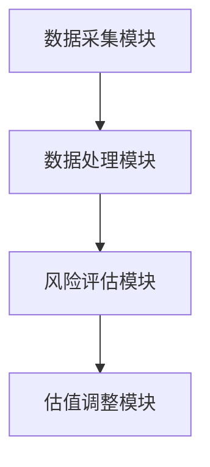

                 


# 如何处理企业估值中的地缘政治风险

> 关键词：企业估值，地缘政治风险，风险评估，资产定价，政治经济学

> 摘要：地缘政治风险是影响企业估值的重要因素。本文系统地探讨了地缘政治风险的定义、类型、影响以及如何在企业估值中进行有效管理和应对。通过数学模型、系统设计和实际案例分析，本文提供了从理论到实践的全面解决方案，帮助读者理解和应对地缘政治风险对企业估值的影响。

---

# 第一部分: 地缘政治风险与企业估值的背景介绍

## 第1章: 地缘政治风险的定义与影响

### 1.1 地缘政治风险的定义与核心概念

#### 1.1.1 地缘政治风险的定义
地缘政治风险是指由于政治、经济、军事或文化等领域的国际关系变化对企业价值产生的潜在影响。这种风险通常由国家间的冲突、贸易政策变化、外交关系恶化等因素引发。

#### 1.1.2 地缘政治风险的核心要素
- **政治因素**：政府政策变化、法律调整、外交关系等。
- **经济因素**：贸易壁垒、关税调整、货币政策变化等。
- **军事因素**：战争、冲突、制裁等。
- **文化因素**：国际社会对企业行为的负面看法。

#### 1.1.3 地缘政治风险与企业估值的关系
地缘政治风险直接影响企业的收入、成本和资产价值，进而影响企业的整体估值。

---

### 1.2 地缘政治风险对企业估值的影响

#### 1.2.1 地缘政治风险的潜在影响
- **收入下降**：贸易限制可能导致企业销售额下降。
- **成本上升**：关税增加或供应链中断可能推高生产成本。
- **资产贬值**：地缘政治冲突可能导致企业资产价值下降。

#### 1.2.2 地缘政治风险对企业价值的评估
- **资产定价模型**：在企业估值中，需要考虑地缘政治风险对资产未来现金流的影响。
- **风险调整折现率**：地缘政治风险通常会增加折现率，从而降低企业估值。

#### 1.2.3 地缘政治风险的量化与分析
- **风险评估指标**：通过政治风险指数（PCI）、贸易风险指数（TCI）等指标量化地缘政治风险。
- **情景分析**：假设不同地缘政治情景，评估企业估值的变化。

---

## 第2章: 地缘政治风险与企业估值的数学模型

### 2.1 地缘政治风险的量化模型

#### 2.1.1 风险评估模型的构建
地缘政治风险评估模型可以基于以下步骤构建：
1. 确定地缘政治风险的驱动因素（如贸易政策、国际关系等）。
2. 量化每个风险因素的影响程度。
3. 综合所有因素得到总体的地缘政治风险指数。

#### 2.1.2 风险权重的确定
- 风险权重可以通过历史数据分析确定，权重反映了每个风险因素对企业估值的影响程度。

#### 2.1.3 风险影响的计算公式
地缘政治风险指数（GPEI）计算公式如下：
$$ GPEI = \sum_{i=1}^{n} w_i \cdot R_i $$
其中，$w_i$ 是第 $i$ 个风险因素的权重，$R_i$ 是第 $i$ 个风险因素的风险水平。

---

### 2.2 地缘政治风险对企业价值的影响公式

#### 2.2.1 企业价值的计算公式
企业价值（EV）通常由以下公式计算：
$$ EV = \frac{FCF}{(1 + r)^t} $$
其中，$FCF$ 是未来现金流，$r$ 是折现率，$t$ 是时间。

#### 2.2.2 地缘政治风险对企业价值的调整公式
在考虑地缘政治风险的情况下，折现率 $r$ 需要调整为：
$$ r_{\text{调整}} = r + \lambda \cdot GPEI $$
其中，$\lambda$ 是风险溢价系数，$GPEI$ 是地缘政治风险指数。

#### 2.2.3 风险调整后的企业价值计算
$$ EV_{\text{调整}} = \frac{FCF}{(1 + r + \lambda \cdot GPEI)^t} $$

---

### 2.3 地缘政治风险的数学模型应用

#### 2.3.1 案例分析：中美贸易摩擦对企业估值的影响
假设一家美国企业受到中美贸易摩擦的影响，关税增加导致其成本上升10%。地缘政治风险指数 $GPEI$ 为0.8，风险溢价系数 $\lambda = 0.05$，则调整后的折现率为：
$$ r_{\text{调整}} = r + 0.05 \cdot 0.8 = r + 0.04 $$

#### 2.3.2 数学模型的实际应用
通过上述公式，可以量化地缘政治风险对折现率的影响，从而调整企业估值。

#### 2.3.3 模型结果的验证与优化
模型结果需要通过历史数据验证，并根据实际情况进行优化，例如调整权重或引入更多风险因素。

---

## 第3章: 地缘政治风险的系统分析与架构设计

### 3.1 系统分析与需求定义

#### 3.1.1 问题场景介绍
企业需要一个系统来实时监测地缘政治风险，并将其纳入估值模型中。

#### 3.1.2 项目目标与范围
- 目标：构建一个实时监测和评估地缘政治风险的系统。
- 范围：包括数据采集、风险评估、估值调整等功能。

#### 3.1.3 系统功能需求
- 数据采集：实时获取国际新闻、政策变化等数据。
- 风险评估：计算地缘政治风险指数。
- 估值调整：根据风险指数调整企业估值。

---

### 3.2 系统功能设计

#### 3.2.1 风险数据采集模块
- 功能：实时采集国际新闻、政策变化等数据。
- 输入：原始数据。
- 输出：结构化数据。

#### 3.2.2 风险评估模块
- 功能：计算地缘政治风险指数。
- 输入：结构化数据。
- 输出：风险指数。

#### 3.2.3 估值调整模块
- 功能：根据风险指数调整企业估值。
- 输入：风险指数。
- 输出：调整后的估值。

---

### 3.3 系统架构设计

#### 3.3.1 系统架构图（Mermaid）


#### 3.3.2 系统交互流程设计（Mermaid）
```mermaid
sequenceDiagram
    participant 用户
    participant 数据采集模块
    participant 数据处理模块
    participant 风险评估模块
    participant 估值调整模块
    用户 -> 数据采集模块: 提供地缘政治数据
    数据采集模块 -> 数据处理模块: 传输数据
    数据处理模块 -> 风险评估模块
    风险评估模块 -> 估值调整模块: 传输风险指数
    估值调整模块 -> 用户: 返回调整后的估值
```

---

## 第4章: 地缘政治风险的项目实战

### 4.1 案例分析：中美贸易摩擦对企业估值的影响

#### 4.1.1 环境配置
- 数据源：国际新闻、贸易政策数据。
- 工具：Python、Pandas、NumPy。

#### 4.1.2 核心代码实现
```python
import pandas as pd
import numpy as np

# 假设数据已经采集并结构化为df
df = pd.DataFrame({
    '政策变化': [0.1, 0.05, 0.08],
    '贸易壁垒': [0.2, 0.1, 0.15]
})

# 计算地缘政治风险指数
def calculate_gpei(data):
    weights = {'政策变化': 0.4, '贸易壁垒': 0.6}
    gpei = data['政策变化'] * weights['政策变化'] + data['贸易壁垒'] * weights['贸易壁垒']
    return gpei

df['GPEI'] = df.apply(lambda x: calculate_gpei(x), axis=1)
print(df)
```

#### 4.1.3 案例分析与结果解读
- 计算出的地缘政治风险指数（GPEI）反映了政策变化和贸易壁垒对企业估值的影响。
- 通过调整折现率，可以得出风险调整后的企业估值。

---

## 第5章: 总结与最佳实践

### 5.1 本章小结
地缘政治风险是企业估值中不可忽视的因素。通过数学模型和系统设计，可以有效量化和应对地缘政治风险。

### 5.2 最佳实践 tips
- 定期更新风险评估模型。
- 关注国际新闻和政策变化。
- 结合历史数据验证模型。

### 5.3 未来研究方向
- 开发更复杂的地缘政治风险模型。
- 探讨地缘政治风险对企业其他方面的（如供应链）的影响。

---

# 作者：AI天才研究院/AI Genius Institute & 禅与计算机程序设计艺术 /Zen And The Art of Computer Programming

