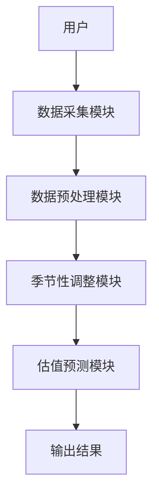

                 


# 如何处理企业估值中的季节性影响

> 关键词：企业估值，季节性影响，数学模型，算法，系统架构

> 摘要：本文将深入探讨企业估值中季节性影响的处理方法。通过分析季节性影响的定义、特征及其对估值的影响机制，结合数学模型和实际案例，详细讲解如何有效应对季节性波动对企业估值的影响。

---

## 引言

在企业估值过程中，季节性影响是一个不可忽视的重要因素。许多行业（如零售、旅游、制造等）的业务表现会因季节变化而显著波动。如果不加以调整，这些波动可能会导致估值结果的偏差，进而影响企业的战略决策。本文将从理论到实践，详细探讨如何处理企业估值中的季节性影响。

---

## 第一部分：季节性影响的背景与概念

### 第1章：季节性影响的背景与概念

#### 1.1 季节性影响的定义与特征

- **定义**：季节性影响是指企业在不同时间段内（如一年四季或特定月份）的业务表现因季节变化而产生的波动。这种波动可能影响收入、利润、资产和负债等多个方面。

- **特征**：
  - **周期性**：季节性影响通常具有固定的周期性，例如每年的节假日或特定季度。
  - **波动性**：季节性影响可能导致企业的收入和利润出现显著波动。
  - **行业差异**：不同行业的季节性影响表现不同，例如零售业的节假日销售高峰，制造业的季节性生产需求变化。

- **案例**：某零售企业在 holiday season（节日季）的销售额通常是其他季度的 3 倍，这种波动性就是季节性影响的典型表现。

#### 1.2 企业估值中的季节性影响

- **企业估值的基本概念**：企业估值是对企业价值的评估，通常包括对企业未来现金流的预测和折现。季节性影响可能会影响现金流的预测。

- **影响机制**：
  - 收入波动：季节性影响可能导致企业收入在特定时间段内显著增加或减少。
  - 利润波动：收入波动和成本变化可能导致利润出现周期性波动。
  - 资产和负债变化：季节性影响可能导致企业库存、应收账款等资产或负债在特定时间段内增加或减少。

- **边界与外延**：
  - 季节性影响通常是有规律的周期性波动，而非随机波动。
  - 季节性影响的外延可能包括行业特定的季节性因素，例如旅游行业的夏季高峰期。

---

### 第2章：季节性影响的核心概念与联系

#### 2.1 季节性影响的核心原理

- **数学模型**：
  - **趋势分解模型**：将时间序列数据分解为趋势（Trend）、季节性（Seasonality）和随机（Random）部分。
  - **异常值检测模型**：识别数据中的异常值，以减少季节性影响的干扰。
  - **加权平均模型**：通过加权平均的方法，消除季节性波动的影响。

- **特征对比表**：
  | 特征 | 季节性影响 | 非季节性影响 |
  |------|------------|--------------|
  | 时间性 | 具有周期性 | 时间分布均匀 |
  | 强度 | 可能显著 | 较小或不明显 |
  | 预测性 | 可预测 | 难以预测 |
  | 行业差异 | 高 | 低 |

- **ER实体关系图**：
  ```mermaid
  graph TD
      A[企业] --> B[季节性影响]
      B --> C[收入]
      B --> D[利润]
      B --> E[资产]
      B --> F[负债]
  ```

---

### 第3章：季节性影响的数学模型与算法

#### 3.1 季节性调整的数学模型

- **趋势分解模型**：
  $$ y_t = T_t + S_t + R_t $$
  其中，$T_t$ 是趋势部分，$S_t$ 是季节性部分，$R_t$ 是随机部分。

- **异常值检测模型**：
  $$ \hat{y}_t = \alpha y_{t-1} + (1-\alpha)y_{t-2} $$
  其中，$\alpha$ 是平滑参数。

- **加权平均模型**：
  $$ \hat{y}_t = \sum_{i=1}^{n} w_i y_{t-i} $$
  其中，$w_i$ 是权重，$y_{t-i}$ 是历史数据。

#### 3.2 算法实现步骤

1. 数据采集：收集企业的历史财务数据，包括收入、利润、资产和负债等。
2. 数据预处理：对数据进行清洗，处理缺失值和异常值。
3. 季节性分解：使用趋势分解模型，将数据分解为趋势、季节性和随机部分。
4. 季节性调整：根据季节性分解结果，调整当前估值。
5. 估值预测：结合调整后的数据，进行未来估值的预测。

#### 3.3 代码实现

```python
import pandas as pd
from statsmodels.tsa.seasonal import seasonal_decompose

# 示例数据：企业季度收入
data = pd.Series([100, 150, 120, 130, 200, 250, 220, 230])

# 季节性分解
decomposition = seasonal_decompose(data, model='additive')
trend = decomposition.trend
seasonal = decomposition.seasonal
residual = decomposition.resid

# 季节性调整后的收入
adjusted_data = trend + residual

print("Adjusted Data:", adjusted_data)
```

---

## 第二部分：系统分析与架构设计

### 第4章：系统分析与架构设计方案

#### 4.1 问题场景介绍

- **目标**：构建一个能够处理季节性影响的企业估值系统。
- **输入**：企业的历史财务数据。
- **输出**：调整后的估值结果。

#### 4.2 系统功能设计

- **数据采集模块**：从数据库中获取历史财务数据。
- **数据预处理模块**：清洗数据，处理缺失值和异常值。
- **季节性调整模块**：使用数学模型，调整季节性影响。
- **估值预测模块**：基于调整后的数据，进行估值预测。

#### 4.3 系统架构设计



#### 4.4 接口设计

- **输入接口**：提供 CSV 文件或数据库连接。
- **输出接口**：生成调整后的估值报告。

---

### 第5章：项目实战

#### 5.1 环境安装

- **工具**：Python、Pandas、Statsmodels。
- **安装命令**：
  ```bash
  pip install pandas statsmodels
  ```

#### 5.2 核心代码实现

```python
import pandas as pd
from statsmodels.tsa.seasonal import seasonal_decompose

# 示例数据：企业季度收入
data = pd.Series([100, 150, 120, 130, 200, 250, 220, 230])

# 季节性分解
decomposition = seasonal_decompose(data, model='additive')
trend = decomposition.trend
seasonal = decomposition.seasonal
residual = decomposition.resid

# 季节性调整后的收入
adjusted_data = trend + residual

print("Adjusted Data:", adjusted_data)
```

#### 5.3 案例分析

- **案例背景**：某零售企业在 holiday season 的销售额显著增加。
- **数据处理**：使用上述代码对销售额进行季节性调整。
- **结果分析**：调整后的数据更加准确，有助于企业进行估值预测。

---

## 第三部分：总结与展望

### 第6章：总结与展望

#### 6.1 本章总结

- **核心内容**：本文详细讲解了企业估值中季节性影响的处理方法，包括数学模型、算法实现和系统设计。
- **实际意义**：通过处理季节性影响，可以提高估值的准确性和可靠性，为企业决策提供更好的支持。

#### 6.2 未来展望

- **算法优化**：进一步优化季节性调整模型，提高预测精度。
- **行业应用**：将本文的方法推广到更多行业，帮助更多企业应对季节性影响。

---

## 结语

企业估值中的季节性影响是一个复杂但重要的问题。通过数学模型和系统设计，我们可以有效应对季节性波动，提高估值的准确性。希望本文的分析和案例能够为企业提供有价值的参考。

---

**作者**：AI天才研究院/AI Genius Institute & 禅与计算机程序设计艺术 /Zen And The Art of Computer Programming

