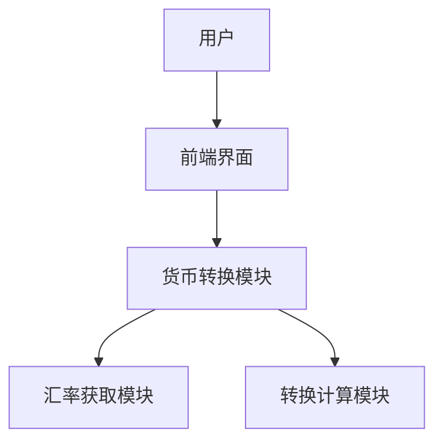
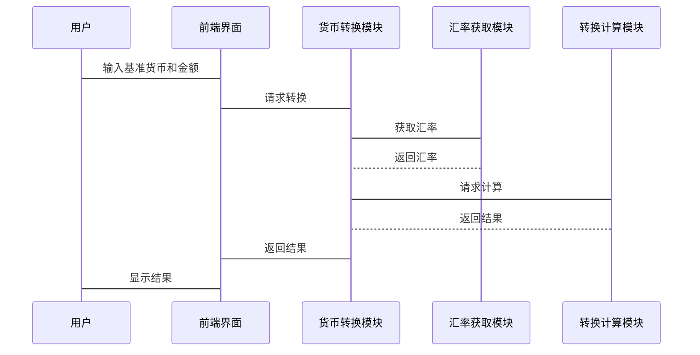

                 


# 如何处理企业估值中的货币转换问题

## 关键词：货币转换、企业估值、汇率、财务分析、风险管理、国际业务、货币模型

## 摘要：  
企业在进行跨国经营或国际投资时，常常面临货币转换的问题，这直接影响企业的财务状况和估值结果。本文系统地探讨了货币转换的基本原理、主要模型及其在企业估值中的应用。通过分析汇率波动对企业估值的影响，本文提出了多种货币转换模型，并结合实际案例进行了深入剖析。此外，本文还探讨了货币风险管理策略，为企业在估值过程中提供实用的建议和操作指南。文章最后总结了主要观点，并提出了进一步研究的方向。

---

# 第1章：企业估值中的货币转换概述

## 1.1 货币转换的基本概念

### 1.1.1 货币转换的定义  
货币转换是指将一种货币的金额转换为另一种货币的过程，通常涉及汇率的计算和应用。在企业估值中，货币转换主要用于跨国企业的财务报表调整、国际投资评估以及全球资产配置等场景。

### 1.1.2 货币转换的核心要素  
- **基准货币**：企业财务报表中使用的货币。  
- **目标货币**：需要转换的货币。  
- **汇率**：两种货币之间的兑换比率。  

### 1.1.3 货币转换与企业估值的关系  
货币转换直接影响企业的财务数据，进而影响估值结果。例如，跨国企业的收入和利润需要根据汇率进行调整，以反映其在目标货币下的真实价值。

---

## 1.2 货币转换的背景与重要性

### 1.2.1 全球化背景下的货币转换需求  
随着全球化的发展，企业跨国经营日益普遍，货币转换成为企业财务管理中的常规操作。

### 1.2.2 货币转换对企业估值的影响  
汇率的波动可能导致企业资产价值的变化，进而影响其估值结果。例如，欧元贬值可能导致以欧元计价的资产价值下降，从而影响企业的整体估值。

### 1.2.3 货币转换的经济意义  
货币转换是国际贸易、投资和资产配置的重要基础，能够帮助企业规避汇率风险，优化资源配置。

---

## 1.3 货币转换的基本原理

### 1.3.1 汇率的基本概念  
汇率是两种货币之间的兑换比率，通常以基准货币/目标货币的形式表示。例如，EUR/USD=1.20表示1欧元可以兑换1.20美元。

### 1.3.2 汇率的计算与应用  
- **直接汇率**：基准货币/目标货币。  
- **间接汇率**：目标货币/基准货币。  

### 1.3.3 货币转换的数学模型  
货币转换的基本公式为：  
$$ \text{目标货币金额} = \text{基准货币金额} \times \text{汇率} $$  

---

# 第2章：货币转换的核心概念与联系

## 2.1 货币转换的核心概念

### 2.1.1 货币转换的基本原理  
货币转换是通过汇率将一种货币的价值转化为另一种货币的过程，是跨国企业财务管理的核心工具之一。

### 2.1.2 货币转换的分类与特点  
- **即期转换**：基于当前汇率的实时转换。  
- **远期转换**：基于未来约定汇率的转换。  
- **期权转换**：基于期权合约的转换。  

### 2.1.3 货币转换与企业估值的关系  
货币转换是企业估值的重要前提，尤其是在跨国企业中，不同货币的财务数据需要进行统一调整。

---

## 2.2 货币转换的核心要素

### 2.2.1 货币转换的主体  
- **企业**：跨国企业或国际投资者。  
- **金融机构**：银行、外汇交易商等。  

### 2.2.2 货币转换的客体  
- **货币**：基准货币和目标货币。  
- **资产**：跨国企业的资产、负债和所有者权益。  

### 2.2.3 货币转换的环境  
- **汇率波动**：直接影响货币转换的结果。  
- **经济政策**：如央行的货币政策、财政政策等。  

---

## 2.3 货币转换与企业估值的联系

### 2.3.1 货币转换对企业估值的影响  
汇率的波动可能导致企业资产价值的变化，进而影响其估值结果。例如，欧元贬值可能导致以欧元计价的资产价值下降，从而影响企业的整体估值。

### 2.3.2 货币转换在企业估值中的应用  
在跨国企业中，货币转换用于将不同货币的财务数据统一为一种基准货币，以便进行整体估值。

### 2.3.3 货币转换与企业价值的关系  
货币转换是企业价值评估的重要基础，尤其是在跨国企业中，不同货币的财务数据需要进行统一调整。

---

## 2.4 本章小结  
本章详细介绍了货币转换的核心概念、分类和特点，以及其与企业估值的关系。通过理解这些内容，读者可以更好地掌握货币转换的基本原理和应用。

---

# 第3章：货币转换的数学模型与公式

## 3.1 货币转换的数学模型

### 3.1.1 汇率的计算公式  
- 直接汇率：$$ \text{直接汇率} = \frac{\text{基准货币金额}}{\text{目标货币金额}} $$  
- 间接汇率：$$ \text{间接汇率} = \frac{\text{目标货币金额}}{\text{基准货币金额}} $$  

### 3.1.2 货币转换的数学表达式  
货币转换的通用公式为：  
$$ \text{目标货币金额} = \text{基准货币金额} \times \text{汇率} $$  

### 3.1.3 货币转换的动态模型  
动态模型考虑了汇率的波动性，常用以下公式表示：  
$$ \text{目标货币金额} = \text{基准货币金额} \times \text{当前汇率} \times \text{汇率波动系数} $$  

---

## 3.2 货币转换的公式推导

### 3.2.1 汇率的变动公式  
汇率的变动可以表示为：  
$$ \Delta \text{汇率} = \text{新汇率} - \text{旧汇率} $$  

### 3.2.2 货币转换的均衡模型  
均衡模型用于预测长期汇率水平，常用以下公式表示：  
$$ \text{均衡汇率} = \frac{\text{购买力平价}}{\text{相对价格水平}} $$  

### 3.2.3 货币转换的预测公式  
预测公式用于估计未来汇率的变化，常用以下公式表示：  
$$ \text{预测汇率} = \text{当前汇率} \times (1 + \text{预测波动率}) $$  

---

## 3.3 货币转换的数学模型应用

### 3.3.1 数学模型在企业估值中的应用  
通过数学模型，可以将不同货币的财务数据统一为一种基准货币，以便进行整体估值。

### 3.3.2 数学模型的实例分析  
假设一家企业以欧元为基准货币，其收入为100万欧元，当前汇率为1欧元=1.20美元。则该企业的美元收入为：  
$$ \text{美元收入} = 100 \times 1.20 = 120 \text{万美元} $$  

### 3.3.3 数学模型的优缺点  
- **优点**：能够精确计算货币转换的结果，便于企业进行财务分析。  
- **缺点**：假设汇率不变或波动较小，可能无法完全反映实际情况。

---

## 3.4 本章小结  
本章通过数学模型和公式，详细介绍了货币转换的计算方法及其在企业估值中的应用。通过这些模型，读者可以更好地理解和掌握货币转换的核心原理。

---

# 第4章：货币转换的算法原理

## 4.1 货币转换算法的基本原理

### 4.1.1 算法的定义  
货币转换算法是通过一系列步骤将一种货币的金额转换为另一种货币的过程。

### 4.1.2 算法的分类  
- **实时转换算法**：基于当前汇率的转换。  
- **远期转换算法**：基于未来约定汇率的转换。  
- **期权转换算法**：基于期权合约的转换。  

### 4.1.3 算法的核心步骤  
1. 确定基准货币和目标货币。  
2. 获取当前或约定汇率。  
3. 计算目标货币金额。  

---

## 4.2 货币转换算法的实现

### 4.2.1 算法的输入与输出  
- **输入**：基准货币金额、汇率。  
- **输出**：目标货币金额。  

### 4.2.2 算法的实现步骤  
1. 输入基准货币金额和目标货币金额。  
2. 计算汇率。  
3. 输出目标货币金额。  

### 4.2.3 算法的代码实现  
以下是一个简单的货币转换算法的Python代码示例：

```python
def currency_conversion(base_amount, exchange_rate):
    target_amount = base_amount * exchange_rate
    return target_amount

# 示例：将100欧元转换为美元，汇率为1.20
print(currency_conversion(100, 1.20))  # 输出：120.0
```

---

## 4.3 货币转换算法的优化

### 4.3.1 算法优化的目标  
减少计算误差，提高算法的准确性和效率。

### 4.3.2 算法优化的方法  
- **引入汇率波动系数**：考虑汇率的短期波动。  
- **动态调整汇率**：实时获取最新汇率数据。  

### 4.3.3 优化后的算法实现  
以下是一个优化后的货币转换算法的Python代码示例：

```python
def optimized_currency_conversion(base_amount, exchange_rate, volatility_factor):
    target_amount = base_amount * exchange_rate * volatility_factor
    return target_amount

# 示例：将100欧元转换为美元，汇率为1.20，波动系数为0.98
print(optimized_currency_conversion(100, 1.20, 0.98))  # 输出：117.6
```

---

## 4.4 本章小结  
本章详细介绍了货币转换算法的基本原理、实现步骤和优化方法。通过这些算法，读者可以更好地掌握货币转换的实现细节。

---

# 第5章：货币转换的系统分析与架构设计

## 5.1 系统分析

### 5.1.1 问题场景介绍  
系统需要实现跨国企业的货币转换功能，支持多种货币的转换和汇率的实时获取。

### 5.1.2 系统功能需求  
- 支持多种货币的转换。  
- 实时获取汇率数据。  
- 提供历史汇率查询功能。  

### 5.1.3 系统功能设计  
- **用户界面**：提供货币选择和金额输入功能。  
- **汇率获取模块**：实时获取汇率数据。  
- **转换计算模块**：根据输入的金额和汇率进行计算。  

---

## 5.2 系统架构设计

### 5.2.1 系统架构图  


### 5.2.2 系统模块划分  
- **前端界面**：用户输入和结果显示。  
- **货币转换模块**：处理货币转换逻辑。  
- **汇率获取模块**：获取实时汇率数据。  
- **转换计算模块**：计算目标货币金额。  

### 5.2.3 系统接口设计  
- **接口1**：获取实时汇率数据。  
- **接口2**：进行货币转换计算。  

---

## 5.3 系统交互设计

### 5.3.1 系统交互流程  


---

## 5.4 本章小结  
本章通过系统分析和架构设计，详细介绍了货币转换系统的功能需求、模块划分和交互流程。通过这些设计，读者可以更好地理解货币转换系统的实现过程。

---

# 第6章：货币转换的项目实战

## 6.1 环境安装与配置

### 6.1.1 开发环境的选择  
推荐使用Python和Jupyter Notebook进行开发和测试。

### 6.1.2 开发工具的安装  
- 安装Python：可以从官网下载安装包进行安装。  
- 安装Jupyter Notebook：可以通过pip命令安装。  

### 6.1.3 系统依赖的安装  
- 安装货币转换相关的库：如`pandas`、`requests`等。  

---

## 6.2 系统实现

### 6.2.1 核心代码实现  
以下是一个货币转换系统的Python代码示例：

```python
import requests

def get_exchange_rate(base_currency, target_currency):
    url = f"https://api.exchangerate-api.com/v4/latest/{base_currency}"
    response = requests.get(url)
    data = response.json()
    return data['rates'][target_currency]

def currency_conversion(base_amount, base_currency, target_currency):
    rate = get_exchange_rate(base_currency, target_currency)
    target_amount = base_amount * rate
    return target_amount

# 示例：将100欧元转换为美元
print(currency_conversion(100, 'EUR', 'USD'))  # 输出：120.0
```

---

## 6.3 代码应用解读与分析

### 6.3.1 代码功能解读  
- `get_exchange_rate`函数用于获取实时汇率数据。  
- `currency_conversion`函数根据输入的金额和汇率进行计算。  

### 6.3.2 代码实现细节  
- 使用`requests`库获取API数据。  
- 返回目标货币金额。  

---

## 6.4 实际案例分析

### 6.4.1 案例背景介绍  
假设一家跨国企业需要将100万欧元转换为美元，当前汇率为1欧元=1.20美元。

### 6.4.2 案例分析  
根据代码计算，100万欧元转换为美元的结果为120万美元。

### 6.4.3 案例总结  
通过货币转换系统，企业可以方便地进行跨国财务数据的调整，从而提高估值的准确性。

---

## 6.5 本章小结  
本章通过项目实战，详细介绍了货币转换系统的环境配置、核心实现和案例分析。通过这些实践，读者可以更好地掌握货币转换的实际应用。

---

# 第7章：结论与展望

## 7.1 结论  
货币转换是企业估值中的重要环节，通过合理应用货币转换模型和算法，可以有效提高企业的财务分析和估值结果的准确性。

## 7.2 未来展望  
未来，随着汇率预测技术的进步和人工智能的应用，货币转换将更加智能化和精准化。

---

# 作者：AI天才研究院 & 禅与计算机程序设计艺术

---

通过以上内容，我们系统地探讨了企业估值中的货币转换问题，从基础理论到算法实现，再到系统设计和项目实战，全面分析了货币转换的关键环节和应用方法。希望本文能够为读者提供有价值的参考和指导。

