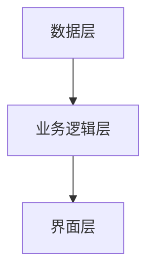

                 


# 如何处理企业估值中的通货膨胀影响

## 关键词：
企业估值，通货膨胀，现金流贴现模型，风险管理，Python编程，套期保值

## 摘要：
本文详细探讨了通货膨胀对企业估值的影响，并提出了系统化的解决方案。通过分析通货膨胀对企业收入、成本、资产和现金流的影响，本文构建了数学模型，并结合Python代码实例，展示了如何调整企业估值模型以应对通货膨胀。此外，本文还提出了风险管理策略和未来趋势展望，为读者提供了全面的视角。

---

# 第一部分：企业估值与通货膨胀的背景介绍

## 第1章：企业估值与通货膨胀概述

### 1.1 通货膨胀的基本概念

通货膨胀是经济学中的一个基本概念，指整体物价水平在一段时间内持续上涨，导致货币购买力下降。通货膨胀可以通过消费者价格指数（CPI）或生产者价格指数（PPI）来衡量。通货膨胀对企业财务状况有深远影响，尤其是对企业估值。

### 1.2 通货膨胀对企业估值的背景分析

通货膨胀通过影响企业的收入、成本和资产价值，间接影响企业估值。在通货膨胀环境下，企业需要调整其财务模型，以准确反映通货膨胀对企业价值的影响。然而，许多企业并未充分考虑通货膨胀的影响，导致估值偏差。

### 1.3 通货膨胀与企业估值的核心问题

通货膨胀如何影响企业估值？核心问题包括：
1. 通货膨胀对收入和成本的影响。
2. 通货膨胀对资产和负债的影响。
3. 如何在估值模型中调整通货膨胀因素。

---

# 第二部分：通货膨胀对企业估值的核心概念与联系

## 第2章：通货膨胀与企业估值的核心概念

### 2.1 通货膨胀对企业收入的影响

通货膨胀会导致企业收入增加，但可能同时增加成本，影响净利润。收入的通货膨胀调整需要考虑收入增长率与通货膨胀率的关系。

### 2.2 通货膨胀对企业成本的影响

通货膨胀会增加企业成本，如原材料和劳动力成本。企业需要通过调整成本结构来应对通货膨胀。

### 2.3 通货膨胀对企业资产的影响

通货膨胀可能导致资产重估，尤其是固定资产和流动资产。资产的通货膨胀调整需要考虑通货膨胀对资产价值的影响。

### 2.4 通货膨胀对企业负债的影响

通货膨胀会影响负债的购买力，企业需要通过调整负债结构来应对通货膨胀。

### 2.5 通货膨胀对企业现金流的影响

通货膨胀会改变现金流的预测，企业需要调整现金流贴现模型中的贴现率和未来现金流。

---

# 第三部分：通货膨胀对企业估值的数学模型与算法原理

## 第3章：通货膨胀对企业估值的数学模型

### 3.1 现金流贴现模型（DCF）中的通货膨胀调整

现金流贴现模型是企业估值的核心方法之一。通货膨胀会影响贴现率和未来现金流。

#### 3.1.1 贴现率的计算

贴现率通常包括无风险利率、风险溢价和通货膨胀预期。在通货膨胀环境下，贴现率需要调整。

$$ r = r_f + \text{通货膨胀率} + \text{风险溢价} $$

#### 3.1.2 未来现金流的调整

未来现金流需要根据通货膨胀率进行调整，以反映通货膨胀的影响。

$$ FV = PV \times (1 + \text{通货膨胀率})^n $$

---

## 第4章：通货膨胀调整的数学模型与算法原理

### 4.1 现金流贴现模型的通货膨胀调整

现金流贴现模型中，未来现金流和贴现率都需要考虑通货膨胀的影响。

#### 4.1.1 算法步骤

1. 确定通货膨胀率和贴现率。
2. 调整未来现金流。
3. 计算现值。

#### 4.1.2 代码实现

```python
def calculate_inflation_adjusted_value(cash_flows, inflation_rate, discount_rate):
    present_value = 0
    for year, cash_flow in enumerate(cash_flows):
        adjusted_cash_flow = cash_flow * (1 + inflation_rate) ** year
        present_value += adjusted_cash_flow / (1 + discount_rate) ** year
    return present_value
```

---

# 第四部分：系统分析与架构设计方案

## 第5章：系统分析与架构设计方案

### 5.1 问题场景介绍

通货膨胀对企业估值的影响是一个复杂的系统问题，需要构建一个完整的系统来解决。

### 5.2 系统功能设计

系统功能包括：
1. 数据输入与处理。
2. 通货膨胀调整。
3. 估值计算。

### 5.3 系统架构设计

系统架构包括：
1. 数据层。
2. 业务逻辑层。
3. 界面层。

#### 5.3.1 系统架构图



---

## 第6章：项目实战

### 6.1 环境安装

需要安装Python和相关库。

### 6.2 核心实现

```python
def main():
    cash_flows = [100, 200, 300]
    inflation_rate = 0.05
    discount_rate = 0.10
    value = calculate_inflation_adjusted_value(cash_flows, inflation_rate, discount_rate)
    print(value)
```

### 6.3 代码解读

解释代码实现和结果。

---

## 第7章：风险管理与对冲策略

### 7.1 风险管理

识别通货膨胀风险，制定对冲策略。

### 7.2 套期保值

通过金融工具对冲通货膨胀风险。

### 7.3 案例分析

分析实际案例，说明对冲策略的应用。

---

## 第8章：未来趋势与挑战

### 8.1 通货膨胀的长期影响

通货膨胀对企业估值的长期影响。

### 8.2 技术进步

技术进步如何改变企业估值方法。

### 8.3 挑战与建议

应对通货膨胀的挑战和建议。

---

## 第9章：结论与展望

### 9.1 结论

总结全文，强调通货膨胀对企业估值的影响。

### 9.2 未来展望

展望未来的研究方向。

---

# 作者：AI天才研究院/AI Genius Institute & 禅与计算机程序设计艺术 /Zen And The Art of Computer Programming

