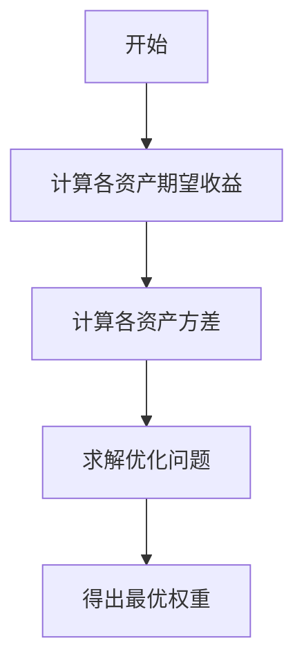
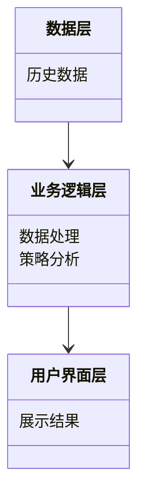
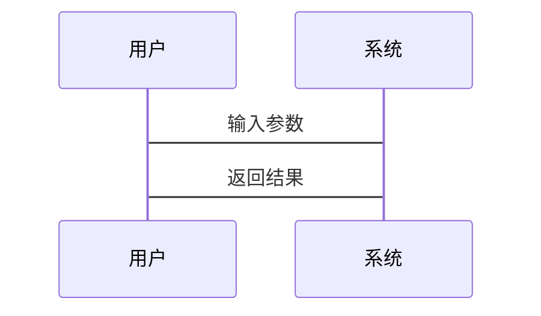

                 


# 如何将特价股票策略与其他投资策略结合

> 关键词：特价股票策略，投资组合优化，技术分析，基本面分析，风险管理，夏普比率，投资策略结合

> 摘要：本文详细探讨了如何将特价股票策略与其他投资策略相结合，以优化投资组合。通过分析不同策略的原理、协同效应和数学模型，结合系统设计与实战案例，帮助读者理解如何有效结合策略，降低风险，提高收益。

---

# 第一章：特价股票策略与其他投资策略的结合概述

## 1.1 特价股票策略的定义与特点

### 1.1.1 特价股票策略的定义
特价股票策略是指投资者在特定条件下购买低于其内在价值的股票，以期在市场恢复时获得超额收益。这种策略通常关注市场低估的股票，利用价格波动进行投资。

### 1.1.2 特价股票策略的核心特点
- **逆向思维**：在市场低迷时买入，市场高涨时卖出。
- **价值导向**：基于对公司内在价值的评估，寻找被市场低估的机会。
- **风险管理**：通过分散投资和严格止损控制风险。

### 1.1.3 特价股票策略与其他股票策略的对比
| 策略类型 | 核心特点 | 适用场景 | 优缺点 |
|----------|----------|----------|--------|
| 技术分析 | 基于价格和成交量 | 短期价格波动 | 易受市场情绪影响 |
| 基本面分析 | 基于公司财务数据 | 长期价值判断 | 需要深入研究 |
| 特价股票策略 | 价格低于价值 | 市场低估时 | 风险较高，需要耐心 |

## 1.2 投资策略的多样性

### 1.2.1 主流投资策略的分类
- **价值投资**：寻找低估股票。
- **成长投资**：投资于高增长公司。
- **趋势投资**：跟随价格趋势。

### 1.2.2 技术分析与基本面分析的区别
技术分析关注价格走势，基本面分析关注公司财务数据。两者结合可以互补优势。

### 1.2.3 不同投资策略的适用场景
| 策略类型 | 适用场景 | 示例 |
|----------|----------|------|
| 价值投资 | 市场低迷 | 标普500成分股 |
| 成长投资 | 高增长行业 | 科技公司 |
| 趋势投资 | 上涨趋势 | 主流指数 |

## 1.3 特价股票策略与其他投资策略的结合意义

### 1.3.1 组合投资的优势
通过结合不同策略，投资者可以分散风险，捕捉更多收益机会。

### 1.3.2 风险分散的重要性
单一策略风险较高，结合策略可降低整体风险。

### 1.3.3 提高投资收益的潜力
不同策略在不同市场环境下表现不同，结合后可提高整体收益。

## 1.4 本章小结
本章介绍了特价股票策略的特点与其他投资策略的区别，强调了结合策略的必要性和优势。

---

# 第二章：特价股票策略的核心原理与数学模型

## 2.1 特价股票策略的核心原理

### 2.1.1 特价股票策略的数学模型
- **收益预测模型**：基于历史数据预测未来收益。
- **风险评估公式**：计算投资组合的风险。

### 2.1.2 投资组合优化的数学表达
$$
\text{目标：最大化收益} \quad \text{或最小化风险}
$$
$$
\text{约束：投资权重之和为1}
$$

### 2.1.3 特价股票策略的收益预测模型
$$
R_i = a \cdot P_i + b \cdot V_i
$$
其中，$R_i$是收益，$P_i$是价格，$V_i$是价值。

## 2.2 投资组合优化的算法原理

### 2.2.1 均值-方差优化模型
Mermaid流程图：


### 2.2.2 Markowitz有效前沿的构建
Markowitz有效前沿展示了在给定风险下，收益最大的组合。

### 2.2.3 现实中的挑战
- 数据不足
- 市场变化快

## 2.3 特价股票策略与其他策略的协同效应

### 2.3.1 技术分析与基本面分析的结合
技术分析提供短期信号，基本面分析提供长期价值判断。

### 2.3.2 风险对冲策略的应用
使用衍生工具对冲市场风险。

### 2.3.3 时间序列分析
利用历史价格数据预测未来走势。

## 2.4 本章小结
本章详细讲解了特价股票策略的数学模型和优化算法，分析了与其他策略结合的优势。

---

# 第三章：投资组合优化的系统分析与架构设计

## 3.1 系统分析与设计概述

### 3.1.1 投资组合优化的场景描述
投资者希望通过系统实现策略结合，优化投资组合。

### 3.1.2 系统功能需求分析
- 数据采集
- 策略分析
- 投资组合优化
- 风险管理

### 3.1.3 系统非功能需求分析
- 可扩展性
- 实时性

## 3.2 系统架构设计

### 3.2.1 系统架构的分层设计
- 数据层：存储历史数据
- 业务逻辑层：处理数据，执行策略
- 用户界面层：展示结果

### 3.2.2 系统模块的划分与交互
Mermaid类图：


### 3.2.3 系统架构的可扩展性设计
模块化设计，便于后续添加新策略。

## 3.3 系统接口设计

### 3.3.1 数据接口的设计
- 数据输入接口
- 数据输出接口

### 3.3.2 算法接口的设计
- 策略分析接口
- 优化算法接口

### 3.3.3 用户接口的设计
- 输入参数接口
- 输出结果接口

## 3.4 系统交互设计

### 3.4.1 系统交互流程图
Mermaid序列图：


## 3.5 本章小结
本章设计了投资组合优化系统的架构，展示了模块划分和交互流程。

---

# 第四章：投资组合优化的实战案例与代码实现

## 4.1 环境安装与配置

### 4.1.1 安装Python和必要的库
- 安装Python 3.8+
- 安装Pandas、NumPy、Scipy

### 4.1.2 数据源配置
选择可靠的数据源，如Yahoo Finance。

## 4.2 核心代码实现

### 4.2.1 数据采集与预处理
```python
import pandas as pd
import numpy as np

# 从Yahoo Finance获取数据
def get_data(ticker):
    data = pd.read_csv(f'https://query1.finance.yahoo.com/chart/{ticker}')
    return data['Close']
```

### 4.2.2 算法实现
```python
from scipy.optimize import minimize

def portfolio_optimization(returns):
    n = len(returns.columns)
    # 定义目标函数
    def objective(weights, returns):
        return - (weights @ returns.mean())
    # 定义约束
    constraints = [{'type': 'eq', 'fun': lambda w: sum(w) - 1}]
    # 求解
    result = minimize(objective, np.ones(n)/n, constraints=constraints)
    return result.x
```

### 4.2.3 结果分析
- 计算夏普比率
- 绘制有效前沿

## 4.3 实战案例分析

### 4.3.1 数据分析
分析历史数据，寻找低估股票。

### 4.3.2 策略实施
结合技术分析和基本面分析，选择投资组合。

### 4.3.3 结果解读
计算投资组合的收益和风险，优化结果。

## 4.4 本章小结
本章通过实际案例展示了如何实现投资组合优化，帮助读者理解理论应用。

---

# 第五章：最佳实践、小结、注意事项与拓展阅读

## 5.1 最佳实践

### 5.1.1 策略结合的原则
- 分散投资
- 定期再平衡
- 风险管理

### 5.1.2 工具选择
- 使用专业投资软件
- 借助API获取数据

### 5.1.3 持续学习
关注市场动态，更新策略。

## 5.2 小结

### 5.2.1 本章内容回顾
详细讲解了如何结合特价股票策略与其他策略，优化投资组合。

## 5.3 注意事项

### 5.3.1 风险提示
- 市场波动风险
- 数据质量问题
- 模型假设偏差

### 5.3.2 实际操作中的注意事项
- 严格止损
- 分散投资
- 定期评估

## 5.4 拓展阅读

### 5.4.1 推荐书籍
- 《投资学》
- 《算法交易》

### 5.4.2 推荐网站
- Quantitative Research
- 投资组合优化论坛

---

# 作者：AI天才研究院/AI Genius Institute & 禅与计算机程序设计艺术 /Zen And The Art of Computer Programming

