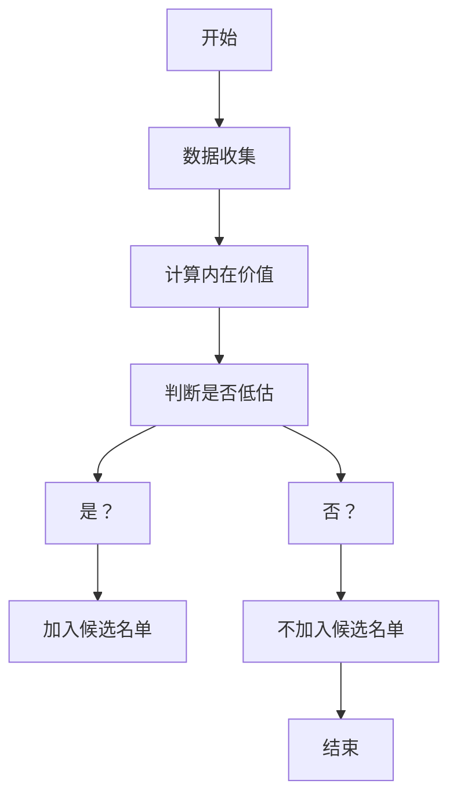
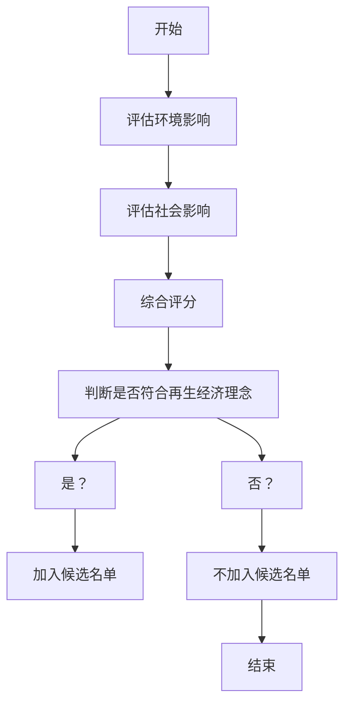
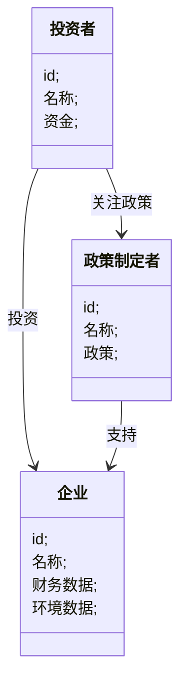

                 


# 如何将特价股票策略与再生经济投资理念结合

> **关键词**：特价股票策略、再生经济投资、股票筛选算法、可持续投资模型、经济循环优化
>
> **摘要**：本文详细探讨了如何将特价股票策略与再生经济投资理念相结合，通过数学模型和算法优化，构建一种既追求短期收益又注重长期可持续发展的投资策略。文章从背景与概念、核心概念与联系、算法原理、数学模型与公式，到系统分析与架构设计方案，层层展开，为投资者提供了一种全新的投资思路。

---

## 第一部分：特价股票策略与再生经济投资理念的背景与概念

### 1.1 特价股票策略的定义与特点

特价股票策略是一种以寻找被市场低估的股票为核心的投资方法。以下是其定义与特点：

#### 1.1.1 什么是特价股票
特价股票是指市场价格低于其内在价值的股票。这种股票通常被认为具有较高的投资潜力，因为它们的价格可能被市场低估，存在较大的反弹空间。

#### 1.1.2 特价股票的核心特点
- **低估值**：市场价格低于内在价值。
- **高波动性**：通常存在于周期性行业，价格波动较大。
- **潜在收益**：通过挖掘被忽视的股票，获得超额收益。

#### 1.1.3 特价股票的投资逻辑
- 投资者关注股票的基本面，如市盈率（P/E）、市净率（P/B）等指标，寻找低于行业平均水平的股票。
- 通过技术分析，寻找股价超跌反弹的机会。

### 1.2 再生经济投资理念的定义与特点

再生经济是一种以可持续发展为核心的投资理念，强调资源的循环利用和经济的生态化发展。

#### 1.2.1 什么是再生经济
再生经济强调通过减少资源消耗、降低污染、提高资源利用效率来实现经济增长。其核心在于“循环经济”和“可持续发展”。

#### 1.2.2 再生经济的核心特征
- **资源节约**：减少资源消耗，避免浪费。
- **循环利用**：推动资源的循环使用，减少废弃物产生。
- **环境友好**：降低对环境的负面影响。

#### 1.2.3 再生经济与传统经济的区别
- **传统经济**：以资源消耗为核心，追求GDP增长，忽视环境成本。
- **再生经济**：以资源效率为核心，追求可持续发展，注重环境效益。

### 1.3 特价股票与再生经济的联系

#### 1.3.1 投资理念的契合点
- **低价股票**：再生经济行业中的股票可能因为市场忽视或行业低迷而被低估。
- **长期价值**：再生经济企业具有较高的社会价值，符合长期投资逻辑。

#### 1.3.2 再生经济对特价股票的影响
- 再生经济行业的复苏可能带动相关股票的价值重估。
- 再生经济的政策支持可能提升相关股票的市场表现。

#### 1.3.3 组合投资的优势
- 通过结合特价股票的短期收益和再生经济的长期价值，投资者可以在市场波动中实现收益稳定。

---

## 第二部分：特价股票策略与再生经济的核心概念与联系

### 2.1 核心概念原理

#### 2.1.1 特价股票的评估模型
- **内在价值计算**：通过DCF（ discounted cash flow）模型评估股票的内在价值。
- **低估判断**：比较市场价格与内在价值，寻找低估股票。

#### 2.1.2 再生经济的评估指标
- **环境影响评估**：量化企业的环境影响，如碳排放、资源消耗等。
- **社会影响评估**：评估企业在社会可持续发展方面的表现。

#### 2.1.3 两者结合的逻辑框架
- **筛选过程**：首先筛选出符合再生经济理念的企业，再在这些企业中寻找被低估的股票。

### 2.2 核心概念对比分析

#### 2.2.1 特价股票与再生经济的对比表格

| **属性**       | **特价股票**                     | **再生经济**                     |
|-----------------|----------------------------------|----------------------------------|
| 核心目标         | 寻找被低估的股票                 | 推动资源循环利用，实现可持续发展 |
| 评估指标         | 市盈率、市净率                   | 碳排放、资源利用率               |
| 投资周期         | 短期至中期                       | 长期                              |
| 风险特征         | 市场波动风险较高                 | 环境政策风险较高                 |

#### 2.2.2 特价股票与再生经济的ER实体关系图

```mermaid
er
actor 投资者;
actor 政策制定者;
actor 企业;
-- 以下是实体关系图
class 投资者 {
    id;
    名称;
}
class 政策制定者 {
    id;
    名称;
}
class 企业 {
    id;
    名称;
}
```

---

## 第三部分：特价股票策略与再生经济的算法原理

### 3.1 算法原理概述

#### 3.1.1 特价股票筛选算法
- **数据收集**：收集股票的历史价格、财务数据等。
- **估值计算**：使用DCF模型计算股票的内在价值。
- **低估判断**：比较市场价格与内在价值，筛选出低估股票。

#### 3.1.2 再生经济评估算法
- **环境影响评估**：量化企业的环境影响。
- **社会影响评估**：评估企业在社会可持续发展方面的表现。

#### 3.1.3 组合优化算法
- **目标函数**：最大化投资收益。
- **约束条件**：确保组合中包含符合再生经济理念的企业。

### 3.2 算法流程图

#### 3.2.1 特价股票筛选流程图（mermaid）



#### 3.2.2 再生经济评估流程图（mermaid）



### 3.3 算法实现代码

#### 3.3.1 特价股票筛选算法

```python
def calculate_intrinsic_value(stock_data):
    # 假设stock_data包含现金流、折现率等信息
    cash_flow = stock_data['cash_flow']
    discount_rate = stock_data['discount_rate']
    intrinsic_value = cash_flow / discount_rate
    return intrinsic_value

def is_undervalued(current_price, intrinsic_value, margin=0.2):
    return current_price <= intrinsic_value * (1 - margin)
```

#### 3.3.2 再生经济评估算法

```python
def calculate_environmental_impact(enterprise_data):
    # 假设enterprise_data包含碳排放、资源消耗等信息
    carbon_emission = enterprise_data['carbon_emission']
    resource_usage = enterprise_data['resource_usage']
    environmental_impact = carbon_emission + resource_usage
    return environmental_impact

def calculate_social_impact(enterprise_data):
    # 假设enterprise_data包含员工福利、社会责任等信息
    employee_welfare = enterprise_data['employee_welfare']
    social_responsibility = enterprise_data['social_responsibility']
    social_impact = employee_welfare + social_responsibility
    return social_impact
```

---

## 第四部分：数学模型与公式

### 4.1 特价股票评估模型

#### 4.1.1 估值公式
$$\text{内在价值} = \frac{\text{现金流}}{\text{折现率}}$$

#### 4.1.2 相关性分析
$$r = \frac{n\sum xy - \sum x \sum y}{\sqrt{n\sum x^2 - (\sum x)^2} \sqrt{n\sum y^2 - (\sum y)^2}}$$

### 4.2 再生经济评估模型

#### 4.2.1 可持续性评分公式
$$\text{评分} = \alpha \times \text{环境影响} + \beta \times \text{社会影响} + \gamma \times \text{经济效益}$$

#### 4.2.2 线性回归分析
$$y = a + bx + e$$

---

## 第五部分：系统分析与架构设计方案

### 5.1 问题场景介绍

#### 5.1.1 投资者需求分析
- 投资者希望通过投资特价股票获得短期收益。
- 投资者希望投资符合再生经济理念的企业，实现长期可持续发展。

#### 5.1.2 市场环境分析
- 当前市场存在大量被低估的股票。
- 再生经济正在成为全球关注的焦点，相关企业具有较高的发展潜力。

### 5.2 系统功能设计

#### 5.2.1 领域模型（mermaid类图）



---

## 结语

通过将特价股票策略与再生经济投资理念相结合，投资者可以在追求短期收益的同时，关注企业的长期可持续发展。这种投资策略不仅符合市场趋势，还具有较高的社会责任感。未来，随着再生经济的不断发展，这种投资理念将具有更大的发展潜力。

---

**作者**：AI天才研究院/AI Genius Institute & 禅与计算机程序设计艺术 /Zen And The Art of Computer Programming

