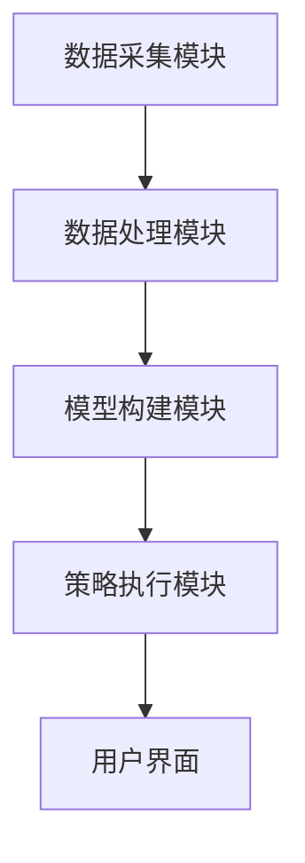

                 


# 如何将特价股票策略与另类数据因子共创策略相结合

> 关键词：特价股票策略，另类数据因子，协同算法，系统架构，投资策略

> 摘要：本文详细探讨了如何将特价股票策略与另类数据因子相结合，从背景、核心概念到数学模型、系统设计、项目实战等多方面进行了深入分析，最后总结了最佳实践和未来发展方向。

---

## 第一部分: 特价股票策略与另类数据因子概述

### 第1章: 特价股票策略的背景与现状

#### 1.1 特价股票的定义与特点
- **定义**：特价股票是指在特定市场条件下，价格低于其内在价值的股票。
- **特点**：价格波动大、低估值、高潜力。
- **市场定位**：通常出现在市场低迷或公司暂时困境时期。

#### 1.2 另类数据因子的定义与特点
- **定义**：另类数据是指传统金融数据以外的非结构化数据，如社交媒体情绪、新闻头条、专利数量等。
- **特点**：非结构化、实时性强、多样性高。
- **应用**：用于预测市场情绪、识别潜在风险。

#### 1.3 特价股票策略与另类数据因子的结合背景
- **背景分析**：传统股票策略依赖历史数据，难以捕捉实时市场变化。另类数据的引入弥补了这一不足。
- **挑战**：数据量大、处理复杂、模型精度要求高。
- **优势**：提高预测准确性，捕捉市场拐点。

---

## 第二部分: 特价股票策略与另类数据因子的核心概念

### 第2章: 特价股票策略的理论基础

#### 2.1 技术分析与基本面分析的结合
- **技术分析**：通过K线图、均线等技术指标预测价格走势。
- **基本面分析**：关注公司财务状况、行业地位等。
- **结合方法**：综合技术指标和基本面数据，识别潜在投资机会。

#### 2.2 特价股票策略的核心要素
- **价格偏离度**：价格与内在价值的偏离程度。
- **市场情绪**：投资者情绪对股价的影响。
- **交易量**：成交量的变化反映市场热度。

#### 2.3 数学模型
- **时间序列模型**：ARIMA模型用于预测股价走势。
- **回归分析**：建立股价与多种因子的回归模型。
- **聚类分析**：将股票按相似性分组，识别潜在特价股票。

### 第3章: 另类数据因子的理论基础

#### 3.1 另类数据的来源与分类
- **来源**：社交媒体、新闻、专利、供应链数据等。
- **分类**：文本数据、图像数据、网络流量数据。

#### 3.2 另类数据因子的构建方法
- **文本挖掘**：使用NLP技术提取情感倾向。
- **图像识别**：通过OCR识别公司财报中的信息。
- **自然语言处理**：分析新闻标题的情绪指数。

#### 3.3 评估标准
- **数据质量**：数据的准确性和实时性。
- **相关性**：数据与股价变动的相关性。
- **可解释性**：因子对股价的影响程度是否清晰。

### 第4章: 特价股票策略与另类数据因子的协同算法

#### 4.1 协同过滤算法
- **原理**：基于用户行为和市场数据，推荐潜在的特价股票。
- **步骤**：收集用户数据，构建用户-股票矩阵，计算相似性，推荐股票。

#### 4.2 强化学习算法
- **原理**：通过状态-动作-奖励机制优化投资决策。
- **步骤**：定义状态空间，设计动作策略，设定奖励函数，训练模型。

#### 4.3 集成学习算法
- **原理**：结合多种模型的优势，提高预测准确性。
- **步骤**：构建多个基模型，集成预测结果，优化最终决策。

---

## 第三部分: 系统架构设计

### 第3章: 系统功能设计

#### 3.1 数据采集模块
- **功能**：实时采集股票价格、新闻、社交媒体数据。
- **工具**：API接口、爬虫技术。

#### 3.2 数据处理模块
- **功能**：清洗、转换、标准化数据。
- **工具**：Python的Pandas库。

#### 3.3 模型构建模块
- **功能**：训练协同算法模型，生成预测结果。
- **工具**：机器学习框架如Scikit-learn、TensorFlow。

#### 3.4 策略执行模块
- **功能**：根据模型输出生成交易信号。
- **工具**：交易API。

### 第4章: 系统架构图



---

## 第四部分: 项目实战与案例分析

### 第4章: 项目实战

#### 4.1 环境安装
- **工具**：Python 3.8+, Jupyter Notebook, Pandas, Scikit-learn, TensorFlow。

#### 4.2 核心代码实现

```python
import pandas as pd
from sklearn.ensemble import RandomForestClassifier

# 数据加载
data = pd.read_csv('stock_data.csv')

# 特征工程
features = data[['price', 'volume', 'sentiment_score']]
target = data['target']

# 模型训练
model = RandomForestClassifier()
model.fit(features, target)

# 预测
predictions = model.predict(features)
```

#### 4.3 案例分析
- **案例背景**：某科技公司股价受新闻影响出现暴跌，符合特价股票特征。
- **分析过程**：利用另类数据因子分析社交媒体情绪，结合技术分析预测股价反弹。

#### 4.4 小结
- **经验总结**：数据质量直接影响模型精度，需加强数据清洗和特征工程。

---

## 第五部分: 总结与展望

### 第5章: 总结
- **主要观点**：将特价股票策略与另类数据因子结合，能显著提升投资策略的准确性和实时性。
- **优势**：捕捉市场拐点，提高投资收益。

### 第6章: 展望
- **未来研究方向**：探索更多另类数据来源，优化协同算法。
- **技术发展**：AI和大数据技术的进一步融合，推动投资策略创新。

---

## 作者信息

作者：AI天才研究院/AI Genius Institute & 禅与计算机程序设计艺术 /Zen And The Art of Computer Programming

