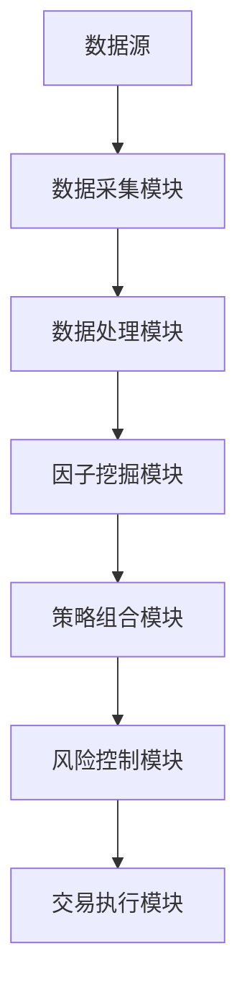

                 

# 如何将特价股票策略与另类数据因子挖掘策略相结合

> 关键词：特价股票策略，另类数据因子挖掘，投资策略，量化交易，数据驱动决策

> 摘要：本文探讨了如何将特价股票策略与另类数据因子挖掘策略相结合，通过分析两者的结合方式、算法原理、系统设计以及实际案例，为读者提供一个全面的解决方案，帮助投资者在复杂市场环境中制定更有效的投资策略。

---

## 第一部分：特价股票策略与另类数据因子挖掘策略的背景与基础

### 第1章：特价股票策略与另类数据因子挖掘策略概述

#### 1.1 特价股票策略的基本概念

##### 1.1.1 特价股票的定义与特点
特价股票是指在特定市场条件下价格低于其内在价值的股票。其特点包括价格波动大、市场关注度低、交易量小等。特价股票策略的核心目标是通过识别市场低估的机会，进行短期或长期投资以获取超额收益。

##### 1.1.2 特价股票策略的核心目标
- 识别市场低估的股票。
- 利用价格波动进行套利或投机。
- 在市场波动中捕捉短期收益。

##### 1.1.3 特价股票策略的市场背景
随着市场波动加剧，投资者 increasingly seek ways to capitalize on market inefficiencies. 特价股票策略成为一种重要的投资手段，尤其是在市场下跌或经济低迷时期。

#### 1.2 另类数据因子挖掘策略的基本概念

##### 1.2.1 另类数据的定义与特点
另类数据是指传统金融数据之外的非结构化数据，如社交媒体数据、新闻文章、卫星图像等。其特点包括数据的非结构化、实时性、多样性和复杂性。

##### 1.2.2 另类数据在金融领域的应用
- **文本数据**：通过自然语言处理技术分析新闻和社交媒体，识别市场情绪和潜在事件。
- **图像数据**：利用图像识别技术分析卫星图像，预测经济活动。
- **音频数据**：通过语音识别技术分析市场参与者的言论，预测价格走势。

##### 1.2.3 另类数据因子挖掘的核心目标
通过挖掘另类数据，提取有用的金融因子，帮助投资者更好地理解市场动态，做出更精准的投资决策。

#### 1.3 特价股票策略与另类数据因子挖掘策略的结合意义

##### 1.3.1 结合的必要性与可行性
- **必要性**：传统金融数据的局限性促使投资者寻找新的数据源。
- **可行性**：随着大数据技术的发展，另类数据的获取和处理变得更加可行。

##### 1.3.2 结合后的优势与潜在价值
- 提高策略的准确性和稳定性。
- 拓展投资机会，捕捉市场中的潜在收益。
- 提高交易效率，降低交易成本。

##### 1.3.3 结合的边界与外延
- 边界：结合策略的有效性和可操作性。
- 外延：从简单的数据挖掘扩展到复杂的算法优化。

---

## 第二部分：特价股票策略与另类数据因子挖掘策略的核心概念与原理

### 第2章：特价股票策略的核心概念与原理

#### 2.1 特价股票策略的分类

##### 2.1.1 套利策略
套利策略通过同时买入低估资产和卖出高估资产，利用价格差异获利。适用于市场套利机会较多的情况。

##### 2.1.2 事件驱动策略
事件驱动策略关注公司层面的事件，如并购、重组等，利用事件发生前后股价的变化进行投资。

##### 2.1.3 技术分析策略
技术分析策略通过分析历史价格和成交量数据，预测未来价格走势。

#### 2.2 特价股票策略的关键因素

##### 2.2.1 市场波动性
市场波动性影响特价股票策略的收益和风险。

##### 2.2.2 交易成本
交易成本包括佣金、滑点等，直接影响策略的盈利能力。

##### 2.2.3 时间窗口
策略的时间窗口决定了操作的频率和持有时间，影响策略的收益和风险。

#### 2.3 特价股票策略的数学模型

##### 2.3.1 时间序列分析模型
时间序列分析模型用于预测未来价格走势，常用的模型包括ARIMA和GARCH。

##### 2.3.2 回归模型
回归模型用于分析变量之间的关系，预测股价变化。

##### 2.3.3 马尔可夫链模型
马尔可夫链模型用于分析市场状态转移，预测市场趋势。

### 第3章：另类数据因子挖掘策略的核心概念与原理

#### 3.1 另类数据的分类

##### 3.1.1 文本数据
文本数据包括新闻文章、社交媒体帖子等，通过自然语言处理技术提取情感和主题。

##### 3.1.2 图像数据
图像数据包括卫星图像、公司标识等，通过图像识别技术提取信息。

##### 3.1.3 音频数据
音频数据包括电话会议录音、市场评论等，通过语音识别技术提取信息。

#### 3.2 另类数据因子的提取方法

##### 3.2.1 文本挖掘技术
文本挖掘技术包括情感分析、关键词提取等，用于从文本中提取有用的信息。

##### 3.2.2 图像识别技术
图像识别技术包括目标检测、图像分割等，用于从图像中提取信息。

##### 3.2.3 自然语言处理技术
自然语言处理技术用于理解和生成人类语言，帮助识别潜在的市场信号。

#### 3.3 另类数据因子的特征分析

##### 3.3.1 因子的稳定性
因子的稳定性影响其在不同市场环境下的表现。

##### 3.3.2 因子的相关性
因子的相关性影响其在组合策略中的表现。

##### 3.3.3 因子的可解释性
因子的可解释性影响其在实际应用中的可靠性。

### 第4章：特价股票策略与另类数据因子挖掘策略的结合方式

#### 4.1 因子筛选与策略优化

##### 4.1.1 因子筛选的标准
- 相关性：因子与目标资产价格变动的相关性。
- 稳定性：因子在不同市场环境下的稳定性。
- 可解释性：因子的可解释性。

##### 4.1.2 因子优化的方法
- 线性回归：用于筛选相关性高的因子。
- 逐步回归：逐步筛选出最优因子组合。
- 主成分分析：通过降维技术提取重要因子。

##### 4.1.3 因子权重的分配
- 等权重分配：每个因子分配相同的权重。
- 优化权重分配：根据因子的重要性分配不同权重。

#### 4.2 策略组合与风险控制

##### 4.2.1 策略组合的构建
- 单一策略：单独使用特价股票策略或另类数据因子策略。
- 组合策略：将两种策略结合使用，降低风险。

##### 4.2.2 风险控制措施
- 多样化投资：分散投资以降低风险。
- 风险对冲：使用衍生工具对冲市场风险。
- 交易风险管理：控制交易成本和滑点风险。

---

## 第三部分：特价股票策略与另类数据因子挖掘策略的算法原理

### 第5章：算法原理

#### 5.1 时间序列分析模型

##### 5.1.1 ARIMA模型
ARIMA模型用于预测未来价格走势，公式为：
$$ ARIMA(p, d, q) $$
其中，p为自回归阶数，d为差分阶数，q为移动平均阶数。

##### 5.1.2 GARCH模型
GARCH模型用于预测市场波动性，公式为：
$$ GARCH(p, q) $$
其中，p为自回归阶数，q为移动平均阶数。

#### 5.2 回归模型

##### 5.2.1 线性回归模型
线性回归模型用于分析变量之间的关系，公式为：
$$ y = \beta_0 + \beta_1x + \epsilon $$

##### 5.2.2 逻辑回归模型
逻辑回归模型用于分类问题，公式为：
$$ P(y=1|x) = \frac{e^{\beta_0 + \beta_1x}}{1 + e^{\beta_0 + \beta_1x}} $$

#### 5.3 机器学习模型

##### 5.3.1 支持向量机（SVM）
SVM用于分类和回归问题，通过构建超平面将数据分为两类。

##### 5.3.2 随机森林
随机森林通过构建多个决策树，进行投票或平均预测结果。

##### 5.3.3 神经网络
神经网络通过多层结构模拟人类神经网络，用于复杂模式识别。

---

## 第四部分：系统设计与实现

### 第6章：系统设计

#### 6.1 系统架构设计

##### 6.1.1 系统功能模块
- 数据采集模块：采集金融数据和另类数据。
- 数据处理模块：对数据进行清洗和预处理。
- 因子挖掘模块：提取有用因子。
- 策略组合模块：结合特价股票策略和另类数据因子策略。
- 风险控制模块：控制交易风险。

##### 6.1.2 系统架构图

#### 6.2 接口设计

##### 6.2.1 数据接口
- 数据接口用于获取金融数据和另类数据。
- 使用REST API进行数据交互。

##### 6.2.2 策略接口
- 策略接口用于调用不同的投资策略。
- 使用函数调用接口进行交互。

#### 6.3 交互流程设计

##### 6.3.1 用户需求分析
- 理解用户需求，设计系统功能。
- 确定系统模块和功能。

##### 6.3.2 系统实现
- 按照设计文档进行系统开发。
- 进行功能测试和性能测试。

##### 6.3.3 系统部署
- 部署系统到生产环境。
- 进行系统监控和维护。

---

## 第五部分：项目实战

### 第7章：项目实战

#### 7.1 环境搭建

##### 7.1.1 安装必要的软件
- 安装Python编程语言。
- 安装Jupyter Notebook进行数据分析。

##### 7.1.2 安装必要的库
- 使用Pandas进行数据分析。
- 使用Scikit-learn进行机器学习。
- 使用Numpy进行数值计算。

#### 7.2 核心实现

##### 7.2.1 数据采集与预处理
- 使用API获取金融数据和另类数据。
- 对数据进行清洗和预处理。

##### 7.2.2 因子挖掘
- 使用文本挖掘技术提取情感因子。
- 使用图像识别技术提取图像因子。

##### 7.2.3 策略组合
- 结合特价股票策略和另类数据因子策略。
- 优化因子权重和策略组合。

#### 7.3 案例分析

##### 7.3.1 数据分析
- 对历史数据进行分析，识别潜在机会。
- 对因子进行回测和验证。

##### 7.3.2 案例解读
- 分析成功案例，总结经验教训。
- 分析失败案例，提出改进建议。

---

## 第六部分：进阶与最佳实践

### 第8章：进阶与最佳实践

#### 8.1 小结
- 特价股票策略和另类数据因子挖掘策略的结合可以提高投资效率。
- 系统化的方法可以帮助投资者更好地应对市场变化。

#### 8.2 注意事项
- 风险控制是策略成功的关键。
- 数据质量直接影响策略效果。
- 算法优化需要不断测试和调整。

#### 8.3 拓展阅读
- 推荐阅读相关书籍和论文。
- 关注金融领域的新技术和发展。

---

## 作者信息

作者：AI天才研究院/AI Genius Institute & 禅与计算机程序设计艺术 /Zen And The Art of Computer Programming

