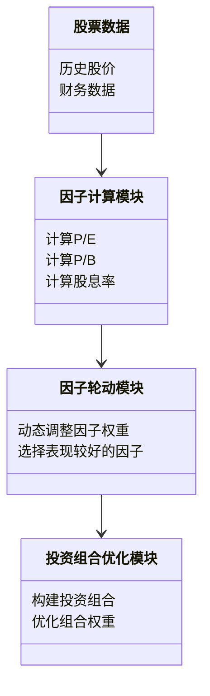
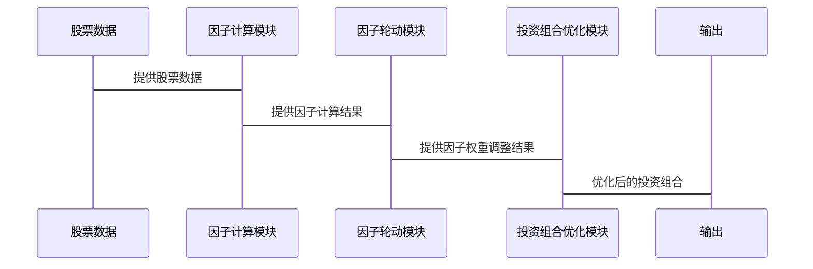

                 


# 如何将特价股票策略与因子轮动策略相结合

> 关键词：特价股票策略、因子轮动策略、股票投资、量化投资、策略结合

> 摘要：本文将详细介绍如何将特价股票策略与因子轮动策略相结合，通过分析两种策略的核心原理、数学模型和实际应用场景，探讨其结合的必要性、优势与潜在风险。同时，本文将从背景介绍、核心概念、算法实现、系统架构到项目实战等多维度展开，为读者提供一套完整的策略结合方案。

---

## 第1章 特价股票策略与因子轮动策略概述

### 1.1 特价股票策略的基本概念

#### 1.1.1 特价股票的定义与特征

特价股票通常指那些市场价格低于其内在价值的股票，投资者认为这些股票被市场低估，具有较大的上涨潜力。特价股票的核心特征包括：

- **低估值**：市盈率（P/E）、市净率（P/B）等估值指标显著低于行业或市场平均水平。
- **高分红**：股息率较高，通常意味着公司具有较强的盈利能力和稳定的股息支付能力。
- **流动性**：虽然特价股票可能流动性较低，但其潜在的上涨空间吸引了长期投资者。

#### 1.1.2 特价股票策略的核心思想

特价股票策略的核心思想是通过筛选低估值、高分红的股票，构建一个能够在市场反弹时获得超额收益的投资组合。这种策略通常适用于熊市或市场低迷时期，因为此时许多优质股票被市场错杀，价格被低估。

#### 1.1.3 特价股票策略的市场应用

在实际投资中，特价股票策略常用于价值投资，巴菲特等投资大师就是典型的践行者。该策略尤其适合长期投资者，但同时也需要投资者具备较强的选股能力和耐心，因为特价股票的反弹可能需要较长时间。

### 1.2 因子轮动策略的基本概念

#### 1.2.1 因子轮动的定义与特征

因子轮动策略是一种基于多因子模型的投资策略，通过动态调整因子权重来捕捉市场的变化趋势。其核心思想是根据市场环境的变化，选择表现较好的因子进行投资，避免表现不佳的因子。

因子轮动的特征包括：

- **动态性**：因子权重会根据市场表现动态调整。
- **多样性**：通常结合多个因子（如市值、价值、动量等）进行投资。
- **适应性**：能够根据市场环境的变化进行灵活调整。

#### 1.2.2 因子轮动的核心思想

因子轮动策略的核心思想是基于因子的周期性表现。不同因子在不同市场环境下表现不同，例如，在牛市中动量因子表现较好，而在熊市中价值因子表现较好。因此，因子轮动策略通过动态调整因子权重，能够在不同市场环境中获取超额收益。

#### 1.2.3 因子轮动策略的市场应用

因子轮动策略广泛应用于量化投资中，尤其是在机构投资中，通过多因子模型构建投资组合。该策略的优势在于能够根据市场变化灵活调整，但同时也需要较高的计算能力和数据支持。

### 1.3 特价股票策略与因子轮动策略的结合意义

#### 1.3.1 结合的必要性与优势

特价股票策略和因子轮动策略的结合，能够充分发挥两种策略的优势。特价股票策略能够在市场低迷时捕捉低估机会，而因子轮动策略则能够根据市场环境动态调整投资组合。两者的结合能够在不同市场环境下灵活应对，提高投资组合的稳定性。

#### 1.3.2 结合的潜在价值与风险

- **潜在价值**：通过结合两种策略，投资者可以在不同市场环境下灵活调整投资组合，降低风险，提高收益。
- **潜在风险**：因子轮动策略需要较高的计算能力和数据支持，且因子表现具有周期性，可能导致短期波动较大。

#### 1.3.3 结合的实际案例分析

以沪深300指数为例，假设我们结合特价股票策略和因子轮动策略，能够在市场低迷时选择低估值股票，在市场上涨时选择动量因子表现较好的股票，从而实现长期稳定的收益。

## 1.4 本章小结

通过本章的介绍，我们了解了特价股票策略和因子轮动策略的基本概念、核心思想和市场应用。两者的结合能够充分发挥各自的优势，为投资者提供一种灵活、稳定的投资策略。

---

## 第2章 特价股票策略的核心原理

### 2.1 特价股票的筛选标准

#### 2.1.1 市盈率（P/E）因子

市盈率是衡量股票估值的重要指标，公式为：

$$ P/E = \frac{Price}{Earnings} $$

通常，P/E低于行业平均水平的股票被认为是低估的。

#### 2.1.2 市净率（P/B）因子

市净率是衡量股票估值的另一个重要指标，公式为：

$$ P/B = \frac{Price}{Book\ Value} $$

P/B低于行业平均水平的股票被认为是低估的。

#### 2.1.3 股息率（Dividend Yield）因子

股息率是衡量股票分红能力的指标，公式为：

$$ Dividend\ Yield = \frac{Dividend}{Price} $$

股息率较高的股票通常被认为是高分红股票，具有较高的投资价值。

### 2.2 特价股票策略的实施步骤

#### 2.2.1 数据收集与预处理

- 数据来源：收集历史股价、财务数据等。
- 数据清洗：处理缺失值、异常值等。

#### 2.2.2 因子计算与排序

- 计算P/E、P/B、股息率等因子。
- 根据因子值对股票进行排序。

#### 2.2.3 投资组合构建与优化

- 根据排序结果选择部分股票构建投资组合。
- 通过优化算法（如均值-方差优化）优化投资组合。

### 2.3 特价股票策略的数学模型

#### 2.3.1 市盈率模型

$$ P/E = \frac{Price}{Earnings} $$

#### 2.3.2 市净率模型

$$ P/B = \frac{Price}{Book\ Value} $$

#### 2.3.3 股息率模型

$$ Dividend\ Yield = \frac{Dividend}{Price} $$

### 2.4 本章小结

通过本章的介绍，我们了解了特价股票策略的核心原理，包括筛选标准、实施步骤和数学模型。

---

## 第3章 因子轮动策略的核心原理

### 3.1 因子轮动的基本概念

#### 3.1.1 因子轮动的定义与特征

因子轮动是一种基于多因子模型的投资策略，通过动态调整因子权重来捕捉市场变化。其核心思想是根据市场环境的变化，选择表现较好的因子进行投资。

#### 3.1.2 因子轮动的核心要素

- **因子选择**：选择合适的因子（如市值、价值、动量等）。
- **因子权重**：根据因子表现动态调整权重。
- **因子轮动周期**：根据市场环境变化调整因子权重的频率。

### 3.2 因子轮动的实现步骤

#### 3.2.1 因子筛选与排序

- 根据因子表现对股票进行排序。
- 选择表现较好的因子。

#### 3.2.2 因子权重分配

- 根据因子表现动态调整权重。
- 使用优化算法（如拉格朗日乘数法）优化权重。

#### 3.2.3 投资组合动态调整

- 根据因子权重调整投资组合。
- 定期重新计算因子权重并调整投资组合。

### 3.3 因子轮动策略的数学模型

#### 3.3.1 多因子模型

$$ R_i = \alpha + \beta_1F_1 + \beta_2F_2 + \dots + \beta_nF_n + \epsilon $$

其中，$R_i$ 是股票i的超额收益，$F_j$ 是因子j的值，$\beta_j$ 是因子j的系数。

#### 3.3.2 因子权重分配模型

$$ w_i = \frac{F_i}{\sum_{j=1}^{n}F_j} $$

其中，$w_i$ 是因子i的权重，$F_i$ 是因子i的值。

### 3.4 本章小结

通过本章的介绍，我们了解了因子轮动策略的核心原理，包括基本概念、实现步骤和数学模型。

---

## 第4章 特价股票策略与因子轮动策略的结合模型

### 4.1 结合模型的构建思路

#### 4.1.1 特价股票因子的筛选与排序

- 根据P/E、P/B、股息率等因子筛选特价股票。
- 根据因子值对股票进行排序。

#### 4.1.2 因子轮动的周期性调整

- 根据市场环境变化动态调整因子权重。
- 定期重新计算因子权重并调整投资组合。

#### 4.1.3 组合权重的动态优化

- 根据因子轮动结果动态调整投资组合权重。
- 使用优化算法（如均值-方差优化）优化组合权重。

### 4.2 结合模型的具体实现

#### 4.2.1 数据收集与预处理

- 收集历史股价、财务数据等。
- 处理缺失值、异常值等。

#### 4.2.2 因子计算与排序

- 计算P/E、P/B、股息率等因子。
- 根据因子值对股票进行排序。

#### 4.2.3 因子权重分配

- 根据因子表现动态调整权重。
- 使用优化算法（如拉格朗日乘数法）优化权重。

#### 4.2.4 投资组合构建与优化

- 根据因子权重构建投资组合。
- 使用优化算法（如均值-方差优化）优化投资组合。

### 4.3 结合模型的实际案例分析

以沪深300指数为例，假设我们结合特价股票策略和因子轮动策略，能够在市场低迷时选择低估值股票，在市场上涨时选择动量因子表现较好的股票，从而实现长期稳定的收益。

### 4.4 本章小结

通过本章的介绍，我们了解了特价股票策略与因子轮动策略结合的模型构建思路、具体实现和实际案例分析。

---

## 第5章 系统分析与架构设计方案

### 5.1 问题场景介绍

- **问题描述**：如何将特价股票策略与因子轮动策略相结合，构建一个高效的投资系统。
- **边界与外延**：限定于股票投资领域，不考虑其他金融产品。

### 5.2 系统功能设计

#### 5.2.1 领域模型



#### 5.2.2 系统架构设计


### 5.3 系统接口设计

- **数据接口**：从数据源获取股票数据。
- **因子计算接口**：计算P/E、P/B、股息率等因子。
- **因子轮动接口**：动态调整因子权重。
- **投资组合优化接口**：构建并优化投资组合。

### 5.4 系统交互设计



### 5.5 本章小结

通过本章的介绍，我们了解了系统分析与架构设计方案，包括问题场景、系统功能设计、系统架构设计、系统接口设计和系统交互设计。

---

## 第6章 项目实战

### 6.1 环境安装

- **Python环境**：安装Python 3.x。
- **数据获取工具**：安装pandas、numpy等库。
- **可视化工具**：安装matplotlib或seaborn。

### 6.2 核心实现源代码

```python
import pandas as pd
import numpy as np

# 数据获取
df = pd.read_csv('stock_data.csv')

# 因子计算
df['PE'] = df['Price'] / df['Earnings']
df['PB'] = df['Price'] / df['Book Value']
df['Dividend Yield'] = df['Dividend'] / df['Price']

# 因子排序
sorted Stocks = df.sort_values('PE')

# 投资组合构建
selected_stocks = sorted_stocks.head(10)
weights = np.random.dirichlet(np.ones(len(selected_stocks)), 1)
```

### 6.3 代码应用解读与分析

- **数据获取**：从CSV文件中读取股票数据。
- **因子计算**：计算P/E、P/B、股息率等因子。
- **因子排序**：根据因子值对股票进行排序。
- **投资组合构建**：选择部分股票构建投资组合，并随机分配权重。

### 6.4 实际案例分析

以沪深300指数为例，假设我们结合特价股票策略和因子轮动策略，能够在市场低迷时选择低估值股票，在市场上涨时选择动量因子表现较好的股票，从而实现长期稳定的收益。

### 6.5 本章小结

通过本章的介绍，我们了解了项目实战的具体实现，包括环境安装、核心实现源代码、代码应用解读与分析、实际案例分析。

---

## 第7章 最佳实践与注意事项

### 7.1 最佳实践

- **数据质量**：确保数据来源可靠，处理数据时注意清洗。
- **因子选择**：根据市场环境选择合适的因子。
- **权重调整**：根据市场变化动态调整因子权重。
- **风险控制**：设置止损点，避免重大损失。

### 7.2 小结

通过本章的介绍，我们了解了最佳实践与注意事项，包括数据质量、因子选择、权重调整和风险控制。

### 7.3 注意事项

- **过度拟合**：避免过度拟合市场数据。
- **市场变化**：注意市场环境的变化对因子表现的影响。
- **交易成本**：考虑交易成本对投资组合的影响。

### 7.4 拓展阅读

- **《Python for Data Analysis》**
- **《Quantitative Equity Portfolio Management》**
- **《Factor-Based Investing》**

### 7.5 本章小结

通过本章的介绍，我们了解了最佳实践与注意事项，包括数据质量、因子选择、权重调整和风险控制。

---

## 作者：AI天才研究院/AI Genius Institute & 禅与计算机程序设计艺术 /Zen And The Art of Computer Programming

---

以上是《如何将特价股票策略与因子轮动策略相结合》的完整目录和内容框架，涵盖了从背景介绍、核心概念、算法原理、系统架构到项目实战等多方面内容，希望对您有所帮助！

