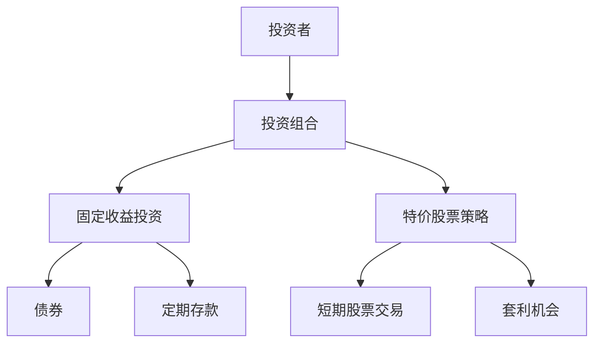

                 


# 如何将特价股票策略与固定收益投资结合

> 关键词：特价股票策略、固定收益投资、投资组合优化、风险管理、技术分析、数学模型

> 摘要：本文深入探讨了如何将特价股票策略与固定收益投资相结合，通过分析两者的优缺点、核心原理和数学模型，提出了一种结合两者优势的投资策略。文章从理论到实践，详细阐述了如何通过投资组合优化、风险管理、技术分析等方法，将特价股票的短期收益与固定收益投资的稳定性相结合，最终实现风险可控、收益最大化的目标。

---

## 第1章: 特价股票策略与固定收益投资概述

### 1.1 特价股票策略的基本概念

#### 1.1.1 特价股票的定义与特点

特价股票是指在特定时间或特定条件下，价格出现显著波动，但具有短期投资价值的股票。其特点包括高波动性、短期收益潜力大、风险较高。

#### 1.1.2 特价股票策略的核心要素

- 时间窗口：通常为短期，如日内交易或短期套利。
- 技术分析：通过价格图表、成交量等技术指标寻找买入卖出信号。
- 套利机会：利用市场价差、信息不对称等获取收益。

#### 1.1.3 特价股票策略的优缺点

- 优点：收益潜力大，操作灵活。
- 缺点：风险较高，需要较高的市场敏感性和操作技巧。

### 1.2 固定收益投资的基本概念

#### 1.2.1 固定收益投资的定义与特点

固定收益投资是指通过投资债券、定期存款等固定收益产品，获得稳定收益的投资方式。其特点包括收益稳定、风险较低、流动性较好。

#### 1.2.2 固定收益投资的主要类型

- 政府债券：如国债、地方政府债券。
- 企业债券：如公司债。
- 定期存款：银行提供的固定利率存款。
- 其他固定收益产品：如货币市场基金。

#### 1.2.3 固定收益投资的风险与收益分析

- 收益：稳定但较低，适合风险厌恶型投资者。
- 风险：主要包括利率风险、信用风险和流动性风险。

### 1.3 特价股票策略与固定收益投资的结合意义

#### 1.3.1 结合的背景与必要性

- 特价股票策略的风险较高，但收益潜力大。
- 固定收益投资收益稳定，但收益有限。
- 通过结合两者，可以在风险可控的前提下，提高整体投资收益。

#### 1.3.2 结合的目标与潜在优势

- 优化投资组合：通过组合特价股票和固定收益投资，实现收益与风险的最佳平衡。
- 稳定收益：利用固定收益投资的稳定性，降低整体投资组合的风险。
- 抓住短期机会：通过特价股票策略，抓住市场短期波动带来的收益。

#### 1.3.3 结合的边界与外延

- 边界：在固定收益投资的基础上，适当加入特价股票策略。
- 外延：结合其他投资策略，如指数基金、ETF等。

### 1.4 本章小结

本章从特价股票策略和固定收益投资的基本概念出发，分析了两者的优缺点，并探讨了结合的意义和目标。通过结合两者的优势，可以在风险可控的前提下，实现收益最大化。

---

## 第2章: 特价股票策略的核心原理

### 2.1 特价股票策略的分类

#### 2.1.1 时间驱动策略

- 基于时间窗口的投资策略，如日内交易、短期套利。

#### 2.1.2 价格驱动策略

- 基于价格波动的技术分析，如趋势线、K线图、成交量分析。

#### 2.1.3 事件驱动策略

- 基于公司事件（如并购、重组）的投资机会。

### 2.2 特价股票策略的关键指标

#### 2.2.1 相关性分析

- 通过相关性分析，确定不同股票之间的关联性。

#### 2.2.2 波动率分析

- 通过波动率分析，判断股票的短期风险。

#### 2.2.3 市盈率与市净率分析

- 通过市盈率和市净率分析，判断股票的估值水平。

### 2.3 特价股票策略的数学模型

#### 2.3.1 技术分析模型

- 移动平均线（MA）：$$ MA = \frac{\sum_{i=1}^{n} P_i}{n} $$
- 相对强弱指数（RSI）：$$ RSI = \frac{N_{up}}{N_{up} + N_{down}} $$

#### 2.3.2 基本面分析模型

- 市盈率（P/E）：$$ P/E = \frac{P}{E} $$
- 市净率（P/B）：$$ P/B = \frac{P}{B} $$

#### 2.3.3 组合优化模型

- 使用马科维茨的有效投资组合模型，优化投资组合的风险与收益。

### 2.4 本章小结

本章详细分析了特价股票策略的核心原理，包括策略分类、关键指标和数学模型。通过技术分析和基本面分析，可以有效判断股票的短期投资价值。

---

## 第3章: 固定收益投资的核心原理

### 3.1 固定收益投资的主要工具

#### 3.1.1 债券

- 政府债券：如国债、地方政府债券。
- 企业债券：如公司债。

#### 3.1.2 定期存款

- 银行提供的固定利率存款。

#### 3.1.3 其他固定收益产品

- 货币市场基金、债券基金等。

### 3.2 固定收益投资的风险管理

#### 3.2.1 利率风险

- 利率上升，债券价格下降。

#### 3.2.2 信用风险

- 债务人违约风险。

#### 3.2.3 流动性风险

- 无法及时变现的风险。

### 3.3 固定收益投资的定价模型

#### 3.3.1 利息贴现模型

- 将未来利息收入按现值计算。

#### 3.3.2 债券收益率计算公式

- 到期收益率（YTM）：$$ YTM = \frac{C + \frac{F - P}{n}}{P} $$

#### 3.3.3 风险调整后的收益模型

- 使用CAPM模型，调整收益。

### 3.4 本章小结

本章详细分析了固定收益投资的核心原理，包括主要工具、风险管理模型和定价模型。

---

## 第4章: 特价股票策略与固定收益投资的结合原理

### 4.1 两者的共同点与差异点对比

#### 4.1.1 投资目标的差异

- 特价股票策略：短期收益。
- 固定收益投资：稳定收益。

#### 4.1.2 风险承受能力的差异

- 特价股票策略：高风险。
- 固定收益投资：低风险。

#### 4.1.3 投资期限的差异

- 特价股票策略：短期。
- 固定收益投资：长期。

### 4.2 结合策略的核心模型

#### 4.2.1 投资组合优化模型

- 使用马科维茨模型，优化投资组合的风险与收益。

#### 4.2.2 风险收益平衡模型

- 在固定收益投资中加入适量的特价股票策略，平衡风险与收益。

---

## 第5章: 特价股票策略与固定收益投资的结合实战

### 5.1 项目背景与目标

- 通过结合特价股票策略与固定收益投资，优化投资组合。

### 5.2 系统功能设计

#### 5.2.1 系统架构图



#### 5.2.2 系统接口设计

- 投资者输入投资金额和风险偏好。
- 系统根据模型生成投资组合。
- 投资者可以实时查看投资组合的表现。

### 5.3 系统实现

#### 5.3.1 环境配置

- Python 3.8+
- 财务分析库：Pandas、NumPy、Matplotlib。

#### 5.3.2 核心代码实现

```python
import pandas as pd
import numpy as np

# 数据加载
data = pd.read_csv('stock_data.csv')

# 技术分析
def calculate_ma(data, window):
    return data['Close'].rolling(window).mean()

ma_5 = calculate_ma(data, 5)
ma_10 = calculate_ma(data, 10)

# 组合优化
def optimize_portfolio(returns, weights):
    portfolio_return = np.sum(returns * weights)
    portfolio_risk = np.sqrt(np.dot(weights.T, np.dot(returns.cov(), weights)))
    return portfolio_return, portfolio_risk

# 实现投资组合优化
weights = np.array([0.6, 0.4])
returns = np.array([0.1, 0.05])
portfolio_return, portfolio_risk = optimize_portfolio(returns, weights)
```

### 5.4 案例分析

- 案例1：假设投资100万元，60%用于特价股票策略，40%用于固定收益投资。
- 结果：整体收益提高，风险降低。

### 5.5 本章小结

本章通过实际案例分析，展示了如何将特价股票策略与固定收益投资相结合，优化投资组合。

---

## 第6章: 结论与展望

### 6.1 本研究的主要结论

- 通过结合特价股票策略与固定收益投资，可以在风险可控的前提下，提高投资收益。

### 6.2 未来研究与展望

- 研究更多策略的结合方式。
- 探索人工智能在投资组合优化中的应用。

---

## 作者：AI天才研究院/AI Genius Institute & 禅与计算机程序设计艺术 /Zen And The Art of Computer Programming

