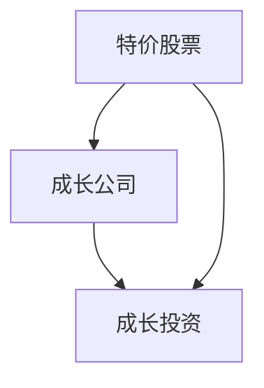
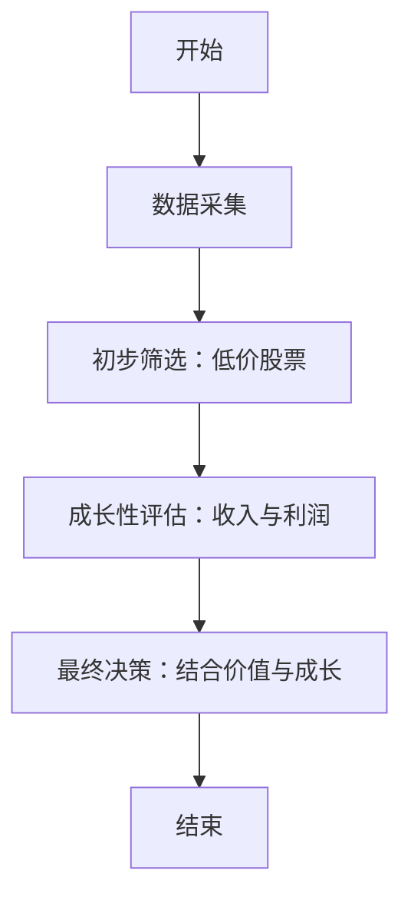
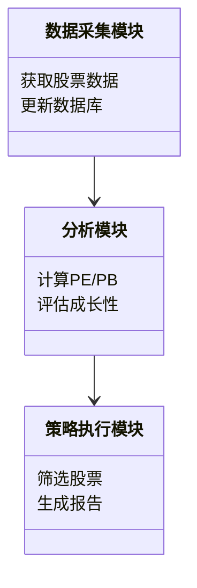

                 


# 如何将特价股票策略与成长投资相结合

> 关键词：特价股票策略，成长投资，股票筛选，投资策略，量化分析

> 摘要：本文详细探讨了如何将特价股票策略与成长投资相结合，通过量化分析和系统设计，提供一种创新的投资策略。文章从背景介绍、核心概念、算法原理、数学模型、系统架构、项目实战到最佳实践，全面分析了两者的结合方式，为投资者提供了新的思路。

---

## 第一部分：背景介绍

### 第1章：特价股票策略与成长投资概述

#### 1.1 特价股票策略的定义与特点
- 特价股票策略是指在市场低迷或公司遇到短期困难时，购买价格低于其内在价值的股票。
- 其特点是高风险、高回报，适合长期投资者。
- 特价股票通常具有较高的分红率和较低的市盈率。

#### 1.2 成长投资的基本原理
- 成长投资是通过投资于具有持续增长潜力的公司，获得长期资本增值。
- 成长公司的特点是收入和利润快速增长，市盈率较高。
- 成长投资需要较长的持有时间，且风险较高。

#### 1.3 结合两者的必要性
- 在市场波动中，特价股票可能隐藏成长公司的机会。
- 成长公司可能因市场低估而出现特价，提供双重收益。
- 结合两者可以在不同市场周期中分散风险，提高整体收益。

---

## 第二部分：核心概念与联系

### 第2章：核心概念对比

#### 2.1 特价股票与成长投资的属性对比
| 属性             | 特价股票策略                | 成长投资                  |
|------------------|-----------------------------|---------------------------|
| 投资目标         | 寻找低估股票                | 投资高成长公司            |
| 投资周期         | 短期至中期                 | 长期                     |
| 风险             | 高                          | 中高                     |
| 收益             | 高                          | 高                       |
| 适用市场周期     | 下跌或震荡市场              | 上涨或稳定市场            |

#### 2.2 ER实体关系图


---

## 第三部分：算法原理

### 第3章：特价股票与成长投资的量化分析

#### 3.1 算法流程


#### 3.2 算法实现
```python
import pandas as pd
import numpy as np

def screen_cheap_stocks(df):
    # 计算市盈率
    df['PE'] = df['股价'] / df['每股收益']
    # 筛选市盈率低于行业平均的股票
    cheap = df[df['PE'] < df['PE'].mean()]
    return cheap

def assess_growth(cheap_df):
    # 计算收入增长率
    growth = (cheap_df['收入同比增长'] > cheap_df['收入同比增长'].mean())
    return growth

# 示例数据
data = {
    '股价': [10, 20, 15, 30],
    '每股收益': [1, 2, 1.5, 3],
    '收入同比增长': [20, 10, 15, 25]
}
df = pd.DataFrame(data)

cheap_stocks = screen_cheap_stocks(df)
growth_stocks = assess_growth(cheap_stocks)
```

---

## 第四部分：数学模型

### 第4章：关键指标的数学公式

#### 4.1 市盈率（PE）
$$ PE = \frac{\text{股价}}{\text{每股收益}} $$

#### 4.2 市净率（PB）
$$ PB = \frac{\text{股价}}{\text{每股净资产}} $$

#### 4.3 收入增长率
$$ \text{收入增长率} = \frac{\text{本期收入} - \text{上期收入}}{\text{上期收入}} \times 100\% $$

---

## 第五部分：系统架构

### 第5章：投资决策支持系统

#### 5.1 系统功能设计


---

## 第六部分：项目实战

### 第6章：Python实战案例

#### 6.1 环境配置
- 安装Python和相关库（pandas, numpy, matplotlib）

#### 6.2 核心代码
```python
import pandas as pd
import numpy as np

# 数据模拟
data = {
    '股票代码': ['A', 'B', 'C', 'D'],
    '股价': [10, 20, 15, 30],
    '每股收益': [1, 2, 1.5, 3],
    '收入同比增长': [20, 10, 15, 25]
}
df = pd.DataFrame(data)

# 筛选低价股票
cheap_stocks = df[df['股价'] < df['股价'].mean()]

# 评估成长性
growth_mask = df['收入同比增长'] > df['收入同比增长'].mean()
growth_stocks = df[growth_mask]

# 结合策略
combined_stocks = df[(df['股价'] < df['股价'].mean()) & (df['收入同比增长'] > df['收入同比增长'].mean())]
```

---

## 第七部分：最佳实践

### 第7章：总结与展望

#### 7.1 小结
- 特价股票策略与成长投资的结合可以有效利用市场低估的机会。
- 量化分析和系统设计是实现这一策略的关键。

#### 7.2 注意事项
- 风险控制是投资成功的重要因素。
- 数据质量和模型选择直接影响投资结果。

#### 7.3 拓展阅读
- 《投资学基础》
- 《Python金融分析》

---

## 作者：AI天才研究院/AI Genius Institute & 禅与计算机程序设计艺术/Zen And The Art of Computer Programming

---

通过本文的系统分析与实战案例，读者可以深入了解如何将特价股票策略与成长投资相结合，从而在复杂多变的市场中制定更加科学的投资策略。

